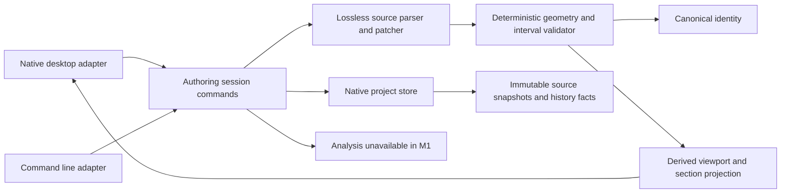

# Application architecture

**Accepted direction for the conditional first offline milestone, 2026-09-23.**
[Owner Ruling 13](../notes/rulings.md#ruling-13--g3-serial-first-core-implementation-freeze)
authorizes one serial core implementation track after worker preflight. Author seat:
`cfd-arch-codex-20260923`; Owner: `cfd-owner-20260923`; independent reviewer: root.
No production application is implemented by this architecture change.
The [ADR](../adr/0003-application-stack.md) selects a stack after actual SDK/native spikes. The
[proof](../proof/application-spikes.md) distinguishes observed results from implementation obligations.

**Implementation status, 2026-09-23:** the bounded shared core and native store
passed [independent review](../reviews/application-core.md) and joined under
Owner Ruling 22. A desktop/CLI [candidate checkpoint](../reviews/ui-application-native.md)
now exists on `feature/application-native-adapters` at `de105f0`; it is not
joined or accepted. Its 11-step source/package gate passed, but independent
native inspection returned `cgWindowNotFound` and yielded no rendered, AX or
keyboard proof. [Owner Ruling 25](../notes/rulings.md) retains this
source-bound candidate in its isolated branch and blocks native M1 acceptance.
The architecture below remains the contract; its original sequencing and
spike-status paragraphs are dated decision evidence.

## 1. Intent and authoritative grounding

M1 is an offline native workbench and CLI sharing one deterministic core: Example or source/project Open →
validate → accepted lossless source and geometry → section/viewport inspection → one independent LE or TE
numeric edit → Preview/Apply/Cancel → Undo/Redo → atomic Save/Reopen, with invalid drafts recoverable.
Analysis reads **Unavailable — no method implemented**. There is no fabricated solver output.

Grounding traversed `spec-cfd-workbench-v1 → spec-foildsl → adr-foildsl-authority`, and
`spec-cfd-workbench-v1 → mockup-workbench-v7 → design-authoring-decisions`, then
`thick-client-shell → proof-native-ui-workbench`. Product revision 1.5 is the build basis; legacy 0.2 is
superseded. The v7 prototype is interaction evidence, not a production evaluator or storage implementation.

Load-bearing requirements: SRC-02 preserves exact source bytes; SRC-03 owns one draft and atomic source/shape
history; SRC-04 fails closed; SRC-11 preserves the other rail; CLI-01 shares run keys and numbers; DOC-02/04
save/recovery; A8.1 targets offline behavior, 100 ms edit feedback, 250 ms preview/cancel and a five-second
cold launch. FoilDSL §§5–8 require continuous validity, bounded evaluation and distinct source/definition
identity. These remain requirements until measured in a product on each target OS.

## 2. Domain before components

| Bounded context | Aggregate root and invariant | Owned facts / other references |
|---|---|---|
| Shape authoring | Document session: one active accepted source revision plus at most one owned draft; only a current certificate for that exact candidate may commit | Immutable source snapshots, accepted revision links and history cursor facts; references profile assets by hash |
| Project history | Project: every active/reference/recovery pointer resolves to a stored immutable revision or is explicitly absent | Append-only accepted revisions and cursor moves; recovery draft is separate from accepted source |
| Geometry evaluation | Evaluated definition is a value, not an independently writable aggregate | Parsed CVs/knots and certified interval bounds are derived from exact source/evaluator identity |
| Analysis (future) | Immutable run: results resolve to precisely the input manifest and method/settings | References accepted definition and profile hashes; M1 has no run or scientific values |
| Experiments (future) | Experiment version: one typed schedule/optimization definition | References accepted design and operating points; queue/run facts do not edit geometry |

Source snapshot grain: exactly one accepted byte sequence for one source revision. Accepted-revision grain:
one accepted authoring transaction, with predecessor and source/definition identity. Cursor-fact grain: one
Undo/Redo/select action referring to an existing accepted revision. Recovery grain: one pending draft over
one accepted base, replaced as recovery state without rewriting accepted history. Profile geometry, source
and evaluator attributes use immutable versioning (Type-2 meaning). Window/camera preferences are explicitly
replaceable Type-1 state outside geometry identity. Shape parameters, area and ratios are non-additive
across revisions. Operation duration and byte counts are additive across distinct operations only.

The durable representation is the ADR-0002 local-document alternative to relational dimensions/facts:
versioned native JSON envelope containing immutable source snapshots and append-only history facts, no DB.
Each source snapshot stores exact UTF-8 bytes as base64, its SHA-256, and immutable ID. History references
snapshots; it never stores a second editable AST/channel table. The active pointer is rebuilt from cursor
facts. On reopen every hash/reference is checked and geometry reparsed. A cache is disposable and carries
source/evaluator keys; no cache is required to reconstruct the document. Read cost is bounded by the native
8 MB envelope cap in M1; a later indexed format requires a migration ADR, not silent schema replacement.

## 3. Candidate shapes and structural decision

| Candidate | Advantage | Liability / disposition |
|---|---|---|
| Native modular monolith; GUI + CLI share managed core | One address-space transaction authority, native file/AX surface, no IPC serialization copy of geometry | Native toolkit/rendering must pass real platform checks. Recommended after bounded macOS spike; Windows remains gated |
| WebView shell + typed IPC | Reuses HTML rendering idioms | Adds JS/native trust and revision-generation boundaries; prototype source is not production code. No exercised WebView IPC/AX contract. Rejected for M1 |
| Native UI + local geometry worker | Crash/CPU isolation; useful for future long-running solvers | Process lifecycle, versioned transport, cancellation and stale reply protocol add cost before a measured need. Reserved for solver integration, not M1 |

The leverage point is source/certificate ownership, not the visible toolkit. A modeless UI can inspect any
station while the draft stays bound to its base and target. All writes pass through the same session
coordinator. One background validation operation per session; newer generations cancel and supersede older
ones. Completion must compare source hash, evaluator, base revision, draft ID and generation before publish.
Apply rechecks those bindings under the session write lock. Preview meshes never serve as validity proof.

Stocks: accepted snapshots, history facts, one recovery draft, bounded derived mesh cache. Flows: typed
commands, validated candidates, revision events and saves. Feedback: edits invalidate stale validation;
failed validation returns diagnostics without modifying accepted state. Delays: validation and filesystem
I/O are cancellable away from the UI thread. No unbounded queue, retries or replay loop is permitted.

## 4. Components and composition

Composition root alone wires core, store, diagnostics and UI. Core has no Avalonia, filesystem, subprocess,
network or UI-thread dependency. Desktop invokes core commands and displays immutable projections; CLI uses
the same commands and machine-readable diagnostics. The persistence adapter owns file handles and locks.
No generic message bus, ORM, service locator, runtime plugin system or web server is needed for M1.

Whole-application seams, not implementation authorizations: Setup creates typed brief/goal proposals;
CAD owns accepted shape; Analysis owns immutable method results; Experiment setup owns definitions;
Run owns queued execution and consent; Results reads pinned artifacts; Export reads accepted certified
geometry and reports conversion residual. Optional assistance proposes typed intents through the same
validation/Apply boundary. Future solver/assistant/export adapters are absent in M1 and cannot be invoked.

## 5. Determinism and admitted geometry

Source SHA-256 hashes exact bytes. Definition identity is BLAKE3 of the exact FoilDSL §8 object serialized
with RFC 8785. Decimal units are converted as exact rational values before one ties-to-even binary64 rounding.
`.ToString("R")` alone is not JCS: its exponent and negative-zero forms differ. No UI-specific hash or
tolerance quantization is allowed. Both adapters call the same core identity function. [Spikes](../proof/application-spikes.md)
establish cross-library hashing of identical canonical bytes, not a finished C# JCS implementation.

The proposed first **certified admission subset** has one inline profile, one profile at all stations,
open foil tip, independent degree-3 rail/channel bases, degree-5 profile sides with a common x mapping and
knot vector, supported root locks/IDs, and no unresolved assets/assertions. Unsupported valid documents are
retained and reported as unsupported, never partially accepted. The parser still recognizes/rejects every
unsupported production deliberately; it cannot skip unknown syntax.

Use exact binary64-to-rational coefficients for conservative proof. On each nonempty knot span, recover
Bernstein coefficients with exact rational arithmetic. Positive derivative support proves x increases on
that span; repeated zero-length spans are excluded and multiplicity limits enforced. Nonnegative derivative
coefficients with at least one positive coefficient suffice on each open span. Inconclusive bounds return
Not assessed; a mathematically valid curve is not necessarily admitted by this conservative method.

For chord, the sufficient initial test compares each leading span's ordinate upper hull with the global
trailing lower hull (or the converse partition); strict separation proves positive chord regardless of
the rails' different abscissae/knots. This intentionally rejects many valid overlapping-hull designs; no
claim of a complete positivity decision procedure is made. Thickness-channel hull must lie strictly in
(0,1). Profile sides sharing x/basis permit exact Bernstein bounds on upper-minus-lower on every span;
positive interior support plus correct endpoints proves a simple section. Branch-and-bound maximum
enclosure propagates through normalization; work/time/depth limits yield Not assessed, never a midpoint
certificate. Numerical rendering can use a midpoint only with its derived error bound displayed.

Why sufficient for this subset's placed surface: every span plane has unique `Y=halfSpan*eta`; chord is
positive; a section is two noncrossing graphs meeting only declared endpoints; rigid LE-pivot rotation and
positive scale preserve its simplicity. Thus distinct span planes cannot intersect, and within-plane
self-intersection is excluded. This proof depends on the exact subset and does not extend to arbitrary
banking, multiple profile blends, point tips, folds or independent x mappings. Full-language conformance
remains future work. M1 must block Apply when any precondition or enclosure budget is unproven.

Ruling 18 adds deterministic execution feasibility to that admission: every supported finite binary64
eta/x query in `[0,1]`, on either side/span half, must fit the declared arithmetic, depth, iteration and
operation caps. Bound pre-reduction rational intermediates and all inverse/normalization/trigonometric
steps, or use a proved analytic reduction with propagated error. Record the computable bound and domain
in the authority-bound certificate. A finite successful query grid is not proof. Inconclusive feasibility
returns Not assessed before acceptance. Cooperative elapsed-time/cancellation/environmental failures remain
distinct observable outcomes; this contract does not promise hard wall-clock completion.

## 6. File boundary, safety and failure

Native JSON: at most 8 MB; source: at most 1 MiB; each source decoded/hashed before parse. A base64 source
array is chunked to keep native envelope lines ≤4 kB; native line limit does not rewrite original source
line endings or impose a second undocumented FoilDSL line cap. Unknown required native version rejects
without modifying original. Unknown optional content is retained read-only; M1 cannot overwrite it.

Persistence uses same-directory exclusive temporary creation, write+flush, recheck expected on-disk hash,
atomic publication, owned temporary/claim cleanup, then final directory flush where supported. Under
Ruling 19, cooperative overwrites share one fixed reserved claim in the held parent directory, even
for different targets. This intentionally conservative contention also excludes equivalent filename/parent
aliases without guessed filesystem normalization. New-file publication remains atomic no-replace. User
targets cannot alias internal names; a stale claim is reported, never age-deleted blindly. No symlink in the chosen path
chain is accepted, and the opened parent identity is checked. External changes produce Conflict and offer
reload/compare/Save As. An arbitrary noncooperating writer can race between final check and replace: the
accepted cooperative policy does not exclude that writer. Platform-specific handle-relative
no-follow/replace behavior needs actual tests, not a portable-path-string assertion. Preserve originals.

## 7. LOA, quality and operations

LOA archetype F describes the eventual optional assistant beside a deterministic CAD hot path; M1 is entirely
T0. C (typed construction) may describe future proposals but no planner is built. A/B/D/E/G/H/I are rejected
as dominant M1 shapes: there is no stream, synthesis, optimization or autonomous agent. P1/P2 choose T0;
P3/P5 typed validation; P7 state in the source store; P8 Apply operation ID prevents duplicate commits;
P9 shared typed commands; P10 metadata events; P11 OS-user rights only. C1–3 are N/A without model calls;
C4 typed internal boundaries, C5 no model side effects, C6 operation IDs, C7 explicit unavailable/no fallback,
C8 named patterns, C9 anti-pattern review, C10 bounded local history/events, C11 OS principal/no credentials.

Normal-path events: `language.parse`, `geometry.validate`, `geometry.preview`, `document.apply`,
`document.save`, `document.reopen`, with operation ID, source byte count, generation, evaluator, duration,
status and stable code. No source, names, file paths or rationale text in telemetry. Local-only by default;
no telemetry exporter in M1. An operator distinguishes parse failure, unsupported geometry, exhausted proof,
stale draft and disk conflict by code and duration. Missing measurement says Not recorded.
Native I/O records measured publication/flush outcomes in the same injected session ring; capture and
acknowledgment duration cannot stand in for disk latency. Store-owned standalone rings are disposed with
their store; injected rings remain caller-owned. Telemetry disposal cannot falsify an in-flight save result.

## 8. Vertical delivery and release gates

| Increment | Real end-to-end behavior | Human and automated proof | Unblocks |
|---|---|---|---|
| M1 walking skeleton | Native+CLI Example/Open, one rail transaction, source/history, save/reopen, recovery; Analysis Unavailable on macOS ARM64 and Windows x64 | Same source/hash and diagnostics through both adapters; real numeric/keyboard/draft/save UI; fault and cross-platform identity suite; live Windows x64 runtime and native UIA/Narrator; actual on-screen cold ≤5 s, edit ≤100 ms p95, Preview/Cancel ≤250 ms p95 on the specified workload and hosts | A measured two-platform offline editor, then broader language |
| M1.1 section authoring | Full section editor with persistent station entry, standalone upper/lower profile controls, shared/independent scope, constraints, thickness intent, blends and accepted-source history | Detailed multi-profile design plus scientific, Data, UX and Test review before authoring; native editing, continuous geometry certificate, exact source/Save/Reopen/Undo/Redo and accessible interaction proof | Product section authoring; not an M1 acceptance shortcut |
| M2 geometry breadth | Remaining profiles/assets and certified blend/promotion beyond M1.1 section authoring | Independent bases, closure and fit residuals; exact-operation gates for remaining CAD breadth | Further product CAD breadth |
| M3 admitted local analysis | Real 2D/3D method adapter and immutable run manifests | Product numerical fixture ladder and freshness; no mock science | Experiment/results path |
| M4 experiments/backend/export | Thin task-specific run/export slices | Consent, process failure, artifact provenance and CAM measurements | Full seven-area workflows |
| M5 optional assistance | Typed proposals only, offline work unaffected | Adversarial untrusted source/proposal tests | Optional productivity |

At the original design gate, no production track could start until Owner ruled
the ADR and shared contract. That gate is now recorded by Rulings 13 and 22:
the complete parser/identity/session core joined before the serial C adapter
candidate. The B→C dependency remains an authority boundary; no adapter owns
a second parser or editable geometry source. Windows x64 cross-build is separate from live Windows
UIA/Narrator, file replace, numerical parity, signing and installer proof. macOS spike is unsigned/unnotarized.
The [user-approved M1 placement](../notes/m1-scope-decision.md) keeps real Windows
x64 runtime and visible timing in M1 and names the full section editor M1.1.
This changes milestone placement, not the current narrow C lease or any proof
threshold. The current batch-cycle diagnostics do not meet the on-screen budget.

## 9. Confidence and independent gate

At the architecture decision gate, the candidate package restore/build,
osx-arm64 spike bundle, author AX/picker flow and root's separate spike input/
picker/cancel observation were verified within their recorded limits. The
monolith complexity claim was Inferred; the complete canonicalizer/parser,
store, product native UI and Windows live behavior were then Not assessed.
Subsequently, the shared C# parser/identity/session/geometry/store passed the
bounded [core review](../reviews/application-core.md), and the selected stack
was reconciled in AGENTS.md and the product-spec pointers. The current
[adapter review](../reviews/ui-application-native.md) records CLI/controller/
package evidence and the native inspection blocker, leaving rendered macOS UI,
native AX/keyboard, Windows
runtime, signing/notarization and product performance open. Full geometry
coverage outside the conservative admitted subset remains out of M1 scope.
Root/Owner issue the independent product gate; neither architecture status nor
a passing package build clears it.
