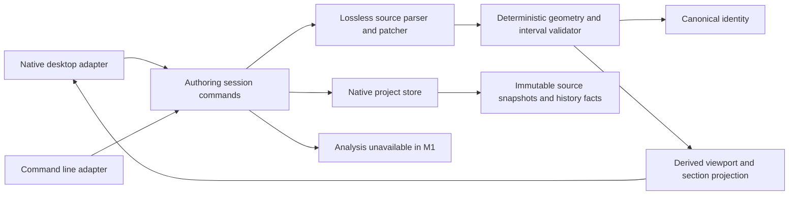
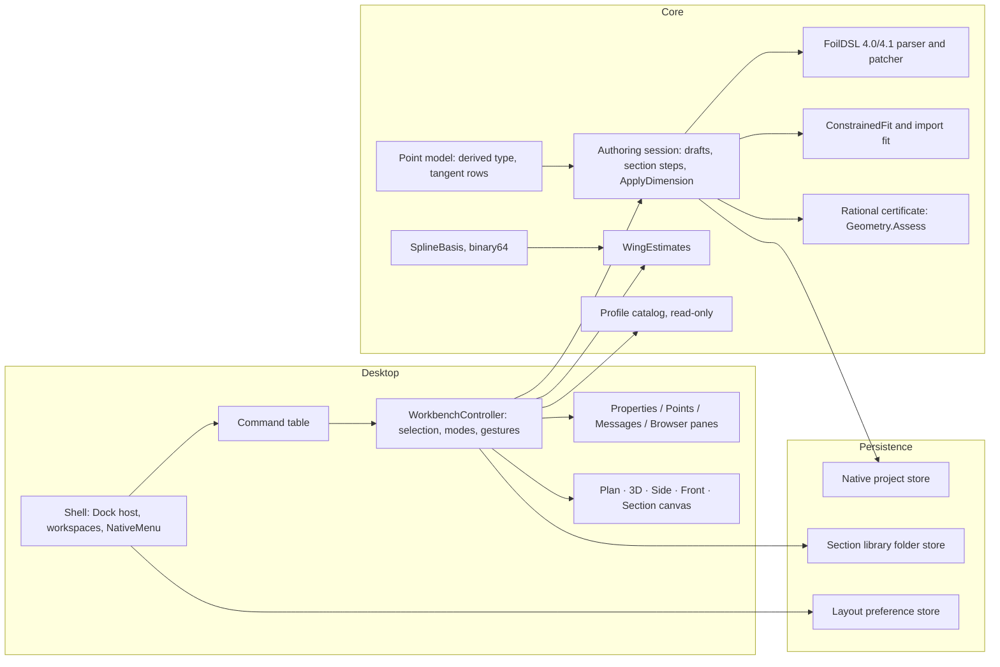

# Application architecture

**Accepted direction for the conditional first offline milestone, 2026-09-23.**
[Owner Ruling 13](../notes/rulings.md#ruling-13--g3-serial-first-core-implementation-freeze)
authorizes one serial core implementation track after worker preflight. Author seat:
`cfd-arch-codex-20260923`; Owner: `cfd-owner-20260923`; independent reviewer: root.
No production application is implemented by this architecture change.
The [ADR](../adr/0003-application-stack.md) selects a stack after actual SDK/native spikes. The
[proof](../proof/application-spikes.md) distinguishes observed results from implementation obligations.

**Implementation status, 2026-09-23:** the bounded shared core and native store
passed [independent review](../reviews/application-core.md) and joined under
Owner Ruling 22. A desktop/CLI [candidate checkpoint](../reviews/ui-application-native.md)
now exists on `feature/application-native-adapters` at `de105f0`; it is not
joined or accepted. Its 11-step source/package gate passed, but independent
native inspection returned `cgWindowNotFound` and yielded no rendered, AX or
keyboard proof. [Owner Ruling 25](../notes/rulings.md) retains this
source-bound candidate in its isolated branch and blocks native M1 acceptance.
The architecture below remains the contract; its original sequencing and
spike-status paragraphs are dated decision evidence.

**Revision 2026-09-26 (spec 1.6, CAD-first).** Sections 1–9 stand. [§10](#10-revision-2026-09-26--spec-16-cad-first-shell-and-editing)
adds the CAD-first shell, the point model, driving dimensions, Wing estimates, the multi-step section draft, the
Profile catalog and My sections, and their ADRs ([0005](../adr/0005-point-types-in-the-b-spline-record.md)–[0009](../adr/0009-cad-first-shell-docking-and-menus.md)).
Where §10 and an earlier section differ, §10 names the change; nothing in §1–§9 is silently contradicted.

## 1. Intent and authoritative grounding

M1 is an offline native workbench and CLI sharing one deterministic core: Example or source/project Open →
validate → accepted lossless source and geometry → section/viewport inspection → one independent LE or TE
numeric edit → Preview/Apply/Cancel → Undo/Redo → atomic Save/Reopen, with invalid drafts recoverable.
Analysis reads **Unavailable — no method implemented**. There is no fabricated solver output.

Grounding traversed `spec-cfd-workbench-v1 → spec-foildsl → adr-foildsl-authority`, and
`spec-cfd-workbench-v1 → mockup-workbench-v7 → design-authoring-decisions`, then
`thick-client-shell → proof-native-ui-workbench`. Product revision 1.5 is the build basis; legacy 0.2 is
superseded. The v7 prototype is interaction evidence, not a production evaluator or storage implementation.

Load-bearing requirements: SRC-02 preserves exact source bytes; SRC-03 owns one draft and atomic source/shape
history; SRC-04 fails closed; SRC-11 preserves the other rail; CLI-01 shares run keys and numbers; DOC-02/04
save/recovery; A8.1 targets offline behavior, 100 ms edit feedback, 250 ms preview/cancel and a five-second
cold launch. FoilDSL §§5–8 require continuous validity, bounded evaluation and distinct source/definition
identity. These remain requirements until measured in a product on each target OS.

## 2. Domain before components

| Bounded context | Aggregate root and invariant | Owned facts / other references |
|---|---|---|
| Shape authoring | Document session: one active accepted source revision plus at most one owned draft; only a current certificate for that exact candidate may commit | Immutable source snapshots, accepted revision links and history cursor facts; references profile assets by hash |
| Project history | Project: every active/reference/recovery pointer resolves to a stored immutable revision or is explicitly absent | Append-only accepted revisions and cursor moves; recovery draft is separate from accepted source |
| Geometry evaluation | Evaluated definition is a value, not an independently writable aggregate | Parsed CVs/knots and certified interval bounds are derived from exact source/evaluator identity |
| Analysis (future) | Immutable run: results resolve to precisely the input manifest and method/settings | References accepted definition and profile hashes; M1 has no run or scientific values |
| Experiments (future) | Experiment version: one typed schedule/optimization definition | References accepted design and operating points; queue/run facts do not edit geometry |
| Profile catalog (1.6) | Catalog entry: read-only, bundled; admission class fixed by its generator or terms | GEN coordinate sets with generator and hash; VEND/LINK metadata only ([ADR-0008](../adr/0008-profile-catalog-and-section-library.md)) |
| Section library — My sections (1.6) | Library: current entry names unique ignoring case; an entry references one immutable section document | Installation-scoped folder of immutable section files named by SHA-256; the current library is a folder scan; outside document history (ADR-0008) |
| Installation preferences (1.6) | Workspace layout: replaceable Type-1 state, never document data | Per-workspace dock/float layout, versioned; unknown or corrupt → preset ([ADR-0009](../adr/0009-cad-first-shell-docking-and-menus.md)) |

Source snapshot grain: exactly one accepted byte sequence for one source revision. Accepted-revision grain:
one accepted authoring transaction, with predecessor and source/definition identity. Cursor-fact grain: one
Undo/Redo/select action referring to an existing accepted revision. Recovery grain: one pending draft over
one accepted base, replaced as recovery state without rewriting accepted history. Profile geometry, source
and evaluator attributes use immutable versioning (Type-2 meaning). Window/camera preferences are explicitly
replaceable Type-1 state outside geometry identity. Shape parameters, area and ratios are non-additive
across revisions. Operation duration and byte counts are additive across distinct operations only.

The durable representation is the ADR-0002 local-document alternative to relational dimensions/facts:
versioned native JSON envelope containing immutable source snapshots and append-only history facts, no DB.
Each source snapshot stores exact UTF-8 bytes as base64, its SHA-256, and immutable ID. History references
snapshots; it never stores a second editable AST/channel table. The active pointer is rebuilt from cursor
facts. On reopen every hash/reference is checked and geometry reparsed. A cache is disposable and carries
source/evaluator keys; no cache is required to reconstruct the document. Read cost is bounded by the native
8 MB envelope cap in M1; a later indexed format requires a migration ADR, not silent schema replacement.

## 3. Candidate shapes and structural decision

| Candidate | Advantage | Liability / disposition |
|---|---|---|
| Native modular monolith; GUI + CLI share managed core | One address-space transaction authority, native file/AX surface, no IPC serialization copy of geometry | Native toolkit/rendering must pass real platform checks. Recommended after bounded macOS spike; Windows remains gated |
| WebView shell + typed IPC | Reuses HTML rendering idioms | Adds JS/native trust and revision-generation boundaries; prototype source is not production code. No exercised WebView IPC/AX contract. Rejected for M1 |
| Native UI + local geometry worker | Crash/CPU isolation; useful for future long-running solvers | Process lifecycle, versioned transport, cancellation and stale reply protocol add cost before a measured need. Reserved for solver integration, not M1 |

The leverage point is source/certificate ownership, not the visible toolkit. A modeless UI can inspect any
station while the draft stays bound to its base and target. All writes pass through the same session
coordinator. One background validation operation per session; newer generations cancel and supersede older
ones. Completion must compare source hash, evaluator, base revision, draft ID and generation before publish.
Apply rechecks those bindings under the session write lock. Preview meshes never serve as validity proof.

Stocks: accepted snapshots, history facts, one recovery draft, bounded derived mesh cache. Flows: typed
commands, validated candidates, revision events and saves. Feedback: edits invalidate stale validation;
failed validation returns diagnostics without modifying accepted state. Delays: validation and filesystem
I/O are cancellable away from the UI thread. No unbounded queue, retries or replay loop is permitted.

## 4. Components and composition

```mermaid
flowchart LR
  GUI[Native desktop adapter] --> Session[Authoring session commands]
  CLI[Command line adapter] --> Session
  Session --> Parser[Lossless source parser and patcher]
  Parser --> Kernel[Deterministic geometry and interval validator]
  Kernel --> Identity[Canonical identity]
  Session --> Store[Native project store]
  Store --> Bytes[Immutable source snapshots and history facts]
  Kernel --> View[Derived viewport and section projection]
  View --> GUI
  Session --> Unavailable[Analysis unavailable in M1]
```

Composition root alone wires core, store, diagnostics and UI. Core has no Avalonia, filesystem, subprocess,
network or UI-thread dependency. Desktop invokes core commands and displays immutable projections; CLI uses
the same commands and machine-readable diagnostics. The persistence adapter owns file handles and locks.
No generic message bus, ORM, service locator, runtime plugin system or web server is needed for M1.

Whole-application seams, not implementation authorizations: Setup creates typed brief/goal proposals;
CAD owns accepted shape; Analysis owns immutable method results; Experiment setup owns definitions;
Run owns queued execution and consent; Results reads pinned artifacts; Export reads accepted certified
geometry and reports conversion residual. Optional assistance proposes typed intents through the same
validation/Apply boundary. Future solver/assistant/export adapters are absent in M1 and cannot be invoked.

## 5. Determinism and admitted geometry

Source SHA-256 hashes exact bytes. Definition identity is BLAKE3 of the exact FoilDSL §8 object serialized
with RFC 8785. Decimal units are converted as exact rational values before one ties-to-even binary64 rounding.
`.ToString("R")` alone is not JCS: its exponent and negative-zero forms differ. No UI-specific hash or
tolerance quantization is allowed. Both adapters call the same core identity function. [Spikes](../proof/application-spikes.md)
establish cross-library hashing of identical canonical bytes, not a finished C# JCS implementation.

The proposed first **certified admission subset** has one inline profile, one profile at all stations,
open foil tip, independent degree-3 rail/channel bases, degree-5 profile sides with a common x mapping and
knot vector, supported root locks/IDs, and no unresolved assets/assertions. Unsupported valid documents are
retained and reported as unsupported, never partially accepted. The parser still recognizes/rejects every
unsupported production deliberately; it cannot skip unknown syntax. *(As built, the subset already admits distinct
blended profiles on a shared basis; §10 proposes adding checked `tangents` rows — see §10 and ADR-0005.)*

Use exact binary64-to-rational coefficients for conservative proof. On each nonempty knot span, recover
Bernstein coefficients with exact rational arithmetic. Positive derivative support proves x increases on
that span; repeated zero-length spans are excluded and multiplicity limits enforced. Nonnegative derivative
coefficients with at least one positive coefficient suffice on each open span. Inconclusive bounds return
Not assessed; a mathematically valid curve is not necessarily admitted by this conservative method.

For chord, the sufficient initial test compares each leading span's ordinate upper hull with the global
trailing lower hull (or the converse partition); strict separation proves positive chord regardless of
the rails' different abscissae/knots. This intentionally rejects many valid overlapping-hull designs; no
claim of a complete positivity decision procedure is made. Thickness-channel hull must lie strictly in
(0,1). Profile sides sharing x/basis permit exact Bernstein bounds on upper-minus-lower on every span;
positive interior support plus correct endpoints proves a simple section. Branch-and-bound maximum
enclosure propagates through normalization; work/time/depth limits yield Not assessed, never a midpoint
certificate. Numerical rendering can use a midpoint only with its derived error bound displayed.

Why sufficient for this subset's placed surface: every span plane has unique `Y=halfSpan*eta`; chord is
positive; a section is two noncrossing graphs meeting only declared endpoints; rigid LE-pivot rotation and
positive scale preserve its simplicity. Thus distinct span planes cannot intersect, and within-plane
self-intersection is excluded. This proof depends on the exact subset and does not extend to arbitrary
banking, multiple profile blends, point tips, folds or independent x mappings. Full-language conformance
remains future work. M1 must block Apply when any precondition or enclosure budget is unproven.

Ruling 18 adds deterministic execution feasibility to that admission: every supported finite binary64
eta/x query in `[0,1]`, on either side/span half, must fit the declared arithmetic, depth, iteration and
operation caps. Bound pre-reduction rational intermediates and all inverse/normalization/trigonometric
steps, or use a proved analytic reduction with propagated error. Record the computable bound and domain
in the authority-bound certificate. A finite successful query grid is not proof. Inconclusive feasibility
returns Not assessed before acceptance. Cooperative elapsed-time/cancellation/environmental failures remain
distinct observable outcomes; this contract does not promise hard wall-clock completion.

## 6. File boundary, safety and failure

Native JSON: at most 8 MB; source: at most 1 MiB; each source decoded/hashed before parse. A base64 source
array is chunked to keep native envelope lines ≤4 kB; native line limit does not rewrite original source
line endings or impose a second undocumented FoilDSL line cap. Unknown required native version rejects
without modifying original. Unknown optional content is retained read-only; M1 cannot overwrite it.

Persistence uses same-directory exclusive temporary creation, write+flush, recheck expected on-disk hash,
atomic publication, owned temporary/claim cleanup, then final directory flush where supported. Under
Ruling 19, cooperative overwrites share one fixed reserved claim in the held parent directory, even
for different targets. This intentionally conservative contention also excludes equivalent filename/parent
aliases without guessed filesystem normalization. New-file publication remains atomic no-replace. User
targets cannot alias internal names; a stale claim is reported, never age-deleted blindly. No symlink in the chosen path
chain is accepted, and the opened parent identity is checked. External changes produce Conflict and offer
reload/compare/Save As. An arbitrary noncooperating writer can race between final check and replace: the
accepted cooperative policy does not exclude that writer. Platform-specific handle-relative
no-follow/replace behavior needs actual tests, not a portable-path-string assertion. Preserve originals.

## 7. LOA, quality and operations

LOA archetype F describes the eventual optional assistant beside a deterministic CAD hot path; M1 is entirely
T0. C (typed construction) may describe future proposals but no planner is built. A/B/D/E/G/H/I are rejected
as dominant M1 shapes: there is no stream, synthesis, optimization or autonomous agent. P1/P2 choose T0;
P3/P5 typed validation; P7 state in the source store; P8 Apply operation ID prevents duplicate commits;
P9 shared typed commands; P10 metadata events; P11 OS-user rights only. C1–3 are N/A without model calls;
C4 typed internal boundaries, C5 no model side effects, C6 operation IDs, C7 explicit unavailable/no fallback,
C8 named patterns, C9 anti-pattern review, C10 bounded local history/events, C11 OS principal/no credentials.

Normal-path events: `language.parse`, `geometry.validate`, `geometry.preview`, `document.apply`,
`document.save`, `document.reopen`, with operation ID, source byte count, generation, evaluator, duration,
status and stable code. No source, names, file paths or rationale text in telemetry. Local-only by default;
no telemetry exporter in M1. An operator distinguishes parse failure, unsupported geometry, exhausted proof,
stale draft and disk conflict by code and duration. Missing measurement says Not recorded.
Native I/O records measured publication/flush outcomes in the same injected session ring; capture and
acknowledgment duration cannot stand in for disk latency. Store-owned standalone rings are disposed with
their store; injected rings remain caller-owned. Telemetry disposal cannot falsify an in-flight save result.

## 8. Vertical delivery and release gates

| Increment | Real end-to-end behavior | Human and automated proof | Unblocks |
|---|---|---|---|
| M1 walking skeleton | Native+CLI Example/Open, one rail transaction, source/history, save/reopen, recovery; Analysis Unavailable on macOS | Same source/hash and diagnostics through both adapters; real numeric/keyboard/draft/save UI; fault and identity suite. On-screen timing is not an M1 gate and Windows x64 runtime qualification is deferred — see the [D1/D2 decision revision](../notes/m1-scope-decision.md#revision--2026-09-25) | A measured offline editor, then broader language |
| M1.1 section authoring | Full section editor with persistent station entry, standalone upper/lower profile controls, shared/independent scope, constraints, thickness intent, blends and accepted-source history | Detailed multi-profile design plus scientific, Data, UX and Test review before authoring; native editing, continuous geometry certificate, exact source/Save/Reopen/Undo/Redo and accessible interaction proof | Product section authoring; not an M1 acceptance shortcut |
| M1.2 CAD-first (spec 1.6) | Five vertical slices, M1.2a–e, in [§10.6](#106-vertical-delivery-m12) | Per slice, §10.6 | The v10 CAD-first product on macOS |
| M2 geometry breadth | Remaining profiles/assets and certified blend/promotion beyond M1.1 section authoring | Independent bases, closure and fit residuals; exact-operation gates for remaining CAD breadth | Further product CAD breadth |
| M3 admitted local analysis | Real 2D/3D method adapter and immutable run manifests | Product numerical fixture ladder and freshness; no mock science | Experiment/results path |
| M4 experiments/backend/export | Thin task-specific run/export slices | Consent, process failure, artifact provenance and CAM measurements | Full seven-area workflows |
| M5 optional assistance | Typed proposals only, offline work unaffected | Adversarial untrusted source/proposal tests | Optional productivity |

At the original design gate, no production track could start until Owner ruled
the ADR and shared contract. That gate is now recorded by Rulings 13 and 22:
the complete parser/identity/session core joined before the serial C adapter
candidate. The B→C dependency remains an authority boundary; no adapter owns
a second parser or editable geometry source. Windows x64 cross-build is separate from live Windows
UIA/Narrator, file replace, numerical parity, signing and installer proof. macOS spike is unsigned/unnotarized.
The [user-approved M1 placement](../notes/m1-scope-decision.md) originally kept real Windows
x64 runtime and visible timing in M1 and names the full section editor M1.1.
A [2026-09-25 revision](../notes/m1-scope-decision.md#revision--2026-09-25) then
removed on-screen (visible) timing as an M1 gate — product performance targets
stay as spec targets, no on-screen capture is planned — and deferred Windows x64
runtime qualification (last hosted run `36113074255` at `4a1d80f` failed with 4
baseline failures; `feature/windows-*` branches are kept). This changes milestone
placement, not the current narrow C lease or any remaining proof threshold.

## 9. Confidence and independent gate

At the architecture decision gate, the candidate package restore/build,
osx-arm64 spike bundle, author AX/picker flow and root's separate spike input/
picker/cancel observation were verified within their recorded limits. The
monolith complexity claim was Inferred; the complete canonicalizer/parser,
store, product native UI and Windows live behavior were then Not assessed.
Subsequently, the shared C# parser/identity/session/geometry/store passed the
bounded [core review](../reviews/application-core.md), and the selected stack
was reconciled in AGENTS.md and the product-spec pointers. The current
[adapter review](../reviews/ui-application-native.md) records CLI/controller/
package evidence and the native inspection blocker, leaving rendered macOS UI,
native AX/keyboard, Windows
runtime, signing/notarization and product performance open. Full geometry
coverage outside the conservative admitted subset remains out of M1 scope.
Root/Owner issue the independent product gate; neither architecture status nor
a passing package build clears it.

## 10. Revision 2026-09-26 — spec 1.6: CAD-first shell and editing

**Status of this section: proposed.** §1–§9 are accepted; §10 and ADR-0005–0009 are Proposed until the Owner rules
them. §10 widens one earlier statement explicitly: §5's admission subset gains `tangents` rows (checked, outside
identity; ADR-0005) and already admits distinct blended profiles on a shared basis (`Geometry.cs:341-356`).

### 10.1 Grounding and what changes

Grounding traversed `spec-cfd-workbench-v1` (rev 1.6, `f56d259`: A3.1–A3.3, A4.15, CAD-14–21, B1, B7, B11, B12,
Appendix G, the DR table) → `spec-foildsl` (§4–§6, §8) → `adr-0001-master-curve-degree`, `adr-foildsl-authority` →
`design-section-editor` (as built) → `review-ui-workbench-v9` §5, `review-ui-workbench-v10` DR table. The code was
opened, not recalled; citations are file:line on `feature/ui-cad-direction` at `f56d259`.

Structure is unchanged: one native modular monolith, one deterministic Core, GUI and CLI adapters, FoilDSL source as
the only geometry authority, append-only history (§2–§4). LOA archetype and tiers are unchanged: everything in 1.6 is
T0 deterministic; there is no model call (§7). What 1.6 adds is **editing structure and a new shell**:

| Change | Decision | Where it lives |
|---|---|---|
| Point types (Anchor · Control · named) on every curve | Type is knot multiplicity in the existing record; tangent kind is a FoilDSL 4.1 curve annotation outside identity; every change measured and reported (DR-5 settled; DR-11 raised) | [ADR-0005](../adr/0005-point-types-in-the-b-spline-record.md) |
| Typed Span / Root chord / Tip chord; Wing estimates incl. MAC | Commands that patch or refit the rails of record under strict A4.6 until DR-9; estimates are the FoilDSL metric definitions, one pure Core function, never stored | [ADR-0006](../adr/0006-driving-dimensions-and-wing-estimates.md) |
| Section editor mode with one Finish; gesture commit; catalog Replace | One multi-step section draft; gesture = draft applied on release; Replace = draft step (DR-4 settled; DR-6 default) | [ADR-0007](../adr/0007-edit-transactions-section-draft-and-gesture-commit.md) |
| Catalog and My sections | Bundled read-only catalog; a folder of immutable, create-only section files (DR-8 default location; inline copy is a stated deviation) | [ADR-0008](../adr/0008-profile-catalog-and-section-library.md) |
| Docks, floats, workspaces, platform menus | Dock for Avalonia 11.3.12.1 with owned OS-window floats, Application-level NativeMenu, one command table, own layout file | [ADR-0009](../adr/0009-cad-first-shell-docking-and-menus.md) |
| Evaluator, command table, selection, telemetry | Below ADR weight | notes [binary64 evaluator](../notes/binary64-evaluator.md), [command table and selection](../notes/command-table-and-selection.md) |

### 10.2 Surface list (E7) — every layer each change must reach

| Change | Store | Model | Service (Core) | Projection | Desktop | UI | CLI (CLI-01) | Compute reader |
|---|---|---|---|---|---|---|---|---|
| Point type, tangent kind | FoilDSL 4.1 `tangents` | curve + derived type | `SetPointType`, `SetTangentKind`; `Assess` checks rows | point view (type, kind, role, locks, reported change) | selection, Properties, Points grid | glyphs, type menu | inspect shows types and rows; source edit path | canonical identity strips rows |
| Driving dimensions | source patch (`half_span`, stations, rail ordinates); receipt fields (expand) | — | `ApplyDimension` (fit, residual, rule id) | receipt | Wing block inputs | Messages, status line | a `dimension` command with the same core call | estimates |
| Wing estimates | none (never stored) | — | `WingEstimates.From` | value + generation + convergence | per drag frame | Wing block | inspect prints them | future assertion path, same definitions |
| Section draft | recovery row, receipt fields (expand) | step list over bytes | `BeginSectionDraft`, `ApplySectionStep`, `FinishSection` | draft view + step reports | mode state machine | section editor, strip | not exposed (GUI mode); its accepted row reads like any other | certificate on Finish |
| Catalog, My sections | bundled resource; section folder | entry, flat provenance | catalog reader; Replace step | picker rows with rights | picker, save dialog | Replace from catalog…, Save to My sections… | none in M1.2 | import fit (ADR-0007) |
| Shell | layout file | pane ids, workspace | — | — | Dock host, command table, selection | panes, menus, floats | — | — |
| Open (Start/Opening/cancel) | `recent/recent.json` (own store claim, design-slice §4.5) | `OpenOutcome` closed union (Opened · NeedsIds · Refused · Failed · Cancelled · Superseded) | `OpenAsync` — build aside, then atomic swap; cancellation never discards the current document (design-slice §6.2, resolving the as-built open-cancel hazard) | outcome + Recent entries | Start card, Opening status, model-area alert band | Cancel; File ▸ Open Recent ▸ (entries, Clear Menu) | — | — |
| Accessibility | — | — | — | accessible names/values from the point and station views | automation peers for panes, tabs, floats (Dock peers read, not tested) | VoiceOver pass (S5 for NVDA) | — | — |
| Licence and SBOM | licence register (A8.5) | — | — | — | Dock + transitive set, lock file | — | — | — |

### 10.3 Components and layers (additions to §4)

```mermaid
flowchart LR
  subgraph Desktop
    Shell[Shell: Dock host, workspaces, NativeMenu] --> Cmd[Command table]
    Cmd --> Ctl[WorkbenchController: selection, modes, gestures]
    Ctl --> Props[Properties / Points / Messages / Browser panes]
    Ctl --> Views[Plan · 3D · Side · Front · Section canvas]
  end
  subgraph Core
    Session[Authoring session: drafts, section steps, ApplyDimension] --> Parser[FoilDSL 4.0/4.1 parser and patcher]
    Session --> Fit[ConstrainedFit and import fit]
    Session --> Kernel[Rational certificate: Geometry.Assess]
    Basis[SplineBasis, binary64] --> Est[WingEstimates]
    Points[Point model: derived type, tangent rows] --> Session
    Catalog[Profile catalog, read-only]
  end
  subgraph Persistence
    Store[Native project store]
    Lib[Section library folder store]
    Prefs[Layout preference store]
  end
  Ctl --> Session
  Ctl --> Est
  Ctl --> Catalog
  Ctl --> Lib
  Shell --> Prefs
  Session --> Store
```

Core still has no Avalonia, filesystem or UI-thread dependency (§4): the Desktop reads a library entry through the
Persistence store and hands its bytes to the Core Replace step; the catalog is an embedded resource; estimates are pure.
The one duplicate binary64 evaluator (`FoilSource.cs:574`) folds into `SplineBasis` (`ConstrainedFit.cs:576`) under a
byte-identical golden master; the rational certificate path is excluded ([note](../notes/binary64-evaluator.md)).

### 10.4 Durable representation (Data & Persistence)

- **Project document:** the envelope shape is unchanged; FoilDSL may now be 4.1 (additive `tangents`); the accepted-row
  receipt and the recovery row gain optional fields (section step count, dimension and point-type receipts). Each
  expansion is one-way: a build that predates it refuses the project (`DSL-VERSION`, `DOC-UNSUPPORTED-FIELD`) and leaves
  the file unchanged; fixtures prove it (ADR-0005, ADR-0007). No estimate, dimension or point type is stored.
  **Correction (design-slice, `docs/design/app-shell.md` §3.8):** `DOC-UNSUPPORTED-FIELD` names a genuinely new field;
  a new *value* in an already-known field — such as the receipt's `rail = "dimension"` — is refused by an old build
  with `DOC-REFERENCE` instead (`AuthoringSession.cs`:897-903, :934-937, `_ => false`), as ADR-0007 §1 predicts.
- **My sections:** each entry is one immutable section document named by its SHA-256; the current library is a folder
  scan; names are unique ignoring case (NFC, ordinal) under the store claim (ADR-0008).
- **Layout:** Type-1 replaceable preference file per installation; not history, not document data (ADR-0009).
- **Undo grain:** one accepted row per workspace gesture, per typed dimension, per point-type change outside the
  section editor, and per section Finish. Section-internal steps are draft state, not history (ADR-0007).

### 10.5 Cross-cutting

- **Observability (normal path, no flag):** every apply keeps the existing apply event with `edit_kind` (`gesture` ·
  `dimension` · `point-type` · `section`); new events only for non-apply work — `estimates.compute`, `section.step`,
  `library.save`, `layout.load` (restored · preset-fallback · pane-dropped · clamped n · session-only), `float.relocate`
  (moved · docked-back). Each carries operation id, duration, outcome and stable code; no names, paths or source text.
- **Trust boundaries:** library files and the layout file are user-writable input — parsed with the FoilDSL limits
  (SRC-09) and a closed DTO respectively; no type-name deserialization. The catalog is a hashed build artifact. Dock
  and its transitive set are pinned by a committed lock file and recorded in the licence register (A8.5).
- **Failure:** every refusal leaves geometry and undo depth unchanged; a layout that cannot load falls back per pane,
  then to the preset; where publication is unproved for the platform (`DOC-UNSUPPORTED-PERSISTENCE`) the layout is
  session-only and Save to My sections is refused with the reason; a stale claim is reported, never deleted by age; a
  missing catalog resource disables Replace with its reason.
- **Idempotency (P8):** `ApplyDimension`, `FinishSection`, gesture Apply and library save carry operation ids and are
  memoized like every existing mutating call.

### 10.6 Vertical delivery (M1.2)

**Entry gate:** M1.2 builds on M1.1 as merged and needs the native rendering/AX proof that Owner Ruling 25 still blocks
(§ header: `cgWindowNotFound`); M1.2a is the first slice that must pass it. Every slice is macOS, end to end,
demonstrable from the packaged `.app` (unsigned until the release gate) and test-validated. Windows stays deferred (§8).

| Slice | User-visible capability | Real vs mocked | Human demo | Automated proof | Unblocks |
|---|---|---|---|---|---|
| **M1.2a walking skeleton** | Start / Opening / open-failed (CAD-14); Planform workspace with Plan + 3D and the left side bar; Properties for the foil with the Wing block; typed Span; NativeMenu app, File, Edit and Window menus from the command table | All real; Dock with the fixed Planform preset (no saved layout yet); catalog and library absent | Launch the `.app` → New from example → read estimates → type Span 1.5× → Undo → ⌘Z in the Span field edits the text, not the foil | CAD-17 fixtures; CAD-16 span and invalid-input clauses; CAD-14; command-table parity; Edit-verb routing row | every later slice |
| **M1.2b rail points** | Select a rail point; Properties shows its derived type; gesture commit; estimates live during drag; Control ⇄ Anchor and tangent kinds on channels; typed Root/Tip chord to the DR-9 default | FoilDSL 4.1 real | Drag a TE point, watch MAC change, release, Undo; make a point an Anchor, save, reopen; type a root chord and read the reported residual | CAD-15 on channels (locality exact, change reported, save/reopen); 4.1-refusal fixture; CAD-16 chord clauses with the spike fixtures | section point work |
| **M1.2c section editor** | Edit section mode, one Finish, inner Undo, paired section point types (DR-11 default), Points and Messages panes, Precision workspace | Real | Edit section → move three points, make one an Anchor, Undo twice, Finish → one Undo step | CAD-20; CAD-15 on sections (exact on insert, ≤ 10 µm reported on remove, refusals); GEO-14; receipt-refusal fixture | catalog |
| **M1.2d catalog and My sections** | Replace from catalog…, Save to My sections…, DAT imports listed | GEN subset real; VEND/LINK metadata | Replace with NACA 0012, see residual, save as "My 0012", open another foil, find it | CAD-18, CAD-19; folder-scan and name-uniqueness tests incl. two processes; provenance parser test | — |
| **M1.2e floats, workspaces and saved layouts** | OS-window floats owned by the main window, Maximize, focus-safe floats, Review workspace, per-workspace layouts saved and clamped | Real on one Mac; S1–S5 scheduled; S1 before the layout format is frozen | Float Properties, tab into a covered point, watch it move; relaunch after moving it | UX-31/32 rows; F12's five non-happy edges; layout round trip and per-pane fallback; clamp tests incl. S6; S7 single-monitor rows | Windows qualification |

### 10.7 Decision requests and open items

| ID | Status after this run | Default designed to | Bounded change if overturned |
|---|---|---|---|
| DR-2 | Operator | Leading edge held | One enum value; quarter-chord re-sets the frame by a rigid x-translation (ADR-0006). **Ruled:** "the quarter-chord line is held. Per ADR-0006, a root edit then translates the planform rigidly so LE(0)=0, and the status line says so." (Ruling 53) |
| DR-4 | **Settled** (ADR-0007) | — | — |
| DR-5 | **Settled** (ADR-0005) | — | — |
| DR-6 | Operator | Commit at gesture end | Controller release handler only (ADR-0007). **Ruled:** "default: a point gesture commits at its end as one undo step." (Ruling 53) |
| DR-7 | Operator | Activity rail outside the left side bar | A shell region outside the Dock host; no Core change. **Ruled:** "default: the narrow activity rail of area icons, outside the left side bar." (Ruling 53) |
| DR-8 | Operator | Installation library; **deviation:** an entry used in a foil is inlined, not pinned as an asset (ADR-0008 §4) | Project library = a store adapter plus envelope expansion; asset pin = an envelope asset set (expand-migrate-contract). **Ruled:** "My sections is the app's shared section library." (Ruling 53) |
| DR-9 | **New**, operator | Strict A4.6 with the operator's linear rule; residual always reported | Root-flat rule, lock release, or report-not-refuse (ADR-0006). **Ruled:** "option (a): the root-flat blend on root-mirror-locked rails, with both numbers reported." (Ruling 53) |
| DR-10 | **New**, operator | Channel ceiling stays 10 | ADR-0001 amended; FoilDSL range relaxed, expand-only (ADR-0005). **Ruled:** "raise the channel vertex ceiling to 16. ADR-0001 is amended and the FoilDSL range relaxed expand-only, in the M1.2b design-slice." (Ruling 53) |
| DR-11 | **New**, operator | Section point types paired per chord position | Independent side bases and their certificates (B6-class) (ADR-0005). **Ruled:** "Independent section point types. This requires the B6 restart in the M1.2c wave, and D4 waits on M1.2c." (Ruling 53) |

Open: OI-3 (Windows floats, screen readers) → spike tasks S1–S7 (ADR-0009). B6 (independent profile bases) still gates
section type changes on multi-profile foils. Findings for the spec owner: CAD-15's gap clause needs a point off the line
through its neighbours; CAD-15's "no other curve changes" reads "≤ 10 µm, reported" on sections under DR-11; DR-8's
asset-pin wording versus the inline copy. For design-slice: the import acceptance compares against 1e-5 normalised
rather than A4.6's 10 µm at local chord (`DatImport.cs:255`); the receipt field names; the Not assessed and residual
strings; the stale-claim recovery action — now named in `docs/design/app-shell.md` §4.4: a once-per-session message
names the file and offers **Show in Finder**, opening the folder holding `.cfd-writer.claim`; the store still never
deletes a claim itself.

### 10.8 Council record (Adversary Mode, 2026-09-26)

Author: this `/define-architecture` run. Reviewers were separate agents; no author cleared a veto. One repair cycle of
the two allowed was used; every veto was cleared by its own lens on re-review. Native Desktop and Enterprise were
advisory and their findings were folded in without a second pass.

| Lens | Initial verdict | Main findings | Repair (cycle 1) | Final |
|---|---|---|---|---|
| Computational Geometry | **Hard veto** — unreported deviation (Anchor → Control; DR-9 measured against a substituted rule) | Interpolation rule, exact locality (2.2e-16), paired exact insertion and the estimate formulas Verified; handles rotate 63.5° if only the anchor moves; section refit not segment-local; quarter-chord breaks `leading(0) = 0`; CAD-15 gap clause infeasible on collinear points; quadrature error unbounded | Every type change measured and reported; handles move with the anchor; segment-local refit with pinned rows; DR-11 raised; DR-9 default strict with deviation from the operator's rule reported (spike: 0.4–15 mm for root-flat); frame re-set; exact per-rail area integration, bounded MAC quadrature; spike tip cases pinned | **Veto cleared** on re-review (Geometry lens). Carried to design-slice: after a u\* snap the CAD-15 fixture asserts "within the identity tolerance", not exact; DR-9 and DR-11 need the operator before M1.2b/M1.2c ship |
| Data & Persistence | Pass with conditions (no veto) | Receipt schema expansion undeclared; rights needed outside data; library enforcement; 4.1 one-way; corner spelled twice | Receipt/recovery expansion declared with refusal fixtures; flat provenance in the entry; create-only publish, re-scan under claim, NFC; rollback consequence and fixture stated; `corner` keyword removed; per-pane layout fallback; no overwrite of newer layout | **Conditions met** on re-check; an old build names `DSL-VERSION` (`AuthoringSession.cs:1001`, `:882`); rollback fixtures must exist and pass before the migration counts as tested |
| Native Desktop | Pass with conditions (advisory) | Float ownership, Application-level menu, Edit verbs vs text fields, app/Window menus from the `.app`, units, F6 across floats, float titles, lost KeyUp; signing | All folded into ADR-0009/0007; S6 reworded, S7 added; signing stays a release gate (Release Engineer) | — |
| Enterprise | Pass with conditions (advisory) | Estimates duplicate language metrics; DR-8 deviation unstated; evaluator claim wrong; spike not committed (`spikes/` is git-ignored); transitive pins; notes for command table; §10 status; gates; CLI column | Estimates bound to `foildsl.md`:276-277; deviation stated; evaluator note; spikes moved to `docs/proof/cad-first-spikes/`; lock file; two decision notes; §10 marked proposed; entry gate stated; E7 widened | — |
| Simplifier | **Soft veto** — library facts file; nested provenance | Port unused; evaluator count wrong; per-kind telemetry; layout round trip too early | Facts file cut (folder scan); provenance flattened; port cut; telemetry reuses the apply event; layout persistence moved to M1.2e | **Veto cleared** on re-review; NFC kept only with a test that pins it |

### 10.9 Residual architectural risk

- Interior anchors are G1/C¹ joins on sections; fairness depends on the comb and user discipline.
- Until DR-9 is answered, typed chords on documents with the default root-mirror lock are mostly refused.
- Section point types are paired (DR-11) and refused on multi-profile foils until B6.
- Projects touched by 1.6 features cannot be opened by earlier builds (the file is never changed).
- Dock's 11.x line is frozen; an Avalonia 12 migration is the only route to Dock fixes.
- Windows, mixed-DPI, owned-float and screen-reader behaviour is unverified (S1–S7).
