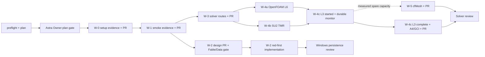

# Windows W-0 through W-5 execution plan

## Goal and authority

Complete W-0 through W-5 from `pc-kickoff.md`. The Mac session remains the sole repository leader and owns `main`,
global rulings, conductor joins and final readiness. This Windows session is the local coordinator. A read-only
`gpt-6-astra` Owner reviews the plan, the Windows persistence contract, seam requests and final evidence.

The local coordinator owns only this plan, worker briefs, leases, GitHub dispatch and the status ledger. It does not
author product or proof-track work. Every completed track must return a clean commit, push a `win/*` branch, open a PR
and post `pr-ready` through `tools/xmsg.py`.

## Measured preflight

| item | observed state |
|---|---|
| Git | primary and coordinator worktrees clean at `origin/main` `7102e90fd04d`; `core.autocrlf=false` |
| .NET | SDK `10.0.203` selected from `%USERPROFILE%\.dotnet` |
| coordination | nine artifact patterns; `coord-regen` and `coord-register` effective |
| GitHub | `gh` authenticated as `timianmalloo` with repository access |
| host | Windows x64; i9-12900H, 14 cores / 20 logical processors; 31.7 GiB RAM |
| GPU | RTX 3080 Ti Laptop GPU, 16 GiB, driver 596.47 |
| WSL | package repaired to `2.7.14.0`; kernel `6.18.33.2-2`; default version 2; no distro installed |
| Grok | CLI 1.0.46 authenticated; `grok-4.7` is the observed default |

## Optimized graph

The critical path is W-0 → W-1 → W-3 → W-4(a,b) → W-4(c). W-2 is independent after W-1. W-5 uses otherwise idle
capacity after L3 starts only when measured load shows that L3 retains priority. W-0, W-1, B1, W-3, W-5 and completed
W-4 each have their own delivery checkpoint; their PRs do not wait for L3 completion. The loop variant is the count of
W items lacking verified exit evidence; it must decrease after each checkpoint. Two repair cycles without decrease
stop that track and produce a blocker report.

## Artifact classes

| path | class | rule |
|---|---|---|
| `docs/coordination/xmsg.jsonl`, `docs/audit/*.jsonl` | register | official writer only; union merge; no exclusive lease |
| `docs/docs-index.js`, `docs/audit/audit-data.js` | derived | regenerate through official scripts at join |
| `docs/coordination/windows-w0-w5-execution.*` | authored | coordinator only |
| `docs/proof/win-*/**`, `cases/win-*.yaml` | authored | one track owner per exact subtree/file |
| production source, tests and design documents | authored | exact lease before write; no cross-track edits |

## Tracks

| track | owner and harness | authored paths | dependencies | budget | exit evidence |
|---|---|---|---|---|---|
| A0 · setup | Grok 4.7 in a dedicated `win/setup` worktree; deterministic commands where sufficient | `docs/proof/win-setup/**`; no source, tests or tools | Owner plan gate | 30 min; one retry; no subagents | Full kickoff host survey; coordinator-supplied primary-clone install/doctor evidence; W-0 `done`; clean commit, PR and xmsg |
| A1 · smoke | Grok 4.7 in a fresh `win/smoke` worktree; Sol fallback only for unavailable UI observation | `docs/proof/win-smoke/**`; no source, tests or tools | delivered W-0 evidence | 60 min; one retry; no subagents | Build/test/docs output; every required screenshot and UI observation; expected Save failure; defects recorded without repairs; clean commit, PR and xmsg |
| B1 · Windows store design | GPT-6.1 Sol/high | `docs/design/windows-native-store.md`; `docs/proof/win-store-design/**` | delivered W-1 evidence | 60 min; one repair cycle | Win32-source-cited contract for handles, reparse points, sharing, durability, replace and identity; delivered design PR; explicit Fable/Data approval with independent Data/Security/Test vetoes resolved; exact helper path frozen |
| B2 · Windows store implementation | GPT-6.1 Sol/high, only after B1 is frozen | candidate lease: `src/CfdWorkbench.Persistence/ProjectStore.cs`, `src/CfdWorkbench.Persistence/CfdWorkbench.Persistence.csproj`, `src/CfdWorkbench.Persistence/native/cfd_store.c`, `tests/CfdWorkbench.Core.Tests/ProjectStoreTests.cs`, `tools/verify-application-core.py`, `docs/proof/application-core.md`; the Owner narrows it and the Mac approves every path outside the PC allowance before dispatch | delivered B1 PR plus explicit Fable/Data approval | 90 min first checkpoint; two red-green repair cycles | red observed; Windows store suite green; changed-source gates green; macOS path unchanged by review; clean commit, PR and xmsg |
| C · solver evidence | one active writer at a time: GPT-6.1 Sol/medium for route and numerical decisions, then explicit handoff to Grok 4.7 for frozen commands and receipt collection | `cases/win-smoke-cavity.yaml`; `cases/win-spike04r3-g2-l6.yaml`; `cases/win-su2-tmr-naca0012.yaml`; `cases/win-spike04r3-g2-l3.yaml`; `cases/win-cfmesh-s4.yaml`; `cases/win-cfmesh-s6.yaml`; `docs/proof/win-routes/**`; `docs/proof/win-naca/**`; `docs/proof/win-cfmesh/**`; observed-row edits only in `docs/design/guided-solver-setup.md`. Existing shared cases are read-only without Mac handoff. | delivered W-1 evidence; WSL ready but distro absent | W-3 90 min; W-4a 60 min; W-4b 120 min; W-4c machine time; W-5 120 min | every trial has its Windows YAML/config and fresh `runs/<timestamp>/` output; pinned Ubuntu/OpenFOAM and native SU2 routes; cavity; L6 comparison; SU2 TMR comparison; durable L3 start receipt, later completion/A4/GCI; cfMesh verdict; checkpoint PRs and xmsg |

No implementation worker may edit this plan or another track's paths. The local Owner reviews any requested seam. Any
path outside the PC allowance requires an xmsg `handoff` and affirmative Mac response before writing; a local lease does
not authorize that path.

## GPU qualification inside Track C

The GPU path is a measurement gate, not a promise about the binary. Track C must verify NVIDIA visibility in WSL and
inspect the installed OpenFOAM v2512 build for supported offload/fused/Umpire facilities. If no supported GPU path is
present, skip GPU trials and continue the CPU route. Otherwise compare one warm-up plus three short CPU/GPU trials using
unchanged numerics. GPU execution is admitted only when the median wall time improves
and existing result-equivalence tolerances pass. The receipt records GPU utilization, VRAM, CPU utilization, flags,
versions and outputs. If the pinned build has no validated GPU path, Track C records that result, continues within the
aggregate 12-physical-core budget and posts a Mac decision request for any later separately pinned build. Visibility
alone proves no solver acceleration. No third-party solver or
CUDA product dependency is introduced here.

## Common delegation contract

Each brief starts its audit marker and states its absolute worktree, branch, base SHA, exact owned paths, exclusions,
dependencies, deadline, context ceiling, fallback and return evidence. Workers do not run `EnterWorktree`, install the
coordination layer, spawn agents, change Git identity or merge `main`. Grok runs in the foreground with `--no-subagents`;
its diff and cwd/branch/HEAD are independently inspected. At most two implementation workers are active. The aggregate
compute budget is 12 physical cores across tests and solver jobs, reserving two physical cores for the OS/coordinator.
L3 may use all 12 only when no other heavy test or solver job runs; otherwise the coordinator partitions the same cap
from measured load. Every code track runs the applicable Windows ring once and
reads the result. Repetition requires a relevant code change or unresolved failure.

## GitHub join rule

At each task start: fetch `origin`, merge `origin/main`, then run `py -3 tools/xmsg.py unread --mark`. A returned track
is accepted locally only when its owned diff, evidence and tests match the brief. The Windows coordinator pushes the
`win/*` branch. Delivery order is: push the tested evidence commit; open the PR; post xmsg `pr-ready`; commit and push
the xmsg message. The PR records the tested SHA, evidence paths, applicable branch docs gate, audit entry and official
graph derivation. The tested SHA remains PR head or an ancestor with no later changes to tested paths. The Mac/Fable
owner reviews; the Mac leader alone uses conductor-join, runs readiness and pushes `main`. A worktree-only commit is
incomplete delivery.

## Planned versus actual

| track | planned | actual |
|---|---|---|
| coordinator | plan, dispatch, GitHub and xmsg only | active |
| Astra Owner | plan, B1, seams and final review | pending dispatch |
| A | W-0/W-1 evidence | pending |
| B | W-2 design and implementation | pending W-1 |
| C | W-3/W-4/W-5 solver evidence | pending W-1 |
