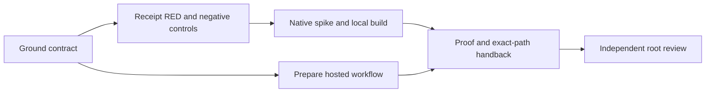

# Windows qualification contract

**Goal:** make the Windows API and failure questions executable without changing
the accepted product. **Done when:** six Ruling 40 artifacts, local compile and
receipt controls, source-bound raw evidence and independent review handback exist.
**Not in scope:** production `src/`, existing tests/verifiers/package files,
accepted file format, a push or dispatch, host permissions, VM provisioning,
M1 integration, section editing or displayed timing. **Tier:** T2.
**Fan-out:** one author; no descendants. Root independently owns Data/Security/Test
review. Requested model: `gpt-6-astra`; effective model identity: **Not recorded**.

This is an **unaccepted candidate contract**, not a Windows implementation of
`IProjectStore`. A native scenario pass proves that scenario on its recorded host.
It cannot clear a missing scenario, a production invariant, or a root veto.

## Grounding and change surfaces

Read on the delegated base `ed0d070ff87dc1f0485e1ce0d3341869f54c4d62`:
`ProjectStore.cs` defines immutable `SaveRequest`, expected-disk-hash conflict,
create-only publication and `SaveResult`. Its `Supported()` guard only admits
macOS arm64. Its durability comment requires file and final-directory fsync after
owned cleanup. Its cooperative directory claim avoids raw-name alias locks.
Traversal: Windows route → application architecture → application contracts;
Ruling 40 freezes this separate experiment. No current product API is replaced.

The surface list is: independent binary fixtures → disposable native calls → JSONL
scenario rows → Python receipt validator → local/CI raw artifacts → this proof
reader. Production store/model/service/client/UI/compute surfaces are read-only.
The optional hosted UIA probe observes host capability, not a Workbench screen.

Bounded context: qualification evidence. Aggregate: one unique run directory;
invariant: a result cannot outlive its exact source, SDK, executable set and fixture
identity. One scenario row is exactly one named case in that run. Source and binary
hashes are immutable value objects; process identity is PID **and creation time**
and executable path/hash. Rows and raw outputs are append-once files in a new
directory; a second run refuses that directory. Counts are additive over distinct
runs, durations are additive only for serial operations, hashes/statuses are
non-additive. No data migration or alternate project schema is introduced.

## Execution graph and review floors

| Node | Capability, input → exit | Dependency |
|---|---|---|
| G | Reasoning: R40/current source/API docs → bounded contract and unresolved decisions | None |
| R | Deterministic mechanics: fixed receipt contract → observed failing validator and wrong-result controls | G |
| N | Reasoning + deterministic mechanics: native API matrix → standalone source, local compile, non-Windows refusal | R |
| W | Reasoning: hosted runner policy/action revisions → manual-only disposable workflow and capability probe | G |
| P | Deterministic mechanics: raw outputs → source-bound proof, graph/audit and clean exact-path commit | N, W |
| V | Independent review: root Data/Security/Test → verdict or bounded correction | P |

The naive six serial nodes become a dependency graph with W independent of R/N;
one-author ownership keeps actual agent width one. No speed or token saving is
claimed. Model: six nodes, longest dependency chain five nodes, one bounded
review loop. Immutable floors: actual API reads, negative receipts, unsupported
host refusal, native security/durability uncertainty, independent review.
Budget: 70 tool calls or 45 minutes from `2026-09-25T04:08:19Z`; first exhausted
budget or unresolved primitive yields a precise checkpoint, never a weaker gate.
Loop variant: unresolved contract and executable-oracle questions. One evidence-
directed correction is allowed before handback; unrun Windows behavior is not
"fixed" by repeated local macOS builds. Plan/proof live in the two authorized
documents rather than an unauthorized seventh authored plan file.

## Approach selection and supported subset

| Candidate | Assessment |
|---|---|
| .NET `File.Move`/`FileStream` alone | Smallest API, but does not expose creation-time SD, retained ancestor identities or rename/disposition handles required here. Rejected as a security proof. |
| Win32 `CreateFileW` + retained handles + `SetFileInformationByHandle` | Selected **disposable measurement** route. No extra package; ABI can compile on macOS and execute only on Windows x64. Allows direct creation, DACL, sharing, identity and namespace experiments. |
| `NtCreateFile` with `OBJECT_ATTRIBUTES.RootDirectory` and relative component opens | Stronger candidate for production namespace anchoring. [Microsoft documents the API](https://learn.microsoft.com/en-us/windows/win32/api/winternl/nf-winternl-ntcreatefile), but this packet does not qualify its NTSTATUS/OBJECT_ATTRIBUTES ABI or upgrade the production store to it. This remains an explicit W2 design decision. |

The current spike allows only Windows x64, fixed local **NTFS**, drive-letter
absolute paths ≤240 characters, ASCII components, no trailing dot/space, reserved
device component, `.`/`..`, UNC, device prefix or ADS colon. Non-ASCII Unicode
spellings are both rejected; no normalization equivalence is asserted. The file
must be regular, non-reparse, and have exactly one hard link. Case behavior is
measured by opening the uppercase spelling and comparing identity; a case-sensitive
directory fails that case. ReFS, network/removable filesystems, long/device paths,
cloud placeholders, arbitrary reparse tags and case-sensitive NTFS directories
are outside this candidate subset. No privilege, registry or developer-mode change
is attempted to enlarge it.

`PinnedPath` holds the drive root and every ancestor open without delete sharing,
checks each retained handle for directory/reparse attributes, and retains identities.
This is more than a final-component `OPEN_REPARSE_POINT` precheck. However, the
spike still resolves absolute DOS names for later opens/renames. **Flagged:** it
does not establish containment against drive-device remapping, every reparse tag,
concurrent filesystem filter behavior or a fully hostile same-user namespace.
In particular, access-zero directory handles that share write do **not** establish
protection against in-place `FSCTL_SET_REPARSE_POINT` mutation of the same empty
directory. That is an unexecuted, unsupported seam; a MoveFileEx refusal cannot
stand in for it. No fixture result clears this containment gap.
The ancestor substitution oracle is a deterministic attempted rename of a held
ancestor; it is not an exhaustive race proof. There is **no admitted production
path subset** until root accepts these residuals or a handle-relative design is
qualified. A successful scenario never promotes this limitation into containment.

## API and ABI ledger

All P/Invokes use Windows calling convention (`DllImport` default Winapi), UTF-16
for `W` entry points, four-byte BOOL except the one-byte BOOLEAN returned by
`CreateSymbolicLinkW`, native-sized handles, and `SetLastError` where the API uses
last error. Returned kernel handles are owned by `SafeFileHandle`; security
descriptors use `LocalFree`. The tested native architecture is **x64 only**.

| API / source | Contract exercised and ABI boundary |
|---|---|
| [CreateFileW](https://learn.microsoft.com/en-us/windows/win32/api/fileapi/nf-fileapi-createfilew) | CREATE_NEW=1, OPEN_EXISTING=3; share bits read/write/delete=1/2/4. OPEN_REPARSE_POINT=0x00200000 and BACKUP_SEMANTICS=0x02000000. Creation receives a security descriptor; opening an existing object does not replace it. Sharing is checked against retained accesses, not a universal writer lock. |
| [SECURITY_ATTRIBUTES](https://learn.microsoft.com/en-us/windows/win32/api/wtypesbase/ns-wtypesbase-security_attributes) | x64 length 24; DWORD at 0, descriptor pointer at 8, BOOL inheritance at 16. Handles are non-inheritable. Native guard checks size before cases. |
| [GetFileInformationByHandle](https://learn.microsoft.com/en-us/windows/win32/api/fileapi/nf-fileapi-getfileinformationbyhandle) | 52-byte BY_HANDLE_FILE_INFORMATION. Compare volume serial and file index while handles are retained; reject nonregular/reparse/multiple-link objects. This packet excludes filesystems requiring a different identity representation. |
| [FILE_RENAME_INFO](https://learn.microsoft.com/en-us/windows/win32/api/winbase/ns-winbase-file_rename_info), [actual WinBase.h](https://raw.githubusercontent.com/microsoft/win32metadata/main/generation/WinSDK/RecompiledIdlHeaders/um/WinBase.h) | Header conditional union resolves the documentation's duplicated member rendering. x64 union offset 0, RootDirectory 8, byte-length DWORD 16, UTF-16 name 20. Class 3; FALSE refuses replacement, TRUE requests replacement. The spike's root member is zero and full names stay inside its pinned disposable folder. No cross-volume fallback. |
| [SetFileInformationByHandle](https://learn.microsoft.com/en-us/windows/win32/api/fileapi/nf-fileapi-setfileinformationbyhandle) | Class 4 FILE_DISPOSITION_INFO is one BOOLEAN. Deletion targets a retained owned handle; the current name must still match that identity before the call. A foreign occupant is preserved. |
| [GetSecurityInfo](https://learn.microsoft.com/en-us/windows/win32/api/aclapi/nf-aclapi-getsecurityinfo), [SDDL conversion](https://learn.microsoft.com/en-us/windows/win32/api/sddl/nf-sddl-convertstringsecuritydescriptortosecuritydescriptorw) | Advapi returns a descriptor allocated for LocalFree. Read owner/group/DACL and convert to `RawSecurityDescriptor`; never repair permissions after writing. |
| [FlushFileBuffers](https://learn.microsoft.com/en-us/windows/win32/api/fileapi/nf-fileapi-flushfilebuffers) | Handle requires write access. File-content flush is measured separately from namespace metadata durability. Whole-volume flushing requires administrative privilege and is outside scope. |
| [CreateProcessW](https://learn.microsoft.com/en-us/windows/win32/api/processthreadsapi/nf-processthreadsapi-createprocessw) | Explicit executable path, mutable quoted UTF-16 command line, CREATE_SUSPENDED=4 and CREATE_UNICODE_ENVIRONMENT=0x400. x64 STARTUPINFO=104 and PROCESS_INFORMATION=24. Assign ownership before ResumeThread. |
| [Job objects](https://learn.microsoft.com/en-us/windows/win32/procthread/job-objects), [limits](https://learn.microsoft.com/en-us/windows/win32/api/winnt/ns-winnt-jobobject_extended_limit_information), [query](https://learn.microsoft.com/en-us/windows/win32/api/jobapi2/nf-jobapi2-queryinformationjobobject) | x64 extended limits=144, KILL_ON_JOB_CLOSE=0x2000, no breakaway; query owned PIDs with class 3 and a 128-process bound. Incomplete observation refuses qualification. Retain process creation time, path and executable hash before accepting its identity. |

The C# and Python sizes are asserted, but **native ABI execution remains Not
assessed**. Compiler success does not validate Win32 marshaling or filesystem
semantics. Header/docs were inspected 2026-09-25; their live links are supporting
contracts, not executable receipts or immutable SDK header provenance.

## Save/security contract and finite oracle matrix

The candidate `Publish` copies input before its mutation hook, acquires a single
directory claim, reads the expected target through a retained handle, writes and
flushes a separate creation-time-private file, rechecks target identity/hash, then
requests a same-directory handle rename. It never edits accepted product bytes,
source/history/recovery identity rules, or `/2` hashes. Fixtures are synthetic
binary bytes, deliberately not a counterfeit product-format compatibility test.

| Required case(s) | Runnable oracle / wrong result |
|---|---|
| create, read | Publish B from a staged file / retained read A; exact independent hashes and identity, not merely file existence |
| create-collision | Existing A plus create-only B → DOC-CONFLICT, A preserved |
| overwrite | Expected A → publish B; reopened identity/bytes match staged handle |
| conflict | Expected B while disk is A → DOC-CONFLICT; target and input unchanged |
| immutable-input | Mutate caller array after the candidate snapshots it → published original B |
| cancel-before, cancel-after | Real token before candidate → DOC-CANCELLED/no target; token after namespace call → publication known, never falsely not-saved |
| write-fault | Inject abort after one real written byte; no target and identity-owned temp/claim cleanup |
| replace-fault | Real native rename toward an absent parent → uncertain result, old A retained, no retry/fallback |
| sharing | A retained writer excludes a second write open with ERROR_SHARING_VIOLATION; does not assert exclusion of arbitrary namespace writers |
| dacl-create | Creation-time protected current-user-only full-control DACL inspected before first payload write |
| dacl-inheritance | Child under permissive disposable inherited-Everyone parent still private; unprotected control must be detected |
| dacl-replacement | Private replacement retains private descriptor; replacement is not permission preservation for arbitrary imported ACLs |
| denial | Disposable deny-current-user DACL → actual open denied with Win32 5 |
| case-alias | Uppercase spelling resolves same retained file identity; directory-wide claim policy avoids separate raw-name locks |
| unicode-alias, ads-device-unc | Both Unicode forms and six excluded path classes rejected before filesystem access |
| hard-link | Create an actual hard link; regular-file guard rejects link count >1 and preserves A |
| leaf-reparse, ancestor-reparse | Create disposable native symlinks; guard rejects redirect and external fixture remains A. Missing rights → Not assessed/nonzero |
| ancestor-substitution | Attempt rename of held ancestor; requires access/sharing refusal and retained ancestor identities |
| owned-cleanup, cleanup-refusal | Delete matching owned handle; after rename plus foreign replacement, refuse cleanup and preserve foreign B |
| file-flush | Actual FlushFileBuffers succeeds; does not set durability true |
| directory-durability | Always Not assessed until an accepted equivalent contract exists; cannot become Pass through receipt rewriting |
| process lifecycle (driver) | Three owned generations observed before timeout; terminate only job; query zero active PIDs; reject missing observer, duplicate identity, live/unseen-child claim |

**Creation-time DACL policy (proposed, not product policy):** protected DACL with
one allow ACE, full file rights `0x1f01ff`, for the current token's user SID; no
inherited or Everyone ACE. Owner is that SID. These disposable fixtures perform
real subsequent read/write/denied opens as effective-access probes. This is not
POSIX 0600, not a general group/privilege/mandatory-integrity AccessCheck proof,
and not protection against administrators or another process of the same user.
Overwrite of a foreign/imported descriptor must be refused by a future product
adapter until a separately accepted preservation/normalization policy exists.

**Durability decision D-W0-1, unresolved:** no equivalent of the existing
final-directory-fsync promise was established. The candidate always returns
`DurabilityConfirmed=false`; successful publication yields
`DOC-SAVE-UNCERTAIN`, `PublicationKnown=true` and the published hash. A failed
namespace request yields uncertain/not-known, with raw error retained by the
case where available. This proposal uses existing field/code vocabulary but is
**not an approved product semantic change**. Root/Data must either accept this
truthful outcome or require a stronger primitive. File flush, namespace visibility,
metadata persistence and hardware power-loss survival are distinct claims.

## Threats, failure modes and limits

STRIDE boundaries: caller path/bytes → native filesystem; source → executable;
child process → job observer; native rows → Python parser; workflow → hosted runner.
Spoofed/missing/duplicate receipts, wrong fixture bytes/publication and source or
binary substitution are rejected by executed parser negatives. Binary binding
covers apphost **and** managed DLL/deps/runtimeconfig; apphost bytes alone are not
the application. Tampering with old/foreign file entries must be preserved and
reported. Denial, unsupported filesystems, missing reparse rights, failed native
layout checks and incomplete process observation are finite nonzero outcomes.
No broad taskkill, credential read, privilege enablement or trust mutation exists.

Timeout cleanup observes the owned job after termination; a parent exit is not
quiescence. An observation race is a conservative failure, not a guessed identity.
The observer-failure negative retains its cleanup receipt before refusing. The
driver never recursively deletes the scratch root. Files survive for review;
third-party contents or collided cleanup names are never removed for tidiness.
The local macOS branch uses an owned process group, disabled build servers and
group-absence observation, but does not claim Windows process containment.

LINDDUN: fixtures are synthetic, no customer files/credentials are accessed. Raw
process paths and disposable Windows owner SID can identify the build principal;
local logs are retained locally, hosted upload is limited to the listed receipts
and fixtures with three-day retention. No home or NuGet cache is uploaded.
Operational questions are answered by source.json, per-step stdout/stderr and
process.json, case elapsed times/status/error, summary.json, binary file hashes
and fixture hashes. Actual CI usage/spend/tokens are **Not recorded**.

## Hosted session and prepared workflow

One explicit x64 runner candidate: `windows-2022`, as listed in the
[hosted-runner reference](https://docs.github.com/en/actions/reference/runners/github-hosted-runners).
Image labels are maintained images, not immutable OS builds: retain `ImageOS`,
`ImageVersion`, runtime OS and architecture. SDK is exactly 10.0.203, matching
`global.json`; no SDK-file edit is made. Action tag→commit pairs were read through
`git ls-remote`, and their pinned action.yml input contracts were read. They are
pinned in the workflow: checkout v4.2.2 `11bd719…`,
setup-dotnet v4.3.1 `67a3573…`, upload-artifact v4.6.2 `ea165f8…`.

The workflow has only `workflow_dispatch`, an exact branch equality guard,
contents-read permissions, no persistent credentials/cache/secrets/OIDC/deploy,
and checkout's global safe-directory mutation explicitly disabled,
12-minute job timeout and task-local SDK/home/package paths. No run was dispatched.
Manual dispatch availability from a non-default-only workflow is not assumed:
W1 must choose a concrete reviewed ref route under GitHub's workflow-dispatch
rules before invocation. This file does not authorize moving it onto the default
branch or replacing the trigger with a repository-wide push trigger.

[GitHub billing policy](https://docs.github.com/en/billing/concepts/product-billing/github-actions)
places standard hosted runs in public repositories in its free execution class;
larger runners and storage have separate rules. The route packet records a public
repository; W1 must recheck visibility and actual policy at dispatch. This packet
does not infer zero storage charges or claim measured spend.

The hosted graphical/UIA session is **not yet measured**. A historical
[runner-image issue](https://github.com/actions/runner-images/issues/3180) concerns
self-hosted Azure DevOps VMSS and does not establish present GitHub-hosted Windows
capability. The driver therefore actually runs a PowerShell UIAutomationClient
probe of the current root, child count, interactive flag and session ID on Windows,
retaining stdout/stderr/exit and owned process identity. No absence is assumed.
This can establish a candidate UIA route; it cannot prove Workbench keyboard,
native pickers, UIA provider quality, Narrator, contrast or displayed timing.
Those W3 and reference-device gates remain independent even if this probe works.

## Open decisions and production admission fence

1. **D-W0-1:** directory durability equivalence or truthful not-confirmed semantics.
2. **D-W0-2:** qualify handle-relative namespace opens/rename, DOS-device stability,
   junction and arbitrary-reparse/ancestor race controls before admitting production paths.
3. **D-W0-3:** imported/foreign ACL overwrite policy and full effective-token security proof.
4. **D-W0-4:** execute Windows ABI/job/negative cases on an authorized concrete W1 ref;
   missing native rights or observation remains Not assessed, never skipped green.
5. **D-W0-5:** root checks actual hosted UIA capability before selecting W3 hosting;
   Narrator and reference-device final displayed frame remain separate.

No code here clears those decisions or the accepted M1 gates. Root's review may
admit this packet as **prepared evidence infrastructure** while withholding every
production/runtime acceptance. Rollback is removing this isolated experiment;
there is no product data migration to reverse.
