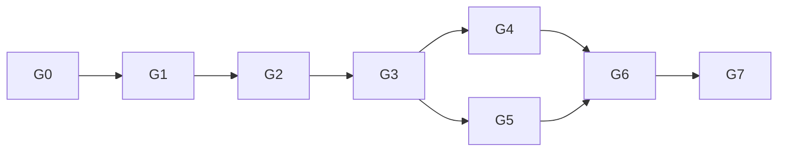

# Application build execution graph

**Input:** the 23 September 2026 user request logged as `al-01M376G6MEVMMTPKPYP4GGBGVD`; compiled as `al-01M376HFY6J6F4SNW84C5J5Q4H` with no open decision requests. The compiled goal and exclusions govern this graph. This is the one overall `/optimize-graph` pass. The matching track contract is [application-build coordination](../coordination/application-build.md). **Tier T2; global active execution cap 3, external harness cap 2 until a measured reason supports more.** The Coordinator authors only this plan and coordination controls. The Owner rules technical decisions and holds the veto. The root Codex lead supplies independent review.

## Evidence and scope

The product specification [A3–A4](../specs/cfd-workbench-v1.md), [FoilDSL §§2, 5–8](../specs/foildsl.md), and [v7 limits](../mockups/workbench-v7.md) define the first surface. Their graph path is `spec-foildsl --refines--> spec-cfd-workbench-v1`; `mockup-workbench-v7` is a linked demonstration, not production proof. FoilDSL and the product specification are **in review**, so an architecture author must record any reconciliation needed before implementation. The v7 mockup explicitly lacks production semantic hashing, immutable persistence, recovery, and cross-platform atomic save. Its sampled geometry is illustrative.

The first milestone is an offline native workbench on Windows and macOS with a shared GUI/CLI core: open the Example, native `.foil` and `.cfdw.json`; parse/validate to accepted source; evaluate owned geometry; inspect a viewport and section; edit one numeric independent leading or trailing rail through a base-bound draft with preview/apply/cancel; undo/redo; atomic save/reopen, including a recovery draft; and print identity and diagnostics through the CLI from the same core. Analysis, solver, export, OCCT and AI capability claims are deferred. The Owner reviews this milestone and any spec contradiction before a worker takes an implementation contract.

**End-to-end surface list:** file envelope and append-only project records → accepted lossless source and immutable Surface/Profile revisions → parser, validation, evaluator and semantic identity → GUI/CLI application services → typed UI projection and native viewport/section → no analysis compute reader in M1 (show Unavailable). Every changed identity crosses save/reopen, undo/redo and CLI. An inspection slice remains derived; no second editable channel table may appear.

## Graph and mandatory floors

| node | goal and input | exit condition / oracle | capability; tier | depends on |
|---|---|---|---|---|
| G0 | Ground pack, normative intent, known gaps, classification and harness capability from installed repo | Pack/coord doctor results, exact versions and denied/allowed probe receipts recorded; missing evidence reads `not recorded` | Deterministic mechanics; T0 | — |
| G1 | Architecture author resolves module boundaries, candidate stack, domain data model, spike contracts and detailed first slice design from G0 and specs | Owner rules decisions; root independently checks vetoes; selected stack has actual native accessibility/viewport/file dialog and cross-platform packaging evidence or an explicit remaining gate | Reasoning; T3 | G0 (data) |
| G2 | Pin canonical numbers, identity and persistence semantics; architecture author executes focused contract spikes | Executed decimal→binary64/unit and RFC 8785/BLAKE3 vectors, geometry invariant/evaluator oracle, save fault/conflict oracle; unrun Windows evidence is labelled unverified | Reasoning plus deterministic mechanics; T2 | G1 candidate decision (decision) |
| G3 | Freeze interfaces and first-slice contracts with Owner ruling | Named type/semantic contract, owned paths and fixtures, no unresolved `DR-n`, independent Test/Data/UX vetoes cleared | Independent review; T2 | G1, G2 (data) |
| G4 | Implement accepted source, parser, model, evaluator, identity and persistence in one coherent core track | Red→green normal, invalid and fault fixtures; immutable accepted history; one numeric rail edit round trip via core API | Reasoning; T2 | G3 (data) |
| G5 | Implement native shell/viewport/CLI adapters against compiling G3 contracts and fixtures in disjoint authored paths | Example opens; keyboard and accessibility state evidence; UI and CLI consume same core; unavailable analysis labelled honestly | Reasoning; T2 | G3 (data) |
| G6 | Join and inspect M1 on integrated branch | `conductor-join.py` and integrated gate set pass; user workflow exercised in rendered app; independent vetoes pass; Windows/macOS evidence status stated separately | Independent review + deterministic mechanics; T2 | G4, G5 (data) |
| G7 | Re-plan next dependency-ready slice within approved product scope | New graph cites observed M1 behavior and remaining requirement, budget and gates; no speculative worker launch | Reasoning; T2 | G6 (decision) |

**Observed graph refinement, 2026-09-23:** A returned commit `a92c4e7` and Owner Ruling 8
conditionally selected the native M1 direction. Its spike's compiling vocabulary was a
sketch, not the complete session contract. G3 therefore has an admitted **serial B0
contract-completion/design step before its Owner freeze**: full session operations,
native-v1 replay/operation IDs, missing-ID `.foil` acceptance, exact decimal/JCS
identity, bounded growth and OS-specific persistence fixtures. B0 started in isolated
`feature/application-contracts` at integrated base `73cabb89`; no G4/G5 production
fan-out is admitted yet. The original width-two estimate is still a planning model,
not measured elapsed improvement; actual A required a serial mechanical join and B0.

**Execution readback, 2026-09-23:** B0 is joined at `c13db27`; root Test review and Owner
Ruling 12 accepted its bounded contracts, not a product implementation. Ruling 13 then
froze 18 exact paths for one serial G4 core worker. Three isolated clean checkpoints
are `5f40af0` (parser/identity), `5b5b489` (continuous source-shape certificate and
interval section query), and `a8a6351` (bounded placed-surface and owned session with
126 passing tests). None is joined or M1-ready. Their named oracles and root's separate
frozen-source reviews establish specific boundaries, not the missing native-store, UI
or Windows runtime obligations. Owner Ruling 16 added an immutable authored-control
projection and public consumer fixture within the existing B lease before C can freeze
its adapter API. Two twist-identity/arithmetic questions remain under independent probe.
G5 is currently serial after G4: the compiling G3 contract did not remove remaining
core admission and adapter data dependencies. Ruling 15 and the independently reviewed
FoilDSL diagnostic clarification were joined as a documentation seam; they do not
relax G4. Later Rulings 17–19 add the explicit `/2` identity, all-query feasibility
and native-store contract repair. Root's exact-path companion update is disjoint
from the current serial B store/Ruling 16 checkpoint, but must join before the
dedicated `/2` production continuation. The next measured gate is the complete
G4 handoff and independent review.

**Mandatory, immovable floors:** domain aggregate/data-model ruling before code; stack/SDK spikes before dependency commitment; E7 surface/reader trace; exact UTF-8 source SHA-256 distinct from semantic RFC 8785/BLAKE3 identity, with pinned decimal/unit-to-binary64 vectors; certified geometry validity for the admitted subset or an explicit `Not assessed` blocker; applicable Testing Strategy union and red-first control observations; cross-platform native accessibility/viewport and packaging evidence; independent Data, Test and UX hard vetoes plus root review; integrated rendered workflow proof; audit/change entries and graph derivation. Each gate must name an input that fails it. A green command exit means the command passed, not that M1 works. macOS ARM64 live evidence can be observed locally. Windows x64 build/tests may come from a separate runner; an unrun Windows native workflow remains a release obligation and cannot be called M1 pass on both platforms.

**Naive → optimized:** A naive serial walk would be G0→G1→G2→G3→G4→G5→G6→G7: 8 nodes, width 1, no bounded loop. The optimized graph keeps all 8 nodes and every floor, moves only the disjoint adapter construction after frozen G3 alongside core construction, and makes G6 a single integrated join. Its maximum width is 2. A parser and its evaluator stay in G4 because their invariants and identity are coupled. The implementation branches are admitted only after G3 proves no decision edge remains. Architecture and spike work stay serial because their results alter each other's shape.

**Cost model, Inferred:** use effort units solely to compare shape, not as observed hours or tokens: G0=1, G1=4, G2=3, G3=1, G4=5, G5=4, G6=2, G7=1. `T₁=21`; naive `T∞=21`; with G4/G5 parallel, `T∞=17` and at width 2 the bound is `T₂ ≤ (21−17)/2+17 = 19` units, with a hard lower bound of 17. This is a small modeled gain. Branch setup, context cost and integration may exceed four units; the width-two option is justified only when G3 produces truly independent paths and the first wave's measured overhead is below that saving. Otherwise G4→G5 is serial. No wall-time or token bottleneck has yet been measured for this application.

**Five-part fan-out contract (G4/G5 only):** width 2; one retry with backoff only for a clean pre-prompt startup timeout/EOF/429/529, never replay a started turn; each branch exits with a descendant commit, owned-path inventory and independently runnable named oracles; all M1-critical branches must pass before G6, and a partial branch is retained and reported; a failed branch stops locally, with Owner-ruling before reassignment. Each branch has the specific budget, context ceiling, deadline and fallback in the coordination plan. The feedback loop's variant is the count of tracks lacking verified exit evidence, floor zero, exit when zero or a documented blocker has a ruling/fallback; two passes without decrease trigger the kick ladder, and a cap firing is a defect signal.

**Disconfirmation:** the Simplifier struck parallel parser/evaluator/persistence branches because they share the accepted-source invariant and identity. G4 and G5 may run together only if G3 freezes a public contract with compiling stubs and fixtures; any API decision that still changes adapter shape makes G4→G5 serial. Test Architect refuses a UI branch that merely renders v7 fixture data or a gate without a failing example. SRE treats all duration and multiplier claims here as Inferred; the pack's reported ~15× orchestrator-worker token multiplier is external evidence, not this project's measured cost. The root lead conditionally cleared G0/G1 on 2026-09-23 and required these explicit corrections before G3. The first re-plan checkpoint is the G1 stack ruling, the second the G3 frozen interface, the third the observed M1 workflow.

## Planned versus actual

| measure | plan | actual |
|---|---|---|
| Nodes / max width | 8 / 2 | G0–G3 complete through Ruling 13; implementation width 1 so far |
| Wall time, tokens, spend | Not modeled as facts | Measured receipts per track; aggregate tokens/spend Not recorded |
| Rework passes and budget firings | 0 intended | A and B0 required serial contract completion; G4 has three isolated non-joinable checkpoints |
| Completeness/rigor floors | All immovable nodes above | B0 independent gate passed; G4/G5/G6 and platform proof pending |

The initial qualification/plan budget is 70 tool calls or 30 minutes; at either cap, record what estimate failed and re-plan the remainder. Do not drop a gate. Later worker budgets appear in the coordination plan. The graph is closed when M1 is independently verified and every dependency-ready next slice has either a new bounded contract or a recorded genuine blocker; the user asked for continued increments, so M1 is a checkpoint, not an automatic stop.
