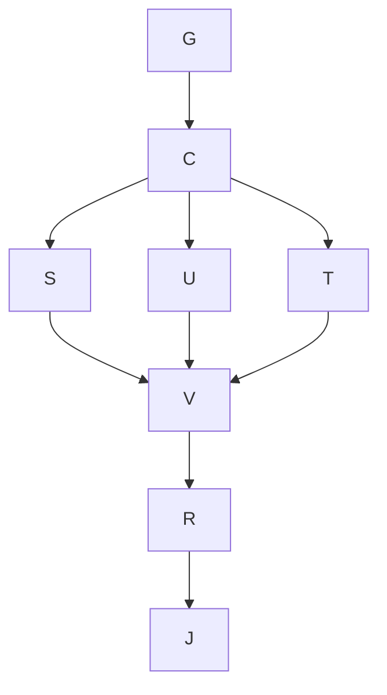

# Goal and boundaries

Goal: incorporate the five approved authoring additions and resolve the identified specification contradictions, then independently inspect for further gaps.
Done when specification and interactive v7 agree, changed flows have observed proof, and remaining gaps are ranked for review.
Not in scope: production implementation, application/backend selection, deployment, merge, or automatically implementing newly discovered gaps.
Tier T2. Fan-out cap three including coordinator. Continue the existing session-owned `feature/foildsl-authoring` worktree.

## Before-edit surface list and direction

Profile bank and station assignments → normalized span blend reader → source parser/serializer → section draft scope and thickness policy → shared revision/history → CAD/section/source views → baseline/alternative snapshots and analysis pins → edit intent → product and language specifications → rendered HTML → proof, graph and audit.
No production store/service/wire exists. Native persistence and exact geometry remain specified obligations, not HTML proof.

Preserve the desktop workbench, tokens, docks and four-view CAD. Add a compact persistent station card with a section thumbnail and an explicit Edit section action. Scope appears in the section document. Edit intent and alternatives use keyboard-accessible dialogs; comparisons use accepted snapshots and honest unavailable evidence. Direction: technical instrument, quiet canvas, compact contextual controls, clear draft owner. No ornamental imagery.

Domain precedes UX: a profile is a named authored value referenced by assignments; selected station is view state. Shared edit affects every referencing assignment and adjacent blend intervals. Fork changes one assignment and its adjacent intervals. Draft owner does not follow selection. Baselines are immutable snapshots; alternatives retain source, assignments, history and run pins. Display geometry is derived by one reader.

## Graph and ownership

| Node | Goal / inputs | Exit and oracle | Tier | Capability | Dependency |
|---|---|---|---|---|---|
| G | Ground current spec, mockup, history, skills | verified seams and surfaces above | T2 | Reasoning | none |
| C | Settle ownership, scope, span and alternatives | independent domain/Test Architect conditions resolved | T2 | Independent review | G decision |
| S | Language agent evolves spec/contracts | explicit criteria and contradictions resolved | T2 | Reasoning | C decision |
| U | Coordinator builds v7 | changed flows functional; bounded unsupported cases explicit | T2 | Reasoning | C decision |
| T | Reviewer writes adverse interaction oracle | observed RED, semantic/history/selection assertions | T0 | Deterministic mechanics | C decision |
| V | Execute browser, render, craft, docs gates | state assertions and rendered evidence, no blocking failures | T0 | Deterministic mechanics | S,U,T data |
| R | Independent veto and further gap review | ranked findings, resolved blockers and residuals | T2 | Independent review | V data |
| J | Derive, audit, commit, handoff | review links and clean owned worktree; no merge | T0 | Deterministic mechanics | R data |

S owns Markdown specifications/decision notes, U owns HTML/build tools/integration, T owns the new browser oracle, R owns review/proof notes. They share the settled contract, never a writable file. Join requires actual artifact inspection and test output; partial work cannot clear a veto. One retry for transient tool errors, then report and use a local fallback. Failure stays within the branch's owned surface.

Inferred node-unit model: naive 8 serial nodes, work 8/span 8; optimized work 8/span 6, width 3, deterministic share 3/8. Ceiling `(8−6)/3+6=6.67` node units; no elapsed-time speedup claim. Collapsing grounding and domain review would remove independent disconfirmation, so rejected. Separating dependent UI subfeatures would increase handoffs, so rejected. Evidence inspection and spec writing may overlap after C; independent breadth exploration is bounded to the final gap review.

Immovable floors: independent model/data and UX veto; observed RED; full existing CAD/source/edge regression floors; hostile input and resource bounds; rendered keyboard/layout/contrast/craft checks; docs/audit discoverability. Shared fail clauses are jointly satisfiable: selection may change without changing geometry; a single draft may remain inspectable while other writers refuse; normalized profile geometry may differ while the held t/c channel stays identical. Scans cover v7 and new source tools, not historical reference UI.

Repair loop variant: unresolved blocking assertions/review findings, floor zero. Exit requires zero plus no new blocking failures. Three non-decreasing passes trigger re-planning, never completion. No fixed time budget; reduce concurrency or change proof mechanism if blocked, never drop an obligation. Re-plan at multi-profile reader integration and independent review.

Grounding gap carried from the prior plan: `kb-graph-and-loop-engineering` is absent from the consuming repository; use the installed execution-graph standard without inventing a dangling typed link.

## Planned versus actual

The eight-node dependency graph was retained. Specification and the new adverse oracle proceeded under
separate ownership while the coordinator built the settled interaction model. Independent review then
consumed actual browser/rendered evidence. No new gap-review finding became a new implementation track.
The final mechanical join runs after the independent verdict; its audit marker measures elapsed duration.
Token and individual-agent timing data are unavailable, so no speedup or saving is claimed.

Observed rework included five failing full/surface gate runs before the first green combined pass:
contextual target sizing, selection focus restoration, the old chrome budget plus invalid legacy fixture,
the remaining invalid fixture diagnostic, and the section reflow target gate. Independent extended-state
review then found draft-tab overflow and stale bottom-bar copy, repaired before final review. Additional
semantic probes corrected coarse chord resampling and per-profile basis metadata. These are evidence of
where the initial surface inventory needed deeper state coverage, not reasons to weaken its gates.

The new fixed entry actions justify the explicitly recorded CAD-07 budget change from 48 to 51; observed
entry chrome is 49. Layout, target, contrast and keyboard floors are unchanged. The old test's direct
duplicate station injection was replaced by public add-if-absent setup, preserving its lifecycle oracle.
Source, rail and full CAD gates passed (13/6/16 groups; 77 CAD measurements and 30 shell cells), with final
authoring state coverage and independent verdict linked by the proof pack. The graph relation control caught
unregistered prose relations before index derivation. See `docs/proof/authoring-decisions.md` for evidence.
