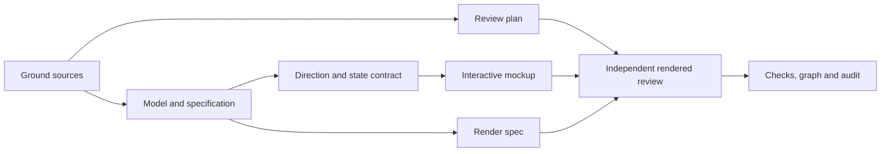

# Editable foils and flow-result iteration

Goal: update the current spec and mockup using CFD-Bench and the proposal packet. Done when both express editable catalog sections, weighted smoothing for sections and outlines, water-aware loads, velocity/angle sweeps, and linked 2D/3D flow playback, with independent review and checks. Not in scope: selecting the stack, implementing a solver, native runtime, publishing or installing dependencies for the future product. Tier T1; fan-out cap three delegates, four agents including coordinator.

## Grounding and shape

Traversal: `mockup-workbench → spec-cfd-workbench → kb-cfd-workbench-grounding`, with `mockup-workbench → workbench-direction → design-language`. The current source map resolves the proposal packet to `~/projects/CFD-WorkBench-Proposal`. CFD-Bench's parametric geometry, CAD UX, flow visualization, constants and estimation methods supply domain context. Source claims are not promoted to scientific validation. The graph-engineering knowledge base is absent in this consuming repo; the installed execution-graph standard supplies the rules without inventing an unresolved graph edge.

Surface list: source evidence → conceptual geometry/conditions/sweep/result model → functional criteria → UX flows → UI state contracts → design language/direction → interactive mockup → spec HTML and browser proof → graph/audit. No store, service or production compute code is changed.

Candidate meanings of smooth: exact interpolation with tangent continuity, or approximating weighted control geometry. The user's words select the latter as a named mode while exact constraints remain explicit. Candidate meanings of replay: parametric operating points or physical transient time. The request selects operating-point replay; transient playback is a separately gated capability. Existing G1 modeling and G2 scientific-view archetypes remain because precision entry is serial while linked evidence is read in parallel.

## Execution graph

| ID | Goal and inputs | Exit / oracle | Tier | Capability | Dependencies |
|---|---|---|---|---|---|
| G | Ground current artifacts and source deltas | Sources read, interpretation and bounds recorded | T1 | Reasoning | none |
| P | Attack plan and floors | Independent Test/Simplifier lens finds no weaker proof | T1 | Independent review | G, plan (data) |
| S | Update conceptual and functional model, then UX/UI spec | Falsifiable happy/error criteria cover every user request | T1 | Reasoning | G (data) |
| D | Extend words-first direction and state contracts | One selection, weighted smoothing and shared sample identity specified | T1 | Reasoning | G, S contract (decision) |
| U | Extend interactive mockup and behavior oracles | Geometry, metrics, sweep controls and replay demonstrate the contract | T1 | Reasoning | D (decision) |
| H | Render full canonical spec to HTML | Source hash, all text and flows preserved | T0 | Deterministic mechanics | S (data) |
| V | Measure and independently attack spec/mockup | No unresolved in-scope blockers; limits stated | T1 | Independent review | P, S, U, H (data) |
| C | Reconcile, derive and audit | Repository/HTML/browser/craft evidence and linked artifacts | T0 | Deterministic mechanics | V (data) |

Naive ordering repeats source discovery then builds spec and UI serially. Optimized work shares source grounding and an early model/UX contract, overlapping HTML mechanics with mockup work. Authoring waits on the agreed contract; independent source reads and review preparation do not. There is one owner per changed file. No broad exploratory research fan-out is needed.

**Inferred unit-work model, not measured time:** eight nodes; T1=8, T∞=6, p=3 upper bound (8−6)/3+6=6.67 units versus serial span 8. Deterministic share 2/8, unchanged. Historical prior authoring ran 3,550 seconds across the original full specification/design task; that broader task does not establish this iteration's duration or bottleneck. Token cost is not available. The bounded author/reviewer split earns its cost through different artifacts and independent vetoes; no speedup is claimed from this model.

Floor nodes are immovable: source/one-authority trace, bottom-up specification, independent Test/Data/UX veto review, real rendered interaction proof, required documentation and audit checks. Functional changes to the prototype get falsifiable browser oracles, including invalid inputs and immutable result provenance. A new control must demonstrate it rejects a broken case; green alone is insufficient.

Fan-out contract: cap three delegates; one retry only for transient tool failure; spec author exits with owned spec/source files, UI author with owned mockup/tools, reviewer with specific predicates and evidence. Join inspects all outputs. Partial failure stays open and is reported; no missing branch is silently accepted. Authors never share an index mutation or clear their own hard vetoes. Root owns graph, audit, plan, direction and integration.

Loop: unresolved in-scope blocking findings strictly decrease to zero. A correction must close a named finding and be rechecked. Three rounds is a circuit breaker that triggers replanning, never a pass or reason to drop a gate. Replan if smoothing contradicts shape ownership, field data is unavailable, rendering tooling fails, or review exposes incompatible specification and mockup contracts.

## Verification contracts

| Check | Corpus and failure clause | Compatible boundary |
|---|---|---|
| Spec/source review | Changed current specification; all new user verbs and dependent scope statements | Future product behavior may be specified without pretending runtime exists |
| Browser oracles | `docs/mockups/workbench.html`; route and harness matrix plus geometry/sweep/load/replay paths | Deterministic illustrative fixtures, not hydrodynamic validation |
| Spec parity | Full Markdown body → generated HTML; requirement IDs, text blocks, diagrams, source hash | Only frontmatter excluded from visible body |
| Craft and tokens | Explicit mockup HTML and design preview; installed complete ruleset, nonempty scan, no new suppressions | Cosmetic findings reported by severity, never hidden |
| Repo checks | Repository through `tools/check-docs.py` and installed graph/audit traversal | Use installed exclusions; no custom graph writer |

Exact scan scope: craft is nonrecursive over the two named HTML files, using the installed 59-rule Impeccable set through `ui-craft-gate.py`; token authority is root `DESIGN.md`, with no additional allowlist or suppression. Browser control checks load only the named workbench file and exercise the explicit routes/harness values in `tools/check-mockup.mjs`; HTTP(S) requests and page exceptions fail. Graph checks recurse through `docs/` Markdown plus the root artifacts supported by `docs-graph.py`, excluding its documented `docs/ai-forward-pack/**`, `docs/_site/**`, generated HTML/index and non-Markdown data. These exclusions govern graph metadata only, never UI coverage or scientific claims.

Independent plan gate: Test Architect PASS-with-conditions and Simplifier PASS. Final clearance requires rendered behavior plus a populated proof record. The reviewer requested explicit scan bounds; the paragraph above closes that plan finding. No requested or mandatory verification was removed.

Shared-surface predicates are jointly satisfiable: simulation inputs change case definitions, historical results retain their pinned inputs; conversion changes force display only; geometry preview does not commit until Accept; sweep replay changes selected case, never claims elapsed solver time. Tests must fail if any of those boundaries is violated.

Budget: no user cost limit. Reuse tools and existing tokens. Degradation is explicit unverified product/native/scientific obligations, never an omitted requested interaction or silent scope cut.

## Completion ledger

All eight nodes completed within the declared three-delegate ceiling. The source and geometry/conditions contract was shared before UI authoring; specification HTML rendering overlapped mockup construction. Independent plan and specification gates passed, and the final reviewer exercised the rendered artifact before clearing it. Root retained graph/audit/integration ownership. No product runtime, stack selection, installation or publishing entered scope.

Measured deliverables: specification revision 0.2, 82 requirement IDs, 535 HTML-parity text blocks, five rendered workflows; 144 browser measurements and 22 behavior oracles in the final 5.818-second author check; independent broad/edge/focused browser evidence; strict token lint with zero warnings; four unchanged Minor craft findings, no suppressions; 16 connected graph artifacts with zero defects/orphans/staleness/index drift. The 15 review-suggested flags retain user/downstream review. Evidence and residual limits are in `docs/reviews/foil-editing-flow-results.md`.

Rework was bounded by named findings. One specification-oracle correction addressed degenerate/locked geometry. UI correction clusters covered composition plus an available separation illustration; draft ownership/provenance/field-scope behavior; and the final sidebar/absence-heading strings. A transient 2D renderer error was caught by the actual-view oracle and fixed. Red evidence includes the missing smoothing control before edits and stale specification text/hash/edition before regeneration. These failures now have executable or always-loaded controls in the defect register.

Actual workflow wall times are measured by the keyed audit start/append records. Model tokens, per-agent overlap and monetary cost are **not recorded**. The earlier unit-work bound remains Inferred; no actual speedup is claimed. The final remaining work is user iteration and the explicitly deferred production/native/scientific proof, not an unfinished specification/mockup node.
