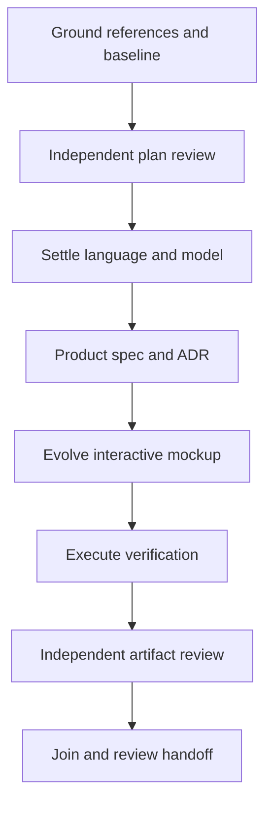

# FoilDSL authoring evolution

## Goal state

Goal: one canonical authored foil description, reconciled with existing geometry and UX.
Done when references are tracked unchanged, the product and normative language specifications agree,
the mockup demonstrates the changed flows, and independent review plus deterministic proof is recorded.
Not in scope: production implementation, stack/backend selection, deployment, merge.
Tier T2. Concurrent agents at most three including coordinator. Stop for human review.

## Grounding and surfaces (before editing)

Verified baseline: HEAD `034f0b8482c2`; spec `spec-cfd-workbench-v1` body revision 1.3;
`mockup-workbench-v5` implements that spec and supersedes v4. The spec frontmatter still says
1.2: repair the stale title as part of this revision. Traverse spec → `control-vertex-workspace`
via v5 → `cad-editing-views`; spec → `kb-hydrofoil-workbench`; plan →
the pack execution-graph standard. `kb-graph-and-loop-engineering` is absent from this consuming
repository's indexed graph: the attempted traversal returned GRAPH_INVALID after the proposed link
was added. That dangling link was removed; this is a grounding gap, not an invented knowledge node.
Source copies remain in the primary checkout.

Affected surfaces: reference files → reconciliation/evidence → domain model → normative grammar
and examples → durable representation ADR → product A/B/C requirements → source/editor transaction
model → visual controls and 2D/3D readers → revision and run freshness → prototype serialization
and reopen → browser/conformance proof → rendered specification → README and graph → audit.
No production store/service/wire/client types exist in this task; their contracts are specified only.

## Execution graph

| ID | Goal and inputs | Exit/oracle | Tier | Capability | Dependencies |
|---|---|---|---|---|---|
| G | Ground constitution, history, references, current spec/UI | source inventory, conflicts, authority and surface list recorded | T2 | Reasoning | none |
| P | Attack this plan and floor mapping | independent Test Architect/Simplifier verdict | T2 | Independent review | G |
| C | Settle domain and language contracts from G | formal syntax, semantics, examples and reconciliation; independent pre-build review | T2 | Reasoning | G, P |
| S | Update product spec and representation decision | language → domain → UX → UI trace, no competing truth | T2 | Reasoning | C |
| U | Evolve mockup under settled UX | source/visual transactions and preserved workbench interactions | T2 | Reasoning | S |
| V | Execute conformance, browser, docs and craft checks | malformed inputs rejected; geometry/revision and recovery assertions; nonempty scan | T0 | Deterministic mechanics | U |
| R | Independent domain and rendered UI review | no unresolved blocking contradiction; limitations named | T2 | Independent review | S, V |
| J | Join, derive, audit, commit and hand off | references unchanged; final checks green; review links; no merge | T0 | Deterministic mechanics | R |

All shown edges are data or decision edges. Independent reference analysis and baseline inspection
within G overlap; they own no shared writable file. S and U remain serial because UI consumes UX.
Independent review runs alongside coordinator mechanics only after inputs are frozen.
No gate is collapsed into its authoring node. P, V, R and audit/discoverability in J are immovable.

Inferred cost model (node units, not measured time): naive serial work 10, span 10, width 1;
collapsed bounded graph work 8, span 8, width up to 3 within grounding/review. At coarse granularity
T1=T∞=8, so widening the dependent authoring chain buys nothing; ceiling at p=3 is 8 units.
No speedup claim. Deterministic share 2/8. The useful overlap is source inspection, not competing
authors of the same state model. Wall time and tokens will be recorded only when measured/exposed.

## Bounds and rigor floors

Each agent has one bounded assignment: language/reconciliation/examples; baseline and independent
review; coordinator owns product spec, UI, ADR and integration. One retry for transient tool errors,
then report evidence and choose a local fallback. Partial outputs never clear a gate. Agent failure
is contained to its owned files; coordinator may finish them after ownership is released.
Join requires reading actual artifacts and proof, not trusting a success message.

Repair-loop variant: number of unresolved blocking acceptance failures, floor zero. Exit at zero
with no newly discovered blocking failure; three non-decreasing passes trigger re-planning, not
completion. Bound scope to the requested artifact set. Degrade parallelism or proof mechanism,
never silently remove a requirement or gate. Re-plan at reference conflict resolution and reviewer findings.

Testing union: D0 hygiene; deterministic parser/evaluator examples and boundaries; malformed input
and resource limits; state transitions/history; serializer round-trip; integration through UI readers;
accessibility and rendered layouts. Scientific kernel, native accessibility and solver gates remain
explicit production obligations, never certified by an HTML prototype. Observe new behavior checks red
before adding the behavior. Existing v5 oracle is the regression floor when extending its surface.

Shared-surface clauses are compatible: source text can retain formatting while normalized semantic
content provides identity; invalid drafts remain editable while accepted geometry and runs stay pinned;
the prototype may reject unsupported constructs but must never silently discard them or claim full
language/geometry conformance. Reference immutability is measured by byte comparison. Documentation
graph scan scope is the script's complete docs inventory; prototype checks target the new artifact and
its fixtures, not historical reference sources. No ad-hoc broad token ban is introduced.

## Planned versus actual

Completed the same dependency chain with two bounded delegates and a coordinator. Language and
baseline inspection overlapped; UI consumed the settled contract; independent review remained separate
from authoring. Fourteen review findings were resolved. Rework reached normalization/knots, shared
validation, metadata-preserving preview/history, source reflow and traceable criterion IDs. The final
generator sweep added the same normalization to both recipe paths. No requested surface was dropped.
Duration is measured by the audit start markers; tokens and per-agent elapsed intervals were not
recorded, so no measured speedup or token saving is claimed. Final proof is linked from
`docs/proof/foildsl-authoring.md`. Human review is the next boundary; implementation and merge remain out of scope.

Independent plan review (Test Architect/Simplifier) passed with conditions: canonical ownership gate
before UI, source/geometry round-trip and idempotency laws, malformed/version/unknown-field rejection,
bounded text input, every geometry writer synchronized, and one-draft exclusion including sections.
These conditions are included in C/V/R. RED observed before UI edits: loading v5 in Chrome found zero
`#dsl-source` controls where the authoring test requires one (2026-09-23 UTC).
