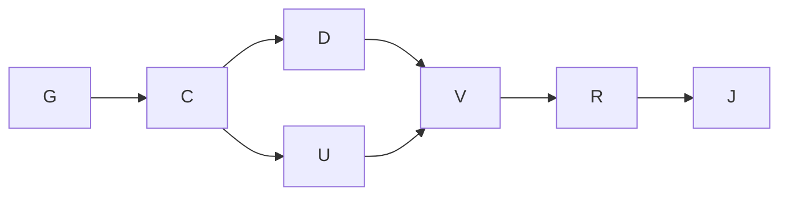

# Independent edges

Goal: LE and TE edit independently. Done when each opposite curve remains unchanged in preview,
Apply, Cancel and history, and source/geometry/readouts agree. T2; cap three agents including root.
Not in scope: production implementation, solver, stack, deployment or merge. Continue in this
session's owned isolated worktree/branch from `71a5b45`; primary checkout remains untouched.

Verified cause: `elevationSVG` maps TE as LE + stored chord, and `chanAt` reads independently
authored LE and chord. This is a representation error, not merely a pointer handler defect.
The independent geometry reviewer rejects per-control chord compensation because rail abscissae
and knot vectors can differ. Author LE and TE directly; derive chord at each eta. Changing a
rail's control eta must not remap the opposite rail. Root origin constraints remain explicit.

Affected surfaces: domain model → grammar/canonical identity/examples → CV seed/edit/validation
→ source serialization → preview/history → planform/body/analysis readers → labels/Properties
→ spec/rendered spec → proof/defect register/graph/audit. No new persistent or service code.
Graph grounding: v6 implements product spec and FoilDSL; FoilDSL refines product spec; ADR0002
records source authority. Pack graph-loop KB is still absent, as recorded in the preceding plan.

| Node | Goal/input | Exit oracle | Tier/capability | Dependency |
|---|---|---|---|---|
| G | Inspect model and reproduce coupling | opposite rail counterexample observed | T2 Reasoning | none |
| C | Settle independent rail contract; attack plan | Geometry/Test/Simplifier gate | T2 Independent review | G decision |
| D | Update grammar/spec/examples from C | derived chord, explicit compatibility, same invariant | T2 Reasoning | C decision |
| U | Correct mockup representation from C | one authored record per rail, all readers derive chord | T2 Reasoning | C decision |
| V | Verify D/U | invariance, source roundtrip, invalid crossing, old CAD/source flows | T0 Deterministic mechanics | D/U data |
| R | Independent final review | no unresolved blocking scoped defect | T2 Independent review | V data |
| J | Derive/audit/commit | clean branch, linked review artifacts | T0 Deterministic mechanics | R data |

Modeled node units: naive work/span 7/7; optimized work/span 7/6, width two within D/U;
at p=3 the work/span bound is 6⅓, not a measured duration. Parallel D/U consume one settled
contract with disjoint file ownership; reviewer owns only review evidence. One transient retry,
then narrower execution; partial results cannot clear the join. Variant: unresolved blocking
contract or oracle failures, floor zero. Three non-decreasing repair passes trigger re-planning,
never completion. Rigor floors: red-first opposite-edge test, shared-acceptance validation,
source and geometry consistency, scientific/native disclaimers, independent review and audit.
No architectural/kernel refactor beyond the scoped representation is authorized.

UI direction: retain the existing expert ParametricWorkbench archetype, tokens, panes and motion.
The job is precise rail manipulation: independent, predictable, inspectable rather than coupled,
surprising or implicit. No new layout or dependencies. Existing accessibility/state/harness floors
apply; root-origin/rail-crossing rejection must retain the draft and expose the diagnostic.
Text, pointer and keyboard edit the same edge; Properties names absolute aft position, while chord
remains a derived readout. Native accessibility remains unverified by HTML evidence.

Actual: seven nodes completed with the planned D/U overlap and separate review. The initial edge
oracle observed 1.602926 mm unwanted opposite-edge motion. Six final edge groups pass, including
different six/nine-CV bases, actual pointer/numeric/keyboard/source input and history; thirteen
source groups and sixteen preserved CAD groups pass. Independent review adds four observed
negative/topology tests. Both rendered specs preserve all source blocks. Three narrow corrections
followed verification: physical chord target key restored after identifier rename, expected sorted
frame order updated, explicit legacy conversion diagnostic added. No proof floor was removed.
Timing is measured by closing audit markers; tokens and per-agent time are not recorded. No speedup
claim. Remaining native/scientific gates and minor UI findings are in the independent review.
