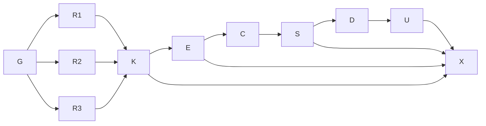

# Knowledge base, domain experts, build-basis specification and elevated mockups

**Goal:** produce the research-backed knowledge base, the domain-expert roster, a new specification that is the basis for building the product, and elevated mockups.
**Done when:** `docs/knowledge/hydrofoil-workbench/` holds the compiled base with index, glossary, constants, open questions and sources; `docs/domain-experts.md` and the persona files exist and the roster surfaces agree; `docs/specs/cfd-workbench-v1.md` supersedes revision 0.2 with a recorded critique and gate; `docs/mockups/workbench-v1.html` and its review exist; graph, audit and repo checks are green.
**Not in scope:** stack selection, architecture, implementation, solver runs, native proof, publishing.
**Tier:** T2. **Fan-out cap:** six concurrent delegates per wave. **Session:** `kb-experts-spec-20260920`, worktree `feature/knowledge-experts-spec-v1`.

## Grounding traversal

`spec-cfd-workbench → kb-cfd-workbench-grounding → {proposal, sequence, inventory, bench-parametric-geometry, bench-cad-ux, bench-gap-register, decision-0001}`; `spec-cfd-workbench → {mockup-workbench, workbench-direction, design-language, review-ui-workbench, review-specification-gate, defect-classes, decision notes}`. All nodes opened. Findings from grounding: the gap register's PROC-01 (domain experts never added) and GAP-02/03/05/06/07 remain open and are exactly what this turn's research must close or bound; the 0.2 specification has no numerical goal-state, no optimization layer, no structural or manufacturing floor, and no measured user evidence.

## Execution graph

| ID | Node | Exit oracle | Tier | Depends on |
|---|---|---|---|---|
| G | Ground repo, specs, mockups, standards; baseline measurements of the current mockup | Baseline craft/lint/browser numbers recorded | T1 | — |
| R1 | Research wave 1: CAD UX · marine/board CAD · curves/lofts · file formats · disciplines data · section catalog | Six area files with the output contract | T2 | G |
| R2 | Research wave 2: low-order hydro · optimization · OpenFOAM/SU2 interop · integration/AI · visualization · structures/materials/manufacturing | Six area files | T2 | G |
| R3 | Research wave 3: validation data, cavitation/free-surface/ventilation/unsteady, testing numerical software | One area file | T2 | G |
| K | Compile the knowledge base: index, glossary, constants, open questions, sources, comparables, references; Simplifier/Researcher adversary gate | Roll-ups compiled by script from area files; gate recorded | T1 | R1, R2, R3 |
| E | Domain-expert roster: derive from repo evidence and the base; Simplifier/Patterns/Tech-Lead gate; write persona files and roster surfaces | `docs/domain-experts.md`; agents in both trees; casting sheet, cards index, README count updated | T1 | K |
| C | Critique specification 0.2 and proposals with the new experts in Adversary Mode | Findings with severity, confidence and fix | T2 | E |
| S | Write specification v1 bottom-up (A: model → B: UX → C: UI); adversarial gate by Test, Data, UX-IA, UX-A11y, Security, AI, domain experts | Every criterion falsifiable; vetoes resolved or recorded; HTML rendered and parity-checked | T2 | C |
| D | Direction brief update, DESIGN.md v1, motion inventory, copy | design-lint strict clean | T1 | S |
| U | Mockup v1 with harness and hard states; browser oracle; craft gate; independent a11y review | Oracle green; detector reported; veto cleared by non-author | T2 | D |
| X | Graph derive, flags, decision notes, defect classes, audit and change log, repo checks | `check-docs.py` and `docs-graph.py validate` green | T0 | K, E, S, U |

Critical path: G → R → K → E → C → S → D → U → X. Research is the only wide fan-out; it is bounded at six per wave with per-branch exit (file present with the contract), one retry for transient tool failure, and a join that reads every file. The spec and the mockup are serial by S2 (structure before surface). The rigor floors are immovable: sourced and labeled claims, Simplifier gate on the base, roster confirmation recorded, bottom-up spec authoring with independent vetoes, hard states and harness in the mockup, deterministic craft gate, browser oracle, graph and audit closure.

Objective order: completeness and rigor, then token cost, then speed. The research fan-out is the one place speed is bought with tokens; it is justified because the twelve areas are independent and each needs its own source budget.

## Verification contracts

| Check | Corpus | Failure clause |
|---|---|---|
| Knowledge contract | every `docs/knowledge/hydrofoil-workbench/*.md` | frontmatter parses; each headline finding carries a label and a source id; roll-ups compiled, not retyped |
| Roster consistency | `docs/domain-experts.md`, `.claude/agents/*.md`, `.github/agents/*.agent.md`, `collaborative-personas.md` §5, `persona-cards.md`, `persona-audit.md` §8.7/8.8, README | every expert appears in all surfaces with the same name and veto |
| Specification | `docs/specs/cfd-workbench-v1.md` → HTML | `tools/check-spec-html.mjs` parity; every story ID unique; gate record present |
| Mockup | `docs/mockups/workbench-v1.html` | `tools/check-mockup-v1.mjs` green; `ui-craft-gate.py` reported; `design-lint.py --strict` clean |
| Graph and repo | `docs/` | `docs-graph.py validate`, `tools/check-docs.py` |

## Planned versus actual

| Node | Planned | Actual | Delta and lesson |
|---|---|---|---|
| G | baseline measurements | craft gate 2 Minors, browser oracle 22 oracles / 144 measurements on the 2026-09-19 mockup | as planned |
| R1–R3 | 13 area files, 6 per wave, one retry | 13 area files (6,157 lines, 591 sources); one wave lost six agents to a provider rate limit (HTTP 429) and was relaunched after the session model switched to Opus 5; the WebSearch quota (200/200) ran out for the last agents, which sourced by direct URL | the retry contract held; the quota is a fan-out cost axis to budget next time (record `searches per agent` in the brief) |
| K | compiled roll-ups, gate | 7 roll-ups by `tools/compile-knowledge.py`; gate BLOCK on five Majors (JMSA constants, AR convention, over-labelled claims, unconsumed values, untagged Flagged bounds) → fixed → PASS-WITH-CONDITIONS | the gate caught a transcription error a reader would have trusted; the compile script's `--check` is now the drift control |
| E | roster + surfaces | 9 candidates → 7 seats; persona files mirrored by `tools/mirror-agents.py`; roster surfaces patched with a marker | as planned |
| C | 14-lens critique | 22 Blockers, 110 Majors consolidated into disposition tables | as planned; volume higher than expected — the 0.2 spec had more unfalsifiable rows than the grounding suggested |
| S | spec v1 + gate | 1,257 lines, 87 criteria, rendered with parity (885 blocks); three gate panels found 1 Blocker + 20 Majors, all fixed in place (85 edits); KB 04 row corrected (0.774 → 0.773) | a second full read by three panels was the right cost: every Major was a sentence, and two (identity tolerance, thickness rule) would have been record-format defects |
| D | DESIGN.md v1 | batlow/vik tokens from the 256-row maps (MIT, verified), target-dense, COPY-28…72 verbatim from the spec, section 12.0; lint clean | as planned |
| U | mockup v1 + oracle + a11y | 140 KB self-contained artifact; 21 oracles / 23 measurements green; craft gate one recorded deviation; independent UX & Accessibility gate (see `docs/reviews/ui-workbench-v1.md`) | two defects found by the oracle before the a11y gate (UI-F selector collision, UI-G chrome z-order) — both are register rows now |
| X | closure | derive, flags, validate, check-docs, audit and change entries | as planned |

**Objective check.** Completeness and rigor first: every node's exit oracle was observed, not asserted. Token cost: the research fan-out and the three spec gate panels were the two expensive nodes; both are justified by the defects they found (five KB Majors, one spec Blocker). Speed last: the critical path was G → R → K → E → C → S → D → U → X as planned; the rate-limit relaunch was the only unplanned serial step.

## Turn 2 (2026-09-21) — seven areas: spec 1.1 and mockup v2

**Goal:** revision 1.1 with seven discrete, complementary areas and an AI prompt entry each; mockup v2 rendering the target build state richly. **Done when:** spec rendered with parity and gated; mockup v2 oracle green, craft gate reported, a11y PASS by a non-author; hub, review, notes, audit, graph and repo checks green. **Not in scope:** stack, architecture, implementation, solver runs, native proof, commits. **Tier:** T2. **Fan-out cap:** 4.

| Node | Planned | Actual |
|---|---|---|
| S2 · spec 1.1 | edit in place; two gate panels | 25 + 20 edits; 1,611 lines; two panels (six lenses) found 3 Blockers + 28 Majors; 68 fix edits; parity 1,238 blocks, 9 flows |
| D2 · DESIGN.md | COPY-73…97; component rows; 12.0a | done; lint clean |
| U2 · mockup v2 | rebuild the shell around the area strip; reuse the v1 core | 228 KB; 84 measurements; 12 oracle groups; craft gate one recorded deviation; a11y gate (this turn's independent run) |
| X2 · closure | hub, note, register rows, audit, graph | done at close |

**Objective check.** Completeness and rigor first: both gates ran before either artifact was called done. Token cost: the two gate panels were the expensive node and found three Blockers, two of which (Goal-state versioning, unbound step parameters) would have been record-format or security defects. Speed last: the mockup rebuild reused the v1 core and its oracle, so the critical path was spec → gate → fix → mockup → oracle → a11y.

## Turn 3 (2026-09-21) — thick-client shell: mockup v3

**Goal:** elevate the mockup into a thick-client shell (Eclipse/VS Code · Fusion 360 · Shape3d · Rhino metaphors), arranged per vignette, with the toolbar functional and no page scroll. **Done when:** the shell contract is proven by an oracle at five window presets × six areas, every v2 interaction contract still passes, the craft gate is at its recorded floor, the independent UX & Accessibility lens clears the veto, and DESIGN.md, the spec's Part B/C, the hub, the review, the decision note and the register are updated. **Not in scope:** native code, new functional stories, new physics. **Tier:** T1. **Fan-out cap:** 2 gate agents.

| Node | Planned | Actual |
|---|---|---|
| M3 · measure v2 | window height, scroll, strip wrapping at five widths | 1,450–6,500 px tall at every width; strip wrapping 2–3 rows in a 64 px bar (direction brief v3 section) |
| B3 · direction | metaphors named per region; per-vignette arrangements before pixels | done first (direction brief); the curve-editor palette moved out of the app toolbar during the build (Simplifier call, recorded in the note) |
| U3 · mockup v3 | new shell CSS + markup; re-home the v2 renderers; shell wiring | 258 KB; five layout defects found by the smoke run and the shell audit before any gate (implicit grid row/column from auto-placement, closed `
` in scrollWidth, duplicate ids); results viewport re-centred with a compact mode; drawers at 640 × 400 |
| O3 · oracle | v2 checks re-targeted + shell checks | `tools/check-mockup-v3.mjs`: 14 groups, 77 measurements, 30 shell cells green; craft gate one recorded deviation; design-lint clean |
| G3 · gates | UX & Accessibility (hard veto) + Native Desktop lens in parallel | see `docs/reviews/ui-workbench-v3.md` |
| X3 · closure | DESIGN.md §5/§12.0b + tokens; spec 1.1a (B1, B7, C1, UI-18, UI-23, D2a); hub; note; UI-H2; audit + change log; graph | done at close |

**Objective check.** Completeness and rigor first: the shell contract became an oracle before the content was re-homed, so every later layout fix was measured, not eyeballed. Token cost: the largest spend was the build itself (one Python patch per fix batch, screenshots read at each step); the two gate agents ran in parallel once, not per fix. Speed last. **Incident:** the playwright module root borrowed from another repo's worktree was removed by that repo mid-turn; replaced by a scratchpad `pnpm add playwright` and recorded in memory (never borrow a worktree for deps).

## Turn 4 (2026-09-21) — CAD editing views: mockup v4 and specification 1.2

**Goal:** icon rail, splines, a free-orbit camera with named views, the station editor as a 2D CAD document, editing elevations for the outline, dihedral/anhedral, twist and thickness as control curves; spec 1.2 for those stories. **Done when:** v4 passes the re-targeted oracle plus the CAD-views group; craft gate at floor; the a11y lens clears; the IA lens clears the UX-layer delta; spec rendered with parity; hub/review/note/register/audit land. **Tier:** T1 · **fan-out cap:** 2 gate agents.

| Node | Planned | Actual |
|---|---|---|
| B4 · direction | metaphors per ask; the 3D-drag risk named before building | done first (direction brief v4) |
| U4 · mockup v4 | new geometry block (splines, projector, 3D view, elevations, station document, icons); shell rewired; old views deleted | 310 KB; the v3 views and the dialog deleted rather than overridden; the lines-plan re-laid as Top over Front + Side after the first screenshot showed three thin panels; analysis layers projected into 3D after the toggle lost them |
| O4 · oracle | v3 groups re-targeted + group 13 | 16 groups, 78 measurements, 30 shell cells green; craft gate: em-dash (recorded) + a spacing cluster measured to be SVG chart geometry |
| S4 · spec 1.2 | CAD-04–06, UX-23, UI-24–25, pointer contract, D3 | rendered with parity (144 ids) |
| G4 · gates | UX & Accessibility + UX Researcher / IA in parallel | see `docs/reviews/ui-workbench-v4.md` |
| X4 · closure | DESIGN.md §12.0c + rows; hub; note; audit; graph | done at close |

**Objective check.** Completeness first: each ask in the brief maps to a story and an oracle assertion. Token cost: one build pass with three screenshot rounds; the two gates ran once in parallel. Speed last.
