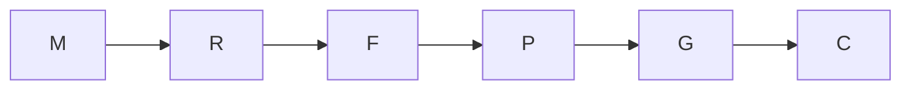

# PRJ-2 execution graph

Goal: clear six CFD review findings without assigning the held VLM-4 tip law. Done when focused tests,
the one full test gate, named tests, docs and event-subscriber gates pass and the repair is committed.
Scope: PRJ projection, labels, tests, COPY-217/232/233, optional strip edges and their writer, PRJ design rows.
The source-to-view surface list is run record → product coupling → projection → result rows/layers.

| Node | Capability | Dependency | Exit |
|---|---|---|---|
| M · merge and inspect merged contracts | Deterministic mechanics | none | Integration head present; `MethodRecord` and strip schema read |
| R · write failing checks for claims, statuses and arithmetic | Reasoning | M | Each changed claim has a red line or planted product mutant |
| F · implement six corrections | Reasoning | R | Focused checks pass; no text-based verdict classification or index-based excluded-strip width |
| P · record proposed copy and proof | Reasoning | F | Proposed rows, source/assumption, proof receipt and ledger are consistent |
| G · run full and named repository gates | Deterministic mechanics | P | Requested four gates have recorded outcomes |
| C · commit and report | Deterministic mechanics | G | One PRJ-2 commit and gate tails reported |

The only repair loop reduces the count of failing focused checks and is capped at two cycles; a cap firing
is a defect report. Fan-out width is one because the verdict, width and copy edits share the projection and
one test harness. No parallel workers were started. The cost figures for individual checks are measured by
the Analysis harness; a whole-turn duration is not claimed because the timing marker was not set at grounding.

Actual: M → R → F → P → G covered the first three findings in red-first order. The width,
moment-arc and copy checks were proven by planted mutants after the corresponding implementation;
their red observations are retroactive sensitivity evidence, not red-first history. A focused
partial-edge boundary correction followed G.
The full ring had no test failures but returned 3 on its 60 s wall budget under measured machine load;
the three other requested gates passed. The remaining gate result is recorded in the linked proof and
reported to the operator rather than raising the budget or repeating the one requested full run.
