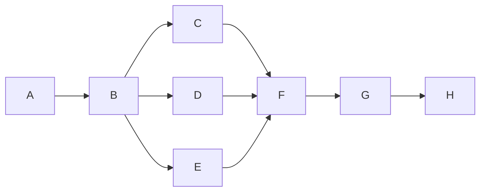

# SEAM repair cycle 1 graph

**Goal:** satisfy review conditions 1–11. **Budget:** 120 minutes, repair cycle 1 of 2.
**Fan-out cap:** 1; the shared projection, section and test files made independent
parallel edits unsafe. **Stop:** each repair exits on its focused red→green oracle;
the final sequence exits on the full ring, docs check and verify gates, or reports a
gate failure for the coordinator.

| Node | Capability | Input | Exit oracle | Depends on |
|---|---|---|---|---|
| A. Rebase | Deterministic mechanics | main and SEAM branch | clean rebased worktree, derived index regenerated | — |
| B. Ground contract | Reasoning | spec, design, COPY-66, KB [S6], code and tests | each requested surface and source bound identified | A |
| C. Repair values and labels | Reasoning + deterministic mechanics | section, polar, drag, projection | focused checks red then green for 1, 2, 4, 6–10 | B |
| D. Repair panel cost | Reasoning + deterministic mechanics | panel solver, cambered foil | one LU per section and measured 129-station warm pass | B |
| E. Repair free surface | Reasoning + deterministic mechanics | [S6] four-axis envelope | each axis has a failing-then-passing boundary test | B |
| F. Reconcile proof | Reasoning | reviewer measurements and C–E results | §5.1, proof and defect classes agree | C–E |
| G. Verify | Deterministic mechanics | final tree | one full ring, check-docs and verify gates read to completion | F |
| H. Close | Deterministic mechanics | G results | audit append, render, derive, commit and review handoff | G |

**Cost ledger.** Planned width 1; actual width 1. The repair nodes were independent
in physics but coupled in `AnalysisProjection.cs` and the Analysis harness, so serial
commits preserved one item per change. Focused loops had a failing assertion or
compile contract as a decreasing variant, then a passing assertion; no repair loop
exceeded one correction pass except the cambered source's singular endpoint and the
rendered tier-note follow-up. The cambered warm pass measured 430.265 ms on macOS
arm64. The single full ring took 56 seconds and passed every harness; the docs check
passed and all 12 verify gates passed. The ring had two load-gated cost misses at
load 27.96, recorded as measurement limits rather than passed performance claims.
