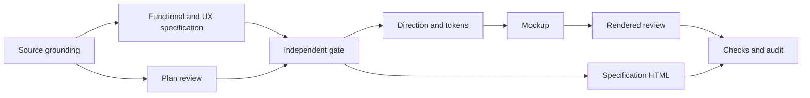

# Specification and interface execution plan

Goal: a full Markdown/HTML specification and high-fidelity HTML mockups for Mac and Windows hydrofoil design. Done when geometry ownership, workflows, hard states and evidence are reviewable. No application implementation, stack selection, solver installation or historical Windows recovery. T2, three concurrent delegates maximum (four processes including owner).

## Grounding and scope

The requested plural proposal directory is absent. The sole matching directory is `~/projects/CFD-WorkBench-Proposal`; its README describes this precise task. Use it as the intended source. Existing Workbench contains a pack and bootstrap audit only: no spec, design language, knowledge graph index, or defect register. Thus the graph traversal starts with source documents, and this change creates the missing links. Pack graph-engineering evidence is not installed in this consuming repository; the installed execution-graph standard supplies the planning rules. No unresolved graph node is invented for that absent knowledge base.

Candidate framings: a general CAD tool, a solver frontend, or a hydrofoil-specific shape-to-evidence workbench. The third matches both proposal sequence and user request. The first two remain boundary systems, not product goals.

Surface list: proposal evidence → conceptual model → functional requirements → UX flows → UI criteria → design tokens → HTML mockups → rendered checks → spec HTML → graph and audit. No store, service, wire type, or compute implementation changes in this task.

## Graph

| Node | Goal / inputs | Exit / oracle | Tier | Capability | Dependencies |
|---|---|---|---|---|---|
| G | Ground proposal + geometry sources | source ledger; contradictions named | T2 | Reasoning | none |
| P | Bound this plan and floors | independent reviewer finds no weaker proof | T2 | Independent review | G (data) |
| S | Author A functional/model, B UX, then C UI criteria | three layers cover all sequence verbs and failures | T2 | Reasoning | G (data) |
| R | Review A→B→C: model, scope, security, UX and UI contract | no unresolved specification blockers | T2 | Independent review | S (data) |
| D | Direction + token system | chosen G1/G2, triggered standards, copy and states | T1 | Reasoning | R (decision) |
| U | High-fidelity interactive mockup | core edits and every harness selector demonstrable | T1 | Reasoning | D (data) |
| V | Render, measure and critique | no unresolved mockup blockers; native limits flagged | T2 | Independent review | U (data) |
| H | Generate full spec HTML | same source hash; all section text present | T0 | Deterministic mechanics | S, R (data) |
| C | Check, index and audit | repository checks; artifacts connected; truthful gate record | T0 | Deterministic mechanics | V,H (data) |

Naive ordering reads all sources serially, then repeats their context for design. Optimized grouping splits geometry and non-geometry evidence (independent files, no shared writes), retains one spec author, then overlaps HTML generation with UI production. Direction exploration may precede R; screens may not. No gate is collapsed into an authoring node.

Inferred unit-work model (not wall-clock): nine nodes, T1=9, T∞=7, p=3 ceiling (9−7)/3+7=7.67 units. Naive serial span=9. Actual costs are not inferable from the bootstrap-only audit. No runtime speedup is claimed. Nodes with mechanical capability are executed as scripts. UI screenshots go to the independent reviewer rather than repeated main-context captures.

Fan-out contract: cap three delegates; at most one retry for a transient tool failure; evidence delegates exit with citations and conflicts, author exits with owned files, reviewers with specific PASS/BLOCK predicates. Join reads every result; partial failure is surfaced, never silently accepted. Only owner writes spec/index/audit; UI author owns UI files. Reviewers are read-only.

Review loop variant: unresolved blocking findings, floor zero. Each change must close a named finding without introducing another; exit zero blockers or explicitly unverified native/research evidence outside mockup scope. Cap three review rounds is a defect signal, never a pass. Re-plan at source conflict, scope mismatch, unavailable rendering tools, or a failing gate that changes an artifact contract.

Shared surface clauses: spec must expose all product verbs; mockup may simulate them but must label every illustrative result. These are compatible: coverage is required, running CFD is not. HTML spec must preserve every Markdown requirement; mockup is a separately labeled interaction artifact. All documentation checks scan the repository via the installed scripts, no ad-hoc graph writer.

| Gate | Target / recursion / rules | Failure predicate and exclusions |
|---|---|---|
| Docs checks | Repository root, installed docs-graph artifact traversal; frontmatter, registered links, index freshness and audit verification | Any invalid link/schema/index or failed foundation/audit check; pack sources use installed-script exclusions |
| Design lint | DESIGN.md only, all token references and strict body rules | Unresolved token or off-system specification; no excluded components |
| Craft detector | docs/mockups/workbench.html and design-language.html explicitly; detector's full installed rule set | Empty/unavailable scan is not PASS; findings mapped to review severities, no silent allowlist |
| Rendered review | All mockup task views and harness dimensions; computed page box, contrast, targets, keyboard and overflow | Hidden/zero frame, inaccessible edit path, missed hard state or broken selector; native runtime expressly out of scope |
| HTML parity | Full spec Markdown body through generated HTML; all requirement IDs, sections and source hash | Any missing requirement/text/hash mismatch; frontmatter excluded from human-readable body only |

Final C reruns source-to-HTML parity after any UI-driven Part C change. Plan review findings P1/P2 corrected in-place; independent reviewer must confirm.

Budget: no user cost/token limit requested. Avoid re-reading shared corpus and avoid new product code. Degradation is explicit evidence gaps or narrower preview fidelity, never removal of a required state, source, or gate.

## Completion ledger

G/P/S/R/D/U/V/H/C completed for the requested specification and HTML iteration artifact. G identified the singular proposal directory, preserved eight source snapshots and reconciled the user's completed Grok gap update. P and R independently closed modeling, plan, flow and acceptance-coverage findings. D selected G1/G2 from the task and established tokens before U. V closed the named geometry, focus, navigation and historical-result blockers; four Minor craft findings remain visible for iteration. H rendered all 459 source text blocks and five flows with matching hash. C indexed 13 artifacts and ran the repository checks: zero defects, orphans, stale artifacts or index drift. Eleven review-suggested flags intentionally preserve the user-iteration handoff; they are not failed checks. Closing skill records are in the audit log.

The planned three-delegate ceiling was maintained. Geometry and proposal evidence were gathered independently; the main agent retained specification and integration ownership, the UI author retained mockup ownership. HTML generation and specification verification overlapped UI authoring. Final focused corrections used the same reviewers instead of new delegation. The user's Grok update added an explicit source-reconciliation step. Native proof, full WCAG conformance, scientific validity and per-edit latency remain unverified outside the HTML delivery claim.

Actual measured outputs: 144 browser measurements, 14 behavior oracles, four Minor craft findings, zero strict design-lint warnings, 459 HTML parity blocks. Browser sweep duration is in the proof JSON; skill wall time is measured by audit start/append. Token counts, aggregate agent overlap and cost are **not recorded**; the earlier unit-work estimate is not presented as an actual speedup. Evidence: [specification gate](../reviews/specification-gate.md), [interface review](../reviews/ui-workbench.md), browser and HTML proof JSON, and the audit log. No application implementation or stack selection entered scope.
