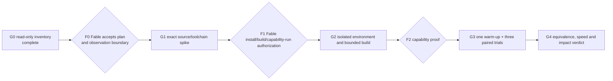

# Windows OpenFOAM GPU qualification plan

The pack execution-graph standard governs this plan. `kb-graph-and-loop-engineering` is absent from this consuming
repository, so the frontmatter does not invent a dangling typed link.

## Decision requested

Approve only the next planning decision: investigate the official OpenFOAM v2512 native fused/offload path in an
isolated environment. Do not authorize installation, build or GPU execution through this PR. Fable must first rule
whether the missing L3 rate for the completed inventory is acceptable, then designate an L3 observer that may export
immutable iteration samples without granting this GPU track access to live L3 state.

## Current route assessment

| Route | Local evidence | Primary-source contract | Disposition |
|---|---|---|---|
| Installed OpenFOAM v2512 binary | WSL sees the GPU; `libfusedFiniteVolume.so` and Umpire/PETSc config stubs exist. The displayed `simpleFoam` dynamic dependencies include none of them or CUDA; runtime-loaded plugins were not excluded. Toolkit and compiler commands are absent from `PATH`. | OpenFOAM's v2512 infrastructure notes say Umpire pools can select host, device or managed memory **when compiled with Umpire**. Its numerics notes describe fused expressions and tested GPU offload, while calling the functionality active development. | **Not qualified.** Visibility and a fused library do not establish solver offload. |
| Fresh native v2512 source build | No source tree was established in the bounded OpenFOAM runtime search. Other filesystem roots were not searched. | Official v2512 release/source is the same product and version as the current runtime. Exact supported compiler flags and the full `simpleFoam` offload surface have not yet been established. | **Preferred spike**, contingent on Fable approval and exact-source/toolchain review. |
| PETSc CUDA with AmgX | PETSc/AmgX libraries and tools were not found in the bounded runtime search. OpenFOAM ships a PETSc config stub only. | PETSc documents CUDA vectors/matrices and `PCAMGX`; it also says WSL CUDA builds are experimental and outside its tested configurations. NVIDIA documents AmgX as a GPU linear-solver library, not an OpenFOAM adapter. | **Hold.** Requires a verified OpenFOAM integration point and dependency/architecture decision. |
| Direct AmgX/OpenFOAM plugin | No plugin was found locally. | NVIDIA's AmgX repository lists general APIs and dependencies; no maintained official OpenFOAM adapter was established from primary sources. | **Hold.** Do not select an unverified third-party adapter. |
| HIP/ROCm | One HIP runtime library is present; no tools/root, and the observed discrete GPU is NVIDIA. | No local route established. | **Reject for this machine unless new evidence changes the device/toolchain decision.** |

Primary sources, retrieved 2026-10-10:

- OpenFOAM v2512 infrastructure and Umpire memory pools:
  <https://www.openfoam.com/news/main-news/openfoam-v2512/infrastructure>
- OpenFOAM v2512 fused expressions and GPU-offload status:
  <https://www.openfoam.com/news/main-news/openfoam-v2512/numerics>
- OpenFOAM v2512 release/source context:
  <https://www.openfoam.com/news/main-news/openfoam-v2512>
- PETSc GPU installation and WSL support status:
  <https://petsc.org/main/install/install/>
- PETSc `PCAMGX` contract:
  <https://petsc.org/release/manualpages/PC/PCAMGX/>
- NVIDIA AmgX repository and build contract: <https://github.com/NVIDIA/AMGX>
- NVIDIA CUDA on WSL installation boundary: <https://docs.nvidia.com/cuda/cuda-quick-start-guide/index.html>

The NVIDIA WSL guide forbids installing a Linux NVIDIA driver in WSL because the Windows host supplies the driver.
Any later proposal may install only a pinned toolkit in an isolated environment; it must never select a driver-bearing
meta-package.

## Execution graph

| Node | Goal and inputs | Exit condition | Capability / tier | Dependency |
|---|---|---|---|---|
| G0 | Bind the current GPU, WSL and installed-runtime facts. Input: Ruling 191 and retained capture. | Manifest-bound inventory and limitations pass docs/privacy checks. | Deterministic mechanics, T0 | none |
| F0 | Fable rules the route and supplies an authorized L3 observation handoff, window and impact threshold. | Explicit ruling names the observer surface and permits or rejects G1. | Independent review, T1 | G0 |
| G1 | Inspect an exact OpenFOAM v2512 source tag and official build contracts without compiling. Record source commit/hash, license, compiler/CUDA/Umpire requirements and whether the hydrofoil solver path reaches supported offload code. | Every dependency and integration claim is source-cited; unsupported paths are rejected. | Reasoning, T1 | F0 |
| F1 | Review the concrete install/build bill of materials, containment and exact capability execution. | Fable explicitly authorizes exact versions, hashes, locations, budgets, build commands, capability command, telemetry and oracle, or closes the route before execution. | Independent review, T1 | G1 |
| G2 | Build only the approved route in a separate WSL distro or equally isolated root, then run only the exact F1-authorized capability command. | Reproducible build receipt; no active-L3/shared-runtime mutation; authorized capability probe shows actual device work or rejects route. | Deterministic mechanics, T1 | F1 |
| F2 | Admit the candidate to measurement. | GPU execution is observed, build identity is bound, and CFD/Test/SRE owners accept the numerical and telemetry oracle. | Independent review, T1 | G2 |
| G3 | Compare paired CPU/GPU measurements on an immutable non-L3 case. | One warm-up plus three valid CPU and GPU trials complete within budgets; invalid trials stop rather than retry beyond cap. | Deterministic mechanics, T1 | F2 |
| G4 | Decide using observed median wall time, numerical equivalence and L3 impact. | Admit measurement-only result or reject the route; no product/physics claim. | Reasoning + independent review, T1 | G3 |

The graph is serial because each gate changes the shape of the next stage. Width is 1 for build and execution. Read-only
documentation review may use one independent owner in parallel. Every loop has a decreasing variant: unresolved
contract items for G1, a frozen list of accepted build/capability checks for G2, and remaining scheduled trials for G3.
The floor is zero. A newly discovered blocking defect stops G2 rather than increasing its list. Each loop has a
two-repair cap; a firing cap is a defect signal and stops that stage.

## Containment and proposed budgets

These are ceilings for Fable review, not current authorization:

- separate WSL distro `cfdw-openfoam2512-gpu` or an equivalently isolated filesystem root; never the active L3 case,
  unit, process, files, OpenFOAM installation or monitor runtime;
- exact v2512 source commit and SHA-256-bound downloads; no floating branch or latest package;
- download ceiling 8 GiB, workspace ceiling 30 GiB, build memory ceiling 12 GiB, build wall ceiling 4 hours;
- at most two compiler workers; no implicit/transitive unbounded job server;
- future CPU comparison at at most four MPI ranks and one thread per rank; GPU trial uses one GPU and at most two host
  threads unless the reviewed route requires fewer;
- active L3's six ranks plus all GPU-track CPU workers remain within the existing 12-physical-core aggregate cap;
- no reboot, Windows driver change, Linux driver package, power/clock change, display change or shared Python update;
- every owned process has an explicit PID/process-group record. On stop, terminate only that owned group. Never signal,
  reprioritize or change affinity for L3;
- preserve failure evidence. Cleanup of an isolated distro is a separate destructive action after Fable confirms the
  retained proof; otherwise leave it stopped and report its disk use.

The plan stops before G2 if exact dependency versions, hashes, licenses, restart requirements, shared-library effects
or rollback steps remain unknown.

## L3 impact measurement gate

The GPU track must not tail L3 logs or inspect its live unit/process tree. Fable must designate the existing L3 observer
to export immutable samples to a neutral proof path. Each sample must bind run identity, completed-iteration counter,
monotonic observation time, read bounds, freshness/reset state, observer source/version and relevant scheduling/load/
thermal data. Missing values are `Not recorded`.

Proposed schedule: three equal 60-second windows immediately before a heavy stage, continuous equal windows during it,
and three after it. Fable must approve the window and slowdown threshold. For each valid interval:

`rate = (completed_iterations_end - completed_iterations_start) / monotonic_elapsed_seconds`

Report every interval, baseline/during/post medians and ranges, and
`100 * (during_median / baseline_median - 1)`. Compute that percentage only when the valid baseline median is positive;
a zero or missing denominator yields no percentage result. Reject mismatched run identities, counter resets, stale
observations and nonpositive elapsed time. Propagate observation-time uncertainty into the reported rates and do not
print more precision than the sampling bounds support. A zero delta is inconclusive without freshness evidence. The
comparison is an observed association; it does not isolate solver phase, thermal, power or unrelated-load effects.

If the approved impact threshold fires, stop only the GPU track's owned work and retain evidence. Missing telemetry
blocks heavy work; it never becomes “no impact.”

## Future paired benchmark oracle

F2 must freeze this contract before a trial:

- immutable non-L3 case snapshot, mesh, boundary/initial conditions, decomposition and OpenFOAM source/build identity;
- explicit CPU and GPU solver/scheme/precision differences; any algorithm or precision change is separately ruled;
- one untimed warm-up, then three alternating CPU/GPU trials to reduce order bias;
- wall time from one monotonic boundary, plus GPU utilization/VRAM, CPU utilization, memory, thermal/power fields where
  available, numeric exits and raw logs;
- a CFD-owner numerical oracle over residual history and final fields/forces, with tolerances fixed before results;
- GPU admission only if the median wall time improves, every equivalence check passes, and the L3 impact gate stays
  within its approved threshold. Otherwise record a measurement-only rejection.

No result changes L3, an accepted W-4 result, GCI, or the product architecture.

## Verification and delivery

This PR is docs/proof/scripts only. Run `py -3 tools/check-docs.py`, `git diff --check`, the PII gate and committed-blob
manifest check. Classify the final merge diff with `tools/join-ring.sh`; if it remains docs-only, record
`RING-SKIPPED`. Mac owns readiness and the join.
