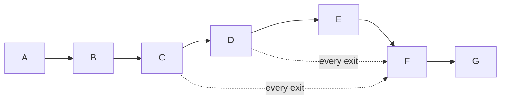

# Ruling 179 execution graph

Goal and acceptance are recorded in `docs/proof/wri-r179/goal-and-contract.txt`.
Grounding gap: `kb-graph-and-loop-engineering` is absent from this consuming repository,
as already recorded in `docs/plans/foildsl-authoring.md`. The installed execution-graph
standard was read; no dangling knowledge ID is invented in the typed links.
Tier T1, fan-out 0, repair cap 2, ceiling 20 minutes including mandatory restoration.
No product repair, registry mutation, display-resolution change, or readiness admission.

| Node | Capability | Input and goal | Exit condition | Tier | Dependency |
|---|---|---|---|---|---|
| A | Reasoning | Ruling 179, exact repaired head, source registrations | Exact scope and grouping read | T1 | None |
| B | Deterministic mechanics | Settings UIA frame and current content | Main Display 1 On, exact scale/item discovery | T0 | A, decision |
| C | Deterministic mechanics | Test source and pinned SDK | Minimal measurement-only DLL build with hashes | T0 | B, decision |
| D | Deterministic mechanics | Exact 150% selection and DLL | 14 named results, scales, bounds, numeric exits | T0 | C, data |
| E | Deterministic mechanics | Exact 200% selection and DLL | 14 named results, scales, bounds, numeric exits | T0 | D, display resource |
| F | Deterministic mechanics | Current Settings and DLL | Exact 150%, fresh 1.5/1.5 with numeric exit | T0 | Any execution exit |
| G | Deterministic mechanics | Original bytes, captured evidence | Source restored, receipt/manifest/index/audit, gates, local commit | T0 | F, data |

All nodes are required floors. D/E share the display and cannot run concurrently.
No independent agent review was authorized; the Mac leader's execution contract fixes the
scope and evidence floors. No new hard veto was cleared by the worker. The naive and optimized
graphs both contain seven nodes, width one, five deterministic mechanics nodes. Independent
read-only grounding was batched; no test or scale mutation was parallelized.

Work/span have no measured complete baseline. Inferred planning ceiling was 1,200 seconds;
single-worker work equals span for the display-dependent chain. No speedup is claimed.
Repair loop variant: unresolved preparation/runner blockers; exit on verified runner readiness,
floor zero, cap two as a circuit breaker. A firing cap is a defect signal and sends stop.
No product-test failure enters a repair loop. Re-plan checkpoints: UIA failure, pinned SDK
failure, source routing mismatch, and runner deadline failure. Degradation is blocked evidence,
never dropping a check while claiming acceptance.

Actual: A/B/C and F completed. D stopped before its first check; E did not start. Repair cycles
2/2 exhausted. Restoration completed at 04:08:11Z, 296 seconds after the first observed worker
clock (Verified elapsed subtraction; not a test-duration estimate). Source restore completed
later under required cleanup. No product result, item-6 bounds, or P3 clause output exists.
This graph records the authorized work and actual stop, not a completed proof.
