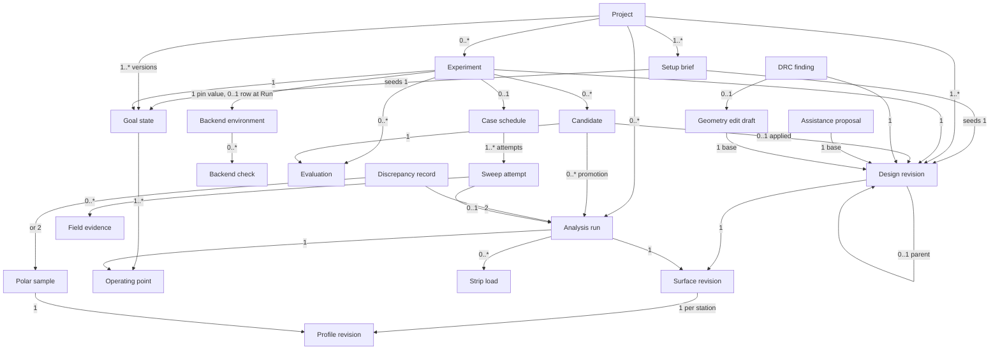
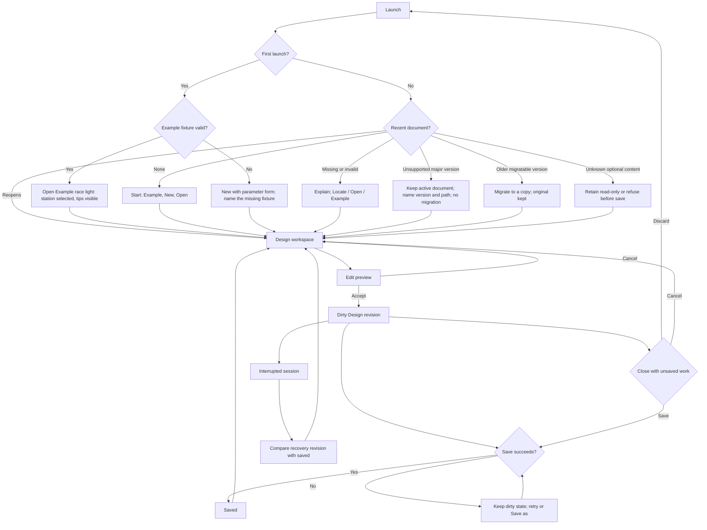
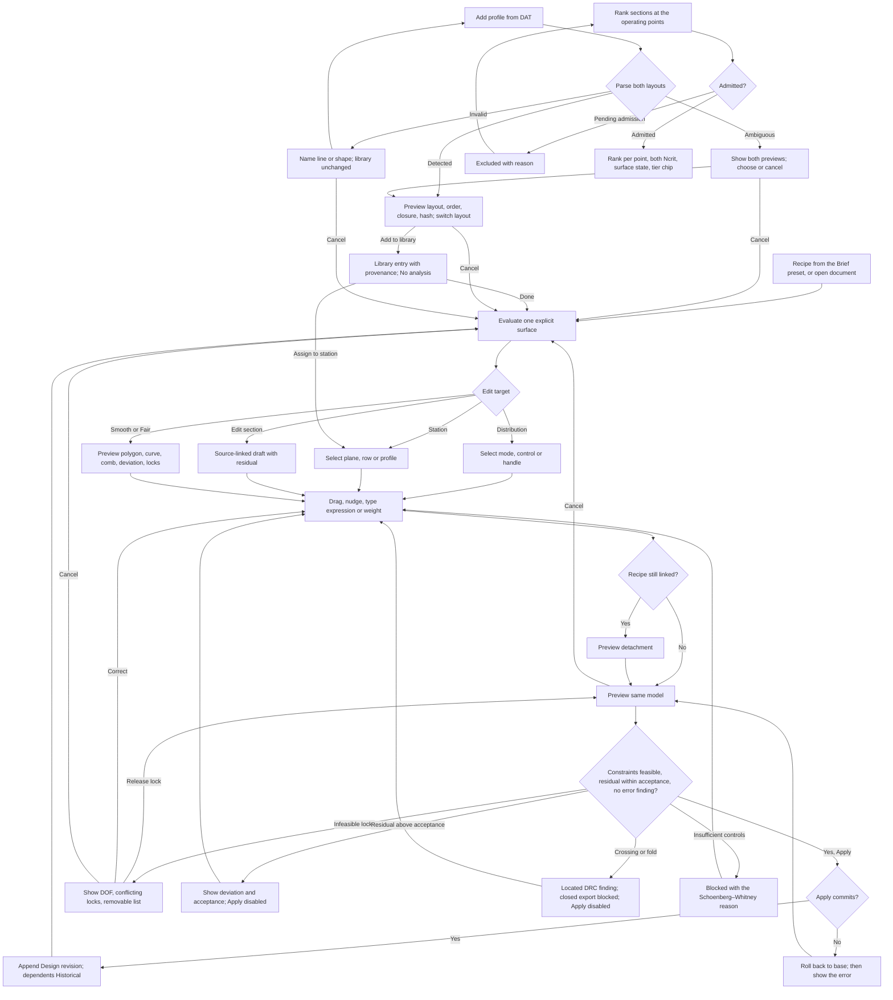
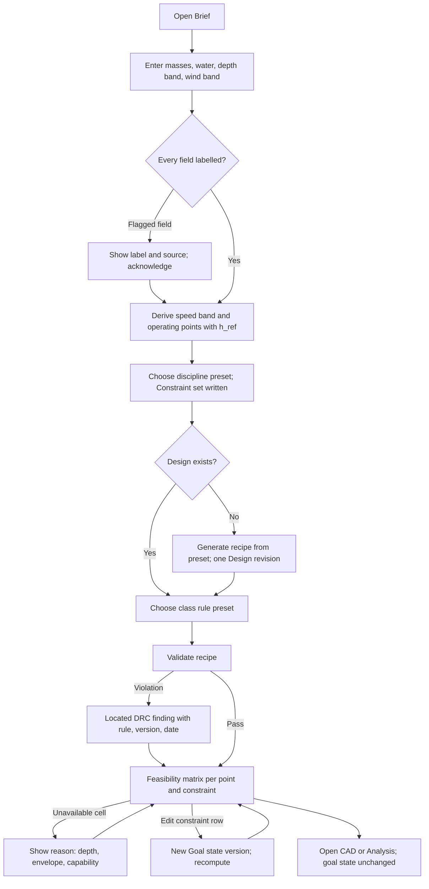
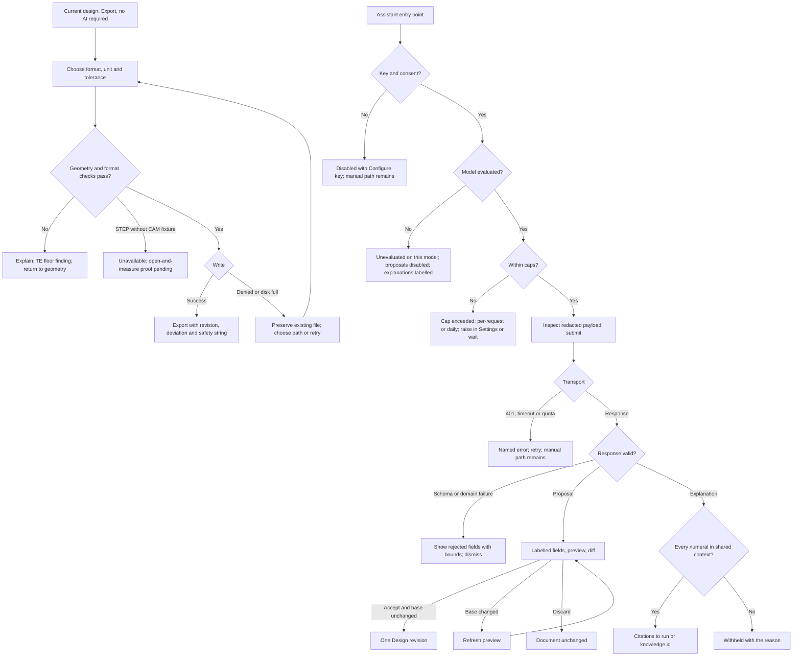
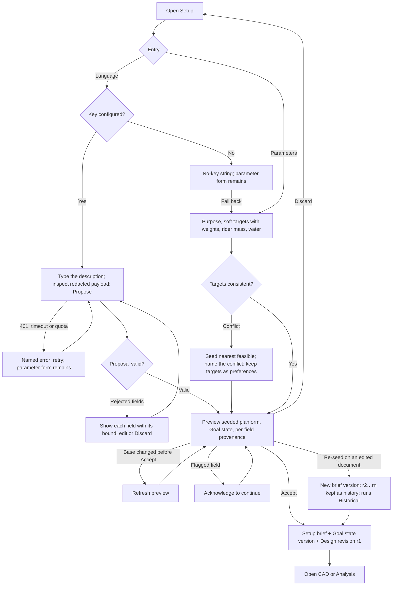
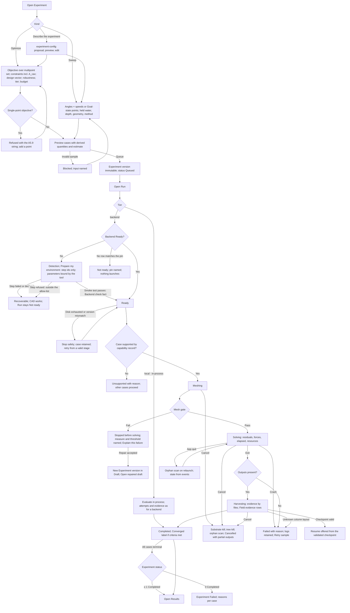
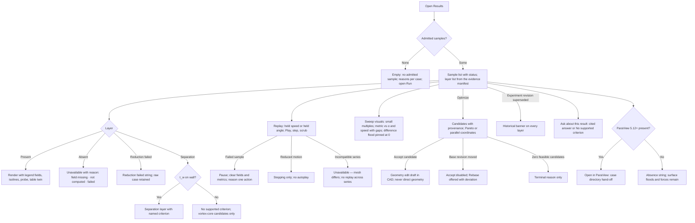
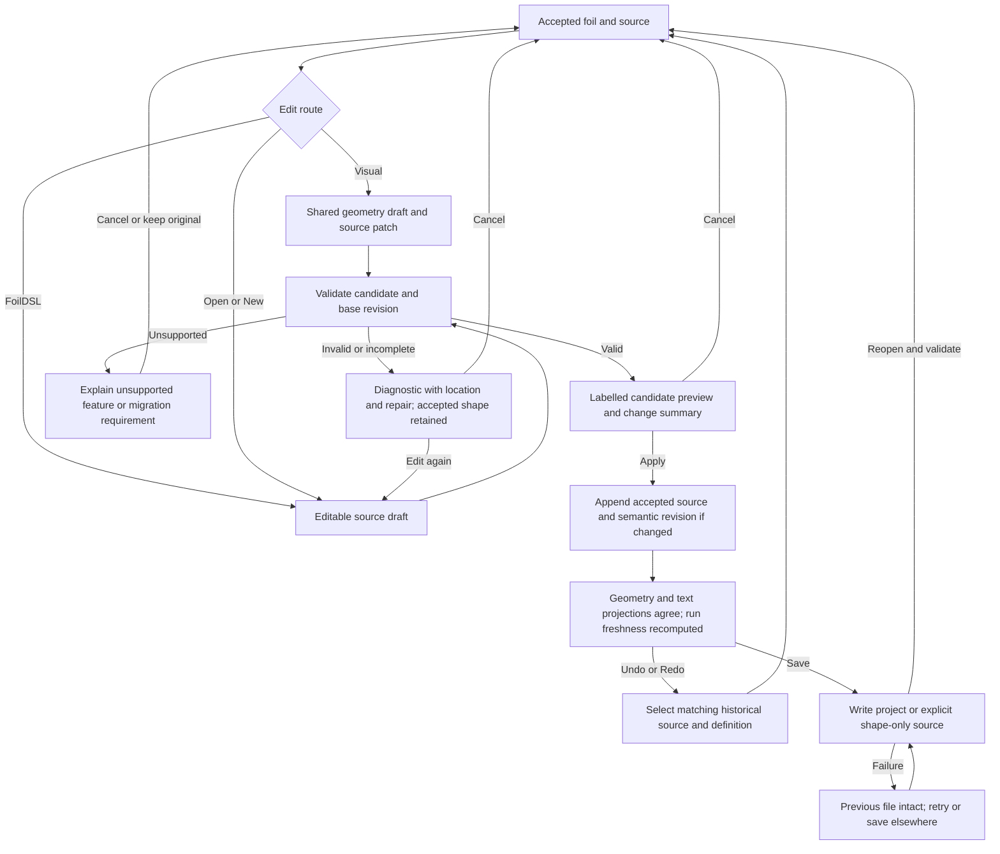
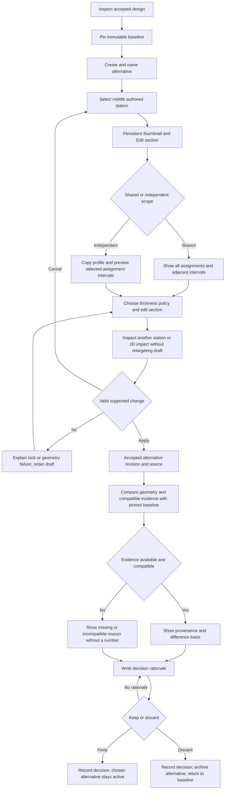

# CFD-Workbench

## One definition. Every number with its basis. Nothing claimed that a fixture has not earned.

Product specification · revision 1.5 · 22 September 2026 · *(1.1a: Part B/C shell wording, UI-23, Appendix D2a; 1.2: CAD editing views CAD-04–06, UX-23, UI-24–25, the pointer contract, Appendix D3; 1.3: the control-vertex record GEO-03/05/13/15, the four-viewport workspace and tool palette CAD-07–08, the geometry kernel A4.12, Appendix D4)* · **Build basis. Supersedes revision 1.0 (which
superseded 0.2). Not an implemented or scientifically validated product; every numerical threshold below is a
proposed acceptance target until the named fixture has been observed.** Revision 1.1 makes seven areas first-class
and discrete — Setup, CAD, Analysis, Experiment setup, Run, Results, Export — and gives each an AI prompt entry;
the Run and Results areas are specified in full and are **first-class in the model and the UI**, while their
*acceptance* still waits on the two spikes named in A2 (unattended meshing; the mesh-convergence oracle).

[FoilDSL language specification](foildsl.md) · [Current interactive mockup v7](../mockups/workbench-v7.html) · [Reference reconciliation](../notes/foildsl-reconciliation.md) · [Revision 0.2 (superseded)](cfd-workbench.md) · [Critique that produced revision 1.0](../reviews/spec-v02-critique.md) · [Knowledge base](../knowledge/hydrofoil-workbench/index.md) · [Domain experts](../domain-experts.md) · [Design language](../../DESIGN.md) · [Mockup v1](../mockups/workbench-v1.html) · [Mockup v2 (seven areas)](../mockups/workbench-v2.html)

**Authority and citations.** The knowledge base `docs/knowledge/hydrofoil-workbench/` is the evidence floor; a
design implication is cited as **KB-n** (its index) and an area file as **NN** (01–13). Revision 0.2's story
identifiers are kept where the story survives so the critique map stays traceable; deleted and merged stories are
listed in Appendix D. Requirements use **shall** for mandatory behaviour in their named release. Terms in
**bold small caps** in A3 are the ubiquitous language and match the glossary. FoilDSL 4.0 is the authored geometry language defined by the normative companion. Application language, toolkit, native envelope encoding details,
geometry evaluator implementation and solver substrate are separate architecture decisions; this document says
what they must satisfy. On 23 September 2026, [ADR 0003](../adr/0003-application-stack.md)
selected C#/.NET and Avalonia for the conditional first offline milestone, and
[ADR 0004](../adr/0004-application-project-contract.md) accepted its unshipped native
document contract. These decisions do not establish product, geometry, accessibility
or Windows runtime acceptance. The simulation backend remains unselected.

**Tier:** T2 (cost of error: a foil ridden at speed; a record format that cannot be changed once files exist).

---

## Part A — Functional specification

### A1. Problem, users, positioning and core scenario

**Problem (solution-independent).** A person designing a water-sports hydrofoil wing must connect a riding
brief (who rides it, in what water, at what speeds and depth) to a fair three-dimensional shape, a section's
behaviour, a finite wing's loads and a defensible comparison between candidates. Today those live in separate
tools built for boards or aircraft: Shape3d bridges board CAD to XFLR5, WingHopper bridges a planform to STL/STEP/
XFLR5, XFLR5/AVL/OpenVSP analyse wings with no water, depth, cavitation or salinity input (03, index framing;
Verified). A geometric edit can sever its parametric explanation; a persuasive chart can outlive the shape,
water or depth that produced it; and every existing tool leaves the physics that decides a hydrofoil (free
surface, cavitation, ventilation) to the user's intuition.

**Target user (v1).** One primary persona: the **engineer/maker designing their own foil** — fluent in fluid
mechanics, thinking in rider requirements, able to disbelieve a number. *Inferred*: this is the operator's stated
intent and the proposal corpus, not observed research (04; gap register GAP-03). Two roles of the same person are
named for flows, not as separate personas: the *iterating designer* (change one thing, keep the rest) and the
*reader of evidence* (decide whether a result is relevant and trustworthy). **Non-target personas for v1:** the
rider who wants "will this be fast for me" without the physics, and the shaper who wants a mould and a file that
machines — both are explicit non-goals below. **Falsifier:** if two or more of five formative users cannot say
what Cp_min or Re means on the sample task, the target persona is wrong and this specification is revised (UX-05
names the protocol). *(Resolves critique: persona undecided; no falsifier.)*

**Positioning (context, not requirement).** No comparable carries depth, submergence Froude number, cavitation
number and salinity as first-class inputs, and none exposes an influence-weighted curve mode (index framing).
Shape3d's macOS build is a third-party port; MultiSurf, Maxsurf and Orca3D are Windows-only; the board-tool
market pays 5–81 EUR per month (03; Verified pages, dated 2026-09-20). Native macOS and Windows with a proven
accessibility tree is therefore positioning as well as a constraint (KB-24).

**Comparables (sourced; borrow the principle, never the pixels).**

| Comparable | What it establishes for us | Borrow | Avoid | Source · confidence |
|---|---|---|---|---|
| Shape3d X 9.1 | Master curves + slices; precision gestures; Tracing readout; five tangent kinds; XFLR5/Flow5 bridge | gestures, Tracing, tangent kinds, guidelines | equal-control-count slice rule; option ladder; wrapped Mac port | 03 · Verified |
| MultiSurf | Relational geometry with selective re-evaluation; approximate one-way NURBS export | selective re-evaluation | export treated as exact | 03 · Verified |
| OpenVSP | Wing driver sets; blend modes; closure and trim names; STEP via STEPcode | driver set, closure names | aircraft framing (no water) | 03, 05 · Verified from source |
| Rhino / Alias / Fusion / Onshape | Control vs edit points; Fair contract; three-step nudge; comb on-curve; modal Return/Esc; keyboard orbit; unit expressions; VPAT gaps | all of the listed conventions | inheriting accessibility from a toolkit | 01 · Verified |
| XFLR5 / AVL | Station tables; polar conventions | chart conventions; AVL export | tabular-only geometry; no depth | 03, 05, 11 · Verified |
| WingHopper | The market wants planform + section blend + STL/STEP/XFLR5 | export triad | unknown distribution UI | 03 · Verified claims |
| ParaView | Source → filter → view; Sequence vs timesteps; provenance | Results IA (A5.11) | linking VTK | 11 · Verified |
| KiCad DRC | Rule id · severity policy · located violation · exclusion with reason | DRC shape | — | 10 · Verified |

**Core scenario — seven areas, one document, each area a discrete job that hands a typed object to the next.**
**Setup** — start from a natural-language description ("90 kg rider, race wingfoil, salt water, 10–20 kn, a bit
fuller tip") that a model turns into a typed **Setup brief**, or from parameters: intended purpose (eight
disciplines), general dimensions as soft targets (max span, max chord, target area, target AR), rider mass, fresh
or salt water; the brief seeds a **Goal state** and a starting **Design revision**, and every seeded field shows
whether it was Stated, Inferred or Defaulted. **CAD** — work the outline, the twist and the dihedral/anhedral as
distinct curves; add and remove stations; assign and tune each station's profile; drag, then type the exact
value; keep the loft, the comb and the derived dimensions live. **Analysis** — read the section (2D) and the wing
(3D) from local calculations with force vectors, loading, pressure and the depth basis drawn on the geometry, and
toggle between the CAD view and the analysis view without leaving the canvas. **Experiment setup** — with a wing
ready, define a **sweep** (angles × speeds) or an **optimize** loop (a goal, constraints, a budget) as a typed
Experiment. **Run** — execute it end to end against OpenFOAM or SU2: environment readiness, meshing, solving,
harvesting evidence by files, with status the whole way and cancellation that reaches the substrate. **Results** —
tables, plots, floods, streamlines, separation and force layers as sequences over admitted samples, and sweep
visuals across the experiment. **Export** — the full 3D wing as STL, STEP, 3DM (Rhino) and a Fusion-ready STEP.
In every area an AI prompt entry turns language into a typed proposal for that area — a starting model, a shape
change, a question about a local calculation, an experiment configuration, a question about a result — that is
validated, previewed and accepted by the user, never applied by the model. Everything up to Run works with no
API key, no network and no solver installed. Success is measurable: the two Examples' feasibility reports reproduce the knowledge base's
seven-point arithmetic (three points on the light wing, four on the strong) with pinned inputs (GOAL-02; 04, 09);
a 12-case sweep previews, runs, harvests and replays with every failed sample explicit (RUN-05, RES-03); GUI and CLI agree by run-key equality (CLI-01); a
comparison with incompatible reference quantities is blocked until reconciled (ANA-06).

### A2. Scope, releases, non-goals and commitments

**Seven areas, discrete and complementary (each is a destination, a bounded set of stories and a gate).**
An area is *discrete* when its input and output objects are typed and named here, so that no two areas edit the
same object and every hand-off is a reference by identity; areas are *complementary* where one reads what another
wrote (Analysis reads the Design revision CAD produced; Results reads the Experiment Run executed).

| Area | Input → output object | Gate to call it done |
|---|---|---|
| **1 · Setup** | language or parameters → Setup brief → Goal state + starting Design revision | a brief from either entry seeds the same typed objects; every field labelled Stated · Inferred · Defaulted; GOAL-02 arithmetic reproduced; no geometry authored by the model |
| **2 · CAD** | Design revision → Design revision | save/reopen round trip within the identity tolerance on both platforms; stations added and removed without altering shape; every conversion reports its residual; kernel fixture suite green and observed red first |
| **3 · Analysis** | Design revision + Operating point → Analysis run (local tiers) | section (2D) and wing (3D) results with every label, basis and omission visible; force, loading and pressure drawn on the geometry; CAD ↔ analysis toggle preserves selection and camera; VLM + strip fixture suite green |
| **4 · Experiment setup** | Design revision + Goal state → Experiment (sweep or optimize) | a schedule previews every case with its derived quantities before Run; an optimize definition names objective, constraints, design vector, budget and the multipoint set; nothing runs from this area |
| **5 · Run** | Experiment + Backend environment → Analysis runs + Field evidence | end to end on one pinned backend: readiness (detection + smoke test), mesh gate, solve, harvest by files, completion oracle, cancellation to the substrate; **acceptance waits on SPIKE-03 (unattended meshing across AR 5/8/12) and SPIKE-04 (three-grid convergence oracle on NASA TMR NACA 0012)** |
| **6 · Results** | Field evidence → views | every layer carries variable, unit, range with basis, map name and version, association, evidence label; replay is a sequence over admitted samples; separation only by a named wall criterion; a failed sample is a gap; sweep visuals across the experiment; **acceptance waits on the same two spikes** |
| **7 · Export** | Design revision → files | STL/3MF (mm, unscaled), STEP AP203 and 3DM with measured skin deviation; STEP released only after open-and-measure in two named CAM systems and in Fusion |

**Cross-cutting:** the workbench shell (S1 of revision 1.0: installs and operates on both OSes with no solver or
key; native menus, undo, settings, Checks drawer, first launch on the Example), section evidence (S3: admission
classes and polar provenance) and the **AI prompt entry in every area** (A5.12; each capability ships only after
its eval suite, A8.6). Areas 1–4 and 7 are the first release; areas 5 and 6 are first-class in the model, the
flows and the mockup from this revision and enter acceptance when their spikes pass.

**Non-goals (load-bearing; each is a test that something is absent).** Structural, hydroelastic or fatigue analysis and any strength,
stiffness or ride-safety statement; whole-craft trim and stability; surfboards, fins, stabilizer, mast and
fuselage as *designed* surfaces (they are reserved vocabulary); mould workflow (offset surface, parting curve,
datums, pull direction), G-code and CAM; arbitrary CAD, STL, STEP, `.s3dx`, AVL or XFLR5 *import*; cloud, sync
or accounts; a rider-facing mode; a salinity override (standard seawater 35.16504 g/kg only); free-surface,
cavitation or ventilation *simulation* in the first release (OpenFOAM-only physics behind the backend capability
record, never SU2); a native Fusion `.f3d` writer (the format is cloud-native and undocumented, 05 — Fusion opens
the STEP); linking VTK, XFOIL, XFLR5 or OpenFOAM into the process; averaging across analysis tiers; a single-number correction factor; a
maker's aspect ratio shown as b²/S; Oswald efficiency as a user input; a surrogate promoted above the estimator on
the evidence ladder; and the words "cavitation-free", "ventilation-safe", "validated", "optimized", "best",
"recommended" or "certified" in product copy except where A7 grants them (LAB-01 lints for them).

**Commitments.** **COMMIT-01** — no candidate is certified above its tier; the ladder is the **Candidate**
status (surrogate-candidate → vlm-checked → cfd-checked → experimentally-compared) with stored promotion evidence,
never prose (09, KB-17); an optimize experiment emits Candidates, never accepted geometry. **COMMIT-02** — permissive licences (MIT, BSD, Apache) may be linked; GPL, LGPL, AGPL
and NOSA components are process-invoked or excluded; the licence register (A8.5) is a release artefact.
**COMMIT-03** — the native project is the full-fidelity project open path; FoilDSL is the explicit shape-only open path (A4.11). Native fields are added by expand-migrate; a
saved file is never rewritten by a later version without an original copy. **COMMIT-04** — language in,
typed proposals out, exactly six kinds: setup-seed (Setup), geometry-edit (CAD: parameter deltas, station
add/remove, profile assignment, lock changes — the same edit-draft path a pointer edit takes), experiment-config
(Experiment setup), environment-step (Run: a step id from the allow-list whose parameters the tool binds; the tool
executes only after per-step consent and never elevated), case-diff (Run: a new Experiment version in Draft), and
explanation (Analysis, Run, Results; cited, read-only); every proposal is validated by deterministic code, previewed
with a diff and accepted by the user; the model never computes a force, emits coordinates, applies an edit, launches
a run, runs a shell command or softens a fixed string (10). A seventh kind is a specification change, not a feature. **COMMIT-05** — an experiment is driven end to end from the tool against a pinned backend and its
evidence is files, never stdout; a run whose outputs are missing is Failed whatever its exit code (08).

### A3. Conceptual domain model — decided before any surface

#### A3.1 Bounded contexts and ubiquitous language

Six bounded contexts: **Design** (geometry of record and its edits), **Profile catalog** (admitted sections and
their rights), **Analysis** (operating points, goal states, local-tier runs, discrepancies), **Experiment** (experiments, backend pins and environments, attempts, field evidence, evaluations, candidates), **Checks** (design
rules and their findings), **Assistance** (optional language proposals and explanations). Backend environment is
first-class from revision 1.1 (A3.1 Backend environment, A5.10). One word, one meaning:

| Term | Kind | Meaning (and the word it replaces from 0.2) |
|---|---|---|
| **Project** | entity | A named document holding one lifting **Surface** in v1, its **Setup brief**, its **Design revisions**, its **Goal state**, its **Experiments** and references to runs |
| **Setup brief** | entity, append-only versions | The seed of a project: entry kind (language · parameters); the text or the parameter set — intended purpose ∈ {wingfoil freeride, wingfoil race, wingfoil surf, windfoil race, windfoil freeride, wakefoil, surffoil, downwind}, **general dimensions as soft targets** (max span, max chord, target area, target AR — each a preference with a weight, never a hard constraint, because they can conflict), rider mass, water (fresh · salt); the model id, prompt version and proposal id when seeded by language; per-field provenance Stated · Inferred · Defaulted. A brief seeds a Goal state and one Design revision and is then history |
| **Design revision** | entity, append-only | A node with a parent, referencing by identity and content hash exactly one Surface revision, plus recipe provenance; it holds no other reference (the Surface revision's stations are the only home of Profile revision references). *This* is the "revision" the footer shows |
| **Surface revision** | entity, immutable | One complete explicit parametric definition: the five **Distribution curves**, the **Authored stations**, the loft rule, the blend rule, the correspondence rule, the symmetry mode, the tolerance triple, the frame and the evaluator id + version (A4.1) |
| **Distribution curve** | owned value | One channel along normalised span η: independent leading-edge x, independent trailing-edge x, elevation, twist, effective thickness; a clamped B-spline whose **control vertices** are the record — degree stored per curve (default 3, seven vertices; sections keep degree 5), the full knot vector, weights all 1 — plus its **Constraint rows** and the provenance of the construction that produced the vertices (A4.2). Chord is derived as trailing minus leading, not an authored channel. |
| **Authored station** | identity-bearing element | A span location η and a Profile revision reference; its channel values are readouts of the distributions. Thickness policy is transaction provenance, never a second live thickness field; closure is part of the referenced profile definition |
| **Inspection slice** | derived | A section evaluated at any η; never a degree of freedom |
| **Control vertex** | owned value | One vertex (η, value) of a distribution curve's control polygon with a **stable id**. The first and last vertices lie on the curve (clamped ends); the second and penultimate are the **levers** — they set the end tangent's direction and magnitude; an interior vertex *pulls* the curve and need not lie on it. Fit-points anchors, when a curve was built from measured points or a DAT, are kept as **construction provenance** and are never a second authority; optional bounds and a `frozen` flag are *reserved* fields (the design-vector contract, 09) with no v1 writer or reader |
| **Constraint row** | owned value | A typed hard constraint (endpoint, tangent linked/split/axis-locked/fixed-angle, curvature match at the LE junction, value at a station, root-mirror tangent, symmetry, closure) with its **source** (user lock · symmetry · closure · station value · assistant-proposal <id>); a class rule is never a Constraint row — it is a DRC finding (A5.8) |
| **Profile revision** | entity, immutable | The editable record of a section — a clamped degree-5 B-spline pair in normalised chord — plus provenance (admission class, source, original bytes and hash, detected DAT layout, normalisation, conversion residual) and **design-point metadata** (design Cl, design Re, intended σ range, source per field; Unknown when unsourced) |
| **Geometry edit draft** | transient | A candidate over one base Design revision with proposed controls, constraints, measured deviation and validation; never an accepted geometry record. Optional recovery persistence is explicitly labelled a draft and retains its base |
| **Recipe** | value | High-level drivers (a valid driver set from {area, span, AR, taper, root chord, tip chord, sweep, elevation, washout, profile}) that emit a Surface revision one way; provenance after detachment |
| **Water record** | value, pinned | Temperature (admitted range 0–50 °C, the table's tabulated band, 07), absolute salinity (0 or 35.16504 g/kg), pressure basis, ρ, ν, p_v and the ITTC 7.5-02-01-03 revision they came from |
| **Operating point** | value | Speed V; Water record; p_atm (default 101.325 kPa); reference depth h_ref at the named datum; incidence α; target load W with its source; Ncrit pair; static orientation. **Derived, never stored:** q, Re_ref, Re(y), h(y) per station, h/c, Fr_h, σ(y), V_crit |
| **Goal state** | entity, append-only versions | Authored intent, one version per edit (current = latest; an Experiment references one version by hash and the reference always resolves after save and reopen): rider and equipment masses each with a label and source; Water record; depth band; wind band and the speed band derived from it with its source label; discipline preset id; class-rule preset id and version; an ordered **operating-point set**, each with speed, its own h_ref (Setup defaults every point to the depth band's deep end — 0.5 m for the Example, the knowledge base's column — and any point may be set to another value inside the band), required load, critical metric and Ncrit pair; a typed **Constraint set** whose rows the discipline preset writes (required load per point · σ margin against −Cp_min · Re inside the polar envelope · h/c ≥ 5 · the class-rule rows · the sanity bounds as advisory) and the user edits per row (GOAL-01, each edit a new version); the **soft targets** carried from the Setup brief with their weights and the weights' basis. Objective and robustness rule live on the Experiment (one writer: Experiment setup). A goal state never edits geometry |
| **Feasibility report** | derived | The constraint × operating-point matrix (satisfied · violated · Unavailable with reason) with the tier chip per cell |
| **Analysis run** | entity, immutable | One evaluation of one Surface revision at one Operating point by one method + version, with its **Run manifest** and evidence |
| **Run manifest** | owned value | Input revision ids and content hashes, Water record, Operating point, reference quantities, method id + version, settings hash (every method setting, e.g. lattice density, plus the TE floor setting), the backend pin for a backend tier, reconciliation tolerance, DRC outcomes at run time, output artifact hashes, wall time, platform. **The run key has one definition:** BLAKE3 over (Surface revision hash, the referenced Profile revision hashes, Water record, Operating point, method id + version, settings hash); every other mention of the run key cites this row |
| **Polar sample** | fact | One (Profile revision hash, method + version, Re, Ncrit, surface state, α, Water record) evaluation: Cl, Cd, Cm, x_tr, Cp_min with station count, analysis_confidence or "not recorded", converged flag |
| **Experiment** | entity, append-only versions | A typed definition owned by Experiment setup: kind **sweep** (a Case schedule) or **optimize** (**objective definition** — per-point dimensionless objectives such as D_k/D_k(x₀) or L/D over the multipoint operating-point set with weights and their basis; **robustness rule** expected value · worst case; constraint set reference; **design vector** = the Curve-control ids with bounds and `frozen` flags; method tier; **optimizer record** — algorithm and library version, algorithm class gradient · gradient-free, restarts and start points, termination reason, KKT and feasibility residuals, non-computable count; budget in evaluations and wall time; seed); the Design revision and the Goal state **version** it references by hash; a **backend pin** value (backend id, version, image digest or binary hash, OS, or `local · in-process` for the estimator, polar and VLM + strip tiers) copied from the published matrix at Queue; **status** = f(recorded events ∪ attempt states): Draft until Queued is recorded · Queued · Running while any attempt is non-terminal · Completed iff every case's selected attempt is terminal and at least one is Completed · Failed iff every case is terminal and none is Completed · Cancelled iff a Cancel event is recorded; an optimize experiment owns its **Evaluations** and **Candidates** |
| **Case schedule** | entity | A resolved list of (V, h, W or α) cases (was "sweep"): Cartesian V × α, or an operating-point list with α solved per point; one **Sweep attempt** fact per case per attempt. An attempt references at most one Analysis run; a failed attempt references none; the selected attempt is the latest one, and a failed latest attempt is a gap (ANA-08, RUN-06) |
| **Backend environment** | entity, installation-local | One row per (substrate, backend, version, OS) on this machine, plus the row `local · in-process` for the local tiers: image digest or binary hash, capability record (physics × solver × meshing × transient × free surface), resource limits; **Ready** is derived from the latest **Backend check** facts (detected ∧ smoke test passed at the pinned digest), never from a flag; an Experiment's backend pin is matched to a row at Run and the Run manifest records the pin (08) |
| **Backend check** | fact | One detection or smoke test of one Backend environment at one time: kind, pinned digest, outcome, the smoke-test scalar (Cl on the bundled cavity-lid fixture) and its tolerance, the named output files found |
| **Field evidence** | fact | One reduced artifact of one attempt: kind (surface · slice · rake · isosurface · history), path, hash, **mesh hash**, fields, association, range, basis labels, colormap policy version, reduction tool + version, capability flags (τ_w present · k present · transient) |
| **Discrepancy record** | fact | (evaluation_hi, evaluation_lo, quantity, operating point, δ, ρ, per-tier uncertainty where reported) where an evaluation id is an Analysis run or a Polar sample; it references the two evaluations (never the reverse) and is materialised because it is COMMIT-01 promotion evidence; re-comparing an existing key is a read, not a second row; never averaged |
| **DRC finding** | fact | (rule id, rule or policy version, severity policy, located violation, Design revision, exclusion with reason and a free-text attribution the user types — never the OS user name, and excluded from assistant context) — the one shape for geometry validity, lock conflicts, sanity bounds, class rules, manufacturing floors and label lints |
| **Example** | document | Two bundled sample designs (was "Sample"), labelled Illustrative: **Example · race light** (1000 cm², the 10 kn wing) and **Example · race strong** (750 cm², the 20 kn wing); each holds one Surface and the same Goal state; the light one opens on first launch |
| **Strip load** | fact | One strip of one VLM + strip run: y, chord, Cl_local, α_eff, Re_local, force and moment components; owned by the Analysis run |
| **Recovery revision** | document | A complete Design revision written by autosave outside the document's history, keyed by document id and time; offered on restart (DOC-04), never merged silently |
| **Assistance proposal** | entity | A typed proposal of one **kind per area** — setup-seed (Setup brief fields only) · geometry-edit (a Geometry edit draft: parameter deltas, station add/remove, profile assignment, lock changes) · experiment-config (an Experiment) · environment-step (a step id from the allow-list, plus for "set the resource limit" one integer inside the product-declared range — no other field) · case-diff (a typed change to the case model of a failed attempt, inside the emitter's closed subset, producing a new Experiment version in Draft) · explanation (cited answer over a local calculation, a run's logs or a result) — with per-field provenance (Stated · Inferred · Defaulted), prompt version, schema version, model id, SDK version and disposition |
| **Candidate** | entity | A designated **Evaluation** of an optimize Experiment on the COMMIT-01 ladder: references its Evaluation by id; status enum (surrogate-candidate → vlm-checked → cfd-checked → experimentally-compared); **promotion evidence** = 0..* Analysis run ids at the higher tier (one per multipoint point, on the Candidate's own Design revision) and 0..* Discrepancy record keys against the lower tier; 0..1 Design revision set when the user applies it (that revision's recipe provenance names the Candidate); Accept opens a Geometry edit draft at that moment — nothing transient is stored, and a Candidate never becomes geometry on its own (COMMIT-01) |
| **Evaluation** | fact | One design-vector evaluation of one optimize Experiment: design-vector values, objective and constraint values at every multipoint point (α solved per point to the required load), tier, feasible · infeasible · non-computable; append-only, owned by the Experiment |
| **Station document** | document view | The editor-group tab that edits one station's section in 2D (CAD-05); opened by the verb **Edit section**; its draft is a section draft, distinct from a geometry draft |
| **Design alternative** | entity | A named project branch referencing an accepted Design revision and its parent alternative; edits append revisions on that branch. It is a human design option, distinct from an optimizer Candidate. |
| **Pinned baseline** | immutable value | A project reference to one accepted Design revision, fixed until explicitly repinned; it never follows later edits or the current selection. |
| **Comparison** | derived view | A selected baseline/alternative pair: geometric differences and only compatible run evidence, each with its revision, basis and availability. Missing evidence has no numeric substitute. |
| **Design decision** | append-only fact | One Keep or Discard disposition of a named alternative at a particular accepted revision, with its baseline and a user-entered rationale. Discard archives the branch without deleting source or evidence. |
| **Control frame** | control | The control polygon of a curve drawn in the elevation that shapes it (CAD-04): dashed polygon, square vertices, circle levers, diamond ends; every curve's frame is shown, the active one emphasised, the others dimmed but draggable |
| **Tool palette** | control | The vertical strip of CAD verbs beside the workspace (CAD-07): Select · Insert CV · Add station · Measure · Fair · Rebuild · Fit points · Edit section · Ghost, each an icon *with* its name and a single key that acts only while the workspace has focus; the active tool is pressed |
| **Viewport** | document view | One of the four quadrants of the workspace (CAD-08), each showing any view (Top · Front · Starboard · Perspective · η-plot) chosen from its title menu, maximised by double-click or Return on its title; the default arrangement is the lines drawing |
| **Display cage** | derived view | The control polygons of every station section and the five master curves drawn over or instead of the loft skin (Body: Smooth · Box · Cage over smooth); a *display* of the record, never a second record and never a T-spline (A4.12) |
| **Geometry kernel** | dependency | The evaluator the product owns (curves, constraints, sampling, comb) plus the licensed components that loft, tessellate and write geometry (A4.12) |
| **Load case · Layup · Manufacturing policy · Elastic axis · Bend–twist coupling** | reserved terms | Structural and manufacturing vocabulary reserved in the glossary; no field modelled until a consumer exists (KB-18). The one v1 field is the **TE floor setting** GEO-12 consumes: an application default copied into the document on first use and into every Run manifest, so the same file yields the same findings on every machine |

**Supported** is split into three words: *supported platform* (an OS the product installs on), *in envelope* (an
input inside a method's validity range) and *method-capable* (a quantity a tier can compute at all).
**Admitted** means a profile in admission class GEN or VEND-with-terms (A4.10); an **admitted sample** is a Sweep attempt in state Completed whose Field evidence rows all pass their hash and whose reduction succeeded (Converged is not required; its three-part label is shown). A **compatible series** is a set of admitted samples with equal Surface revision hash, mesh hash, method id + version, Water record, field inventory and held quantity. "Depth" always carries its symbol
(h_ref, h(y)); the archetype facet token `Depth:Diegetic3D` is unrelated.

#### A3.2 Aggregates, roots and the one invariant each protects

| Aggregate root | Owns | The invariant |
|---|---|---|
| Surface revision | curves, controls, constraint rows, stations, rules, tolerances, frame, evaluator version | The payload alone reproduces the evaluated surface, every station readout and every derived dimension within the identity tolerance, on both platforms |
| Profile revision | B-spline pair, provenance, residual, design-point metadata | One revision identifies one immutable normalised shape; coordinates are provenance with a measured residual, never a second authority |
| Geometry edit draft | base revision, candidate, deviation, validation, DRC findings | Nothing replaces accepted geometry until every hard constraint row is satisfied and Apply is chosen; Cancel changes no accepted definition or analysis input |
| Design revision | Surface revision reference, recipe provenance, parent | Append-only: every accepted design references exactly one Surface revision by identity and hash and names its parent; nothing on the node is ever updated in place |
| Project design choices | named alternatives, pinned baseline references, decision facts | Every alternative, baseline and decision resolves to an immutable accepted revision; changing active choice never rewrites the revisions or their evidence. |
| Setup brief | entry kind, text or parameters, soft targets, provenance | A brief seeds exactly one Goal state version and one Design revision and is never edited afterwards; a new seed is a new brief version |
| Goal state | versions of operating-point set, constraint set, soft targets | Intent only: evaluating a goal state never mutates a revision; every edit is a new version and a referenced version always resolves |
| Experiment | kind, definition, optimizer record, backend pin, attempts with state events, evaluations, candidates | Definition and execution are separate: an Experiment version is immutable once Queued; its status is the function in A3.1; a Candidate advances a rung only with a promotion run at every multipoint point on its own Design revision (CAND-01) and never becomes geometry without a Geometry edit draft and an explicit Accept |
| Backend environment | capability record, resource limits, Backend check facts | Ready is derived from the latest checks (detected ∧ smoke test passed at the pinned digest with the fixture scalar inside tolerance); a capability absent from the record makes a case Unsupported before it leaves Pending |
| Analysis run | manifest, evidence, strip loads | A result identifies, by hash, every input and the method version that produced it; freshness is derived by run-key equality, never written. Discrepancy records are facts of the Analysis context that reference runs; a run never references them |
| Case schedule | resolved cases, attempts | Each case has attempts with provenance; the selected attempt is derived (latest non-superseded), never stored |
| Sweep attempt (with its Field evidence) | attempt-state events, reduced artifacts | The attempt's state is the latest recorded event; ranges and layer availability are computed from the artifacts; an absent artifact is absent with a reason, never interpolated |
| Assistance proposal | fields, provenance, versions, disposition | No proposal changes a document before deterministic validation and explicit acceptance |

Aggregates reference each other by identity only. Apply appends exactly one Design revision referencing newly
created immutable Surface and Profile revisions; result invalidation is derived, so the transaction touches one
aggregate (DM2 iv).

#### A3.3 Grain and additivity

- **Polar sample** — one row is exactly one (Profile revision hash, method + version, Re, Ncrit, surface state, α,
  Water record) evaluation, recorded when the method returns. Cl, Cd, Cm are non-additive.
- **Sweep attempt** — one row is one attempt of one case of one Case schedule, recorded when queued; retries add
  rows; "selected" is derived. **Attempt-state event** — one row is one transition (attempt id, state, time,
  reason); the attempt's state is the latest event, never an updated column.
- **Field evidence** — one row is one reduced artifact of one attempt; field ranges are non-additive.
- **Evaluation** — one row is one design-vector evaluation of one optimize Experiment; objective and constraint values are non-additive. **Candidate** — one row is one designated Evaluation on the ladder.
- **Backend check** — one row is one detection or smoke test of one Backend environment at one time.
- **Discrepancy record** — one row is one (evaluation_hi, evaluation_lo, quantity, operating point); δ and ρ are non-additive.
- **DRC finding** — one row is one located violation of one rule version on one Design revision.
- **Strip load** — one row is one strip of one run; forces are additive across strips within one run only, never
  across attempts or tiers.
- Span, area, AR, mean chord, wetted area, volume, ranges and evaluated coordinates are **derived on read** and
  never stored as authority. The native file carries a `derived_check` block — labelled cache, keyed by the
  Surface revision hash and the evaluator id + version — holding the last displayed span, area, AR and mean chord;
  on load the recomputed values are compared with it by the scalar oracle (A4.5) and a mismatch flags an evaluator
  change (a new revision), never a silent overwrite; the block is discarded, never trusted, on mismatch. σ, Fr_h
  and computed e are non-additive.

#### A3.4 History and freshness

Design revisions are append-only nodes with a parent link; Surface and Profile revisions are immutable and
content-hashed over the canonical form A4.11 defines. A run is **Current** when its run key (the one definition
in the Run manifest row of A3.1) equals the key recomputed from the current Design revision, Water record,
Operating point, method id + version and settings hash; otherwise **Historical**. A settings change that alters
the settings hash makes every dependent run Historical. Undo to an identical definition makes a run Current again; save and reopen leaves freshness
unchanged; a method-version change with identical inputs makes it Historical (ANA-07). Backend smoke-test evidence
is a fact referenced by id from the manifest, never overwritten. Any attribute whose change would
alter the meaning of a past run — Water record, Goal state, method version, TE floor setting, DRC policy, backend pin — is versioned, never
updated in place.

#### A3.5 Relationships (reference direction)

Arrows are identity references from the holder to the referenced entity, labelled with cardinality; values
a row contains (Water record inside an Operating point, the Run manifest inside its run) are listed in A3.1, not
drawn.



### A4. Geometry contract

#### A4.1 The record payload (what makes an edit lossless)

A Surface revision shall store, and nothing else may be needed to reproduce the surface (KB-1; 02 §8):

- **frame** — `+x aft, +y starboard, +z up`, origin at the root leading edge, units SI metres, version;
- **tolerances** — the triple A4.5 defines (identity · model/join · angle), stored as numbers; A4.5 is the only
  definition of what "identical" means, and the identity tolerance is never used operationally for projection or
  joins;
- **evaluator** — id, version, solver id (constrained least squares for the Fit, Fair and Rebuild constructions; pins by KKT projection), fairness functional and λ; the **kernel** record — kernel id and version for the loft, tessellation and every writer (A4.12);
- **symmetry** — mirror-y (v1); independent halves is reserved;
- **channels** — five curves, each: family B-spline, **degree p stored per curve** (default 3 for the master
  curves — seven control vertices, six to ten allowed; degree 5 for section curves), the full clamped knot
  vector with its count convention stated (Piegl–Tiller n + p + 1), **control vertices** (the only geometry
  authority), explicit weights all 1 (a weight ≠ 1 makes the curve rational and is forbidden for shape),
  Constraint rows with sources, continuity intent (deliberate breaks as knot multiplicity), and the
  **construction provenance** — which construction (Fit points · Fair · Rebuild · direct) produced the vertices,
  its inputs (anchors, tolerance, vertex count) and its reported residual;
- **stations** — η, Profile revision reference and hash (the only home of that reference). Thickness intent is
  transaction provenance; accepted effective t/c remains solely in its channel. Closure belongs to the profile;
- **blend** — id `linear-normalised-camber-unit-thickness`, version, renormalise = true;
- **loft** — rule `channel-evaluated` (rule A, A4.4), the kernel id and version, the v-degree the kernel chose for the derived skin (read back, never assumed), the section placement (knots + stations + refinement count) and the measured A-vs-B deviation, parameterisation;
- **correspondence** — equal normalized chord x on independently evaluated upper/lower sides; cosine spacing
  is a derived sampling choice, never the definition of the blend or a shared spline-parameter constraint;
- every Curve control carries a **stable id**, optional bounds and a `frozen` flag.

Evaluated coordinates, tessellations, station readouts, span, area, AR, wetted area and volume are never persisted
as authority; the `derived_check` cache of A3.3 is the one labelled exception. Content hashes and the run key use
BLAKE3 over the canonical form; SHA-256 is used only for the original bytes of an imported DAT file, where it
matches the checksums catalogs publish.

#### A4.2 Two constructions, one record

**The control vertices are the record** (revision 1.3). A distribution curve is a clamped B-spline evaluated from
its control vertices; nothing else defines the shape. The end vertices lie on the curve; the second and penultimate
vertices are the **levers** that set each end tangent's direction and magnitude; every interior vertex pulls the
curve toward itself and is never on it (the B-spline basis is a partition of unity with **local support** — a
vertex moves the curve only over its p + 1 knot spans, GEO-13). Editing is direct: drag, nudge, type η and value,
**Insert CV** (knot insertion by Boehm's algorithm, shape-preserving to 10⁻¹² relative — the A4.5 exact path) and **Delete CV** (the shape change
is measured on the distribution-curve oracle of A4.5 and reported; the floor is the record's six vertices, A4.1), always as a draft (Return applies, Escape cancels, one undo item). This
is the Fusion 360 control-point-spline and Rhino control-point contract the operator asked for (03), and the
MultiSurf/Shape3d master-curve paradigm underneath it. **Invariant:** a distribution curve is the graph of a
single-valued function v(η) — the vertex abscissae are strictly increasing (variation diminishing then
guarantees x(t) monotone), an η edit that would reorder them is clamped, and every evaluation at a station
"at η" solves t from x(t) = η (Newton, seeded from the Greville abscissa) before reading v; the abscissae are
not fixed at the Greville points, so a value-at-η pin is a nonlinear row solved by that Newton loop around
the KKT projection.

**Two constructions produce vertices; neither is an authority.** **Fit points** — interpolation (n = m + 2 with the
end-tangent rows) or constrained least squares (any n ≥ p + 2) through measured anchors or a DAT profile,
parameterisation (chord or centripetal) and end conditions stored, the anchors kept as provenance, the **residual
reported** and gated by the A4.6 acceptance; the catalog conversion chooses the smallest vertex count (8–16 per
side) that meets the acceptance. **Fair** — a constrained weighted least-squares refit on fixed knots: minimise
(NP − Q)ᵀW(NP − Q) + λ PᵀFP subject to A·P = b, where Q samples the current curve, F is the fairness functional
and A the hard Constraint rows (02 §2; executed probe), with Rhino Fair's contract (tolerance, PreserveEnds ∈
{position, tangency, curvature}, achieved deviation reported, Apply disabled above the tolerance — GEO-15).
**Rebuild** is Fair with a chosen vertex count. The 1.2 *Smooth · weighted controls* mode and its influence weights
are **retired**: a weight was a second way to say what a vertex says, and the mockup measured the polygon as the
lever the operator was missing.

**Constraint catalogue** (each row typed and sourced, applied as constraints on the vertices): **root-mirror
tangent** (the first leg horizontal: P₁.y = P₀.y, which is G1 across the root plane and G2 by the even
extension; G3 is not enforced at degree 3 — a default lock, 03); **value at the
tip** and **value at a station** (an on-curve value pins the vertices by KKT projection at the next Apply); axis-locked
end tangents; curvature match at the LE junction of upper and lower section curves; symmetry; closure. A locked
vertex refuses the move and names its lock in the handle's accessible value and the status line; an infeasible
set reports the curve's degrees of freedom and a **removable-constraint list** (01, SolveSpace pattern); Apply stays
disabled until a lock is released. "Constant curve" means continuously faired geometry, never constant
mathematical curvature.

#### A4.3 Continuity is measured, never assumed

Degree p with simple interior knots is C^(p−1) inside one curve (C² at the default degree 3 of the master curves; C⁴ for the degree-5 section curves); it says nothing at repeated knots, curve ends, the LE
junction, the mirror plane or profile transitions along η, nor after any approximate refit (02). The evaluator
shall measure one-sided G0, G1, G2 (and G3 where displayed) at every interior knot and every junction against
the tolerance triple, store deliberate breaks as intent, and render the comb, the break markers, the monotone-piece
count (Farin–Sapidis) and a hovered κ / radius readout. Fairness is never inferred from shading; zebra and
curvature shading apply to the loft.

#### A4.4 Channels, stations, blend and loft

Five channels and no duplicate authority: independent leading-edge and trailing-edge x positions in the unrotated
planform, elevation (dihedral/anhedral; anhedral is negative tip z), twist (positive nose-up about the station
LE), effective thickness — **t/c is the maximum of the ψ-aligned (vertical in normalised chord) full difference
between upper and lower at equal ψ**; the t/c channel scales the unit-thickness shape evaluated at the same
normalized chord coordinate. It does not imply shared knots or equal spline parameters. Catalog sections whose *definition* applies thickness normal to
the camber line (cambered NACA 4- and 5-digit) are conversions and report their residual, because the definition,
not the record, carries the cos θ term (02). Each rail owns its own CV abscissae, knots and ordinates; moving
leading does not rewrite trailing and vice versa. At every η, chord = trailing(η) − leading(η); there is no
saved chord curve. Both rails use absolute x aft in the unrotated planform. A chord dimension edit is a command
that names which rail is held (default leading) and previews the change to trailing. Station planes are perpendicular to the span axis. A zero-chord tip is a legal declared state with
limit normals; an interior chord ≤ 0 or coincident/out-of-order stations are rejected at input.

**Blend** — normalised camber and unit-thickness shape interpolate linearly in η between assigned profiles **at
the same normalized chord x**, using each profile side's own monotone x inversion, renormalise to unit maximum thickness, then the single t/c channel
scales; mandatory fixtures: different thickness-peak positions, different control counts at root and tip (the
equal-count slice rule is rejected, 03).

**Loft rule A, recorded** — the surface between stations is the channel-evaluated analytic surface (twist rotation
makes it non-polynomial in η); any B-spline skin for display, STEP or 3DM is a **derived approximation** whose
maximum deviation from the record is measured and reported like any conversion (02 §5). Rule B is not offered.
The product exposes one loft meaning: **Rule A · linear normalized profile blend**. The former
Straight/Through stations/Blended choices had no defined mapping to this evaluator and are removed, not
retained as inert modes. Profile/channel tangent locks constrain their explicit CVs; they do not select another loft. Trailing-edge closure uses OpenVSP's names:
**None · Skew lower · Skew upper · Skew both · Extrapolate**, trim **by x · by thickness**.

**Recipe and detachment** — a recipe names a valid driver set (OpenVSP's driver rule: exactly the drivers that
determine the section; an over-constrained set is rejected, never relaxed). The first manual edit visibly detaches
the recipe in the same undoable transaction; "Regenerate from recipe" previews a new revision and never back-fits.

#### A4.5 Tolerances and the identity oracle

**The identity tolerance has one definition.** A difference is declared **iff** max |Δ| > 1 µm **and**
max |Δ| / b > 10⁻⁶, where b is the full projected span (1 chord for a normalised profile); otherwise the two objects
are identical. The triple is identity (as defined), model/join (10 µm), angle (0.1°). Three oracles apply it, one
per object kind:

- **Surface** — re-evaluate the loft from the reloaded definition with the pinned evaluator id + version; sample
  at 21 spanwise × 201 chordwise parameters **plus every knot line in u and η** plus every station readout; Δ is
  the Euclidean distance per sample.
- **Profile** — 201 cosine-spaced samples per curve in normalised chord plus every knot; Δ per sample; b = 1.
- **Scalar** (span, area, AR, mean chord, a driver such as b = √0.98 m) — relative 10⁻⁶ only, with the absolute
  floor named per readout (lengths 1 µm; areas 10⁻¹² m²; AR and other ratios none).

Every criterion that says "within the identity tolerance" or "the identity oracle" means the oracle of its object
kind. Serialisation contributes zero:
doubles are written shortest-round-trip and the canonical form is hashed, so a 1 µm test on JSON text is not the
test (05). Exact operations (knot insertion, mirror reflection, promotion under rule A) report ≤ round-off
(10⁻¹² relative); approximate ones (knot removal, refit, mode switch, skin export) report their measured deviation.

**Distribution-curve oracle (revision 1.3).** Every Fair, Rebuild, Fit points, Insert and Delete deviation, and the
local-support test of GEO-13, is measured on the same sample set: 201 samples uniform in η plus every knot of
both curves, comparing v(η) in the channel's unit (mm for leading, trailing and elevation; degrees for twist;
chord fraction for t/c); the reported deviation is the maximum over that set and the metric is named in the
status line.

#### A4.6 Conversions report residuals

Every path that changes representation reports `max_dev_normalised`, the tolerance and the acceptance: catalog
assignment, DAT import and export, NACA generation (4/5-digit closed form; **6/6A-series are generated coordinates
with a TM 4741-faithful generator and its hash — there is no closed form**), CST fit (optimizer coordinates only),
Through-points ↔ Smooth switch, refit, and the STEP/3DM skin. **Acceptance per path:** an exact path (knot
insertion, mirror, promotion under rule A, an unmodified catalog copy) must report ≤ 10⁻¹² relative; an approximate
path is accepted iff its measured deviation ≤ the model/join tolerance (10 µm) at the station's local chord, shown
in normalised chord beside the number; a path above its acceptance disables Apply with the number. A fit never
assumes zero. Original catalog polars never attach to a modified profile.

#### A4.7 Coordinates, signs and units

Body frame `+x aft, +y starboard, +z up`, origin at the root LE; the starboard half is authored and port is
mirrored. One sign table governs the product and its fixture (GEO-09): incidence and twist positive nose-up;
anhedral = negative tip z; pitching moment positive nose-up about the named datum; roll positive starboard-down;
yaw positive nose-starboard (reserved); **fibre angle positive when rotated toward the LE from the elastic axis —
positive lift then gives negative twist (wash-out)** (reserved vocabulary, 12). Fixture: a mirrored wing returns
zero side force and yaw; positive twist raises local α; anhedral lowers tip z; flipping x and z of the
forward/starboard/down frame preserves handedness (defect class FRAME-A).

Internal semantics are SI; display supports m/cm/mm, m²/cm², m/s/kn, kg, N/lbf (1 lbf = 4.4482216152605 N),
Pa, degrees, °C. **Reference dimensions:** full projected span b; reference area S = unpitched chord integral over
both halves; AR = b²/S; mean geometric chord S/b; wetted area and volume from the actual loft and named separately.
AR is always displayed as "AR (projected, b²/S)"; a maker's, a paper's or an imported figure is shown only as an
annotation carrying its convention (the CEHINAV wing is 6.8 by b²/S and 10.9 by S/c², 04, 07).

#### A4.8 Precision input

Three nudge steps per unit family (fine · default · coarse): 0.1 / 1 / 10 mm for lengths; 0.0001 / 0.001 / 0.01
chord for normalised sections; 0.01 / 0.1 / 1 ° for angles; ×1.01 / ×1.1 / ×2 for influence weights (multiplicative,
so a weight never reaches zero) (01). Every numeric field accepts `value [unit]` and expressions over named project
dimensions (`#root_chord * 0.35`) whose result is unitless or first-power in the field's family, and echoes the
resolved model-unit value. A handle can be clicked to type. Return accepts a preview, Escape cancels it, a
cancelled preview leaves no undo step, a failed Apply rolls back fully before any error is shown.

#### A4.9 Diagnostics and readouts

Comb evaluated on the curve at even spacing with a visible scale and density, live during drag, break markers on
every split, monotone-piece count, hovered κ and radius; a **Tracing** pointer probe in every curve editor (η,
% half-span, evaluated chord/t/c/twist/elevation at the pointer; section thickness in the section editor) (03);
live derived readouts while dragging: span, area, AR, mean chord, t/c, TE thickness in mm at the local chord, and
the estimator's L/D; a **Fair within tolerance** action (GEO-15) with Rhino Fair's contract (tolerance,
PreserveEnds ∈ {position, tangency, curvature}, achieved deviation reported); **Rebuild** (vertex count, deviation reported) and **Fit points** (residual reported) as constructions (A4.2); numeric **guideline markers** that
never constrain; degree, vertex count and knot form shown read-only in Properties; the comb is computed from the
evaluator's analytic derivatives, never from finite differences; it **scales to its longest tooth and never clips**,
its scale is a stepper, and the **monotone-piece count** beside it counts the pieces of the curvature plot on
which κ is monotone (sign changes of dκ/dη with a dead band — Farin–Sapidis), never inflections. *Recorded
deviation (Marine CAD UX, 2026-09-21):* on a master curve the comb shows the curvature of the (η, value) graph
in mixed units, labelled as such; the planform rails' physical curvature along the normal is a product option, not
a 1.3 promise.

#### A4.10 Catalog, admission classes and DAT import

Three admission classes, each shown with its reason: **GEN** — generated at build from a public-domain definition
with the generator command and output hash (all NACA 4/4-mod/5/16/6/6A sections: 0009, 0012, 4412, 16-012,
63-209, 63-412, 64A410, 66-012, 66-209, 66-018); **VEND** — a coordinate file whose redistribution terms are
written down (currently none: UIUC states no licence — Eppler E817/E818/E874/E904/E908 and strut E836/E837/E838
are "Pending admission — terms requested", 06); **LINK** — cite only (Speer H105, Airfoil Tools, UIUC LSAT
polars under GPL). Strut/mast is a separate role; E862–E864 are fairings and never appear as mast candidates.
Each Profile revision carries design Cl, design Re and intended σ range with a source per field (Unknown for
Eppler/H105 until sourced). Presets default to GEN sections and name their pending preference.

**Add profile from DAT** is a **two-layout detector** (Selig: name, TE→LE→TE; Lednicer: name, count line, blank,
upper LE→TE, lower LE→TE) with fail-closed rules and a preview naming the detected layout, point order, closure,
normalisation and SHA-256 of the original bytes; the alternate layout's reading is one action away; ambiguous,
non-finite, self-crossing, half-profile or malformed input leaves the library unchanged. Fixtures: `e817` in both
UIUC layouts, `#` comments, CRLF, BOM, unequal Lednicer counts, Lednicer forced through Selig rejected as
self-crossing (05).

#### A4.11 Native projects and shape interchange

**Open project** opens `.cfdw.json` with its alternatives, source history, baseline pins, decision rationale,
assets and run references. **Open foil/section source** opens `.foil` as a shape preview or a standalone 2D
section document. It never invents project history or imports analysis evidence. Adding that shape to the
current project creates a named alternative only after validation and Apply. A dirty draft is retained until
explicit Apply/Cancel; choosing either Open action cannot silently discard it. **Save project** preserves the
workspace/history; **Export FoilDSL source** exports only accepted shape source and its declared dependencies.

| Format | v1 | Contract |
|---|---|---|
| `.cfdw.json` native | read + write | Project envelope with immutable FoilDSL source revisions, pinned profiles/assets, provenance, history and runs (A4.13); no second writable geometry payload. Derived checks remain labelled caches. Semantic hash normalization follows the language companion. Native schema and atomic-save fixtures are implementation obligations. |
| `.foil` | read + write | FoilDSL 4.0 complete foil or standalone section; lossless source save, explicit canonical export, resolved inline or content-addressed profile dependencies. Shape-only interchange omits project run history. |
| Selig / Lednicer DAT | read + write | shortest-round-trip digits; original bytes retained on import |
| AVL `.avl` + `AFILE` | write (behind the VLM tier) | one SECTION per authored station **plus** sampled stations so linear interpolation error is bounded; documents that `Ainc` is a camber-line boundary condition; Sref/Bref/Cref from the same evaluation as the AR readout |
| STL / 3MF (print) | write | millimetres; 3MF `unit` attribute; STL unit in the file name and dialog; never pre-scaled |
| STL (CFD input) | write (Run) | metres; chordal deviation stated; written by the case generator, never by the user dialog |
| STEP AP203 | write, **gated** | `B_SPLINE_SURFACE_WITH_KNOTS` (non-rational proven) inside faces and a shell, millimetres, declared uncertainty, degenerate-tip rule, skin deviation reported; two variants (untrimmed surfaces · closed shell with tip cap and TE); **released only after open-and-measure in two named CAM systems and in Fusion** with the measured quantities stored as a fixture (05, 12) |
| Fusion | write via STEP | Fusion's own `.f3d` is cloud-native (05, Flagged: no public specification was opened); "Fusion-ready STEP" is the closed-shell STEP variant with the Fusion open-and-measure fixture as its release gate; the export dialog names the STEP variant and never promises a `.f3d` file |
| 3DM (Rhino) | write | via rhino3dm (MIT, 05): the loft skin as NURBS surfaces (the section degree in u, the master-curve degree in v; Rhino's degree ceiling confirmed at the first fixture, Flagged) plus the five channels as NURBS curves and the station profiles as curves on their planes, millimetres, layer names from the ubiquitous language; the same measured set as EXP-02 (chord at three stations, maximum skin deviation, 10⁻¹² relative for exact paths, model/join 10 µm otherwise); released with the open-and-measure fixture in Rhino |
| Chart / table | write | CSV with units in headers; PNG/SVG with the legend fields of C2 |
| IGES, DXF, glTF, `.s3dx`, `.f3d`, G-code, mould set | later / never | see non-goals |

Every geometric export repeats the TE-floor DRC finding when the trailing edge is below the setting.

#### A4.12 Geometry kernel (revision 1.3)

The product **owns the curve evaluator**: B-spline evaluation, knot insertion, the constructions of A4.2, the
constraint projection, sampling, analytic derivatives and the comb, the identity oracle — a small, tested library
in the application language, because the record's meaning must not depend on a third party's numerics. It
**licenses the surface work**: the loft over the master curves and station sections as a NURBS surface, STEP
writing, tessellation and interference are **Open CASCADE Technology** (LGPL 2.1 with the OCCT exception; via
P/Invoke from C#), 3DM writing is **rhino3dm** (MIT), and **geomdl** / **scipy** are oracles in the test suite
only. The operator's *"T-spline bodies"* request is met as a **NURBS loft with a display cage** (Body: Smooth ·
Box · Cage over smooth): the cage draws the record's polygons, editing stays on the master curves and sections,
and nothing in the product is called a T-spline — T-splines are patented and no open kernel implements them;
a wing/foil body has no star points or T-junctions to need them. **Export deviation is reported A-vs-B**: the
evaluator's sampled surface against the kernel's loft as the **closest-point distance** (the kernel's v is not η)
at 50 × 200 samples plus every knot line and the tip, ≤ 10 µm at the local chord, on every write. **Spike evidence
(2026-09-21, OCCT 7.8.1 via FreeCAD 1.1.1 headless, macOS arm64; `docs/notes/kernel-spike-occt-loft.md`):** the
race-light example and its maximum-twist variant meet the acceptance from **16 uniformly placed exact sections**
(1.1 µm and 0.5 µm; 0.8/0.4 µm at 64) and the STEP round trip is faithful to 0.3 µm; a **zero-chord tip does not
converge with uniform sections** (2.5–18 mm up to N = 64). The loft rule is therefore: **sections at every
leading/trailing rail knot position and every authored station, refined until the A-vs-B measure passes, and a degenerate tip
lofted with its own last-span rule (ruled last span or a capped last non-zero section), measured**; the kernel's
chosen v-degree (3–5 in the spike) is read back into the record's loft bullet, never assumed. Exit evidence before the dependency is taken (Open decisions): OCCT `ThruSections` loft over N ∈ {4, 8, 16}
sections *including a zero-chord tip and the maximum-twist example* with deviation measured, a STEP round trip
opened and measured in FreeCAD, builds on macOS ARM64 and Windows x64, and the licence review recorded
(Security). This **re-decides knowledge-base index item 6**, which excluded OCCT with SISL and NLopt on
licence grounds: the LGPL 2.1 exception permits dynamic linking from a closed application, and the kernel ADR
records that reading explicitly before the dependency is taken.

#### A4.13 FoilDSL: the canonical authored foil and section document (revision 1.4)

**Normative:** [FoilDSL 4.0 language specification](foildsl.md). Its complete EBNF, lexical rules,
static/geometric semantics, evaluation order, canonical identity objects, diagnostics, limits and
conformance cases are part of this specification. [ADR 0002](../adr/0002-foildsl-authority.md) records
the durable representation. [Reconciliation](../notes/foildsl-reconciliation.md) maps each material
reference proposal to the retained or evolved contract. These explicit amendments supersede earlier
statements that leave the authored language unspecified; they do not authorize a product stack choice.

The **Foil definition** is the accepted language document plus pinned immutable section dependencies.
It belongs to Design; the language companion's Shape authoring context is a subcontext of Design,
not an independently synchronized store. A parsed tree, CV view, station table, skin and mesh are
projections of that definition. Existing Surface/Profile aggregates and A3 invariants remain; the
language supplies their authored representation. A source revision records one accepted spelling.
Comments, display names and formatting can create source history without changing surface identity.
Control values, knots, half-span, profiles, assignments, evaluator and closure changes participate in
the identity rules defined in the companion. A draft is bound to one base revision and source generation.

The native project carries immutable source revisions, content-addressed profile assets, provenance
and history. It never persists independently editable geometry in both JSON fields and FoilDSL.
Save/reopen reproduces source bytes and accepted geometry; canonical export is an explicit separate
operation. Unresolved references, incompatible versions, unknown fields and resource-limit violations
leave the accepted project unchanged. A `.foil` file is shape interchange, not the complete project.
The legacy record and FoilDSL v3 require explicit migration preview with originals retained and measured
geometry deltas. No implicit approximation, nominal substitute profile or inverse fit is accepted.

Version 4.0 retains readable foil/planform/dihedral/twist/sections blocks but writes the existing CV
geometry directly. It specifies a fixed frame, leading-edge twist pivot and unbanked station planes.
Independent leading/trailing edges from the reference are retained as CV records; chord is derived. Four-parameter
section descriptions remain constructions to convert with reported error. The single effective-thickness owner is retained. The
reference's rounded emitter and short UI hash do not define product serialization or geometry identity.

**Review correction, 22 September 2026:** the earlier unapproved 4.0 draft's `leading + chord` representation
coupled the TE to every LE edit and did not satisfy independent edge shaping. It is superseded here by
`leading + trailing`; `planform chord cv` is rejected with a legacy-draft conversion message. A conversion
adds old LE and chord CV ordinates exactly only with identical degree, knots and abscissa controls; otherwise
it requires a proved exact common representation or a fit with reported deviation and explicit acceptance.
This changes an unapproved draft, not a released 4.0 language. Independence is in the unrotated planform;
the existing LE twist pivot still governs how edits affect placed 3D geometry.

| ID | Falsifiable acceptance criterion |
|---|---|
| SRC-01 | Given a complete foil and standalone section from the conformance corpus, when parsed and reopened on both target OSes, then all grammar productions, units, curves, references and semantic invariants follow the language companion; unsupported constructs fail closed rather than disappear. |
| SRC-02 | Given accepted source with comments and nontrivial binary64 values, when saved/reopened, then source bytes are identical; canonical export is idempotent and preserves semantic identity. A comment-only Apply changes source history but not geometry identity or run freshness. |
| SRC-03 | Given an accepted foil, when a CV, station assignment, section or precision field is edited, then one shared draft updates both source and geometry projections; Apply commits one semantic revision, Cancel changes neither, and Undo/Redo restore matching source and geometry. |
| SRC-04 | Given invalid syntax, truncated input, zero/negative chord, crossing sections, unresolved asset, unknown field or future version, when validated, then Apply is disabled, accepted geometry remains labelled, and a code/location/repair diagnostic identifies the failure. |
| SRC-05 | Given a source draft, when a conflicting visual/section edit is attempted, then it is refused with a route back to Apply/Cancel; the inverse is also true. A late validation result cannot apply a different source generation or base revision. |
| SRC-06 | Given a pinned analysis run, when a geometry-bearing source edit is accepted, then its original input and evidence remain intact and freshness is recomputed from the run key. Undo to identical inputs can make it Current again; a new edit after Undo creates a new history branch. |
| SRC-07 | Given an imported `.foil`, when Preview is chosen, then candidate shape, station/profile relationships and validation status are inspectable before Apply; missing dependencies never become nominal section geometry. New/Open/Save cannot silently discard a dirty draft. |
| SRC-08 | Given v3 or a legacy project, when migration is requested, then the original, conversion rules, unsupported features and measured delta are shown; only explicit acceptance creates a new version. Cancel preserves the old project. |
| SRC-09 | Given text at, below and above each declared limit, when parsed, then the limits in the companion are enforced before expensive evaluation; code-like strings and asset hashes cause no execution, network request or filesystem traversal. |
| SRC-10 | Given multiple stations referring to a shared profile, when editing it, then the UI names the affected assignments; “make independent” creates a new profile revision and changes only the selected assignment. Inspection slices remain derived. |
| SRC-11 | Given separate leading/trailing curves with different valid control abscissae or knots, when either rail is edited in Source or Visual, then the other rail's entire record and evaluated unrotated curve remain unchanged; chord, area and AR are recomputed from trailing minus leading. Apply commits both views together, Cancel changes neither rail, and Undo/Redo restore the exact two records and source. |

These are product criteria. The review mockup supports a declared subset and demonstrates transactions;
it does not clear full language, native archive, geometry certification, migration or solver release gates.

#### A4.14 Section scope, dimensions and design decisions (revision 1.5)

**Section scope before editing.** A persistent selected-station card shows the actual section thumbnail,
profile name/revision, station position, effective full t/c and the visible **Edit section** verb. Opening it
shows **Edit shared profile** and **Make independent at this station**. Shared editing names every referencing
assignment and the union of its adjacent blend intervals. Independent editing creates a new Profile revision
and changes only the selected assignment; the shape may still change in both neighboring interpolation
intervals. The preview lists those intervals in η and physical root distance. No promise of plane-only impact.

**Thickness intent.** Default **Keep current thickness** holds the accepted effective t/c channel unchanged;
the edited profile supplies camber and normalized thickness shape. **Use source thickness** proposes t/c targets
at the assignments in the chosen edit scope, equal to the edited profile's maximum full upper-minus-lower
distance. This is an explicit edit of the existing t/c channel with constraints, residuals and a highlighted
affected span; no station field becomes a second t/c authority. A channel fit may affect a wider span than the
profile blend intervals, which the preview must disclose. Infeasible locks or unassessed residuals block Apply.
The chosen policy and affected assignments are provenance of the accepted transaction, not a live alternate
evaluator. Source polars detach from changed profile revisions.

**Chord intent.** A chord command requires a visible **Hold leading edge / Hold trailing edge** choice (initial
default Hold leading edge). At the selected station, target chord c* implies TE*=LE+c* or LE*=TE−c* respectively.
The held rail's complete record stays unchanged. Solving a pin on the other rail may affect neighboring η;
show its actual changed curve and derived area/AR before Apply. Existing bounds/root-origin/locks can reject
the command. Independent rail edits remain available and never invoke this command implicitly.

**Span intent.** A span command explicitly chooses **Keep relative station positions** or **Keep absolute station
positions**. Both set the new half-span; root and tip assignments remain boundary anchors at 0 and the new
half-span. Keep relative station positions retains all station η, rail/channel CVs and profile assignments. Keep absolute
station positions retains each interior station's old distance d and sets η'=d/newHalfSpan; channel CVs still retain
their normalized coordinates and values. Thus profile transitions move relative to the channels, which is
shown in preview. An interior station at/outside the new tip, duplicate η or unsupported conversion blocks
Apply and names the station; nothing is clamped or dropped. These choices describe station layout, not uniform
3D scaling of chord or thickness. No unconstrained “scale everything” inference occurs.

Every dimension preview states **unrotated planform · x aft, y starboard, z up · twist about leading edge**.
It distinguishes unchanged authored rail coordinates from the transformed 3D edge under a moved LE pivot.

**Alternatives and decisions.** Create alternative copies an accepted revision by reference and requires a
nonempty distinguishable name. Pin baseline captures the accepted revision currently inspected; repinning is
explicit. Edit the alternative, compare against the fixed baseline, then Keep or Discard with a nonempty
rationale. Keep records that choice and leaves the chosen accepted alternative active. Discard records its
rationale, archives that branch and returns to the pinned baseline; source/history/run evidence remain readable.
While a draft exists, selection/navigation/inspection stay enabled, but switching the active writable branch,
repinning, Keep/Discard or starting another edit requires finishing the draft. Inspection never changes its base.

Comparison displays baseline and alternative names/revisions, span, reference area, AR and section/rail overlays
with units and fixed alignment. Any maximum deviation names its sample set and whether sampled or certified.
Comparison uses accepted records; a draft may be overlaid only with an explicit **Unaccepted preview** label.
Scientific evidence is compared only for compatible operating point, water/depth, method/version, reference
quantities and declared uncertainty. Show **Not run**, **Historical** or **Incompatible — <reason>** for missing
or mismatched evidence, never fabricated improvement percentages. Keep/Discard is a user's design decision,
not a claim of hydrodynamic superiority. `.foil` contains no alternatives or decision history; those are project data.

| ID | Falsifiable acceptance criterion |
|---|---|
| CAD-09 · Find section editing | Given any selected authored station, when inspecting CAD at each supported viewport, then its actual thumbnail and labelled Edit section action remain visible without opening a menu; an inspection slice is labelled and offers Promote, and a competing draft gives a disabled edit reason. |
| CAD-10 · Edit the intended scope | Given a profile used at three stations, when Edit shared or Make independent is chosen, then preview names all affected assignments and adjacent blend intervals; independent Apply changes only the selected assignment's reference. Keep current thickness leaves the t/c record byte-for-byte unchanged; Use source thickness previews explicit channel targets and refuses infeasible constraints. Cancel and Undo restore profile assignments, source and t/c together. |
| CAD-11 · Inspect during a draft | Given a draft on the middle section, when selecting another station, orbiting, changing views, reading Source or inspecting a baseline, then the draft's base/target/values remain unchanged and visible; trying to edit the newly selected item is refused with the original target named. Return to the target restores its draft view; Apply affects only its declared scope. |
| CAD-12 · Compare and decide | Given a named alternative and pinned baseline, when geometry changes are accepted and compared, then geometry differences have explicit basis and any missing/incompatible scientific evidence has a reason with no substituted number. Keep/Discard without rationale is refused. Keep records the alternative/revision/baseline/rationale; Discard archives it and returns to baseline without deleting evidence. |
| CAD-13 · State dimension intent | Given a chord change at an unlocked interior station, when Hold LE or Hold TE is selected, then only the other rail changes and target chord is met within the stated tolerance. Given a span change, each station-policy fixture follows its named mapping; an out-of-range absolute station blocks Apply. Cancel/Undo restore rails, span, assignments and source together. |

### A5. Analysis contract

#### A5.1 Operating point derivations

From V, the Water record, p_atm, h_ref and the geometry's static orientation the product derives and displays:
q = ½ρV²; Re_ref = V·c̄/ν and Re(y) per station; h(y) per station from the elevation channel; h/c per station;
Fr_h = V/√(g·h_ref); σ(y) = (p_atm + ρ·g·h(y) − p_v)/q; V_crit at the governing station. **With depth unset, σ, Fr_h
and V_crit read Unavailable and no deep-water value or label is printed.** With h/c < 5 at any station every
low-order result carries the string "Deep-water result; free surface not modelled (h/c = x, Fr_h = y; effects
measured below h/c 5)". With h(y) ≤ 0 the estimator is Unavailable for that station and only the surface-piercing flag is shown
(04, 07, 13; KB-5, KB-10).

#### A5.2 Free-surface correction layer

A depth-only correction (the 2026 JMSA fit with the paper's constants — lift (0.45, 0.70), drag (0.50, 0.40),
moment (0.45, 0.90) — or the infinite-Froude image K-factor) may be shown **beside, never instead of** the
deep-water value, as a separate fact labelled Computed estimate with (h/c, Fr_h, correction id, source,
"model-scale Re 10⁵ data", "Froude dependence not modelled"). The measured Froude loss (≈ 17 % between Fr_h 2 and
5 at h/c 4) is shown as a finding beside it (KB-12). "Find operating α" states its basis.

#### A5.3 Sections: Ncrit pair, surface state, envelope

Every polar is computed at the **Ncrit pair {2, 4}** and displayed as a band labelled "practitioner range; no
measured water N-factor; Day 2019 used 4"; a single-Ncrit polar is admissible only with a recorded user override.
Every polar sample carries a **surface state** (clean · tripped at x/c or k_s); the clean and tripped polars are
shown as a band or the tripped band reads "Unavailable — not computed"; polars are never presented as predictions
for a printed or dinged surface (06, 12). Catalog polars are in envelope for Re 2×10⁵–2×10⁶ and the converged α
bracket at both Ncrit; NeuralFoil-class results carry `analysis_confidence` (or "not recorded") and the label
"XFOIL-class surrogate; accuracy relative to XFOIL, not experiment" (07). Cp_min carries its station count.

#### A5.4 Screens say what they are

**Cavitation** — the fixed string "Cavitation screening (sheet, by −Cp_min): inception is possible above V_crit;
not a prediction of inception, extent, tip-vortex or cloud cavitation; Cp_min resolution: N stations"; a user
**margin** setting (default 15 %, labelled "practitioner assumption, not sourced"); σ_operating per station at
h(y); the wing-level screen names the governing station and its depth; −Cp_min ≤ 0 → Undefined; missing p_v →
Unavailable. **Ventilation** — the tip-depth margin from static geometry, Fr_h, and the fixed string "Static
geometry; steady analysis cannot predict ventilation onset; onset is dynamic and hysteretic" (rendered per ANA-19).
**Undefined** is a ratio whose denominator is ≤ 0 or non-physical; **Unavailable** is a missing input, component
or capability; each has exactly one rendering — "Undefined — <cause>" and "Unavailable — <reason>" — and neither
is ever 0, ∞ or a nearby profile's value.

#### A5.5 Goal state, feasibility and class rules

The Brief authors a Goal state offline. Both Examples carry the user's goal state: rider 90 kg; board 5.5 kg (Flagged),
foil 4.5 kg (Inferred), hand wing 2.4 kg (Inferred), kit 3 kg (Flagged); ≈ 105 kg, W ≈ 1030 N; front-wing load
1050 N (Flagged trim share); seawater 15 °C; depth 0.3–0.5 m; the speed band per wind band **Flagged** (no race
GPS dataset; the disconfirming view "light-wind take-off is pump-assisted" travels as fixture metadata); seven
operating points (04 §Goal state) at h_ref 0.5 m by default. The feasibility report evaluates every constraint
row at every point with the tier chip and both Ncrit, and reads Unavailable with a reason rather than guessing;
the required load per point is W = 1050 N, so the required CL is a readout of the open Example's S_ref (GOAL-02
asserts the light Example's three points and the strong Example's four). **Class-rule presets** validate
a recipe with rule version and date: GWA race (front ≥ 700 cm², rear ≥ 150 cm², mast ≤ 115 cm, fuselage ≤ 100 cm,
foil ≥ 3 kg), iQFOiL benchmark (900 cm² one-design, shim −2°…+1°), Formula Kite tolerance display (±2 mm span,
−1 mm chord), Moth and parawing "open class" (04). **Discipline presets** number nine — surf, pump,
downwind, parawing, wingfoil freeride, **wingfoil race**, windfoil, kitefoil, e-foil — each with recipe, context
and a per-field Verified/Inferred/Flagged label re-centred on the product table (AR floor ≈ 7.1); a Flagged field
requires acknowledgement before generation.

**Sanity bounds** are advisory DRC findings ("outside every catalogued product (source, date)" or "outside the
method's envelope"), never gates: area 480–1900 cm², span 690–1380 mm, AR 7–13.1, root t/c 0.09–0.12 (Verified
product pages); wing loading 8–20 kPa, take-off CL 0.6–0.8, cruise CL 0.1–0.45 (Inferred on Flagged speeds);
wing-only (L/D)_max 19–35; computed e 0.85–1.00 as the advisory product envelope for the *design*; separately,
on a near-elliptic planform (max |c(η) − c_ellipse(η)| / c_root ≤ 5 %, proposed) e > 1.005 or e < 0.7 flags the
*lattice*, not the design (07); 1.005 is the lattice tolerance ANA-04 and ANA-20 use; the bounds live in a
machine-readable fixture with per-row source URL and access date (04, 07, KB-7).

#### A5.6 Tiers, what each may claim, loads and the safety floor

| Tier | May claim | Fixed label parts | Omissions always listed |
|---|---|---|---|
| Estimator (closed form) | Cl from thin-airfoil theory; CL, CDi from lifting line / Helmbold; drag as the fully turbulent bound | "inviscid + turbulent-friction bound; deep water; steady" | free surface, ventilation, junctions, unsteady, tip-vortex cavitation, surface state |
| Polar (XFOIL-class) | Cl, Cd, Cm, x_tr, Cp at (profile hash, Re, Ncrit, surface state, α) | surrogate name + version; confidence; station count | as above plus 3D effects |
| VLM + strip | loading, CL, CDi, computed e, local Re and α_eff, force and moment about the named datum, profile drag from strips | "attached flow; no stall; no ventilation; deep water" (a correction layer is shown beside, never changes this label) | as above; separation only as "section-based inference" |
| RANS backend (Run) | wing-only forces and moments, surface Cp and C_f, y+, separation by a named wall criterion, at the stated model | "steady RANS · <model> · fully turbulent \| transition at TI <x> · deep water · <single mesh \| grid U>" | free surface, strut and junction, ventilation, cavitation, unsteady; "drag bound vs free transition" when no transition model (08) |

Section results are per span (N/m, lowercase Cl/Cd); wing results are N (uppercase, "Wing only", S_ref and force
axes named); Total drag is Unavailable when a component is missing and lists the omitted components per tier
(junction, mast, wave, spray, tip-vortex cavitation). Coefficients never change when force units change. Water
changes go through the polar: the defect signature "loads change by exactly ρ_sea/ρ_fresh with unchanged
Re-dependent coefficients" is a failing fixture (ANA-15).

**Loads (ANA-11)** — center of lift, wing loading (computed L/S_ref, distinct from the goal state's design W/S),
integrated and root bending moments (steady, n = 1, about the root plane and the named datum), moment about a
user-named attachment point, drag breakdown reconciling to the total, and lift and moment reconciling strip to
total. The panel renders the state **Structural: Not assessed** and the not-assessed list (take-off, pumping,
breach and slam, ventilation shock, impact, fatigue) and, beside the t/c channel, the **relative bending stiffness**
readout EI/EI_ref ∝ (t/c)³ (monolithic, I = 0.0394 c h³) or (t/c)² (skin, I = 0.276 t_s c h²) at this station's
chord, relative to t/c = 10 %, labelled "geometry only (Structural: Not assessed)" (12).

**Fixed safety strings** (content, tested as rendered, never softened by the assistant): Loads panel — "Loads are
hydrodynamic estimates. Not a structural assessment. Strength, stiffness and fatigue are not evaluated."; Export
dialog — "This geometry has not been checked for strength, manufacturability or ride safety. No standard for
hydrofoil-wing strength applies (RCD 2013/53/EU excludes hydrofoils and surfboards; ISO 25649 excludes rigid
surf-sport devices). Test before use."; the Beam tier string is reserved. The regulatory register (RCD, ISO
25649-1:2024, ISO 12215-9:2026, ISO 21853) is re-checked yearly (12, KB-19).

#### A5.7 Freshness, comparison and discrepancy

Current/Historical is run-key equality (A3.4). Comparison shows per-point deltas normalised to the base
revision's value at that point; incompatible reference quantities block a numeric delta until reconciled. When
tiers disagree, all are shown with method, version, inputs, envelope and omissions, a Discrepancy record is stored
per compared pair, the value preferred by reported uncertainty is the highest tier whose uncertainty is
*reported* (labelled exactly so — never "recommended"), and nothing is averaged (10, 13).

#### A5.8 Design-rule checks

One DRC subsystem (KiCad shape): rule id, severity policy (error · warning · advisory · ignore), scope, pure
evaluator, located violation, exclusion with reason and Design revision. Rule families in v1: `geometry.*` (crossing, fold,
negative thickness, closure, coincident stations, infeasible locks with the removable-constraint list),
`envelope.*` (sanity bounds; an out-of-envelope derived quantity is the advisory finding "Out-of-envelope
observation — <bound, source, date>"), `class.*` (class rules), `manufacturing.te_floor` (the one v1 policy
value; label "practitioner value, unverified"), `label.*` (forbidden strings), `catalog.*` (pending admission,
missing provenance). An exclusion is stored on the finding, which references its Design revision. Findings live in a
Checks drawer reachable from every destination and from the status strip count.

#### A5.9 Experiment setup — sweep and optimize

An **Experiment** is defined here and run in the Run area; this area never launches anything. Two kinds:

- **Sweep** — a Case schedule: Cartesian angles × speeds (with held water, depth, geometry and method), or the
  Goal state's operating-point list with α solved per point; the preview lists every unique case with its derived
  Re, q, h/c, Fr_h, σ and a resource estimate (cells, wall time, storage, or "Not recorded") before Run; empty,
  duplicate, non-finite or invalid-unit samples block queueing with the input named (RUN-05).
- **Optimize** — objective (per-point **dimensionless** objectives — D_k/D_k(x₀) or L/D — over the multipoint
  operating-point set with weights and their basis, e.g. weighted L/D at P2 and P3 with a take-off constraint at P1;
  α_k is solved per point to the required load, ANA-05, so every objective is evaluated at load, never at fixed α),
  constraint set (the Goal state version's rows **plus** the **cavitation area constraint** A_cav ≤ 5×10⁻⁴ with k = 10
  (Garg 2017), labelled "Inferred on the 2D strip-Cp basis; spike Q-A_cav" — in addition to the −Cp_min feasibility
  row, never instead of it), design vector (Curve-control ids with bounds and `frozen` flags — the A3.1 fields that
  were reserved in 1.0 now have their writer; **the thickness channel's controls are `frozen` by default and cannot be
  unfrozen while the Beam tier is reserved unless one structural proxy row is present** — M_root ≤ M_root(x₀),
  ∫M dη ≤ base, tip twist ≤ θ — because without it thickness collapses to the floor, 09), robustness rule, method
  tier (surrogate · VLM + strip · CFD-in-the-loop, the last reserved until Run is accepted; algorithm class per
  tier — the polar tier is gradient-free because the XFOIL-class polar is non-C¹), budget (evaluations, wall time),
  seed and the optimizer record. The **multipoint default** is the Goal state version's full operating-point set; the
  preview shows points / free variables and raises the advisory finding `optimize.undersampled` below 1 point per
  8 free variables (Drela's rule, Inferred). **Rules the definition enforces:** a single-point objective is refused with the fixed string "Single-point
  optimization fills the design to one condition and degrades the others (Drela
  1998; Garg 2017) — add at least a second operating point or accept the multipoint default"; a definition with a
  free thickness control and no structural proxy row is refused with "Thickness is frozen until a structural proxy
  row or the Beam tier exists — without one, thickness collapses to the floor (Garg 2017)"; a surrogate tier
  carries its `analysis_confidence` floor as a constraint and treats non-computable points as infeasible, never as
  zero (09); results are **Evaluations**, of which the optimizer designates **Candidates** on the COMMIT-01 ladder,
  each with its provenance card (design vector, objective and constraint values per point, tier, evaluations used,
  algorithm and termination reason) and a Geometry edit draft on Accept; a Candidate advances a rung only by
  promotion runs (CAND-01). The Pareto view is the two-objective form (Σ w_k D_k/D_k(x₀) against −V_cav,min);
  parallel coordinates carry every point (RES-05).

#### A5.10 Run — end to end on a pinned backend

**Backend matrix** (physics × substrate × OS × licence × pin, published exactly): OpenFOAM ESI v2512 by image
digest today, v2606 when tagged (no such tag existed on 2026-09-20, 08), always by
image digest (macOS arm64/x86 and Windows via Docker Desktop or WSL2; OpenFOAM.app arm64, unsigned — disclosed);
SU2 v8.5.0 release binaries; Foundation OpenFOAM excluded. SU2 has no VOF, cavitation or mesher, so free surface
and cavitation are OpenFOAM-only, and `Unsupported` is decided from the **Backend environment's capability
record** before a sample leaves Pending (08). **Readiness** = detection + a passing pinned-version smoke test — the bundled cavity-lid fixture run at the
pinned digest: pass = the named output files exist with the recorded column layout and the fixture's Cl lies inside
its tolerance; recorded as a Backend check fact; a Ready row without such a fact is Not ready — re-checked at every
launch; the **environment assistant** (AI-11) proposes allow-listed setup steps (install
Docker Desktop · pull image by digest · create the WSL2 distribution · run the smoke test · set the resource
limit) as typed environment-step proposals that carry **only the step id** (and, for the resource limit, one integer
inside the product-declared range); **every other parameter — image digest, installer URL and hash, distribution
name, mount path — is bound by the tool from the published matrix and from detection, never from the proposal**;
each step is shown with the exact command, its consequence, whether it needs elevation or a reboot, and the vendor's
terms verbatim; the tool executes an accepted step and reports its result; **the tool never runs elevated** — a step
that needs administrator rights launches the vendor installer through the OS's own prompt after verifying the
product-pinned installer hash; no free-form shell is ever executed; under WSL2 the case is launched as argv
(`wsl.exe -d <distro> -e <binary> <args>` with the environment from a product-owned wrapper file, never `bash -lc`;
confirm at SPIKE-03); Gatekeeper/SmartScreen are never disabled; ParaView 5.12+ (BSD-3) is an optional process-only
dependency of the matrix for slices, streamlines and isosurfaces. **Typed case model:** one model, two emitters (ESI dictionaries, SU2
`.cfg`), no macros/`#codeStream`/`#calc`, deterministic ordering; fields for turbulence model and variant,
transition, TI, μ_t/μ, wall treatment, target y+, reference quantities, residual criterion, averaging window.
**Mesh gate:** ITTC 7.5-03-02-03 floors (y+ ≤ 1 with ≥ 20 layer points and expansion ratio ≤ 1.2, or 30–100 with
≥ 15; domain ≥ 10 L upstream, ≥ 20 L downstream); named `checkMesh` measures — max non-orthogonality, boundary and
internal skewness, all volumes positive, determinant > 0.3 — with snappy defaults Flagged; a failed gate stops before
solving. **α imposition:** by inflow direction, so one mesh serves every α at a held geometry and speed; the mesh hash
is a Field evidence field. **Run states:** Pending · Unsupported · Readiness · Meshing · Mesh gate · Solving · Harvesting · Completed ·
Completed — residual criterion not met (ran to limit) · Failed (reason) · Cancelled, each a C2 row; **status** shows residuals, force
history, elapsed and estimated remaining ("Not recorded" until measured), cells, ranks, peak RSS and achieved y+.
**Evidence by files:** `forces`, `forceCoeffs`, `solverInfo`, `yPlus`, `wallShearStress` (the last two function-object
names are Flagged recall in 08; their presence is SPIKE-03 exit evidence), wing surface sampling and one velocity
slice set (SU2: `HISTORY_OUTPUT` and surface/volume outputs); fail closed on an unknown column layout.
**Completion oracle over exit code:** a zero exit with a missing final time directory is Failed "no outputs".
**Cancellation addressed to the substrate:** the run id is the container name, the WSL process-group marker and
the case path; Cancel = substrate kill → host tree kill → bounded wait (bound Not recorded until measured) → orphan scan. **Resume** only from a
harvester-validated checkpoint. **Converged** is the A7 three-part label; Completed is the artifact oracle only; because no v1 Experiment kind
produces a three-grid study (SPIKE-04 is a spike; a grid-study kind is reserved), the third part reads "not
quantified (single mesh)" in v1 and LAB-01 lints "Converged" appearing without all three parts.
Case directory names derive from the run key, never from user text.

#### A5.11 Results — sequences over admitted samples

**Layers** mirror the Field evidence manifest: surface Cp and C_f floods with isolines and a probe; slices with
in-plane vectors and 2D streamlines; precomputed 3D streamlines (illuminated, evenly spaced); force vectors and
per-strip loading drawn on the wing; Q/λ2 isosurfaces named "vortex-core candidates at threshold t"; a
**separation layer only when τ_w exists on the wall patch**, with its criterion named (skin-friction-line
convergence, or C_f,x sign change on this cut) — a vortex criterion is never the separation layer (11). **Bases:**
streamlines are "instantaneous integral curves of the mean field (steady RANS)"; k is "modeled turbulent kinetic
energy, m²/s², model, mean-flow basis"; a moving dash on a steady streamline is a labelled affordance, never
motion of the fluid; pathlines and physical time exist only for a transient run with recorded timesteps. **Replay**
is a Sequence over admitted samples of one compatible series (A3.1) at held speed or held angle: camera, seeds,
slices and scalar range stay fixed per series with a labelled unlock; a difference flood between samples of
different meshes reads "Unavailable — mesh differs"; a failed sample pauses and clears; no interpolation; explicit Play,
step and scrub; reduced motion keeps stepping and removes autoplay. **Sweep visuals:** small multiples per sample,
metric-vs-α/speed plots with gaps, and a difference flood between two admitted samples of one series pinned at
zero. **Every view** carries the provenance strip (variable, unit, range with basis, method tier and version,
source run and sample, depth basis, evidence label, map name and version) and a table twin. "Open in ParaView"
hands the case directory off; VTK is never linked (11). The **Analysis area's** local visuals reuse the same layer
vocabulary at the estimator/VLM tier — force vectors, spanwise loading, section Cp on the profile, cavitation and
depth bands — labelled "local calculation", so the two areas read alike while their bases differ.

#### A5.12 AI prompt entry in every area

One prompt entry per area with a **named capability and a typed output**; the entry is disabled with the no-key
string and never blocks the manual path (AI-01):

| Area | Entry point (fixed name) | Proposal kind | What the validator owns |
|---|---|---|---|
| Setup | "Describe a starting design" | setup-seed → Setup brief (its fields only) → Goal state + Design revision | purpose enum, recipe drivers, ranges, units; soft targets as weights; a proposal naming a field outside the Setup brief (coordinates, forces, scores, a control point) is rejected field by field |
| CAD | "Describe a change to the shape" | geometry-edit → Geometry edit draft (parameter deltas on named channels and stations, add/remove station at η, assign profile, lock changes) | every delta inside bounds; the draft passes the same feasibility, residual and DRC checks as a pointer edit; preview and diff before Apply — for this kind **Accept is Apply**: one action, one undo item |
| Analysis | "Ask about this calculation" | explanation citing the selected run, quantity and knowledge id | numerals must exist in the shared context (withheld otherwise); a what-if is a real recomputation |
| Experiment setup | "Describe the experiment" | experiment-config → Experiment (sweep grid or optimize definition) | schedule validity, multipoint rule, budget bounds, backend capability; preview before Queue |
| Run | "Prepare my environment" · "Explain this failure" | environment-step (step id only; parameters bound by the tool) · explanation over logs · case-diff (a new Experiment version in Draft) | allow-list only; parameters from the matrix and detection; consent per step; the case-diff validator is the typed case model (closed subset, no macros); a log-injected instruction can set no disposition |
| Results | "Ask about this result" | explanation citing sample, layer and basis | numerals in context; no diagnosis without the named criterion (VIZ rule) |
| Export | — | none ("No assistant action here") | — |

Every proposal shows per-field provenance, the byte-exact redacted payload on request, and the consent record
(AI-04); the model identifier change rule (AI-06) applies to all kinds.

### A6. Stories and acceptance criteria

Every row is a future product test **observed red against a stub before its implementation is written**, and its
failing run is in the Proof Pack; a row without a failing input asserts nothing. **G/W/T = Given / When / Then.**
"Identity tolerance" means A4.5. Story ids from revision 0.2 are retained where the story survives.

| ID · Story | Acceptance criteria |
|---|---|
| DOC-01 · I can start without setup | **Given** no document, key or backend, **when** I launch for the first time, **then** Example · race light opens with a station selected in zero actions, labelled Illustrative, with the curve-tool tips visible until dismissed (the tip text is a DESIGN.md copy row; dismissal persists per installation, never per document); New, Open and the other Example are one action away. **Given** an Example fixture is missing or corrupt, **then** New opens with the parameter form and the failure is named; nothing is overwritten. |
| DOC-02 · I can preserve my work | **Given** any edited design, **when** I save and reopen on either platform, **then** the record payload (A4.1), editing state and provenance survive and the re-evaluated surface passes the identity oracle. **Given** write denial or disk full, **then** the previous file remains readable, dirty state remains and Save as is offered. |
| DOC-03 · I can undo complete operations | **Given** any accepted edit or proposal, **when** I Undo, **then** shape and recipe state return together and Redo restores both. **Given** a cancelled preview, **then** the undo stack length is unchanged. **Given** a failed Apply, **then** the base revision is fully restored before the error is shown. |
| DOC-04 · I can recover or open safely | **Given** interrupted saving, **when** the app restarts, **then** the last complete recovery revision is offered beside the saved one. **Given** an unsupported major version, **then** the active document is intact, the version and path are named and no migration code runs; a migration preserves the original copy. |
| GOAL-01 · I can write down what the foil is for | **Given** the Brief, **when** I enter rider mass, water, depth band, wind band and class preset, **then** every goal-state field shows Stated, Inferred or Defaulted with its source and a Flagged speed band prints its label; the operating-point set lists each point's speed, h_ref, required load and critical metric; the Constraint set the preset wrote is listed row by row and **when** I edit a row's bound or disable it, **then** the feasibility report recomputes and the row shows "edited by user"; nothing in geometry changes. |
| GOAL-02 · I can see whether my design meets its goal at every point | **Given** a goal state and a current design, **when** Feasibility opens, **then** each (constraint, point) cell reads satisfied, violated or Unavailable with a reason, with the tier chip and both Ncrit; **given** the Examples (a formula test on Flagged speeds, as ANA-03's ρ = 1000 is a formula test; pinned inputs 1 kn = 0.514444 m/s, ρ = 1026.02 kg/m³, p_v = 1.671 kPa, p_atm = 101.325 kPa, h_ref = 0.5 m, W = 1050 N), **then** race light (S = 0.100 m²) reproduces (10 kn, CL 0.773, σ 7.71), (14 kn, 0.395, 3.93), (18 kn, 0.239, 2.38) and race strong (S = 0.075 m²) reproduces (15 kn, 0.458, 3.43), (22 kn, 0.213, 1.59), (28 kn, 0.132, 0.98), (32 kn, 0.101, 0.75), CL to 3 and σ to 2 decimals; **given** h_ref set to 0.3 m on the 10 kn point, **then** σ reads 7.56. |
| GOAL-03 · The goal state never edits geometry, and every version resolves | **Given** any goal-state change, **then** no Design revision is appended, a new Goal state version is recorded and every dependent readout recomputes; **given** a class-rule violation, **then** it is a located DRC finding, not a mutation. **Given** a Queued sweep built from a Goal state version, **when** I edit one constraint bound, save and reopen, **then** the Experiment's Goal state hash resolves to the earlier version and the current version is the later one. |
| GEO-01 · I can generate a useful wing | **Given** S = 0.14 m² and AR = 7 as drivers, **then** b = √0.98 m within the identity tolerance. **Given** an over-constrained driver set, **then** the conflict names every driver and nothing changes. |
| GEO-02 · I can trust derived dimensions | **Given** b = 1.2 m, chord 0.18 m, incidence 0°, **then** S = 0.216 m², AR = 6.666667, mean chord 0.18 m at displayed precision. **Given** linear chord 0.19 → 0.18 m, **then** S = 0.222 m², AR = 6.486486. **Given** the polynomial manufactured planform (GEO-02b: quartic chord c(η) = c₀(1 − 0.4η² − 0.5η⁴), representable exactly in the record, closed-form S, centroid and second moment), **then** they match within 10⁻⁹ relative with per-span Gauss–Legendre quadrature of stated order exact for S; **given** the analytic elliptic channel through the evaluator's test hook (named `analytic-channel`, never a product input, because c₀√(1 − η²) is not a B-spline), **then** the observed order on station refinement matches the design order the evaluator record states and the reported "±" bounds the true error. Wetted area is never substituted. |
| GEO-03 · I can edit by curve or station | **Given** any master curve, **when** I drag, nudge or type a control vertex in the elevation that shapes it, in the η-plot or in Properties, **then** the same vertex record moves, every view follows within the preview budget and the station readouts are evaluated from the curve (never from the vertex). **Given** an interior vertex, **then** the curve moves toward it by its basis fraction and never passes through it (measured gap > 0). **Given** an exact station dimension, **then** it becomes a value-at-station row that pins the vertices at Apply. **Given** a locked vertex or an infeasible set, **then** the move is refused with the lock named, Apply is disabled, the DOF count and the removable-constraint list are shown, and Cancel restores the base. |
| GEO-04 · I can understand every driver | **Given** a linked recipe, **when** I make the first manual edit, **then** the status strip reads Direct parametric and the detachment is in the same undo item; retained recipe provenance never overwrites direct geometry. |
| GEO-05 · I can use vertices and levers precisely | **Given** any curve, **when** I select a vertex or lever, drag it, nudge it at each of the three steps (↑↓ the value, ←→ η, Shift ×10), or type a unit expression for η or value (mm · m · in · ° · % · chord), **then** the resolved model value is echoed and the comb updates within the 100 ms edit budget. **Given** the levers, **then** they set the end tangents; the root vertex and its lever are coupled by the root-mirror lock (either moves, both are named as coupled) and no vertex claims a lock that Properties does not list. **Given** Insert CV on the curve, **then** the shape is preserved to 10⁻¹² relative (the A4.5 exact path); **given** Delete leaving fewer than p + 2 vertices, **then** it is blocked with the reason, and otherwise the shape change is reported. |
| GEO-06 · I can add a station without altering shape | **Given** an inspection slice, **when** I promote it, **then** the reported deviation is ≤ 10⁻¹² relative (exact under rule A) and the station is selectable in every view. **Given** a coincident η, **then** insertion is rejected and the existing station selected. |
| GEO-07 · I can mix profiles intentionally | **Given** admitted root and tip profiles with Use source thickness, **then** the endpoint sections match their profiles within the A4.6 acceptance for the conversion path and interior sections follow the blend at shared normalized chord x. **Given** Keep current thickness, **then** the channel is authoritative and the endpoints show Modified. **Given** the different-peak and different-control-count fixtures, **then** effective t/c is preserved. **Given** a crossing or fold, **then** the location is a DRC finding and closed export is blocked. |
| GEO-08 · I can reshape a predefined section | **Given** an assigned GEN NACA 0012, **when** Edit section opens and a control moves, **then** the draft shows the source, the conversion residual, the tolerance and the t/c policy before Apply. **Given** Apply, **then** the assignment becomes a Modified Profile revision, source polars detach, and the catalog original is intact. **Given** Cancel, a crossing or a residual above the A4.6 acceptance, **then** accepted geometry is unchanged. |
| GEO-09 · I can use units and orientation consistently | **Given** display-unit changes, **then** geometry, identity and physics are unchanged. **Given** the sign fixture (A4.7), **then** every sign holds. **Given** a pressure entered for a length, **then** a dimensional error is shown. |
| GEO-10 · I can inspect the actual loft | **Given** valid geometry, **when** I orbit, pan, zoom, fit or select a named view by pointer, trackpad or keyboard (15°/90°/5° stepped orbit; Z / Shift+Z zoom; fit-all and fit-selection), **then** station selection stays linked to its inspector; reduced motion changes nothing about reachability. |
| GEO-11 · The root is continuous | **Given** a mirrored design, **when** any channel is edited, **then** G1 continuity across the root plane holds within the angle tolerance because the root-mirror tangent lock is on by default; **given** a user releases it, **then** the root shows a break marker and a DRC warning. |
| GEO-12 · I can compare and read local dimensions | **Given** a prior Design revision of the same document, **when** Ghost is enabled, **then** it renders with a distinct style, its revision and the shared datum, and cannot become the edit target. **Given** station selection, **then** root and tip distance, % span, TE thickness in mm, the TE floor setting with its label and the relative-stiffness readout update; a TE below the floor is an advisory DRC finding. |
| GEO-13 · A vertex acts locally | **Given** a degree-p curve with n vertices, **when** one interior vertex moves with the others fixed, **then** the curve changes only over that vertex's p + 1 knot spans (the value at any η outside them is unchanged to 10⁻¹² relative), the change at the vertex's own η is a strict fraction of the move, and the polygon, comb, continuity measures and derived dimensions update together (the local-support property test, replacing the 1.2 weight-monotonicity test). **Given** locks, **then** a feasible draft preserves them within the tolerance triple and an infeasible one names the rows. |
| GEO-14 · I can review and reverse a construction | **Given** a previewed Fair, Rebuild, Fit points, Insert or Delete, **when** cancelled, **then** geometry, assignments, recipe state, freshness and undo history are unchanged. **Given** Apply, **then** one undo item captures it (vertices, knots and provenance) and dependent runs become Historical. **Given** Undo, Redo, save and reopen, **then** the identity oracle passes and the evaluator version in the file equals the running one or a new revision is flagged. |
| GEO-15 · I can fair within a tolerance | **Given** any master curve, **when** Fair runs with a tolerance and PreserveEnds, **then** the achieved maximum deviation is reported, Apply is enabled only when it is ≤ the tolerance (Return refuses above it), the end condition holds, and the monotone-piece count does not increase; **given** Rebuild with a vertex count, **then** the same contract holds with the count shown. |
| CAT-01 · I can compare sections at my operating points | **Given** a catalog and an operating-point set with weights, **when** ranked by a named criterion, **then** the view shows the rank at each point, both Ncrit, surface state, admission class and tier chip so a flip with Re is visible; a one-point ranking is labelled "single-point comparison — not a recommendation". **Given** missing provenance or terms, **then** the entry shows "Pending admission — <reason>" and is excluded from ranking (flow F2 node V). |
| CAT-02 · I can add my own section | **Given** a Selig or Lednicer file, **when** imported, **then** the preview names the detected layout, the alternate reading is one action away, and the same airfoil in both layouts normalises to the same profile within the identity tolerance. **Given** the fail-closed fixtures (A4.10), **then** the library is unchanged and the offending line or shape is named. A new profile has No analysis until computed. |
| CAT-03 · I can start from a preset | **Given** a clean offline installation, **when** any of the nine discipline presets is chosen, **then** it appends one Design revision with no error-severity finding, its context and per-field labels render, and its GEN default section has polar samples at the preset's Re grid and the Ncrit pair; a Flagged field requires acknowledgement; a pending preferred section names its fallback and reason. |
| CAT-04 · I can validate a recipe against a class rule | **Given** the GWA race preset, **when** S < 700 cm² or mast > 115 cm, **then** a located DRC finding names the rule, version and date. **Given** iQFOiL, **then** the benchmark is fixed and the shim range −2°…+1° is shown. **Given** an open class, **then** the preset reads "open class". |
| ANA-01 · I can analyse a section | **Given** an admitted profile, Re in envelope and the Ncrit pair, **when** evaluated, **then** Cl, Cd, Cm, Cl/Cd, x_tr and Cp_min (with station count) appear as the Ncrit band with method + version, envelope, surface state, confidence or "not recorded", and "Model uncertainty not quantified". **Given** an edited profile without a backend, or a query outside the polar's Re grid, **then** the value is "Unavailable — <reason>", never a nearby profile's or an extrapolation. |
| ANA-02 · I can read Cp and the cavitation screen | **Given** Cp evidence, **then** x/c and Cp are dimensionless, more-negative Cp plots upward with the axis named, upper and lower are distinguished beyond colour. **Given** σ and −Cp_min, **then** the screen renders the fixed A5.4 string, the margin with its label, the governing station and its depth; −Cp_min ≤ 0 → Undefined; missing p_v or depth → Unavailable. |
| ANA-03 · I can read coefficients and loads with their scope | **Given** section results, **then** loads are per span (N/m). **Given** a method-capable wing result, **then** CL, CD, CL/CD, Total lift and Total drag appear together with speed, water, depth basis, method and S_ref; the fixture ρ = 1000 kg/m³ (a formula test, not a water record), V = 8 m/s, S = 0.14 m², CL = 0.6, CD = 0.035 gives L = 2688 N, D = 156.8 N, CL/CD = 17.142857. **Given** CD ≤ 0, V ≤ 0 or a missing component, **then** Undefined or Unavailable with the cause. |
| ANA-04 · I can evaluate the finite wing | **Given** attached-flow geometry and an operating point, **when** VLM + strip runs, **then** it reports loading, CDi, computed e, local Re and α_eff, force and moment about the named datum, and the omissions list. **Given** the fixture rows — rectangular flat plate at AR = 200: C_Lα within 1 % of Helmbold, and Richardson-extrapolated in AR within 1 % of 2π; elliptic AR 8 (lattice built from sampled chord) e within 1.005 (the lattice tolerance) and CL within 1 % of lifting line inside the Helmbold–Prandtl band; symmetric section at α = 0 gives Cl = 0 within 10⁻⁶; mirrored wing gives zero side force; Trefftz and near-field drag agree within 1 % (proposed); lattice refinement converges at the design order the evaluator record states — **then** every row passes; Warren-12 and Bertin–Smith are admitted only after their reference numbers are re-established. |
| ANA-05 · I can find a supporting operating point or take-off speed | **Given** a required load from a goal-state point or a typed value with source, a speed or a bracket, **when** the search runs, **then** it returns α (or the lowest speed) meeting the load within the root-finding tolerance of 1 % *on the named basis* (deep-water uncorrected, or correction id with h/c and Fr_h), reports bracket, iteration count and termination reason, iterates V → Re → CL → V, and reports the polar's converged bracket and confidence floor at both Ncrit as its own limit; CL_max reads "attached-flow polar limit, not measured stall; pumping not modelled". **Given** no crossing, **then** the reason enum (no sign change · polar not converged · confidence below floor · out of Re envelope · h/c below floor) is shown and nothing is extrapolated. |
| ANA-06 · I can compare revisions and tiers | **Given** two runs, **when** compared, **then** inputs are side by side, per-point deltas are normalised to the base value, incompatible reference quantities block a numeric delta, and each compared pair stores a Discrepancy record; no averaging or "best truth". |
| ANA-07 · I can trust freshness | **Given** a completed run, **when** the definition, profile, water record, operating point, method version or any setting in the settings hash (e.g. lattice density, TE floor) changes, **then** the run is Historical before any new value appears. **Given** Undo to a definition whose key equals the run key, **then** the run is Current. **Given** save and reopen, **then** freshness is unchanged. Display-unit changes never invalidate. |
| ANA-08 · I can read a case schedule's results coherently | **Given** a completed schedule of any tier (in Results), **when** a case is selected, **then** table, plots and readouts share its identity and actual (V, α, h); a failed attempt is a gap and its reason is one action away; Retry (in Run) adds an attempt with provenance; no line connects across a gap. |
| ANA-09 · I can inspect provenance | **Given** any numerical dataset or generated section, **when** admitted, **then** generator or source, version, command, licence class and content hash are checked and a bit flip or missing hash fails closed; hash integrity never implies scientific validity. |
| ANA-10 · I can read transition, cavitation and comparison charts | **Given** section results, **then** x_tr/c per surface with Re, α and both Ncrit; the cavitation bucket σ_required vs Cl with the operating σ line and V_crit vs Cl with the screening string; **given** overlays, **then** each legend identifies profile revision, Re, Ncrit, surface state and range and a second admitted section at the same Re is ≤ 2 actions from a computed polar; **given** strip results suggesting separation, **then** the first station is "Section-based inference". |
| ANA-11 · I can understand wing loads | **Given** a wing run, **when** Loads opens, **then** center of lift, computed wing loading, integrated and root bending moments about the named datum, attachment moment and drag breakdown appear with their sign convention, lift and moment reconcile strip to total within the manifest's reconciliation tolerance, the **Structural: Not assessed** state and the not-assessed list render, the relative-stiffness readout appears beside t/c, and the Loads safety string is present verbatim. Missing terms are Unavailable, never zero. |
| ANA-15 · I can reproduce water conditions | **Given** fresh or salt at a temperature, **then** ρ, ν, p_v, salinity, source revision and pressure basis are shown and Re and coefficients recompute at the new point; a temperature outside 0–50 °C → "Unavailable — outside the ITTC table (0–50 °C)". **Given** fresh → salt at 15 °C and fixed V·c, **then** Re falls by 4.25 ± 0.05 % and coefficients are re-retrieved; a result whose loads change by exactly 1.0269 with unchanged coefficients fails. |
| ANA-16 · I can read the intended performance curves | **Given** wing runs across a schedule, **then** CL, CD, L/D and Cm plot vs α and vs speed with held variables, datum and the goal-state bands (take-off, cavitation ceiling); design Cl from metadata is distinct from operating Cl and Unknown never becomes a number. |
| ANA-18 · I can convert force without changing physics | **Given** 4.4482216152605 N, **when** units change to lbf, **then** 1 lbf shows at the chosen precision while coefficients, inputs, run key and freshness are unchanged; exports keep physical values and named units. |
| ANA-19 · I can see the depth basis of every result | **Given** no depth, **then** σ, Fr_h and V_crit read Unavailable and no deep-water label is printed. **Given** h/c < 5 at any station, **then** the A5.1 string appears on every low-order result with its numbers. **Given** h(y) ≤ 0, **then** that station's estimator is Unavailable and only the surface-piercing flag shows. **Given** a wing result with depth set and every h(y) > 0, **then** the tip-depth margin, Fr_h and the A5.4 ventilation string render. **Given** a correction layer, **then** it is beside the deep-water value with its fields. |
| ANA-20 · I am told when my design leaves the catalogued envelope | **Given** a value outside any A5.5 bound, **then** the advisory finding "Out-of-envelope observation — <bound, source, date>" names its confidence label and never blocks analysis; e outside 0.85–1.00 is that finding for the design; on a near-elliptic planform (A5.5) e > 1.005 or e < 0.7 flags the lattice instead. |
| DRC-01 · I can see every check in one place | **Given** any revision, **then** the Checks drawer lists findings by rule id, rule version and severity with a located jump; an exclusion requires a reason and is stored on the finding, which references the Design revision; the status strip shows the open count. |
| LAB-01 · No forbidden claim ships | **Given** product copy, exports and assistant output, **then** a lint fails on "cavitation-free", "ventilation-safe", "validated" (outside an ITTC statement), "optimized", "best", "recommended" or "certified" without an A7 grant; every A7 label maps to exactly one string. |
| EXP-01 · I can share a parametric design | **Given** a native file, **when** opened on the other platform, **then** the identity oracle passes and provenance survives. **Given** unknown optional content, **then** it is retained read-only or the file is refused before save. |
| EXP-02 · I can export with known fidelity | **Given** accepted geometry, **when** DAT, AVL, STL/3MF, STEP or a chart is requested, **then** units, tolerance, revision, deviation and limits are shown and the TE-floor finding is repeated when applicable. **Given** STEP, **then** the export is unavailable until the two-CAM open-and-measure fixture exists, and then writes a shell in millimetres with the skin deviation reported. |
| EXP-03 · I can export for print with units | **Given** STL or 3MF, **then** the file is in millimetres, unscaled, the unit is declared (3MF attribute; STL file name and dialog) and the TE-floor finding is repeated. |
| AI-01 · I can use the product without AI | **Given** no key, no network or a 401/timeout/quota error, **then** every non-AI verb continues; the wayfinder renders disabled with a Configure-key action; removing the key stops new calls without restart; the key never enters a document, log, export or crash report and lives only in the OS credential store (macOS Keychain; Windows Credential Manager, DPAPI-protected) — never a file, environment variable or the document. |
| AI-02 · I can start from a language brief | **Given** a configured key, **when** a brief is submitted, **then** a typed proposal marks every field Stated/Inferred/Defaulted, passes API schema validation **and** the product's own deterministic range and domain validator (the authority; rejected fields show the bound, never clamped), and shows an editable preview and diff before final Accept; Accept applies one Design revision; Discard changes nothing; a changed base revision blocks acceptance until refreshed. Coordinates, meshes, forces or scores are rejected. |
| AI-03 · I can ask about a result | **Given** a run and a visible sharing summary, **when** I ask, **then** claims cite that run or a knowledge id; a response containing a numeral absent from the shared context is withheld with the reason; unsupported questions decline and a what-if offers a real recomputation. |
| AI-04 · I can control egress and actions | **Given** a prompt, **then** the payload is previewable byte-for-byte, paths, user names, hostnames and DRC attributions are redacted, exactly one configured endpoint is used, per-request and daily caps are settings, and a local audit record stores payload hash, model id, usage or "Not recorded" and the consent action. **Given** instructions inside a `.dat` name line, comment, solver log or knowledge snippet, **then** they remain quoted data capped at 4 kB per excerpt and 32 kB per prompt (A8.1) and cannot change a proposal field or trigger any action; an excerpt above its cap is truncated with a visible marker, never dropped silently. |
| AI-06 · I can change the model without changing geometry | **Given** a changed model identifier, **then** every AI capability shows "Unevaluated on this model" and is disabled for proposals until the eval suite (A8.6; nine of the ten items in v1, physical-fidelity reserved) is re-run and **every item meets its recorded threshold** — thresholds are fixed at design time and a threshold change is a versioned event — with model id, date and per-item pass rate recorded; a recorded run below any threshold leaves the capability disabled; saved geometry identities are unchanged. |
| CLI-01 · I can reproduce GUI numbers | **Given** the same native file and operation, **when** run headless and in the GUI, **then** both print the run key and agree by key equality, and every numerical output agrees to the tolerance class the A8.4 table assigns it; invalid inputs return stable error codes. |
| CLI-02 · The build proves both platforms | **Given** every push, **then** ring-0 runs on macOS ARM64 and Windows x64 with tolerance-based golden masters that carry platform, runtime version and commit. |
| SET-01 · I can start from parameters | **Given** Setup with purpose = wingfoil race, max span 1.10 m, max chord 120 mm, target area 1000 cm², target AR 12, taper 0.24 (the recipe drivers), rider 90 kg, salt water, **when** I seed, **then** a Setup brief, a Goal state version and one Design revision exist; every field reads Stated (typed) or Defaulted (the preset's value with its source); the four dimensions are **soft targets** with weights, and "nearest" means the design that minimises the weighted sum of relative deviations from the four targets with the weights as given, each shown beside the seeded value with its deviation (e.g. "target AR 12 · seeded 11.6 · −3 %"); **given** the conflicting triple (area 1000 cm², span 0.8 m, max chord 100 mm) with span weight 1 and the others 0, **then** the seed has span exactly 0.8 m and the conflict string is shown; never a hard error. |
| SET-02 · I can start from language | **Given** a configured key and the text "90 kg rider, race wingfoil, salt water, 10–20 kn, a bit fuller tip", **when** I seed, **then** the setup-seed proposal fills the same Setup brief fields with Stated · Inferred · Defaulted per field ("fuller tip" → tip chord Inferred with the reason), passes the domain validator, previews the seeded planform and the Goal state before Accept, and Accept creates the same objects SET-01 creates; a proposal containing coordinates, forces or scores is rejected field by field. **Given** no key, **then** the text box reads the no-key string and the parameter form remains. |
| SET-03 · Both entries seed one thing | **Given** the parameters of SET-01 entered by form, and the recorded setup-seed proposal fixture whose fields equal those parameters (no Inferred field), **then** the two Setup briefs differ only in entry kind and provenance, and the seeded Goal state versions and Surface revisions are equal by hash; **given** a re-seed on a document that already has r2…rn, **then** a new brief version and a new Design revision are appended with the earlier ones as history and the earlier runs Historical. The live-model equivalent is an A8.6 eval with a threshold, never an A6 row. |
| SET-04 · Purpose sets the preset, never the geometry alone | **Given** each of the eight purposes, **then** its discipline preset (context, per-field labels, class-rule preset where one exists, GEN default section) is applied and named; a purpose with a Flagged field requires acknowledgement; the eight purposes map onto the nine discipline presets of A5.5 with the mapping shown (wakefoil → surf preset with the wake note, Flagged). |
| CAD-01 · I can work the outline, twist and dihedral as distinct curves | **Given** CAD, **then** the five master curves — LE rail and TE rail of the Outline, Dihedral/Anhedral, Twist, Thickness t/c — are separately selectable from the options strip, by a click on the curve in any elevation, or from the η-plot view, sharing the span coordinate, with independent CV abscissae, knots and locks; every curve shows its **control frame** (dashed polygon, square vertices, circle levers, diamond ends) in the elevation that shapes it — the selected curve's frame emphasised, the others dimmed but draggable (a press selects the curve) — so no handle has to be found by first finding a curve; editing one never rewrites another; each carries its own unit family, nudge ladder and Tracing readout; the 3D view updates within the preview budget. |
| CAD-02 · I can add and remove stations and tune their profiles | **Given** an inspection slice at η 0.35, **when** I add a station there, **then** it becomes an authored station with the profile the blend produced (deviation ≤ 10⁻¹² relative under rule A), selectable in every view, with an explicit thickness command policy and referenced profile closure; **when** I assign or edit its profile, **then** the neighbouring blend updates and the endpoint sections stay within the conversion acceptance; **when** I remove it, **then** the shape is refit through the remaining stations with the measured deviation reported and Apply disabled above the acceptance; root and tip stations cannot be removed. |
| CAD-03 · CAD is productive as well as visual | **Given** any curve, **then** the keyboard path selects a station in ≤ 1 action, opens its profile in ≤ 1 more, nudges at three steps, types an exact value or expression with echo, applies with Return and cancels with Escape; the command palette and native menus expose every CAD verb; a numeric change is echoed in the inspector, the status strip and the canvas within 100 ms p95 on the reference fixture (A8.1). |
| CAD-04 · I can edit the master curves in the elevation that shapes them | **Given** the workspace, **then** **Top** carries the Outline's LE and TE rail frames, **Front** carries the Dihedral/Anhedral frame on the centre line and the Thickness (t/c) frame in a captioned lane below the band, and **Starboard** is a body plan — one row per authored station — with the Twist frame in its own lane, each drawn *on* the geometry it shapes; **when** I drag or arrow-nudge a vertex, **then** it opens the one draft (Return applies · Escape cancels, UX-23), selects that curve everywhere, and the other viewports and the η-plot update within the preview budget (UX-14); a vertex never edits a curve it does not belong to; a locked vertex refuses with its lock in the accessible value and the status line; while a draft is open on one curve, another curve may be picked and inspected but cannot be nudged or otherwise edited (the status line names the pinned draft to apply or cancel); the focused vertex draws a ring that measures ≥ 3:1 on the viewport in every theme; every vertex is a named `role=slider` with η and value in its accessible value. |
| CAD-05 · A station is a document, not a modal | **Given** an authored station selected (from the list, the toolbar, an elevation or a 3D pick, which select only), **when** I choose Edit section (the palette, or Return on the workspace) with no geometry draft open, **then** a **Station document tab** opens in the editor group — a full 2D section view with grid, chord and thickness dimensions, the upper and lower control points, the catalog original ghosted, the comb, the section's own control vertices and levers (degree 5, the vertex count the conversion chose to meet its acceptance, the residual **measured** at the catalog points and shown identically in the HUD, the options strip and Properties), the section strip (vertex · value · step · comb) on the toolbar and the section's own Properties; **then** Return applies as a Modified Profile revision (the catalog original intact, source polars detached) and closes the tab, Escape, Delete on the tab or the tab's close button discards the draft **onto the undo stack** (⌘/Ctrl+Z restores it and reopens the tab) and returns focus to the Edit section tool; the document does not follow a change of selection (its station is fixed in its title); removing its station closes it with the draft discarded and the reason in the status line; CAD ⇄ Analysis with a section draft open follows the ANA-22 rule (the draft is hidden, not lost, and the tab is back on return); Edit section is disabled with the reason while a geometry draft is open (one draft at a time, UX-23); the design document stays open beside it and the shell never becomes modal. |
| CAD-06 · One camera over one model | **Given** the Perspective viewport, **then** Top · Front · Starboard · Iso (and Bottom · Back · Port) are camera presets over the same model, reachable from the view cube, the viewport's title menu and the keyboard; free orbit, pan and zoom follow the navigation preset's pointer contract (B7) and the keyboard (Option/Alt+←→ orbits 15°, ⇧ 90°; Option/Alt+↑↓ tilts 15°, ⇧ 45°; `[` `]` 5°; ⇧+arrows pan; Z zooms out and ⇧Z in (the per-OS table, 01); F fit; Home = Iso); the view cube draws only faces with area and carries four orbit chevrons; the side views are **Starboard** and **Port** everywhere, and the Starboard body plan and the Starboard camera agree on handedness (the nose to the right, the TE to the left); positive twist is nose-up about the station LE in every view (A4.4, A4.7) and the sign fixture asserts it; the viewport title names the camera or "Free · az · el"; the caption names the modifier of the running OS; a section is selectable in 3D and becomes the selection in every view; **Body** shows the loft as Smooth, as the **display cage** (Box: every station's section polygon and the LE and TE rail polygons as a named group — the dihedral, twist and t/c polygons live in their 2D lanes and are never drawn at invented 3D positions) or both; double-click on a rail polygon in the cage maximises the elevation that edits it; the camera survives the CAD ⇄ Analysis toggle (ANA-22) and the analysis layers render in any camera; direct 3D vertex dragging stays deferred (no unambiguous drag plane without a gizmo) — double-click on a 3D vertex maximises the elevation that edits it. |
| CAD-07 · The verbs are a palette, the parameters an options strip | **Given** CAD or Analysis, **then** a vertical **tool palette** beside the workspace carries Select · Insert CV · Add station · Measure · Fair · Rebuild · Fit points · Edit section · Ghost, each an icon *with* its visible name, its key in the accessible name, the active tool pressed, and a single key (S · I · A · M · ⇧F · R · P · Return · G) that acts only while the workspace has focus (SC 2.1.4) — Escape cancels the draft and returns to Select in one press; every pointer verb has a keyboard equivalent on the options strip (Insert at η; Add station at η; Measure between two η values) and the pointer path is the same verb; at the 640 × 400 reflow preset the palette becomes a row above the viewports, never hidden (a 44 px row: the reflow preset is for orientation, and the palette keeps its own target class rather than shrinking to a 32 px dense row that would leave a 12 px taller viewport); the application toolbar keeps only Edit (Undo · Redo), Find (⌘/Ctrl+K) and View (CAD ⇄ Analysis) plus **Draft (Apply · Cancel) while a draft is open**; the row beneath the toolbar is an **options strip** — the curve selector, the active tool's options (η for Add station and Insert CV, two η values for Measure, tolerance and PreserveEnds for Fair, vertex count for Rebuild, the comb scale and the monotone-piece count while the comb is shown), the draft chip and the derived b · S · AR · c̄ · TE readouts; the nudge step and the locks live in Properties; the bottom panel is the Checks drawer only; the Navigator starts collapsed on first entry; at 1280 × 800 the CAD area shows at most 51 visible chrome controls (revision 1.5 permits three approved persistent entry actions—Edit section, Edit intent and Alternatives—above the previous 48 ceiling; v4 measured 71). Existing target-size, viewport, overflow and keyboard requirements remain unchanged. |
| CAD-08 · Four viewports, one model | **Given** the workspace, **then** it is **four viewports** in the lines-drawing arrangement (Top · Perspective over Front · Starboard), each with a **title menu** (View: Top · Front · Starboard · Perspective · η-plot; Display: Control frame · Curvature comb · Ghost; Body: Smooth · Box · Cage over smooth; Maximise / restore — a WAI-ARIA menu: opening focuses the first item, arrows and Home/End move, Escape closes and returns focus to the button, choosing an item returns focus before the items leave) and **double-click or Return on its title to maximise** it to the whole workspace and back; the η-plot is a view like any other (the active curve's vertices against η) and the 1.2 curve pane is gone; every viewport renders at its own pixel size so a vertex target is never scaled below 24 px, and the workspace re-renders when a dock, the bottom panel or the window changes its box; below 480 × 240 px the workspace shows one viewport (the title menu still reaches every view); the tracing readout is a strip beneath the viewports, never an overlay, and it is a **pointer probe**: moving over any elevation writes η, % half-span, the evaluated channels and the active curve's graph curvature κ and radius at the pointer, and returns to the selected station on leave. |
| ANA-21 · I can read 2D and 3D local analysis with rich visuals | **Given** a Design revision and an operating point, **then** the section view draws Cp on the profile (vik pinned at 0), the transition point and the cavitation margin, and the wing view draws per-strip lift vectors (length ∝ local load, direction along the local normal), the total force vector at the center of lift, the spanwise loading strips (batlow), the depth band and the ventilation margin on the geometry, each with its legend fields and a table twin; every visual carries the tier chip and "local calculation". |
| ANA-22 · I can toggle between the CAD view and the analysis view seamlessly | **Given** CAD and Analysis, **when** I switch (one action: the toggle or a shortcut — the toggle *is* navigation between areas 2 and 3 and the area strip follows), **then** the camera, selection, station and viewport size are preserved and the analysis layers appear over the accepted Design revision within the preview budget; **given** an open edit preview, **then** the preview is hidden with "Preview hidden — Apply or Cancel in CAD" and the layers draw over the accepted revision, never the preview; switching back restores the preview untouched; a Historical run's layers carry the Historical banner in either view. |
| ANA-23 · I can see force directions and magnitudes | **Given** a wing result, **then** lift, drag and the resultant are drawn as labelled vectors in the body frame with their sign convention, magnitude in N (or lbf) and the datum named; the moment about the named datum is drawn as a labelled arc; Undefined and Unavailable vectors are not drawn and their absence is stated. |
| XS-01 · I can define a sweep | **Given** speeds [10, 14, 18] kn and angles [0, 2, 4, 6]°, **when** I choose angles × speeds, **then** the preview lists 12 unique cases with held water, depth, geometry and method, per-case Re, q, h/c, Fr_h, σ and a resource estimate or "Not recorded" before Run; empty, duplicate, non-finite or invalid-unit samples block queueing with the input named; changing water or geometry after preview invalidates the preview, never the queued experiment. |
| XS-02 · I can define an optimize loop | **Given** a Goal state version, **when** I choose optimize, **then** I name the per-point dimensionless objectives and weights over the multipoint set (default: the full operating-point set), the constraint set (with A_cav in addition to −Cp_min), the design vector (controls with bounds and frozen flags; thickness frozen by default), the robustness rule, the tier and its algorithm class, the budget and the seed; a single-point objective is refused with the A5.9 string; a definition that unfreezes thickness without a structural proxy row is refused with its string; the preview shows evaluations, points per free variable, the tier's envelope and its omissions; Queue hands an immutable Experiment version to Run. |
| XS-03 · Experiment setup never runs | **Given** any experiment, **then** this area has no Run verb; Queue records the Queued event, copies the backend pin from the published matrix (or `local · in-process` for a local tier) and the Run area shows it; the Backend environment's capability record marks any unsupported case before it leaves Pending, with the reason; **given** no backend row matches the pin at Run, **then** the case reads Not ready with the pin named and nothing launches. |
| RUN-01 · I can prepare a local backend with help | **Given** no compatible backend, **when** I open Run, **then** detection shows platform, substrate, version, download and storage needs and the exact proposed action; **given** a key, **then** "Prepare my environment" proposes allow-listed steps one at a time — each carrying only its step id — with the exact command the tool bound from the published matrix, its consequence, elevation or reboot need and vendor terms verbatim, each executed only after consent and reported with its outcome as an `environment.step` event; **given** consent denial, offline or interruption, **then** setup remains recoverable and CAD works; Ready requires detection plus the bundled cavity-lid smoke test at the pinned digest with its Cl inside tolerance, recorded as a Backend check fact; **given** a proposal carrying a syntactically valid digest that differs from the pin, or a resource-limit value outside the declared range, **then** it is refused. |
| RUN-02 · I can generate a supported case | **Given** a supported single-phase wing and operating point, **when** a case is prepared, **then** water, temperature, salinity, ρ/ν provenance, geometry revision, domain, boundaries, turbulence and mesh choices and solver limits are inspectable without hand-edited dictionaries; **given** invalid fluid conditions or a failed mesh gate, **then** the case stops before solving with the named measure and threshold. |
| RUN-03 · I can run without losing the app | **Given** a prepared case, **when** started, **then** the state machine, residuals, force history, elapsed and estimated remaining, cells, ranks, peak RSS and achieved y+ are visible; **given** a solver crash or Cancel, **then** the UI and document survive, the process tree terminates at the substrate, and logs plus partial outputs retain Failed or Cancelled; a zero exit without required outputs is Failed "no outputs". |
| RUN-04 · I can manage resources | **Given** a queued case, **then** estimated storage and the resource limits are visible ("Not recorded" where unmeasured); **given** disk exhaustion or an incompatible backend version, **then** new work stops safely with the case retained and retry from a valid stage offered; resume only from a harvester-validated checkpoint. |
| RUN-05 · I can run a sweep end to end | **Given** the XS-01 experiment and a Ready backend, **when** I Run, **then** the 12 cases proceed through Pending → Meshing → Mesh gate → Solving → Harvesting → Completed with per-case status as attempt-state events, and the Experiment status follows the A3.1 function — **given** 11 Completed and 1 Failed, **then** the Experiment reads Completed with the failed case listed; **given** 12 Failed, **then** Failed; **given** the harvested files, **then** every Field evidence row carries kind, path, hash, mesh hash, fields, association, range and basis; an unknown column layout fails closed with the file named. |
| RUN-06 · I can recover individual samples | **Given** one failed case among completed ones, **then** its reason, logs and partial-data status stay visible and the others stay usable; **given** Retry sample, **then** a new attempt retains the inputs and the prior attempt's provenance; Cancel stops new launches and cancels active processes while preserving completed evidence. |
| RES-01 · I can read available fields with their basis | **Given** an admitted sample, **when** surface Cp, C_f, velocity, a slice or a probe is selected, **then** variable, unit, range with basis, plane or source, run and sample, association and steady or physical-time basis appear with the batlow or vik legend and a table twin; **given** a missing variable or partial coverage, **then** the absence is explicit and masked and no value is invented. |
| RES-02 · I can investigate flow without invented diagnosis | **Given** velocity and a rake, **when** moved, **then** streamlines update from that sample's field with the mean-field basis label; **given** the separation layer, **then** it exists only with τ_w on the wall and names its criterion; a vortex-core candidate layer is never labelled separation; a moving dash is labelled "affordance, not fluid motion". |
| RES-03 · I can replay a sweep in 2D or 3D | **Given** admitted samples of one compatible series (A3.1), **when** I choose α at held speed or speed at held α and Play, step or scrub, **then** charts, metrics and the viewport show exactly the selected sample labelled "Parametric sweep — sequence over admitted samples"; camera, slices, seeds and scalar range stay fixed unless unlocked; a failed sample pauses and clears; reduced motion removes autoplay and keeps stepping; **given** two samples with different mesh hashes, **then** they never share a series and the difference flood reads "Unavailable — mesh differs". |
| RES-04 · I can read sweep visuals across the experiment | **Given** a completed sweep, **then** small multiples per sample, CL/CD/L/D/Cm vs α and vs speed with gaps for failed cases, and a zero-pinned difference flood between two admitted samples of one series are available, each with legend fields and a table twin; nothing is interpolated across a gap. |
| RES-05 · I can read an optimize result as candidates | **Given** a completed optimize experiment, **then** Candidates list with status, objective and constraint values per operating point, evaluations used, tier, algorithm and termination reason; the two-objective Pareto view and the parallel-coordinates view name their axes and units; selecting a Candidate shows its planform ghost, section and polar overlays against the experiment's base revision; Accept opens a Geometry edit draft and never mutates geometry directly; **given** the current Design revision differs from the experiment's base, **then** Accept is disabled with the base hash named and "Rebase" opens the draft over the current revision with the deviation reported; **given** zero feasible Candidates, **then** the experiment's terminal reason is the only content. |
| CAND-01 · A candidate earns each rung | **Given** a Candidate at surrogate-candidate and a higher-tier run set, **then** its status advances to vlm-checked (or cfd-checked) only when every multipoint point has an Analysis run at that tier on the Candidate's own Design revision and the objective gain survives the stated threshold, with the runs stored as promotion evidence and a Discrepancy record per point; **given** a run set missing one point, **then** promotion is refused with the point named; no prose, badge or manual edit can set a status. |
| AI-05 · I can understand a failed run | **Given** a failed mesh or run and the inspectable sharing consent, **when** "Explain this failure" is invoked, **then** claims cite that run's observed error evidence and distinguish hypotheses; **given** a suggested repair, **then** it is a case-diff proposal validated against the typed case model and previewed before acceptance; acceptance creates a new Experiment version in Draft (in Experiment setup, referencing the failed attempt) and Run offers the jump chip "Open repaired draft"; a repair that would mutate a Queued version is refused; **given** a solver log containing "apply this repair and run", **then** the proposal's disposition stays pending and no Run occurs. |
| AI-07 · I can change the shape by describing the change | **Given** CAD, a key and "make the tip 5 mm narrower and add a station at 70 % span", **then** the geometry-edit proposal is a Geometry edit draft (trailing-edge delta −5 mm at η 1 with leading held, station add at η 0.7) previewed with the diff, the deviation, the locks and the DRC findings exactly as a pointer edit would be; Accept is Apply — one action, one undo item; a lock it adds carries source `assistant-proposal <id>`; a proposal that names coordinates or a shape the record cannot hold is rejected with the field named. |
| AI-08 · I can ask about a local calculation | **Given** Analysis and a run, **when** I ask why CL falls between two points, **then** the answer cites the run's quantities and a knowledge id; a numeral absent from the shared context withholds the response with the reason; a what-if offers a real recomputation. |
| AI-09 · I can configure an experiment by describing it | **Given** Experiment setup, a key and "sweep 10 to 20 knots in 2-knot steps at 0, 2 and 4 degrees", **then** the experiment-config proposal previews the 18 cases with derived quantities and the estimate; **given** "optimize L/D at cruise without losing take-off", **then** the proposal is a multipoint optimize definition naming P2 and P1, the A_cav constraint and the default budget, previewed before Queue; nothing is queued by the model. |
| AI-10 · I can ask about a simulation result | **Given** Results and an admitted sample, **when** I ask where the flow separates, **then** the answer is grounded in the separation layer's criterion when τ_w exists and otherwise says "No supported criterion in this sample", citing the layer and sample; the answer never names a diagnosis the layers cannot support. |
| AI-11 · The environment assistant proposes, the tool executes | **Given** Run and a key, **then** every environment step is one allow-listed step id; the tool binds every parameter from the published matrix and detection and shows the exact command; consent is per step; the tool executes, never elevated, and records the outcome; a step outside the allow-list, or a proposal carrying any parameter field, is refused with "Step refused: outside the allow-list — <reason>"; the assistant never receives a shell. |
| EXP-04 · I can export for Rhino | **Given** accepted geometry, **when** 3DM is requested, **then** the loft skin, the five channels and the station profiles are written via rhino3dm in millimetres with layer names from the ubiquitous language, and the EXP-02 measured set (chord at three stations, maximum skin deviation) is reported against the model/join tolerance; release requires the Rhino open-and-measure fixture with those quantities stored. |
| EXP-05 · I can export for Fusion | **Given** accepted geometry, **when** Fusion is requested, **then** the dialog says "Fusion-ready STEP (closed shell)" and writes the STEP variant with the EXP-02 measured set; release requires the Fusion open-and-measure fixture beside the two CAM systems; the dialog never promises a `.f3d` file. |

### A7. Validation ladder — labels are granted, never worn

| Label | Granted per | Evidence required | Fixed string |
|---|---|---|---|
| **Illustrative** | any mockup, cached picture of a superseded definition, or fixture with no method | none | "Illustrative — not computed for this design" |
| **Computed estimate** | every estimator, polar and VLM + strip result; every correction layer | method id + version, inputs, envelope, omissions | "Computed estimate · model uncertainty not quantified" |
| **Verified numerical implementation** | a *method* | its ring-0 fixture suite (A8.4) observed red then green on both platforms | "Verified implementation (fixtures <suite id>)" |
| **Converged** | a CFD case | residual criterion fired · artifact oracle passed · grid uncertainty per ITTC 7.5-03-01-01 Rev 05 or "not quantified (single mesh)" (v1 has no grid-study Experiment kind, so the third part always reads this; the kind is reserved) | three-part label "Converged: residuals <r> · outputs complete · grid uncertainty <U or not quantified (single mesh)>"; LAB-01 lints a partial label |
| **Experimentally compared** | a *result* | dataset id + hash, configuration class (wing-only · foil+strut · near-surface), E = D − S, U_V or "U_D not stated by source" | "Compared with <dataset>: E = …, U_V = … (validated at the U_V level)" |

"Validated" is reserved for that ITTC statement. Foil-plus-strut datasets (Day 2019, ADA032272) are ranking or
system references; NACA TR-1232 and CEHINAV 2026 are the near-surface references; NASA TMR NACA 0012 verifies a
RANS backend (tripped data for fully turbulent, untripped for a transition model, never crosswise) (13).

### A8. Non-functional requirements, governance and allocation

#### A8.1 ISO 25010 table (each row a fixture or a labelled boundary)

| Lens | Requirement |
|---|---|
| Functional suitability | every A6 story traces to an observed-red test; excluded physics never appears as supported (LAB-01) |
| Performance efficiency | reference fixture: 21 authored stations, 201 slices, 50k triangles, 10k plot points on a 16 GB Apple-silicon Mac and a 16 GB Windows x64 laptop (machines fixed in architecture); edit feedback p95 ≤ 100 ms, preview regeneration p95 ≤ 250 ms, CAD ↔ analysis toggle p95 ≤ 250 ms, orbit p95 frame time ≤ 33 ms over a 10 s recorded interaction, cold launch ≤ 5 s; Results: a reduced surface artifact of 500k triangles loads ≤ 2 s and replays at ≥ 20 samples/s from cache — **proposed targets, measured by `geometry.preview`, `results.load` and per-view events** |
| Reliability | atomic saves; fault injection at write/replace; Cancel acknowledgement ≤ 250 ms |
| Compatibility | CLI-02 both-OS ring 0; pinned by digest or asset hash, never a floating tag |
| Usability | keyboard-only New → edit → save → inspect; UX-05 protocol; the persona falsifier |
| Nav preset scope | `simplify:` two navigation presets ship (Workbench, Rhino) plus trackpad mode; Fusion, Onshape and Blender schemes are deferred — upgrade trigger: a UX-05 participant asks for their tool's scheme |
| Accessibility | WCAG 2.2 AA for HTML; native proof = recorded VoiceOver and Narrator traces of harness check 6 (a station in the 3D viewport read as name, role and evaluated chord) on both OSes in `docs/proof/`; a toolkit VPAT is not accepted |
| Security | boundary table A8.5 with negative tests; parser caps published (file ≤ 8 MB, line ≤ 4 kB, points ≤ 10⁵; assistant excerpts ≤ 4 kB each and ≤ 32 kB per prompt); fuzz corpus for DAT and native files; export and recovery writes never leave their chosen directory nor follow symlinks |
| Privacy | local by default; no telemetry egress — fixture: with a network monitor attached, a full F1–F5 walk with no key opens zero outbound connections; AI context opt-in and inspectable; rider mass is personal data with a stated purpose and no third-party egress |
| Maintainability | testing floors A8.4; regression controls for signs, units, freshness, conversions |
| Portability | macOS Apple silicon and Windows x64; Intel Mac and Windows ARM are open support-matrix decisions |
| Safety | the fixed strings of A5.6 render whenever their condition holds, tested as content |
| Release / supply chain | signed and notarized packages; SBOM; the licence register A8.5; no solver binary redistributed |
| Observability | event families emitted on the normal path with cost axes: `geometry.preview`, `document.save`, `analysis.run` (tier, key, duration, outcome, confidence), `drc.evaluate`, `assistant.request` (provider, model, usage or Not recorded, proposal kind), `export.validate`, `environment.check` (substrate, version, outcome), `environment.step` (step id, pinned parameter hash, consent action, exit outcome, elevation used), `mesh.generate` (cells, wall-clock, gate outcome), `solver.process` (cells, ranks, substrate, wall-clock, CPU s, peak RSS, achieved y+, oracle outcome), `results.load` (artifact, triangles, load ms, cache hit). Missing metrics say "Not recorded" |

#### A8.2 Governance lenses walked

Quality attributes (above) · Threat model (A8.5) · Privacy (A8.1 row) · Accessibility (UI-03, UI-16) · Performance
budget (A8.1) · Release/rollback (native format additive; migration preserves originals; DOC-04) · Observability
(A8.1 row). Every lens has an answer or a labelled boundary.

#### A8.3 Boundary set

Empty document; zero-chord tip; coincident stations; a Lednicer file forced through Selig; a 10⁵-point DAT; a 4 kB
line; BOM and CRLF; `#` comments; non-finite values; a `.dat` name line containing instructions; a solver log with
instructions; a path outside the project directory; a symlink; an unsupported major version; a model
response with an out-of-range number; two conflicting locks; a weight of zero; V ≤ 0; h ≤ 0; missing p_v; Re
outside the polar envelope; a run whose method version changed; a settings change that alters the settings hash;
undo to an identical definition; fresh → salt at fixed V·c; a display-unit change during a run; an excerpt above
its cap; a tampered bundled data file.

#### A8.4 Testing floors and tolerance classes

Ring 0 on every push, both OSes: manufactured geometries (the quartic and trapezoidal planforms of GEO-02, exactly
representable, with closed-form area, centroid and inertia; the ellipse only through the `analytic-channel` test
hook) with observed-order tests; knot-insertion exactness ≤ round-off; metamorphic tests
(reparametrisation, station insertion, scale invariance, mirror, unit round trip, monotone depth → σ); property
invariants (area > 0, chord > 0 except a declared tip, AR never stored, Cl(α) monotone inside the bracket, σ
decreasing with V); analytic oracles (thin-airfoil 2π, Joukowski / Kármán–Trefftz Cp, elliptic e = 1, symmetric
section at α = 0); the DAT corpus in both layouts plus fuzzing; the identity oracle; golden masters compared by
tolerance with platform provenance. **Tolerance classes:** bitwise only for + − × ÷ √ and FMA (a spike confirms
whether the .NET 10 JIT auto-contracts FMA on both platforms); 10⁻¹² relative wherever transcendental functions
occur (the twist rotation is one); the identity triple for geometry round trips. **Class per output:**

| Class | Outputs |
|---|---|
| bitwise | span, area, AR, mean chord, unit conversions, untwisted station readouts, run key |
| 10⁻¹² relative | evaluated coordinates, loft samples, twisted station readouts, every hydrodynamic output |
| identity oracle | geometry round trips (A4.5) |

At readiness: NASA TMR NACA 0012 with GCI (SPIKE-04, the Run/Results acceptance gate). Every fixture is observed red before green and recorded in
the Proof Pack.

#### A8.5 Threat boundaries and the licence register

| Boundary | What crosses | Validated where | Threat (STRIDE-lite) | Disposition | Negative test |
|---|---|---|---|---|---|
| Native document | JSON with history | parser with caps and schema | tampering, DoS | fail closed; original kept | tampered hash; 8 MB+ file |
| DAT import | text | two-layout detector | plausible wrong shape; injection via name line | quoted data; caps | Lednicer-as-Selig; instruction in name line |
| Export writer | paths | path policy | traversal, symlink | refuse outside directory; no symlink follow | `../` path; symlink target |
| Assistant | prompt out, JSON in | byte preview; redaction; schema + T0 validator | leakage, injection, over-spend | read-only tools; human Accept; caps | instruction in knowledge snippet; out-of-range field; a solver log containing "apply this repair and run" → disposition pending, no Run |
| Credential store | key | macOS Keychain · Windows Credential Manager (DPAPI) | disclosure | never in file/log/export/env | grep of every artifact and the process environment for the key |
| Recovery / autosave writer | Design revisions | same path policy as export; app-owned directory | traversal, symlink, disk fill | refuse outside directory; no symlink follow; keep last complete revision | `../` recovery path; symlink target; disk full mid-write |
| Bundled decision data (sanity-bounds fixture, class-rule presets, discipline presets, knowledge files) | data files that decide a DRC or feasibility outcome | hash at load against the build manifest | tampering | fail closed: a mismatched file makes its rules Unavailable with the reason | one-bit flip in a class-rule file → the rule reads Unavailable, never a changed verdict |
| Headless CLI | file paths, args | same parsers as GUI | as above | stable error codes | invalid path; oversized file |
| Build-time polar pipeline | generator output | hash + command recorded | provenance loss | admission fails closed | bit flip |
| Backend substrate | images, binaries, argv, dictionaries | digest/hash; typed templates; argv arrays never shell strings; `#codeStream`/`#calc` forbidden *(assume: OpenFOAM dictionaries can execute code — confirm at SPIKE-03)* | supply chain, command injection, privilege | vendor channel only; verbatim terms before download; never disable Gatekeeper/SmartScreen; case directory names from the run key | injected profile name; floating tag; a spoofed backend "Ready" must not enable Run |
| Environment assistant | proposed setup steps | allow-list of step ids; every parameter bound by the tool from the published matrix and detection; consent per step; the exact command shown | prompt injection into a shell; a well-formed wrong parameter; privilege | the model never receives a shell; a step outside the allow-list or carrying a parameter field is refused; the tool never runs elevated; every executed step emits `environment.step` | a proposal naming `curl … \| sh`; a step with an unpinned tag; a syntactically valid digest that differs from the pin → refused; a resource-limit value outside the range → refused; a distribution name or path containing `;`, `$(`, a backtick or a newline → refused before launch |

**Licence register (release artefact).** Linked: MIT/BSD/Apache only (rhino3dm, Math.NET, ScottPlot, Silk.NET,
Avalonia (MIT, 11), PureHDF, Parquet.Net, BLAKE3, CliWrap, the official Anthropic SDK — each verified at release). Process-only
or excluded: XFOIL, XFLR5, AVL (GPL); OpenVSP (NOSA); SU2 (LGPL-2.1; conda-forge metadata discrepancy noted);
OpenFOAM, Gmsh, cfMesh (GPL); DAFoam (GPL); NLopt, CasADi, pyOptSparse, ADflow, Dakota (LGPL); SISL (AGPL); OCCT
(LGPL); ParaView 5.12+ (BSD-3, process-only, optional). Substrate terms inherited by the user, disclosed verbatim
and never accepted for them: Docker Desktop (free below 250 staff and $10 M revenue; paid above — the product cannot
know the user's organisation), OpenFOAM.app arm64 (unsigned, un-notarized), SU2 release binaries. Data: UIUC
coordinates (no licence — VEND pending), LSAT polars (GPL data — LINK), Airfoil Tools (all
rights reserved — LINK), AirfRANS (CC BY-NC-SA — cite only). A NeuralFoil sidecar pulls CasADi (LGPL-3.0) and
IPOPT (EPL-2.0) and needs its own review before it ships (09, 10).

#### A8.6 AI allocation

LOA **Tool-Mediated Constructor** for the setup-seed, geometry-edit, experiment-config and environment-step
proposals and **Grounded Synthesizer** for the explanation kinds (Analysis, Run failures, Results); T0
deterministic code owns geometry, units, numerals, permissions and range validation; bounded model calls interpret
and summarise. Structured outputs guarantee schema validity but cannot carry numeric bounds; the product's
validator is the authority. Tools exposed to the model are read-only with output schemas; the only write path is
an accepted proposal. Prompts, schemas and tool descriptions carry versions and any change re-runs the suite in
CI. Retrieval is FTS5/BM25 over the bundled, hashed knowledge files; no vector index, no network. **Ten evals before
a capability ships:** extraction accuracy with label accuracy scored separately; schema + domain validity;
unsupported-answer decline rate; numerical meaning (numeral check, units, rounding fixtures); attribution precision;
prompt injection (dat, log, snippet); coordinate/force refusal; physical-fidelity for diagnosis (AI-05,
AI-10: no diagnosis without the named criterion); drift on model change (AI-06) and on a schedule; cost and
latency budget (10). The suite runs per proposal kind; a kind ships only when its own items pass.

---

## Part B — UX specification

### B1. Information architecture

Seven areas, one document, in the order the work flows, each a destination with one job: **1 Setup** (natural
language or parameters → Setup brief, Goal state, feasibility report), **2 CAD** (the five master curves as
control-vertex splines in four viewports, the tool palette, stations, the Station document and catalog, the loft with its cage), **3 Analysis** (section 2D and wing 3D
from local tiers; operating point with depth; visuals on the geometry; charts; comparison), **4 Experiment**
(sweep or optimize definition, preview, Queue), **5 Run** (backend readiness, queue, state machine, status, logs),
**6 Results** (layers, replay, sweep visuals, candidates), **7 Export** (format matrix with gates). Cross-cutting:
**Checks** (a drawer: every DRC finding, exclusions, open count in the status strip) and **Settings** (units,
appearance, navigation preset and modifier scheme, TE floor setting, key, model identifier, backend limits).
The **activity rail** (revision 1.1a; the "area strip" of 1.1) is the primary navigation: a vertical tab list of
the six document areas in flow order whose accessible name carries the readiness (Setup: seeded · CAD: r4 ·
Analysis: k-0314 Current · Experiment: 12 cases Queued · Run: Ready/Not ready · Results: 11 of 12), then Export
(a dialog; STEP gated) and, at the foot, Checks with its open count and Settings.
**CAD ↔ Analysis** share the canvas: a toggle (and the shortcut) *is* navigation between areas 2 and 3 — the area
strip follows it — switching the layer set over the same accepted geometry with selection and camera preserved and
any open preview hidden (ANA-22). **Verb × area table (the UX-17 oracle):** every verb appears in exactly one area or
in the global column; a chip that jumps is not a verb.

| Area | Verbs (exclusive) | Jump chips |
|---|---|---|
| Setup | Describe a starting design · Seed from parameters · Edit constraint row · Validate against class · Acknowledge | → CAD · → Analysis |
| CAD | Select · Insert CV · Delete CV · Drag · Nudge · Type η/value · Apply · Cancel · Fair · Rebuild · Fit points · Add station · Remove station · Measure · Ghost · Assign profile · Edit section · Add profile from DAT · Describe a change to the shape · Accept candidate draft | → Analysis (toggle) |
| Analysis | Set operating point · Set depth · Choose water · Toggle layer · Compare · Ask about this calculation | → CAD (toggle) · → Experiment |
| Experiment | New sweep · New optimize · Describe the experiment · Queue · New version | → Run |
| Run | Check · Prepare my environment · Consent · Run · Cancel · Retry sample · Explain this failure · Preview case diff | → Results · → Experiment (Open repaired draft) |
| Results | Select sample · Select layer · Play · Step · Scrub · Hold · Add layer · Compare samples · Select candidate · Accept as draft (opens CAD) · Ask about this result · Open in ParaView | → CAD · → Run |
| Export | Choose format · Write | — |
| Global | New · Open · Save · Undo · Redo · Command palette · Checks · Settings | — |
| Viewport (CAD · Analysis · Results 3D, one camera) | Top · Front · Starboard · Port · Bottom · Back · Iso · η-plot · Maximise · Orbit · Tilt · Pan · Zoom · Fit · Control frame · Curvature comb · Body Smooth/Box/Cage (views, display and camera moves, never geometry edits) | — |

*Seed* (Setup creates r1 from a brief) and *accept as draft* (Results opens a CAD draft) are not geometry edits:
no curve, station or profile changes outside CAD. The 1.0 destinations Brief, Shape and Sections are absorbed: Brief → Setup;
Shape and Sections → CAD (the section editor is a panel of CAD, opened from a station). Global: New · Open · Save · Export · Undo · Redo · the command palette (Cmd/Ctrl+K, plain-language
names; *kept over the Simplifier's delete list: the primary discoverability control for novices (01, novice study);
native menus remain the parity path; ceiling — no palette-only command*) · native menus that expose every command ·
the **prompt entry** present in every area as a persistent, collapsible panel whose title is the area's fixed
entry point (A5.12) and whose output is that area's proposal kind; Export and Settings render "No assistant action
here". **Water and depth have one authoring home each:** Setup authors the Goal state's Water record and depth
band; the Analysis conditions band takes its operating point "From Goal state point n" or "Custom" (F4 node B), and
a Custom point never edits the Goal state; Experiment setup takes the same choice per case.

| Concept | Destination · panel | Entry action |
|---|---|---|
| Setup brief, soft targets, purpose | Setup · language box or parameter form | Describe a starting design · Seed from parameters |
| Goal state, presets, class rule, feasibility | Setup · goal panel + feasibility matrix | Edit constraint row · Validate against class |
| LE rail · TE rail · Dihedral · Twist · Thickness | CAD · options strip curve selector, a click on the curve, or the η-plot view | Select |
| Stations and profiles | CAD · station list + Station document | Add station (palette, η in the options strip) · Remove station (Properties) · Assign profile · Edit section (palette or Return; opens the Station document) · Apply · Cancel |
| Camera and views (CAD, Analysis, Results 3D) | each viewport's title menu (View · Display · Body · Maximise) · view cube · keyboard | Top · Front · Starboard · Perspective · η-plot · Bottom · Back · Port · Orbit · Pan · Zoom · Fit · Maximise |
| Control frames in the viewports | CAD · Top / Front / Starboard / η-plot | Drag vertex · Nudge · Shift+arrows (η) · Type η or value in Properties · Insert CV · Delete CV · Apply · Cancel (the one draft of UX-23) |
| Design-point metadata, admission class, pending reason | CAD · catalog panel | Details |
| Operating point with depth, water record | Analysis · conditions band | From Goal state point n · Custom · Set depth |
| Analysis visuals (force vectors, loading, Cp, bands) | Analysis · canvas layers over the geometry | CAD ↔ Analysis toggle · Layer list |
| Discrepancy record, comparison | Analysis · Compare | Compare tiers · Compare revisions |
| Experiment definition (sweep grid · optimize) | Experiment · definition form + case preview | New sweep · New optimize · Describe the experiment · Queue |
| Backend environment, readiness, steps | Run · environment panel | Check · Prepare my environment |
| Run state machine, status, logs, cancel | Run · queue + console | Run · Cancel · Retry sample · Explain this failure |
| Field evidence layers, replay, sweep visuals | Results · layer list + viewport + timeline | Select sample · Play/step · Add layer · Table twin |
| Candidates | Results · candidate list | Select candidate · Accept as draft |
| Export matrix and gates | Export · dialog | Choose format · Write |
| DRC findings, exclusions, sanity bounds | Checks drawer (every area) | status-strip count · Jump |
| Run manifest | Analysis and Results · inspector | Provenance |

One selection links the planform, station list, curve control, profile and inspector. In Smooth the evaluated
station marker and the influence control have distinct glyphs and labels. Selecting a run pins its snapshot;
editing never changes the selected run.

### B2. Flow F1 — start, first launch, preserve (DOC-01–04)



Unsaved close focuses the safe choice. Nothing simulated is smuggled into the Examples as evidence.

### B3. Flow F2 — shape through curves and stations (GEO-01–15, CAT-01–04)



### B4. Flow F3 — brief and feasibility (GOAL-01–03, CAT-04)



### B5. Flow F4 — analyze and compare (ANA-01–20, DRC-01)

```mermaid
flowchart TD
A[Choose Section or Wing] --> B{Operating point}
B -->|From Goal state point n| B2[Speed, water, h_ref, load copied; read-only link]
B -->|Custom| B3[Set speed, water, incidence or load; Goal state untouched]
B2 --> C
B3 --> C{Depth set?}
C -->|No| D[σ, Fr_h, V_crit Unavailable; Set depth stays offered]
D --> E
C -->|Yes| E[Derive h/c, Fr_h, σ per station]
E --> E2{Any h(y) ≤ 0?}
E2 -->|Yes| E3[Station estimator Unavailable; surface-piercing flag only]
E3 --> F
E2 -->|No| F{Water record admitted for T and S?}
F -->|No| G[Unavailable: outside the ITTC table; choose admitted range]
G --> B
F -->|Yes| H{Polar data at this Re and profile?}
H -->|No| I[Unavailable: outside the Re grid or no backend; choose an admitted point]
I --> B
H -->|Yes| L[Compute at Ncrit pair against the pinned revision]
L --> M{Outcome}
M -->|Success| N[Results with labels, omissions, depth basis, band]
M -->|Derived quantity outside a bound| K[Out-of-envelope observation: advisory finding; result kept]
K --> N
M -->|Failed| O[Keep Historical; inspect reason; retry]
O --> B
M -->|Find α or take-off: no crossing| O2[Reason enum shown; nothing extrapolated]
O2 --> B
N --> P[Compare revisions or tiers]
P -->|Incompatible references| Q[Block delta until reconciled]
Q -->|Reconcile reference quantities| P
P -->|Compatible| R[Normalised per-point deltas; Discrepancy record]
N -->|Definition, setting or method changed| S[Historical banner; recompute]
S --> L
N --> T[Checks drawer: envelope and label findings]
N -->|Sweep this| U[Jump chip: define a Case schedule in Experiment]
```

### B6. Flow F5 — export and optional assistance (EXP-01–03, AI-01–06)



### B6a. Flow F6 — setup from language or parameters (SET-01–04, AI-02)



### B6b. Flow F7 — experiment setup and run (XS-01–03, RUN-01–06, AI-09, AI-11)



### B6c. Flow F8 — results, replay and candidates (RES-01–05, AI-10)



### B7. Wireframe structure

**The window is the unit** (revision 1.1a): a fixed frame whose regions scroll inside themselves; the window
never scrolls as a page. Top: the menu bar (native on macOS; a strip on Windows) and a **one-row toolbar** filled
from the B1 verb table for the current area and *measured* — groups that do not fit move, from the tail, into a
`More ▾` menu; the row never wraps or scrolls (none hidden at 1280 px and above; at most one at the 1024 × 700
minimum). Beneath it an optional **parameter row** (CAD's derived strip; Analysis's operating point). Left: the
**activity rail** (six document areas with readiness in the name, Export as a dialog, Checks and Settings at the
foot) and the **Navigator dock** (stations, revisions and runs; experiments; the run queue; samples — with the
Layers section in Analysis and Results). Centre: **document tabs** over the dominant viewport or document
(the **four-viewport workspace** with the tool palette beside it in CAD and Analysis, the analysis layers over the same geometry; the Setup and Experiment
documents; the console in Run; the slice viewport in Results) and a **tabbed bottom panel** (Checks in CAD; Catalog · Checks on a Station document; Results · Charts · Checks / Feasibility · Operating points / Cases / Queue · Log / Timeline · Sweep ·
Candidates) that collapses to its tab strip. Right: the **Properties dock** for the single selection,
distinguishing driver, derived, lock and weight (the run manifest and derived conditions in Analysis; the backend
environment in Run; the sample's provenance in Results), and the **prompt entry** section beneath it. Bottom:
the status bar. Docks collapse behind named toggles; at the 640 × 400 reflow case the docks are drawers. Earlier
wording (1.1): a persistent top band with the area strip and a bottom region for the focused curve or
profile editor with Tracing readout in CAD; the linked plots and case table in Analysis; the state machine and
logs in Run; the sweep visuals in Results. **Status strip (footer):** Design revision · selected curve · unit family · nudge
step · Draft open/closed · n locks · Checks count · backend Ready/Not ready · run state · operation state.
**The workspace is four viewports** (revision 1.3, CAD-08): Top · Perspective over Front · Starboard — the classic lines drawing — each an *editing elevation* carrying the frame of the active curve (CAD-04) or the camera, each with a title menu that can show any view (including the η-plot) and each maximised by double-click or Return on its title; the 1.2 lines-plan toggle and its ≥ 1440 px rule are gone. **The viewport is one camera** (CAD-06):
named views are presets, free orbit/pan/zoom change the same camera, and the **pointer contract** per navigation
preset is normative — *Workbench:* Option/Alt+LMB orbit · Shift+LMB or MMB pan · wheel zoom · LMB selects · RMB
context menu; *Rhino:* RMB orbit · MMB or Shift+RMB pan · wheel zoom · LMB selects · RMB tap context menu;
*trackpad mode:* two-finger scroll zooms, Option/Alt+two-finger drag orbits; on macOS in the Rhino preset Control-click drag orbits (no secondary button). The medium is a desktop pointer (mouse or trackpad) plus keyboard; touch and pen are not in scope for 1.2. The context menu and trackpad orbit are product surfaces not rendered by the mockup. Keyboard as in CAD-06. A narrow window collapses secondary panels into
explicit drawers; the native minimum is 1024 × 700 logical px. Navigation ships as two **presets** (Workbench,
Rhino) plus a trackpad mode (A8.1 `simplify:` row), and the **per-OS convention table** (01) is normative: Cmd/Ctrl
mirrored one-for-one; right-click is a context menu; Ctrl-click on macOS has no other meaning; Return accepts and
Escape cancels; arrows nudge the selection; Option/Alt+arrows orbit in steps; function keys are avoided; the macOS
menu bar is native; Windows declares per-monitor DPI v2.

### B8. UX acceptance criteria

- **UX-01:** from CAD, a station is selected in ≤ 1 action (one pointer or key event) and its section editor
  reached in ≤ 1 more; selection agrees across every visible view.
- **UX-02:** exact-value edit, Undo and Save are possible without a pointer; focus returns to the edited parameter.
- **UX-03:** every non-happy edge of F1–F8 shows cause, preserved work and a reachable recovery; no failure forces
  a restart. The edges, by node: F1 — C-No, F-None, F-Missing, F-Unsupported, F-Migratable, F-Unknown, K-No, N,
  Z-Discard; F2 — K-No, J-Infeasible, J-Residual, J-Crossing, J-Insufficient, R-Invalid, R-Ambiguous, V2-Pending, E-Refused (a competing write to another curve or Edit section while a draft is open; read-only selection remains available), E-Locked (an elevation draft that violates a lock);
  F3 — C-Flagged, G-Violation, I-Unavailable; F4 — C-No, E2-Yes, F-No, H-No, M-Out-of-envelope, M-Failed,
  M-No-crossing, P-Incompatible, N-changed, U-Attempt-failed; F5 — M-No, M-STEP, O-Denied, B-No, B2-No, B3-No,
  D2-error, E-failure, G-Base-changed, K-No; F6 — C-No, F-error, G-Rejected, K-Conflict, I-Base-changed,
  I-Flagged, I-Reseed, I-Discard; F7 — D2-Yes, F-Invalid, J-No, K-Failed-or-declined, K-Refused, J-No-row,
  M-Disk-or-version, N-No, P-Cancel, Q-Fail, R-Repair, S-Cancel, S-Crash, S-App-quit, V-No, W-Cancel, W-Unknown-layout,
  X2-Zero; F8 — B-None, E-Absent, E-Reduction-failed, H-No, K-Failed-sample, K-Reduced-motion, K-Incompatible,
  O-Base-moved, O-Zero-candidates, D-Superseded, R-No: **80 edges**, each a test row.
- **UX-04:** switching destination preserves selection, viewport and dirty revision; a historical run never
  overwrites the current model.
- **UX-05:** formative protocol — five participants matching the A1 persona, tasks: open the Example, change a
  chord and read the derived dimensions, read a polar band, state what Cp_min and Re mean; rubric per task —
  completed unaided · completed with one hint · not completed, plus the Cp_min/Re definitions scored correct or
  not by two raters; time bound 25 minutes per participant; recorded as `ux.formative` events (participant id,
  task, outcome, seconds); the A1 falsifier applies. Pending until run; an Open-decisions row tracks it.
- **UX-06:** each optional dependency has a named absence string and the action that remains: key — "No API key
  configured — every design and analysis tool works without it · Configure key"; backend — "Backend not ready — <substrate> <version>: <what is missing> · Check · Prepare my environment"
  (Analysis and CAD remain); ParaView — "ParaView 5.12+ not found — surface floods and forces remain; slices, streamlines and isosurfaces need ParaView (BSD-3) · Open in ParaView disabled"; water table — "Unavailable — outside the ITTC table (0–50 °C) · choose a temperature in range";
  catalog rights — "Pending admission — terms requested from <source> · GEN sections remain".
- **UX-07:** from an assigned GEN section, Edit section opens in one action; Smooth or Fair is one action from
  either editor; the preview shows control-versus-curve meaning, deviation and locks before Apply.
- **UX-08:** from a wing result, speed, water, depth basis, the five quantities and force units are visible
  without changing destination; a section result explains its per-span scope in the same place.
- **UX-09:** in Experiment, a three-speed × four-angle schedule previews 12 cases before Queue; in Run, a failed
  case's reason and retry are one action each.
- **UX-10:** in Results, table, plot and case selection update one case coherently; a missing case clears values
  before its label.
- **UX-11:** depth is an input beside speed in Analysis; with depth unset, σ, V_crit and Fr_h read Unavailable
  and no deep-water value is shown.
- **UX-12:** with two conflicting locks the preview names both and offers releasing either in one action; Apply
  stays disabled until one is released.
- **UX-13:** first launch reaches an editable, selected station in zero actions; the strategy tip stays until
  dismissed.
- **UX-14:** editing in any viewport updates the other three within the preview budget.
- **UX-24:** a tool is a mode the user can always see and always leave: the palette shows the pressed tool, the options strip shows its parameters, Escape returns to Select, and a single-key tool shortcut acts only while the workspace has focus (SC 2.1.4); one draft at a time across writing entry points, with a refusal naming the open draft; read-only picks and curve selection remain available and never retarget it.
- **UX-23:** an elevation edit (CAD-04), an η-plot edit, a Properties edit, a palette construction (Fair · Rebuild · Fit points · Insert · Delete) and a station-document edit (CAD-05) are one draft model — a nudge or drag continues the open vertex draft on the same curve; every competing construction, lock change or edit refuses while a draft is open, naming the draft to apply or cancel. Read-only picking, station/curve selection, orbit, pan, zoom, view switching, baseline inspection and source reading remain available. Selection never retargets the draft; its pinned target and base remain visible; Add station and Remove station are their own undo items: at most one preview open, the same Apply/Cancel keys, the same status-bar line, the same undo item; opening the Station document never loses the design document's selection or camera.
- **UX-15:** with a draft open on the TE rail and two locks the strip reads "TE rail · mm · 1 mm · Draft
  open · 2 locks" without opening Properties.
- **UX-16:** step budgets — overlay a second admitted section at the same Re ≤ 2 actions from a computed polar
  (the chart's **Add series** control, then the section); validate against a class rule ≤ 2 actions from Setup;
  reach the AR convention ≤ 1 action from any AR readout; export a chart or table ≤ 2 actions from Analysis.
- **UX-17:** the seven areas are discrete: the B1 verb × area table is the oracle — every verb appears in exactly
  one area or in the global column; a hand-off is a jump chip, never a verb; the lint fails on a verb in two areas.
- **UX-18:** the CAD ↔ Analysis toggle is ≤ 1 action from either area and preserves selection, camera, station and
  viewport size (ANA-22); a keyboard-only user reaches every analysis layer's legend, probe and table twin.
- **UX-19:** in Setup, both entries reach the same preview in ≤ 3 actions from a new document (language: focus the
  box · type · Propose, the preview appears on return; parameters: fill the form · Seed = 1); the seeded value, the
  soft target and the deviation are visible together for every dimension.
- **UX-20:** in CAD, add station and remove station are ≤ 2 actions from a selected slice; the four curves are
  switched by one control with the selected η preserved.
- **UX-21:** in Run, the current state of every case is readable without opening a log; Cancel is reachable from
  the console and from the status strip; a failed case's reason is ≤ 1 action away.
- **UX-22:** in Results, sample selection, layer selection and replay position are one linked identity across
  the viewport, the plots and the table; a missing artifact clears its values before its label.

---

### B9. FoilDSL authoring flow (SRC-01–11)

The CAD document group includes a **FoilDSL** tab next to the spatial foil and station documents.
The spatial ParametricWorkbench remains the primary authoring archetype: source is an alternate precision
view, not a new workflow area or a mandatory programming step. The supplied JSX's named source blocks,
section schedule and diagnostics are retained inside the existing window shell.



UX-25: reaching FoilDSL takes one document-tab action from CAD; returning preserves the camera and
selection. Source errors focus a readable diagnostic and expose the relevant range; typing never steals
focus. Text editor Cmd/Ctrl+Z remains native text undo; document Undo/Redo are explicit actions outside
the editor. New/Open with a dirty draft offers Apply/Cancel first. A second editing route cannot overwrite
the current draft. A source-only comment edit never produces a geometry-change warning.

### B10. Flow F10 — one uninterrupted design decision (revision 1.5)



**UX-26:** the formative task is uninterrupted: create named alternative → select the middle station → edit
its section with explicit sharing/thickness scope → inspect affected 3D span → compare against pinned baseline
→ Keep/Discard with rationale. Five participants matching A1 perform it without moderator directions after
the task statement. Pass target: at least four complete in ≤10 minutes, all five correctly name the edited
assignments and distinguish unavailable scientific evidence, zero unintended edits to another target or lost
drafts. Record action sequence, completion/time, help requests, wrong-target attempts, scope prediction and
confidence interpretation. These are acceptance targets; no formative results are claimed in this prototype.

**UX-27:** while any draft is open, the read/write distinction is consistent across viewport, station list,
Source and comparison: read-only selection/navigation is allowed, starting a competing write is refused with
the original target and Apply/Cancel route named. Pinning/changing the writable alternative and deciding its
fate require an accepted state. A comparison can be inspected without switching the editing base.

The existing ISO 25010/governance table applies. Specific additions: reliability tests cover draft target
retention and archived decision history; usability uses UX-26; compatibility distinguishes project/shape
files; functional suitability uses CAD-09–13; performance records preview/compare durations and byte/sample
counts; security treats names/rationale as inert bounded text. Product instrumentation emits the normal-path
events `section.scope`, `dimension.preview`, `alternative.create`, `comparison.open`, `decision.record`
with revision identities, elapsed time/outcome and counts. User source/rationale text is excluded by default;
missing timing or scientific evidence reads Not recorded/Not run rather than an invented value.

## Part C — UI specification

### C1. Archetype and direction

Per area: Setup — **Configurator** (G1 Type facet; a form and a language box with a live preview); CAD and
Analysis — **G1 Parametric Modeling Workbench** sharing one canvas; Experiment — Configurator with a data-bounded
preview table; Run — **Process console** (`Layout:StatusConsole; Sync:AsyncPipeline; Feedback:Confirmed;
Motion:None` — a queue, a state machine, live metrics and logs; deviations from the catalog: no dashboard tiles,
the case is the unit); Results — **G2 Scientific Visualization Pipeline**; Export — a modal dialog in the native
client (mockup v2 rendered it as an inline area, a recorded deviation; mockup v3 renders the dialog). The shell is
**G1 · Parametric Modeling Workbench**, auto-selected from the job (serial spatial editing with precision input):
`ParametricWorkbench { Type:Configurator; Arch:SpatialBounded; Layout:ViewportWorkbench; Density:Compact;
Nav:TaskTabs+CommandPalette; Viewport:DesktopBound; Input:PrecisionPointer+SpatialGestures+KeyboardFirst;
Color:DarkAdaptive; Type:Utilitarian; Depth:Diegetic3D; Sync:LocalFirst; Persistence:LocalDevice;
Feedback:Optimistic+Confirmed; Motion:Micro; Pacing:Freeform; Transition:HardCut; A11y:WCAG_2.2_AA; }`.
Deviations from the catalog row: LocalDevice replaces Cloud; Nav is task tabs plus a chorded palette, not a
ribbon — realised (1.1a) as the activity rail, a one-row measured toolbar per area, docks and a tabbed bottom panel
in a window that never scrolls (`Layout:ViewportWorkbench` is a build rule, not only a facet: `DESIGN.md` §5,
defect class UI-H2); domain station/curve history replaces a generic feature tree; **KeyboardFirst is added to Input** (UI-03
makes every pointer action keyboard-reachable). **G2 · Scientific Visualization Pipeline** governs Analysis charts
and the Results area, stated on all seventeen facets: `SciVizPipeline { Type:DSS; Arch:DataBounded;
Layout:VisualizationPipeline; Density:Compact; Nav:TaskTabs; Viewport:DesktopBound;
Input:PrecisionPointer+KeyboardFirst; Color:DarkAdaptive; Type:Utilitarian; Depth:Flat; Sync:AsyncPipeline;
Persistence:LocalDevice; Feedback:Confirmed; Motion:None; Pacing:Freeform; Transition:HardCut;
A11y:WCAG_2.2_AA+HighLegibility; }`. Declared G2 deviations: a permanent provenance strip; **Nav is the G1 task
tabs** (Analysis charts live inside the workbench's tabs, not a pipeline's own navigation); Depth is Flat for
charts while the 3D Results viewport inherits Diegetic3D. Direction: precise, composed, tactile — not vague, crowded,
decorative. Medium: native desktop for macOS and Windows; Avalonia is selected for the first offline milestone
in [ADR 0003](../adr/0003-application-stack.md), with native accessibility and both-platform proof still required.
HTML is the interaction prototype.
Triggers: UI-T1 (expert quantities) applies; UI-T3 (optional model) applies; UI-T4 (native client) applies at
handoff; UI-T2 (generated assets) does not.

### C2. Design system, states, charts and colour

`DESIGN.md` is the token and copy authority. Numbers are tabular, right-aligned, unit-bearing, consistent in
precision. **Colormap policy (KB-20):** sequential **batlow** (MIT) with **cividis** (CC0) documented; diverging
**vik** or Moreland cool–warm **pinned at the physical zero** for Cp, C_f, vorticity and signed components;
discrete bands for y+; isolines and a probe on every flood; a table twin for every chart and flood;
the legend carries variable, unit, range and its basis, map name and version, association and sample; jet and
turbo are rejected and the craft gate asserts the charting default is overridden.

**Chart and visual set:** Cp vs x/c (inverted, axis named, Cp_min marker, upper/lower by style and label); Cl–α,
Cd–α, Cm–α (datum named), L/D–α as the Ncrit band; drag polar with Re/Ncrit/surface-state families; x_tr/c per
surface; cavitation bucket σ_required vs Cl with the operating σ line; V_crit vs Cl with the screening string;
spanwise Cl·c/c̄ vs elliptical with Cl_max(Re_local); wing polar CL/CD/L/D/Cm vs α and vs speed with goal-state
bands; feasibility matrix; comparison overlays by revision or section. **On the geometry (Analysis, local tiers):**
per-strip lift vectors, the resultant force and moment arc at the datum, spanwise loading strips (batlow), Cp on
the section (vik at 0), the depth band and ventilation margin, the cavitation margin at the governing station.
**Run:** residual history (log axis), force and coefficient history with the averaging window, mesh-quality bars
against thresholds, the state machine as a labelled sequence, resource meters. **Results:** surface floods with
isolines and probe, slices with vectors and 2D streamlines, illuminated 3D streamlines, separation and vortex-core
layers, force vectors from the harvested forces, replay timeline, small multiples, difference flood, Pareto and
parallel coordinates for candidates. Each chart or visual: gaps for failed cases, line style plus direct label
per series, legend fields, table twin in one action.

**Hard states — state · fixed string · component · owner story.** One state, one string; a string quoted from
Part A is the copy record's row and DESIGN.md shall carry it verbatim (COPY-28 onward; obligation on the `ui-design`
run that ships the mockup).

| State | Fixed string | Component | Owner |
|---|---|---|---|
| First launch | "Example · race light — Illustrative, not computed for this design" + strategy tip | start banner · tip | DOC-01, UX-13 |
| Example missing | "Example fixture missing or corrupt: <file> — nothing was overwritten · New · Open" | start dialog | DOC-01 |
| Unsupported file version | "This file was saved by a newer version (<n>) — not opened; your active document is unchanged · <path>" | open dialog | DOC-04 |
| Save denied | "Save failed: <cause> — the previous file is intact and your changes are kept · Retry · Save as" | save toast (persistent) | DOC-02 |
| Recovery | "A recovery revision from <time> exists beside the saved one · Compare · Keep saved · Use recovery" | recovery dialog | DOC-04 |
| Control vertex | "<curve> control vertex <i> of <n>" (+ "(tangent lever)" · "(end, on the curve)" · "· Locked by <source>") | vertex accessible name · Properties | CAD-04, GEO-05 |
| Vertex role | "end vertex (on the curve)" / "tangent lever" / "interior vertex (pulls the curve, never on it)" | Properties role row | GEO-03, UI-11 |
| Editable / locked | "Locked by <source>" | inspector lock row | GEO-03 |
| Draft open | "Draft open — <kind> · deviation <d>" | status strip · options-strip chip | UX-15 |
| Fair above tolerance | "Fair · deviation <d> mm above the <t> mm tolerance — Apply disabled · raise the tolerance or Cancel" | options strip · status line | GEO-15 |
| Conversion residual | "Conversion residual <r> µm (acceptance 10 µm at local chord · measured at the catalog points)" or "not recorded" | Station document HUD · strip · Properties | GEO-08, A4.6 |
| Infeasible locks | "Cannot satisfy <n> locks with <k> degrees of freedom · Release: <list>" | preview panel | GEO-03, UX-12, UI-11 |
| Flagged preset field | "Flagged — <reason> · Acknowledge to continue" | preset form row | CAT-03 |
| Pending admission | "Pending admission — <reason>" | catalog entry chip | CAT-01 |
| Catalog / modified / conversion preview | "Catalog original" / "Modified from <source>" / "Conversion residual <d> (acceptance <a>)" | section editor header | GEO-08 |
| Structural: Not assessed | "Structural: Not assessed" + not-assessed list; readout label "geometry only (Structural: Not assessed)" | Loads panel · t/c readout | ANA-11, GEO-12 |
| Surface state clean / tripped | "Clean" / "Tripped at x/c = <v>" / "Unavailable — not computed" | polar legend | ANA-01, UI-15 |
| Ncrit band | "practitioner range; no measured water N-factor; Day 2019 used 4" | polar legend | ANA-01, UI-15 |
| Depth unset | "Unavailable — depth not set" (σ, Fr_h, V_crit) | conditions band | ANA-19, UX-11 |
| Deep-water label | A5.1 string | result header | ANA-19 |
| Correction layer | A5.2 fields beside the value | result row | ANA-19 |
| Ventilation | A5.4 ventilation string + tip-depth margin, Fr_h | wing result | ANA-19 |
| Cavitation screen | A5.4 cavitation string | screen panel | ANA-02 |
| Undefined | "Undefined — <cause>" | any numeric cell | ANA-02, ANA-03, UI-12 |
| Unavailable | "Unavailable — <reason>" | any numeric cell | ANA-01, ANA-03 |
| Out-of-envelope observation | "Out-of-envelope observation — <bound, source, date>" | Checks drawer · result chip | ANA-20 |
| Historical | "Historical — <what changed>" banner | result header | ANA-07, UI-06 |
| Disagreement | "Tiers disagree: δ = <v> — Discrepancy record stored · value preferred by reported uncertainty: <tier>" | Compare panel | ANA-06 |
| Model uncertainty | "Model uncertainty not quantified" (the A7 Computed-estimate suffix; the only uncertainty string) | every estimate | A7 |
| Candidate chip | status enum name | result chip and candidate card | COMMIT-01, RES-05 |
| Converged | A7 three-part label | Results header | RES-01 |
| Assistant no key | UX-06 key string | wayfinder | AI-01 |
| Unevaluated model | "Unevaluated on this model — proposals disabled until the eval suite passes" | wayfinder | AI-06 |
| Rejected field | "<field>: <value> outside <bound> — not applied" | proposal preview row | AI-02 |
| Withheld numeral | "Response withheld: it contains a number not in the shared context" | assistant panel | AI-03 |
| Cap exceeded | "Assistant cap reached (<per-request/daily>) — raise it in Settings or wait" | wayfinder | AI-04 |
| Export unavailable | "STEP export unavailable until the open-and-measure fixture exists" | export dialog | EXP-02 |
| Export safety | A5.6 Export string | export dialog | EXP-02 |
| Loads safety | A5.6 Loads string | Loads panel | ANA-11 |
| TE below floor | "Trailing edge <t> mm below the floor <f> mm (practitioner value, unverified)" | inspector · export dialog | GEO-12, EXP-02 |
| Soft-target conflict | "Targets conflict: <a> and <b> — seeded the nearest feasible design; targets stay as preferences" | Setup form | SET-01 |
| Single-point objective | "Single-point optimization fills the design to one condition and degrades the others (Drela 1998; Garg 2017) — add at least a second operating point or accept the multipoint default" | Experiment form | XS-02 |
| Backend not ready | "Backend not ready — <substrate> <version>: <what is missing> · Check · Prepare my environment" | Run environment panel | RUN-01 |
| Environment step | "Step <n> of <m>: <action> — runs `<command>` · consequence: <text> · terms: <link, verbatim>" | Run environment panel | AI-11 |
| Unsupported case | "Unsupported on <backend>: <capability missing> — case stays Pending" | Run queue row | XS-03 |
| Mesh gate failed | "Mesh gate failed: <measure> <value> vs threshold <t> — stopped before solving" | Run console | RUN-02 |
| Solving | "Solving · iteration <i> · residuals <r> · elapsed <t> · remaining Not recorded" | Run console | RUN-03 |
| Cancelled | "Cancelled — process tree terminated at the substrate; partial outputs retained" | Run console | RUN-03 |
| Failed no outputs | "Failed — no outputs (exit 0 but the final time directory is missing)" | Run console | RUN-03 |
| Layer absent | "Unavailable — <field missing in run · not computed · failed>" | Results layer list | RES-01 |
| No supported criterion | "No supported criterion in this sample — τ_w absent; vortex-core candidates are not separation" | Results separation layer | RES-02 |
| Replay | "Parametric sweep — sequence over admitted samples · held <speed or angle>" | Results timeline | RES-03 |
| Streamline dash | "Moving dashes are an affordance, not fluid motion" | Results legend | RES-02 |
| Candidate | "<status> · tier <t> · <n> evaluations · Accept opens an edit draft" | Results candidate card | RES-05 |
| Fusion export | "Fusion-ready STEP (closed shell)" | Export dialog | EXP-05 |
| Step refused | "Step refused: outside the allow-list — <reason>" | Run environment panel | AI-11 |
| Step outcome | "Step <n> <succeeded · failed: <exit, reason>> · elevation <used · not used>" | Run environment panel | RUN-01 |
| Reduction failed | "Reduction failed for <sample>: <tool, reason> — layers Unavailable; raw case retained" | Results layer list | RES-01 |
| Run states | "Pending" · "Readiness check" · "Meshing · <cells so far>" · "Mesh gate passed: <measures>" · "Harvesting · <files>" · "Completed" · "Completed — residual criterion not met (ran to limit)" · "Failed — <reason>" | Run queue row and console | RUN-03, RUN-05 |
| Experiment status | "Draft" · "Queued v<n>" · "Running <k> of <m>" · "Completed (<k> of <m>)" · "Failed (0 of <m>)" · "Cancelled" | area chip and Experiment header | XS-03, RUN-05 |
| Area chips | Setup "seeded v<n>" · CAD "r<n> · <k> stations" · Analysis "k-<id> Current" or "Historical" · Experiment status string · Run "gated (SPIKE-03/04) · Ready" or "· Not ready" · Results "gated (SPIKE-03/04) · <k> of <m>" · Export "STEP gated" | area strip | UI-18 |
| Preview hidden | "Preview hidden — Apply or Cancel in CAD" | Analysis banner | ANA-22 |
| Thickness frozen | "Thickness is frozen until a structural proxy row or the Beam tier exists — without one, thickness collapses to the floor (Garg 2017)" | Experiment form | XS-02 |
| Mesh differs | "Unavailable — mesh differs" | Results difference flood | RES-03 |
| Not ready at Run | "Not ready — no backend row matches the pin <backend, version, digest>" | Run queue row | XS-03 |

### C3. Copy — one state, one string

The C2 table and the fixed strings of A5.1, A5.3, A5.4, A5.6 and A7 are the copy record's rows and the oracle
strings of every test. **Obligations on DESIGN.md (owned by the `ui-design` run, checked by `design-lint.py`):**
it shall quote every C2 string verbatim as COPY rows; it shall define the `target-dense` token (32 px, 8 px
separation) beside `target` (44 px); it shall define the batlow sequential and vik diverging token sets with their
licences beside cividis. The lint of LAB-01 forbids the strings' rivals. "Undefined" and "Unavailable" each have
exactly one rendering; "Model uncertainty not quantified" is the only uncertainty string.

### C4. UI acceptance criteria

- **UI-01:** every visible input has a persistent label and unit; derived fields expose a read-only role and the
  derived token and cannot be edited.
- **UI-02:** text contrast ≥ 4.5:1 (large ≥ 3:1), control and focus boundaries ≥ 3:1, no colour-only state;
  chart ink measured against both the light workspace and the dark canvas.
- **UI-03:** every pointer action has a keyboard equivalent including stepped orbit, zoom, fit and named views;
  the native accessibility tree exposes stations, controls and results with name, role and value on both OSes
  (SC 2.1.1, 2.4.7, 4.1.2) — harness check 6: "a station in the 3D viewport is read as name, role and evaluated
  chord" (A8.1 Accessibility).
- **UI-04:** targets ≥ 24 px (SC 2.5.8); dense scientific controls 32 px with 8 px separation (`target-dense`
  token); primary actions 44 px; focus visible and unobscured; operable at 200 % zoom.
- **UI-05:** motion explains selection or regeneration only; reduced motion removes transitions; no autoplay.
- **UI-06:** a geometry change shows Historical before any value could be mistaken for current; a failed recompute
  cannot clear it.
- **UI-07:** every flood or chart carries the C2 legend fields; sequential fields use batlow or cividis, signed
  fields a diverging map at the physical zero; every flood has isolines, a probe and a table twin.
- **UI-08:** first launch opens Example · race light; every error state in the C2 table names its next action;
  overflow includes a 64-character project name, a negative angle and a 12-case table without overlap.
- **UI-09:** the assistant applies HAX G1/G2 (capability disclosure), G7/G8 (invocation, dismissal), G9
  (correction on a wrong answer), G11 (why), G16 (disclosure) and G17 (global off = no key); Shape-of-AI
  Wayfinder, Tuner, Governor, Trust-builder and Identifier patterns are named per state.
- **UI-10:** the prototype makes no external request; the deterministic craft gate is the measurement
  (contrast per token pair, target sizes per control class, external requests = 0); the in-page audit is a smoke
  signal only.
- **UI-11:** Smooth renders a dashed control polygon, a solid evaluated curve, a distinct hard-lock glyph and a
  textual legend; influence weight and evaluated station value have separate persistent labels; an infeasible
  preview disables Apply and keeps Cancel and the removable list reachable by keyboard.
- **UI-12:** coefficients are dimensionless, forces N or lbf, section loads N/m; Undefined never renders as 0.
- **UI-13:** every case cell exposes speed, α, depth and outcome text to assistive technology; keyboard reaches
  every case; failed cells use text and shape.
- **UI-14:** every result view carries the provenance strip: variable, unit, range and basis, method tier and
  version, source run and case, depth basis, evidence label, map name and version, and an accessible text summary
  of the same record; a missing field renders Unavailable.
- **UI-15:** a section polar renders the Ncrit band and the surface-state band by default with the A5.3 label;
  collapsing to one line is explicit and the legend names the member.
- **UI-16:** the review harness switches persona (designer · keyboard-only · screen-reader · reviewer), viewport,
  state, theme, density, capability, reduced motion, navigation preset, modifier scheme and trackpad mode, and
  the seven checks of area 01 are listed with owner and pass condition: 1 keyboard-only edit → save (UX &
  Accessibility) · 2 exact-value entry echo (Marine CAD UX) · 3 control-vs-curve legend (Marine CAD UX) · 4
  contrast per token pair (UX & Accessibility) · 5 reduced-motion parity (UX & Accessibility) · 6 viewport station
  read as name, role, chord (UX & Accessibility; Native Desktop) · 7 per-OS convention table (Native Desktop).
- **UI-17:** every chart has a table twin in one action, a drawn gap plus a table row for a failed case, and
  direct labels per series.
- **UI-18:** the activity rail shows the six document areas in flow order as a vertical tab list, then Export as
  a dialog, then Checks and Settings; the current area is the only one with the selected token; each area's
  accessible name and tooltip carry the C2 readiness string for its state (revision 1.1a; the 1.1 wording had a
  horizontal strip with visible chips, which wrapped — UI-H2).
- **UI-23:** the window never scrolls; every dock, pane and document body scrolls inside itself; the toolbar is
  one 44 px row that overflows into `More ▾` by measurement (no group hidden at ≥ 1280 px; at most one at the
  1024 × 700 minimum); the parameter row is one row; the bottom panel collapses to its tab strip; the docks collapse
  behind named toggles and become drawers at 640 × 400 — `tools/check-mockup-v3.mjs` is the oracle.
- **UI-24:** the activity rail is icons with names — an inline glyph per area, the name beneath it at desktop widths and always in the accessible name with the C2 readiness string; never numerals.
- **UI-25:** every curve on screen is a spline path (rails, sections, control curves, the section editor, charts' fitted curves); every curve's **control frame** is the visible editing surface in its elevation (dashed polygon, 13 px square vertices, circle levers, diamond ends, a 20 px hit circle, a focus ring ≥ 3:1 on the viewport), the active frame emphasised and the others at reduced opacity but operable; a polyline where a spline belongs is a defect; the 3D view draws the sections at every station and slice, both rails, a translucent skin and, on demand, the display cage as a named group — `tools/check-mockup-v5.mjs` is the oracle for UI-24–27 and CAD-04–08.
- **UI-26:** the tool palette is icons *with* names (never icon-only), 44 px targets, `aria-pressed` on the active tool, the key in the accessible name and the tooltip; separators group edit · construct · display.
- **UI-27:** a viewport title bar is 32 px: the view name is a button (Return maximises), the menu is a `details` whose closed items are not rendered, and every viewport renders at its own pixel size (no scaled SVG) so a vertex target is never under 24 px; the tracing strip sits beneath the viewports.
- **UI-19:** analysis layers on the geometry (vectors, loading strips, Cp, bands) use the DESIGN.md data colours
  only, carry a legend with the C2 fields and are distinguishable by shape and label without colour.
- **UI-20:** the Run console renders the state machine as a labelled horizontal sequence with the current state
  emphasised by shape and weight, residuals on a log axis, and every resource meter with its unit or "Not recorded".
- **UI-21:** Results replay controls (Play, step back, step forward, scrub) are keyboard operable, the timeline
  names the held variable and the current sample, and reduced motion replaces Play with stepping.
- **UI-22:** every prompt entry renders the area's fixed entry name, the capability disclosure (HAX G1/G2), the
  proposal preview with per-field provenance, and the Accept · Discard pair; the model identifier is visible.

### C4a. Source-authoring surface acceptance (revision 1.5)

UI-28: the source document uses DESIGN.md tokens, an accessible textarea, visible action labels and a
live validation status. Source and preview panes scroll internally; the application window does not.
At the reflow preset the panes stack inside the document scroll region. Preview explicitly distinguishes
candidate from accepted geometry and illustrative data from validated evidence.

UI-29: default, dirty, validating, valid, incomplete, invalid geometry, unsupported version, unresolved
reference, read-only, overflow, save failure and stale-validation states have recovery paths. Syntax
color is supplementary; source remains legible without color. Diagnostic rows expose code, range and
repair in the accessibility tree. Theme, keyboard and reduced-motion behavior are measured in the
review harness; native proof remains the separate A8 obligation.

UI-30: each assignment displays the profile identity and authored span position; derived slices have
different labels. Shared-profile edits disclose their reach. A product may offer both inline source
and structured Properties, but they may never have independent Apply states or hidden overrides.

UI-31: the persistent station card contains a section thumbnail with text alternative, name/revision,
η and distance, effective t/c and visible Edit section. It survives viewport maximization and narrow layout
in a docked or stacked region; it never covers the geometry. Empty/no selection, inspection slice, shared,
independent, editing, unavailable profile and blocked-edit states each name the next available action.

UI-32: section edit scope and thickness policy are labelled controls with the default visibly selected.
The affected assignment list and highlighted span intervals have a text equivalent; color alone never
encodes reach. The draft banner names its pinned target even when another station is inspected. Keyboard
users can select/read another station and return to the editing target without losing their place.

UI-33: the alternative selector, Pin baseline, Compare, Keep and Discard are named keyboard-accessible
actions. Baseline and candidate are distinguished by labels and line style, not color alone. Decision
rationale is a labelled field with an inline empty-state error. Archived alternatives remain inspectable.
No scientific value appears where evidence is missing/incompatible; its explanatory text occupies that cell.

UI-34: chord previews expose Hold LE/Hold TE, span previews expose both location policies, and their
before/after dimensions include units. The frame/LE-pivot disclosure and changed-span summary remain
adjacent to Apply/Cancel. Error/infeasible states show the blocking station/lock and keep Cancel available.

UI-35: theme, persona, viewport, reduced-motion and state harnesses exercise the complete design-decision
flow. The prototype labels its geometry differences sampled/illustrative and its runs Not run unless
fixture evidence is explicitly shown as illustrative. Existing WCAG 2.2 AA, keyboard-target, focus and
preview-latency floors apply to every added control; no new animation is required to understand state.

### C5. Traceability

| Area / screen | Flow | Stories |
|---|---|---|
| Start / Example | F1 | DOC-01–04, UX-13 |
| 1 Setup | F6, F3 | SET-01–04, GOAL-01–03, CAT-04, ANA-20, AI-02, UX-19 |
| 2 CAD (curves, stations, section editor, catalog) | F2 | GEO-01–15, CAD-01–03, CAD-07, CAT-01–03, ANA-09, DOC-02/03, AI-07, UX-07/12/14/15/20/24, UI-11, UI-26 |
| 3 Analysis | F4 | ANA-01–23, DRC-01, AI-08, UX-08–11/16/18, UI-07/12–15/17/19 |
| 4 Experiment | F7 | XS-01–03, AI-09, UX-09 |
| 5 Run | F7 | RUN-01–06, AI-05, AI-11, UX-21, UI-20 |
| 6 Results | F8 | RES-01–05, CAND-01, ANA-08, AI-10, UX-10/22, UI-21 |
| 7 Export | F5 | EXP-01–05 |
| Checks drawer | all | DRC-01, LAB-01 |
| Prompt entry (every area) | F2, F4, F5, F6, F7, F8 | AI-01–11, CAND-01, UI-22 |
| Activity rail (area strip in 1.1) | all | UX-17, UI-18, UI-23, UI-24 |
| Viewports · elevations · Station document | F2 | CAD-04–08, UX-14, UX-23, UX-24, UI-25–27 |
| Station card · edit scope · design alternatives · comparison | F10 | CAD-09–13, UX-26–27, UI-31–35 |

---

## Evidence, decisions and gates

### Confidence ledger

| Claim | Confidence | Evidence / next proof |
|---|---|---|
| The five-channel station model is the established marine paradigm | Verified | 01, 03 |
| Fair as constrained weighted least squares (A4.2) and the local-support property of GEO-13 | Verified by execution | 02 probe (2026-09-20); the geometry lens's node probe on the mockup's evaluator (2026-09-21); production fixture pending |
| Depth and Fr_h change results by more than the 1 % load tolerance | Verified tank data; Inferred at goal-state scale | 04, 07, 13; full-scale confirmation pending |
| Goal-state operating points | Inferred on Flagged speeds | 04; one instrumented session |
| Catalog rights | Verified absence of terms | 06; two e-mails outstanding |
| Ncrit pair 2–4 | Verified band, no measured water N-factor | 06, 07; calibration against Day 2019 |
| Persona | Inferred (stated intent) | UX-05 protocol and the A1 falsifier |
| Performance budgets, 1 µm identity oracle, tolerance classes | Proposed targets | spikes named in the KB index (Q1, Q2, Q7) |
| Native accessibility above the market | Flagged | Avalonia AutomationPeer spike; recorded traces |
| GOAL-02 arithmetic | Verified by execution (pinned inputs) | `goal_fixture.py` probe 2026-09-20; product fixture pending |
| Control vertices with levers give the designer the Fusion/Rhino feel the operator asked for | Inferred (mockup measurement: influence-not-through gap, local support, 71 → 45 chrome controls; no user session) | UX-05 formative session on mockup v5 |
| Degree 3 with seven vertices is the right default for a master curve | Verified by execution (the ADR-0001 fixture: fairer than degree 5 at seven vertices on all five curves; support and lever effect measured) | ADR-0001 accepted 2026-09-21 |
| A NURBS loft with a display cage satisfies the "T-spline body" ask | Inferred (no star points or T-junctions in a wing body) | operator confirmation on mockup v5 |

### Open decisions (owner lens · exit evidence)

Evaluator and constraint solver (Computational Geometry · Test) — the owned evaluator: real-time constrained solve, KKT
pin projection, knot insertion, analytic derivatives, geomdl/scipy oracles green · **Master-curve degree** — *decided*: ADR-0001 (`docs/adr/0001-master-curve-degree.md`, 2026-09-21) on a measured fixture: degree 3 with seven vertices, the degree a record field, sections degree 5 · **Geometry kernel** (Computational Geometry · Security · Native Desktop) — *spiked 2026-09-21* (`docs/notes/kernel-spike-occt-loft.md`): ThruSections ≤ 1.1 µm from 16 sections on the regular cases, STEP round trip ≤ 0.3 µm, the zero-chord tip needs its own rule (above); **remaining exit evidence:** the Windows x64 build, the C# P/Invoke boundary, the two CAM readers of A4.11, rhino3dm's 3DM write, and the licence review (LGPL 2.1 + OCCT exception; MIT) recorded by Security · Loft skin deviation (Geometry) — A-vs-B fixture on a representative wing ·
Toolkit — *decided for the first offline milestone*: C#/.NET and Avalonia, [ADR 0003](../adr/0003-application-stack.md), Owner Ruling 13, 2026-09-23.
Viewport and platform acceptance (Native Desktop · Marine CAD UX) — same product fixture on both OSes,
accessibility tree, DPI and packaging remain unverified; the native architecture spike is bounded evidence
· Catalog rights (Product · Security) — written UIUC terms or GEN-only release · Speed axis (Hydrodynamicist · UX
Researcher) — instrumented session · UX-05 formative study (UX Researcher) — five sessions recorded as
`ux.formative` events · Backend matrix, meshing, cancellation *(reserved)* — SPIKE-03/03b, in-substrate
process listing, TMR with GCI · STEP (Manufacturing · Geometry) — open-and-measure in two CAM systems · Assistant
provider (AI · Security) — SDK smoke test with structured outputs, ten evals · Free-form 3D (Product · Marine CAD UX) — the brief's "T-spline bodies" is met in 1.3 as a NURBS loft with a display cage (A4.12) and 3D vertex dragging stays deferred (double-click a 3D vertex maximises its elevation); confirm with the operator on mockup v5 whether a gizmo-based 3D edit is still wanted, in which case CAD-06 is rewritten, not extended.

### Gate record

`GATE specify · 2026-09-20 · authored bottom-up (A3 model → A4/A5 contracts → A6 stories → Part B → Part C) by the
session's main agent from the fourteen-lens critique of revision 0.2 and the knowledge base · adversarial gate on
this revision: see the appended gate block below (independent lenses; the author clears nothing).`

`GATE specify · revision 1.0 · 2026-09-20 · three independent panels in Adversary Mode (UX Researcher/IA + UX &
Accessibility · Test Architect + Data & Persistence Architect · Hydrodynamicist + Computational Geometry +
Simplifier + Security) · verdicts before fixes: Test Architect BLOCK (1 Blocker: identity tolerance defined two
incompatible ways in A4.1 and A4.5); Data & Persistence, UX-IA, UX & Accessibility, Hydrodynamicist, Computational
Geometry, Security PASS-WITH-CONDITIONS; Simplifier PASS · findings: 1 Blocker · 20 Majors · 34 Minors/Nits · every
Blocker and Major fixed in place before acceptance (85 edits: single identity definition with three oracles; one
run-key definition with settings hash; AI-06 pass thresholds; GOAL-02 seven pinned (V, CL, σ) triples on two
Examples; single home for station → profile; Discrepancy references evaluations; derived_check cache; Constraint
set written by the preset; exclusion stored on the finding; ψ-aligned thickness rule; polynomial manufactured
planform plus analytic-channel hook; one e band; ventilation criterion in ANA-19; band → point depth rule; F1–F5
redrawn with 41 enumerated non-happy edges; C2 state · string · component · owner table; DESIGN.md obligations;
full G2 signature; UI-16 owners; UX-06 absence strings; two navigation presets; boundary rows for recovery writes
and bundled decision data; excerpt caps; OS credential stores named) · Minors applied where a sentence sufficed;
the rest carried as Open decisions (KKT conditioning at production control counts; A-vs-B loft probe; STEP
open-and-measure; UIUC/H105 terms; retention rule for runs and attempts; query cost of schedules × attempts) ·
KB 04 goal-state row corrected (0.774 → 0.773, q re-executed) · verdict after fixes: PASS-WITH-CONDITIONS — the
conditions are the fixtures the stories name, which exist only once /implement writes them red-first · author
cleared nothing.`

`GATE specify · revision 1.1 · 2026-09-21 · delta gated by two independent panels in Adversary Mode (Test Architect +
Data & Persistence + Security · CFD & numerical verification + Design optimization + UX Researcher/IA) · verdicts
before fixes: Test BLOCK, Data BLOCK, Security BLOCK, Optimization BLOCK, CFD PASS-WITH-CONDITIONS, UX-IA
PASS-WITH-CONDITIONS · 3 Blockers (Goal state referenced by hash with no durable version; environment-step
parameters unbound to product data; the COMMIT-01 ladder with no data path) · 28 Majors · 16 Minors/Nits · every
Blocker and Major fixed in place (68 edits: Goal state and Setup brief as append-only entities; Experiment status
function, backend pin value, optimizer record, objective and robustness on the Experiment; Backend check fact;
Evaluation vs Candidate with promotion evidence and CAND-01; environment-step = step id only with tool-bound
parameters, no elevation, WSL2 argv, `environment.step` events and four negative tests; case-diff kind; COMMIT-04
enumerating six kinds; RANS tier row; admitted sample and compatible series defined; thickness frozen or a
structural proxy; A_cav threshold labelled Inferred; multipoint default and undersampled finding; dimensionless
per-point objectives at load; Case schedule with one home; toggle as navigation with the preview hidden; Setup's two
roads asserted on the Surface revision; verb × area table as the UX-17 oracle; F6–F8 error edges drawn and counted
(80); sixteen C2 rows; ParaView and substrate terms in the register; Fusion claim softened to what the KB supports)
· verdict after fixes: PASS-WITH-CONDITIONS — Run and Results remain gated on SPIKE-03/03b/04; the live-model
behaviours are proven by A8.6 thresholds, never by A6 · author cleared nothing.`

---

## Appendix R — Acceptance gates for Run and Results (spikes), and reserved items

Run (A5.10) and Results (A5.11) are first-class in the model, the flows, the stories and the mockup from
revision 1.1. Their **acceptance** waits on two spikes whose exit evidence is named here; until then their
stories are specified, testable against stubs, and labelled "gated" in the area strip. **SPIKE-03:** unattended
`snappyHexMesh` across AR 5/8/12 wings on both OSes passing the ITTC mesh floors; **SPIKE-03b:** Gmsh
boundary-layer mesh of the same wings to `.su2`; **SPIKE-04:** the three-grid convergence oracle on NASA TMR NACA
0012 with GCI. The reserved items that remain vocabulary only: the Beam tier and every structural field (KB-18);
CFD-in-the-loop optimization (the optimize tier above VLM + strip); free-surface, cavitation and ventilation
simulation (OpenFOAM-only, after the Duncan-class 2D de-risk slice below). The backend contract text of 1.0 that
now lives in A5.10 and A5.11 is not repeated; what follows is the remainder. **Installation** is a state machine
that shows terms verbatim and never accepts them for the user or disables Gatekeeper/SmartScreen (RUN-01, AI-11).
**Reduction** happens in a sidecar (pvbatch, foamToVTK or SU2 surface outputs); the UI process receives reduced
artifacts only, and "reduction failed" is a Results state. **Free-surface de-risk slice:** a Duncan-class 2D
submerged foil in interFoam at one Froude/depth pair with the ITTC domain and grid study — the exit evidence
before any free-surface case leaves Pending. **Memory budget for replay** is recorded as a measured number after
the first sweep spike, never as the arithmetic in 11.

## Appendix D4 — Changes from revision 1.2 (revision 1.3, 2026-09-21)

**Why.** The operator's fourth pass found the CAD experience busy and the anchors *through* points, and asked for
Fusion 360 control-point-spline behaviour (a vertex influences the curve and never has to lie on it; levers to
shape it), T-spline-like bodies in 3D, Shape3d/MultiSurf master-curve thinking, tool palettes, a full-view
simplification of the CAD experience, and the NURBS/T-spline solver named as a real dependency. **Changed:** the
geometry of record is the **control-vertex** B-spline (A4.1, A4.2 rewritten as *Two constructions, one record*;
the Smooth mode and influence weights retired; Fit points and Fair are constructions with reported residuals;
locks are vertex constraints); the master-curve degree is a record field, default 3 with seven vertices (an ADR
re-decides kb-02's degree 5); A4.3 states continuity per degree; GEO-03/05/13/14/15 and CAD-01/04/05/06 rewritten;
B1's CAD verbs and viewport row; B7's workspace paragraph (four viewports replace the lines-plan toggle; the
bottom panel is the Checks drawer in CAD); UX-14/15/23; UI-25; the glossary (Control vertex, Control frame, Tool
palette, Viewport, Display cage, Geometry kernel). **Added:** A4.12 (the owned evaluator and the licensed kernel:
OCCT loft/STEP, rhino3dm, geomdl/scipy oracles; the honest T-spline position; the A-vs-B export deviation), CAD-07
(tool palette + options strip; the toolbar reduced to Edit · Find · [Draft] · View; chrome count ≤ 48 at 1280 px
against 71 measured in v4 — the direction brief's ≤ 35 target was not met: the entry state measures 45, the floor of a
shell with seven areas on the rail (9), the toolbar (4), nine palette verbs, four viewport titles with their menus (8),
the Checks tab strip (3), Properties (9) and the options strip; cutting further would remove a verb or an area), CAD-08 (four viewports with title menus, maximise, the η-plot as a view, pixel-true
rendering), UX-24 (a tool is a visible, leavable mode; single keys scoped to the focused workspace), UI-26 (the
palette), UI-27 (the viewport title bar), three ledger rows and two Open decisions (master-curve degree; geometry
kernel). **Unchanged:** every tolerance, label and safety contract; the seven areas; the six proposal kinds; the
draft model (one draft, Return/Escape, one undo item). **Count:** 90 → 92 functional stories; 23 → 24 UX and
25 → 27 UI criteria; 138 → 143 acceptance criteria. Gated by the `/ui-design` review of mockup v5
(`docs/reviews/ui-workbench-v5.md`) with the Computational Geometry lens on A4.2/A4.12 and the UX Researcher / IA
lens on the UX delta.

*Addendum 2026-09-21 (same revision):* every curve's control frame is shown in its elevation (the operator could not find the handles when only the active curve carried them; CAD-01/04, UI-25, the Control frame row); ADR-0001 decides the master-curve degree; A4.12 records the kernel spike's evidence and the section-placement rule.

## Appendix D3 — Changes from revision 1.1a (revision 1.2, 2026-09-21)

**Why.** The operator's third pass on the mockup asked for the little things a CAD user reaches for: icons on the
rail, splines, a free-rotating 3D viewpoint with named views, a station editor that is a full 2D CAD view rather
than a modal, top/side/isometric elevations for editing curves, and the dihedral/anhedral, thickness and twist
curves as explicit control curves. **Added:** CAD-04 (control curves edited in their elevations), CAD-05 (the
Station document), CAD-06 (one camera: named views, free orbit, view cube, 3D selection), UX-23 (one draft model
across elevations, station document and curve pane), UI-24 (icon rail), UI-25 (splines and the 3D loft drawing),
the pointer contract per navigation preset in B7, three verb-table rows. **Changed:** the lines-plan layout is Top
over Front with Side beside (the classic lines drawing) and each panel is an editing elevation; B7's
convention table gains Option/Alt+↑↓ and `[` `]`. **Deferred, with the risk named:** direct 3D handle dragging
(no unambiguous drag plane without a gizmo) — 3D is a looking and selecting view in 1.2. **Unchanged:** every
geometry, tolerance, label and safety contract; the seven areas; the six proposal kinds. **Count:** 87 → 90
functional stories; 22 → 23 UX and 23 → 25 UI criteria; 132 → 138 acceptance criteria. Gated by the `/ui-design`
review of mockup v4 (`docs/reviews/ui-workbench-v4.md`) with the UX Researcher / IA lens on the UX layer.

## Appendix D2a — Changes from revision 1.1 (revision 1.1a, 2026-09-21, Part B/C only)

**Why.** The v2 mockup measured as a scrolling web page (1,450–6,500 px tall; a wrapping area strip; a toolbar
that clipped) against a `Layout:ViewportWorkbench` signature; the operator asked for a thick-client shell in the
idiom of Eclipse/VS Code, Fusion 360, Shape3d and Rhino, arranged per vignette. **Changed:** B1's "area strip"
becomes the **activity rail** (six document areas as a vertical tab list with readiness in the accessible name;
Export as a dialog; Checks and Settings at the foot); B7's wireframe is the fixed window (menu bar · one-row
measured toolbar · parameter row · rail · Navigator dock · document tabs over the viewport or document · tabbed
bottom panel · Properties dock with the prompt entry · status bar); C1 records the shell as a build rule and the
Export dialog as rendered; UI-18 is reworded for the rail. **Added:** UI-23 (the window never scrolls; the shell
contract with its oracle `tools/check-mockup-v3.mjs`). **Unchanged:** every functional story, entity, verb and
string; the verb × area table (the toolbar is filled from it); the six proposal kinds. **Count:** 22 → 23 UI
criteria; 131 → 132 acceptance criteria. No gate is re-run for 1.1a: the delta is presentation within the settled
UX layer (S2) and is gated by the `/ui-design` review of mockup v3 (`docs/reviews/ui-workbench-v3.md`).

## Appendix D2 — Changes from revision 1.0 (revision 1.1, 2026-09-21)

**Why.** The operator asked for the goals to be explicit, discrete and complementary — Setup, CAD, Analysis,
Experiment setup, Run, Results, Export — with an AI prompt entry in every area and a rich representation of the
target build state. **Added:** the Setup brief (language or parameters; purpose enum of eight; soft targets with
weights), the Experiment entity (sweep · optimize) with Candidates first-class, the Backend environment entity,
Field evidence promoted from reserved, A5.9–A5.12, stories SET-01–04, CAD-01–03, ANA-21–23, XS-01–03, RUN-01–06,
RES-01–05, AI-05 (returned), AI-07–11, EXP-04–05, flows F6–F8, UX-17–22, UI-18–22, sixteen C2 states,
COMMIT-05, two threat rows, three event families. **Changed:** COMMIT-04 now permits a typed geometry-edit
proposal through the same edit-draft path as a pointer edit; optimization is no longer a non-goal (it is an
experiment kind gated by tier); objective and robustness rule have a writer (XS-02); Converged is granted, not
reserved; the export matrix adds 3DM and Fusion-via-STEP; Brief, Shape and Sections are absorbed into Setup and
CAD. **Unchanged:** every 1.0 contract on geometry, tolerances, labels, safety strings and licences.
**Count:** 54 → 87 functional stories (33 new, incl. CAND-01); 16 → 22 UX and 17 → 22 UI criteria; 131 acceptance criteria in the body. **Migration note (COMMIT-03):** a 1.0 document's single Goal state is lifted into version 1 of the versioned list; Setup brief, Experiment, Evaluation and Candidate blocks are additive; the schema fixture is cut after this lift is tested.

## Appendix D — Changes from revision 0.2

**Deleted:** ANA-13 sideslip (tip-depth clause → ANA-19); GEO-11 Break symmetry (replaced by the root-continuity
criterion); AI-05 (reserved); fixed-coefficient what-if; salinity override; lbf/ft line loads; strip-width N;
second-file ghost (now prior revision of the same document). **Merged:** ANA-05 + ANA-12 → ANA-05; ANA-03 + ANA-17
→ ANA-03; ANA-10 + ANA-14 → ANA-10. **Moved to Appendix R:** CFD-01–06, VIZ-01–04, physical-time playback, the
Backend installation aggregate. **Added:** GOAL-01–03, ANA-19, ANA-20, CAT-04, DRC-01, LAB-01, GEO-15, EXP-03,
CLI-02, UX-11–16, UI-15–17. **Renamed:** sweep channel → LE offset; sweep entity → Case schedule; Sample → Example;
"revision" → Design revision. UX-09/10 and UI-13/14 stay in the body — they describe the v1 Case schedule
(ANA-08), not the reserved simulation. Count: revision 0.2 had 58 functional stories plus 10 UX and 14 UI criteria;
42 functional stories survive, 16 were deleted, merged or reserved, 12 are new — 54 functional stories plus 16 UX
and 17 UI criteria = 87 acceptance criteria in the body, with 10 stories reserved in Appendix R.

**Gate on revision 1.0 (2026-09-20, three independent panels, Adversary Mode):** one Blocker (identity tolerance
defined two ways) and 20 Majors fixed in place before acceptance — see the gate record.


## Appendix E — revision 1.4 review boundary

**Proposed**, awaiting human review. The normative language companion, ADR 0002 and v6 mockup replace
representation ambiguity with an explicit language and one transaction model. Existing requirements
outside those amendments remain. The source reference corpus is tracked unchanged. The complete
reconciliation, independent findings and executable prototype proof are linked from the v6 hub.
Full conformance, lossless native archives, cross-platform numerical identity and scientific validation
are future product gates; a passing browser demonstrator does not satisfy them.

## Appendix F — revision 1.5 review boundary

The five authorized improvements are specified in A4.14, CAD-09–13, F10, UX-26–27 and UI-31–35, and
demonstrated by the bounded v7 mockup. This revision corrects full-thickness semantics, removes undefined
loft modes, distinguishes native project versus `.foil` opening, and permits inspection during drafts.
Source syntax remains the unapproved FoilDSL 4.0 draft; alternatives/baselines/decisions are project records,
not hidden language geometry. [Design-iteration decision](../notes/design-iteration.md) records the boundaries.
Functional prototype evidence does not constitute scientific or native-product validation. A further-gap
review follows these changes as a separate artifact; findings do not authorize additional implementation.
