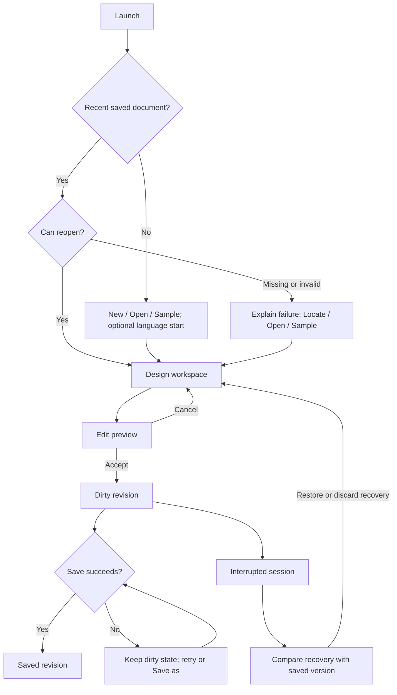
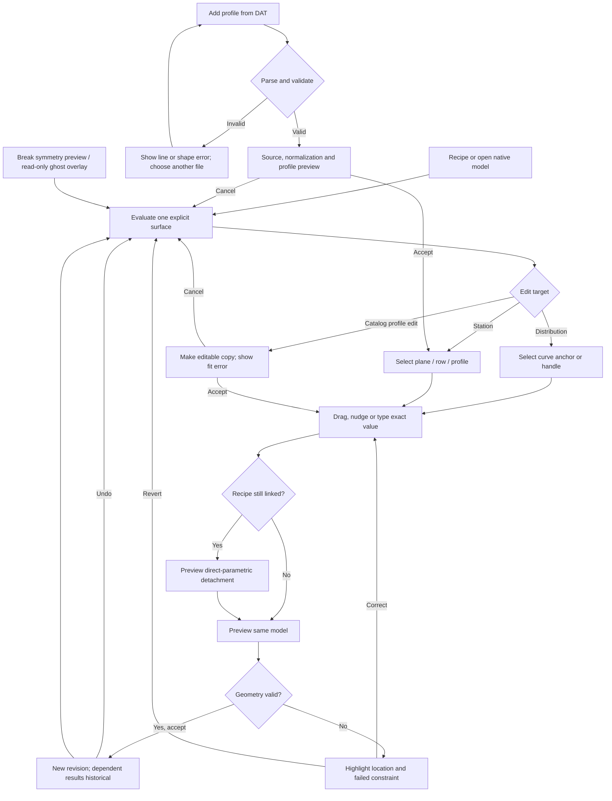
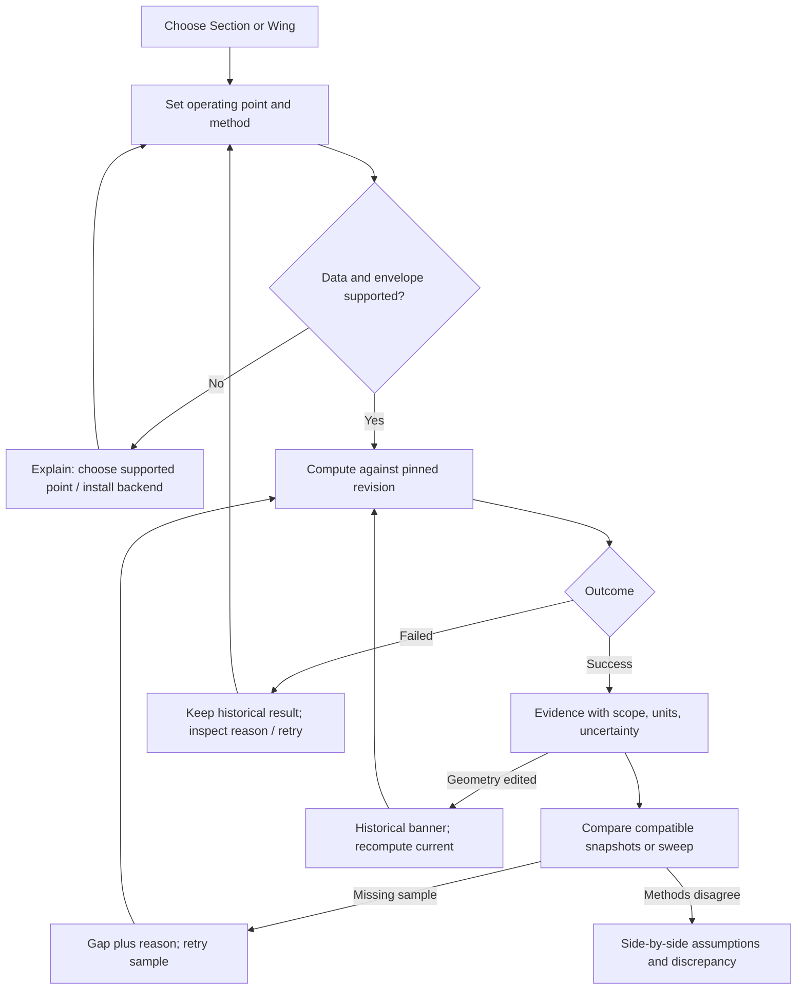
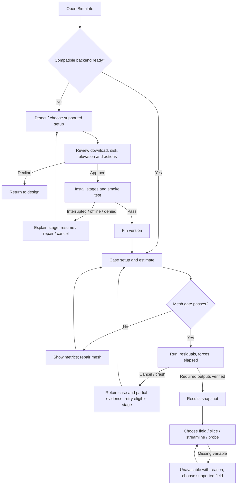
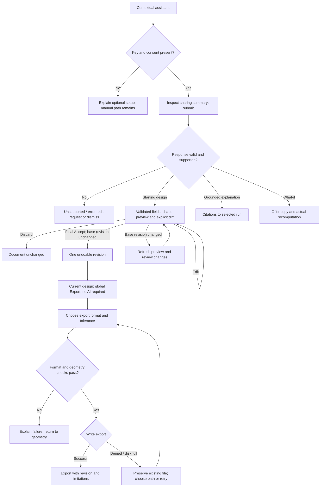

# CFD-Workbench

## A precise shape. An explicit model. Evidence you can inspect.

Product specification · revision 0.1 · 19 September 2026 · **Design proposal for iteration, not an implemented or scientifically validated product.**

[Read the HTML edition](cfd-workbench.html) · [Open the interactive workbench](../mockups/workbench.html) · [Source grounding](../knowledge/cfd-workbench-grounding.md) · [Design language](../../DESIGN.md)

The tool shall let a designer create a three-dimensional hydrofoil with a few meaningful dimensions, fair it through curves and station profiles, and retain a complete parametric description after every accepted edit. It shall explain what its analysis can establish, what it omits, and which shape produced each result.

**Authority.** The current user request and Workbench repository instructions govern. The later WorkBench `sequence.md` supersedes conflicting sequencing in `proposal.md`; CFD-Bench supplies the domain knowledge. Toolkit, language, geometry implementation, exact file schema and solver implementation remain architecture decisions. Requirements below use **shall** for mandatory behavior in their named release. Numerical thresholds are proposed acceptance targets unless explicitly marked observed. The [grounding ledger](../knowledge/cfd-workbench-grounding.md) distinguishes source facts from proposed decisions.

## Part A — Functional specification

### A1. Problem, users and core scenario

Hydrofoil designers must connect rider needs, a fair three-dimensional shape, section characteristics and finite-wing evidence. Today those concerns live in separate modeling, airfoil and CFD workflows. A geometric edit can sever its parametric explanation, while a persuasive chart can outlive the shape or operating conditions that produced it. Workbench joins the workflow without hiding its numerical assumptions.

The primary user is an engineer or technically fluent maker who knows fluid mechanics and wants to express rider requirements. This persona is **Verified source intent**, not validated interview research. Secondary users are a returning foil designer comparing revisions and an analyst inspecting run provenance. No invented interview, conversion rate or user-satisfaction evidence underpins the design.

Core scenario: **from a riding brief to a fair, reproducible wing and a defensible comparison**. Open a sample or enter dimensions; select a section; adjust a curve or station; inspect the loft; save the native parametric document; examine section and wing estimates; compare a revision; optionally run a supported local CFD case and inspect its evidence. All non-AI operations shall be reachable without an API key.

| User | Job | Information needed at decision time |
|---|---|---|
| Engineer/maker | Turn area, span, profile and riding conditions into a fair wing | Active shape driver, units, surface fairness and local profile |
| Iterating designer | Change one dimension without losing previous work | Reversible edit, dimensional delta, historical comparison |
| Analyst | Decide whether a result is relevant and trustworthy | Geometry revision, method, operating point, envelope and evidence source |

### A2. Product scope and releases

The full product covers six stages. Their ordering is a delivery constraint, not a wizard imposed on daily use.

| Stage | User-visible capability | Release boundary / completion proof |
|---|---|---|
| S1 · Workbench | Launch, files, sample, undo, workspace, settings, backend status, optional assistant chrome | Install and operate on Mac and Windows; no solver or AI required |
| S2 · Shape | Recipe, curves, stations, section catalog, profile editing, 3D inspection, native archive | Complete edit/save/reopen loop and identical physical geometry on both platforms |
| S3 · Section evidence | 2D polars, Cp where available, transition, cavitation screening | Provenance-admitted supported data; edited sections show unavailable until actually analyzed |
| S4 · Wing evidence | Live estimate, VLM/strip evidence, operating-point search, sweeps and comparisons | Separate finite-wing method/envelope labels and headless/GUI parity |
| S5 · Local simulation | Detect/install/configure/test backend; mesh, run, cancel and recover | One validated single-phase case on each supported platform; supported backend matrix published |
| S6 · Read the flow | Field views, slices, streamline rake, probes, histories, grounded result questions | Every visible field linked to an actual run and variable; absent fields unavailable |

**First product = S1–S4.** S5–S6 are specified here and delivered behind explicit readiness gates. SU2 and OpenFOAM are intended integration targets; selecting the first supported version/substrate is a required spike, not settled by this document. Free-surface and ventilation capability requires a separate de-risked, validated extension after initial single-phase CFD. Optional AI ships per capability only after its own eval gate.

Deferred: goal/Pareto optimization, structural/hydroelastic solver, pumping/unsteady optimization, fins as design targets, whole-craft trim/stability, surfboards, arbitrary CAD reconstruction, video capture, CAM, mold blocks, G-code and general solid modeling. The data vocabulary may describe context surfaces, but v1 authors one lifting wing; context is not a fuselage/strut interference simulation. No fabrication or structural safety certification is implied.

Retained commitments: **COMMIT-01** no optimizer candidate certified on estimator evidence alone; any future search must re-evaluate with VLM and fabrication-bound candidates with CFD, without calling that a structural sign-off. **COMMIT-02** permissive product dependencies; external solver distribution/interaction needs explicit license review. **COMMIT-03** lossless native project open/save; the completed proposal's S12 explicitly adds bounded section `.dat` import in v1, a documented profile-only extension. Arbitrary mesh/CAD fitting stays a separate future operation with accepted fit error. **COMMIT-04** language model handles language and typed proposals; deterministic geometry and solvers handle numbers. No key or network remains a complete geometry workflow.

### A3. Conceptual domain model — before the screens

The bounded contexts are **Design**, **Profile catalog**, **Analysis**, **Backend environment**, and **Assistance**. A riding brief is design intent; it is never silently a geometry constraint or a solved operating point.

| Term | Kind and meaning |
|---|---|
| Project | Entity containing a named design and its revision/run references |
| Design revision | Entity: an accepted target surface, its referenced profiles and optional context |
| Surface revision | Entity: one complete explicit parametric shape definition |
| Authored station | Identity-bearing element within a surface; a span location with values and a profile assignment |
| Inspection slice | Derived section at a location; not an authored station or extra degree of freedom |
| Distribution curve | Owned value definition connecting a station channel along the span |
| Profile revision | Entity: immutable normalized section geometry with origin and usage evidence |
| Recipe | Value object: high-level starting dimensions and generation choices |
| Loft rule | Value object: correspondence, interpolation, continuity and closure intent |
| Operating point | Value object: speed, fluid state, incidence, depth and explicit load/context |
| Analysis run | Entity: immutable input revision, method/settings, execution state and evidence |
| Sweep | Entity: explicit variable samples and held conditions, with a run outcome per sample |
| Backend installation | Entity: detected location/version/capabilities and last smoke-test evidence |
| Assistance proposal | Entity: typed requested change, provenance per field and acceptance state |
| Length, angle, ratio, mass, force, pressure, frame | Value objects with dimensional meaning; display formatting is not geometry |

| Aggregate root | Owned concepts | Invariant it protects |
|---|---|---|
| Surface revision | Stations, channels, section references, symmetry, connecting rules, closures | Exactly one definition determines the supported surface everywhere on its span |
| Profile revision | Shape, source, normalization, modification provenance | One revision identifies one immutable normalized section shape |
| Design revision | Target/context references, recipe provenance, accepted edit | Every accepted design references a mutually consistent set of shape/profile revisions |
| Analysis run | Input snapshot, method, settings, status, evidence and outputs | A result always identifies the exact inputs and method that produced it |
| Sweep | Sample schedule and outcome references | Each requested sample has exactly one explicit current outcome or an explicit missing/cancelled state |
| Backend installation | Capability and smoke-test record | “Ready” refers to the actual detected version that passed the test |
| Assistance proposal | Suggested fields, source context, disposition | No proposal changes a design before explicit acceptance and deterministic validation |

Projects and runs refer to revisions by identity, not copied competing truths. Durable schema, storage grain, serialization and migration machinery are the architecture/design-slice handoff. Requirements here demand immutable evidence and lossless history, without choosing tables or a programming language.

### A4. Geometry contract: curves and stations are two views of one model

**Chosen synthesis (Inferred product decision): authored stations plus their complete connecting rules form the explicit parametric surface of record.** A list of sampled station rows alone cannot retain curve handles or uniquely determine between-station shape. The explicit definition therefore includes station values, profile references, distribution interpolation, handles, continuity intent, symmetry and closure. Estimation, meshing and export shall evaluate that same definition. Display tessellation and solver sampling are derived views, never alternate editable geometry.

This refines CFD-Bench's [assembly → surface → station → loft grammar](https://github.com/timianmalloo/cfd-bench/blob/496a0a8ca2fae9026927167a8f3e5da0a53f2233/docs/knowledge/cfd-hydrofoil-simulation/parametric-geometry.md). It retains the one-way generation rule and makes the unspoken interpolation authority explicit.

#### Five channels, with no duplicate outline authority

| Channel | Parameter | What it owns | What the UI derives |
|---|---|---|---|
| Sweep | Leading-edge aft offset along span | Planform placement | Leading-edge rail |
| Chord | Positive local chord | Local width | Trailing-edge rail, planform area |
| Elevation | Vertical leading-edge offset | Dihedral/anhedral shape | Front view and local depth |
| Twist | Local incidence | Section rotation | Oriented section and spanwise incidence |
| Thickness | Effective thickness-to-chord ratio | Symmetric thickness scaling about the normalized camber line | Actual effective profile coordinates and thickness |

Planform is a view of sweep plus chord, not a sixth independent curve. Moving the trailing edge shall edit chord through the same channel. A station inspector edits the same channel anchor that appears in the curve editor. Inspection slices cannot carry independent overrides. Promotion to an authored station shall preserve the existing surface within geometry tolerance before any new edit.

A normalized profile defines camber and a unit-thickness shape; the effective t/c channel scales thickness about that camber. Assigning a catalog profile offers **Use source thickness** (sets the station's thickness anchor) or **Keep current thickness** (retains the channel and labels the effective section Modified). The default is Use source thickness, with a before/after preview. Blending interpolates normalized camber and unit-thickness shape only; it never creates another effective t/c. Changing the effective section by either the profile editor or thickness channel shall update the same definition, create modified provenance and invalidate source-polar applicability. The application shall never show an unchanged catalog identity as though it were analyzed at a new thickness.

#### Two editing states; both are parametric

**Recipe linked:** target area, AR or span, taper, sweep, elevation/anhedral, washout and profile generate the explicit definition. Of area/span/AR, exactly two may be driving inputs; the third is derived. Locks show drivers. An overconstrained inconsistent recipe is rejected, not silently relaxed.

**Direct parametric:** first manual curve/station/profile edit visibly detaches the recipe in the same undoable transaction. The former recipe becomes provenance. Stations, profiles, curves and handles remain editable parameters; the design does not become an uneditable mesh. “Regenerate from recipe” creates a preview/new revision with changed fields shown; it never back-fits or overwrites direct edits without acceptance. A general expression language is not required in v1; unit-aware literal inputs, named dimensions and explicit driver relationships satisfy parametrization.

#### Curves, profiles and fairness

Distribution curves shall support selectable on-curve anchors, tangent direction and magnitude, linked/split handles, exact numeric entry, 1 mm default positional nudge and 0.1 mm fine nudge, with angle/ratio steps separately visible. Insertion/removal shall preserve degree-five representation where that curve family is used. A minimum endpoint pair remains; coincident/out-of-order stations and nonpositive chord are invalid. A degree-five curve does **not** by itself guarantee G4 at joins: the tool shall show actual continuity and any intentional break. Curvature combs remain visible while editing, with a legible scale.

A selected station exposes its profile and channel values; selection is shared by 3D, curve view, table and inspector. Catalog sections are immutable. “Make editable copy” retains the source revision and presents the conversion method, maximum normalized deviation and acceptance tolerance. An exact copy representation can report zero conversion error; a CST/spline fit reports measured error and shall never assume zero. Cancel leaves the source untouched. Interior profile thickness must remain positive; intended leading/trailing-edge zeros are allowed at the declared boundaries.

Root and tip may use distinct admitted profiles. Blend correspondence shall align leading edge, trailing edge, upper and lower surfaces at normalized chord locations. The first supported blend linearly interpolates normalized camber and unit-thickness shape in normalized span between assigned profiles, renormalizes the blended thickness shape to unit maximum, then applies the one thickness channel. A zero/nonfinite normalization maximum is invalid. This preserves effective t/c even when source thickness peaks occur at different chord positions; that case is a mandatory fixture. Assigned effective profiles match catalog coordinates only when source thickness is selected and no shape modification exists; otherwise they match the explicitly modified profile, with that status visible. Higher-order profile blending is a later explicit option. Validate intermediate profiles and the full loft for crossings, folds, negative thickness and invalid closure; show continuity changes at profile transitions. Do not infer fairness from smooth shading.

Users shall select open/sharp/finite-thickness trailing-edge and tip/root closure choices supported by the exporter. Draft open geometry may be saved, but meshing/export claims that require a closed manifold shall be blocked until the relevant check passes. “Manufacturing assessed” requires an explicit manufacturing policy; absent minimum thickness/tolerance data shall read **Not assessed**.

Symmetry is initially a single mirror relationship. **Break symmetry**, invoked at a selected station, materializes two independent half-wing definitions while preserving the current shape. Its preview states that the whole wing becomes independent; v1 does not introduce mixed inboard/outboard mirror-link modes. Subsequent changes affect the selected side only. Undo restores the relationship and shape together. A second native design may be loaded as a read-only ghost with distinct line style, revision and alignment datum; it cannot accidentally become the edit target.

The selected station shows distance from root, distance to tip, normalized half-span percentage, local trailing-edge thickness in mm, and the applied thickness floor or Not assessed. AR's displayed value exposes its reference-area convention without leaving the workspace.

#### Catalog and bounded section import

Native project files use `.cfdw.json`; exact schema/version migration design is a later contract. Section import is a separate **Add profile from DAT** action supporting Selig and Lednicer coordinate layouts with an explicit preview of detected format, normalization, point order, closure and source hash. Ambiguous formats, nonfinite values, self-crossing profiles or malformed counts fail without modifying the library. Preserve original coordinates and the accepted normalization. A locally imported profile is not automatically an admitted polar or a redistributable bundled asset.

Required initial catalog roles: lifting Eppler E817/E818/E874/E904/E908; admitted NACA 64A410; NACA 0012/4412 regression examples; separate symmetric strut E836/E837/E838 references. Proposed NACA 63/66- and 16-series and Speer H105 are additions only after generation/rights/provenance gates; the picker shows Pending admission instead of claiming they are bundled. Surf, wing/freeride, SUP/downwind and windsurf/race presets each record a complete recipe, context and admitted default section. A missing/unlicensed preferred profile uses a disclosed admitted fallback, never an invented section. These are starting fixtures, not optimum recommendations.

#### Coordinates, dimensions and units

Adopt the proposal's **right-handed body frame**: +x aft, +y starboard/right when looking forward, +z up; origin at the root leading edge. The positive half-wing editor is labeled **starboard**, and mirroring creates port. Relative to the right-handed forward/starboard/down frame this flips x and z, preserving handedness. An implementation choosing a different frame must migrate this explicit contract, not reinterpret signs.

Station planes are perpendicular to the fixed span axis; they do not rotate to remain normal to a curved span path. Profiles scale by chord and effective thickness, rotate about their leading edge for incidence, then translate to the station. Positive incidence is nose-up: a trailing-edge point on the chord line moves downward relative to the leading edge. Anhedral means negative tip z. Assembly orientation does not change these local definitions.

Internal physical semantics are SI; display supports m/cm/mm, m²/cm², m/s/kn, kg, N, Pa, degrees and Celsius with explicit labels. Changing display units shall not change geometry identity. Inputs may contain a unit suffix; a quantity of the wrong dimension is rejected. No “900 cm” fixture is accepted as a reasonable default span.

**Reference dimensions:** full projected span b is the y extent; reference planform area S is the unpitched chord integral across that span (including both halves once), independent of incidence; AR=b²/S; mean geometric chord=S/b. It is not mean aerodynamic chord. Wetted area and volume use the actual loft and are named separately. Projected x–y silhouette area at nonzero incidence, when shown, is a distinct measure. Derived quantities are read-only results, not competing saved design inputs.

### A5. Functional requirements and acceptance criteria

Every row is a future product test, not a claim that the HTML prototype implements a solver. **G/W/T = Given / When / Then.** Error and recovery cases are part of each contract.

| ID · Story | Acceptance criteria (Gherkin) |
|---|---|
| DOC-01 · As a designer I can start without setup | **Given** no document/key/backend, **when** I launch, **then** New wing, Open and Sample work offline; the assistant explains its missing key. **Given** a missing recent file, **when** restore fails, **then** Locate/Open sample remains available and nothing is overwritten. |
| DOC-02 · I can preserve my work | **Given** an edited shape with handles and profile assignments, **when** I save/reopen on either platform, **then** the full explicit definition, editing state and provenance survive within 1 µm model-space geometric tolerance. **Given** write denial or disk full, **when** saving fails, **then** the previous file remains readable, dirty state remains and Save as is offered. |
| DOC-03 · I can undo complete operations | **Given** any accepted geometry edit or AI proposal, **when** I Undo, **then** shape and recipe state return together; Redo restores both. **Given** a cancelled drag, **when** Escape is pressed, **then** no undo entry or geometry change remains. |
| DOC-04 · I can recover or open safely | **Given** interrupted saving, **when** the app restarts, **then** it offers the last complete recovery revision beside the saved revision. **Given** malformed/unsupported-major-version data, **when** Open is attempted, **then** it leaves the active document intact and identifies the unsupported version/path; migrations preserve an original copy. |
| GEO-01 · I can generate a useful wing | **Given** target S=0.14 m² and AR=7, **when** a linked recipe is generated, **then** b=√0.98 m and measured dimensions meet the declared 1 µm/relative 10⁻⁶ reporting tolerance. **Given** inconsistent locked area/span/AR, **when** I apply, **then** the conflict identifies the three fields and nothing changes. |
| GEO-02 · I can trust derived dimensions | **Given** a symmetric rectangular wing b=1.2 m, chord=0.18 m, incidence=0°, **when** measured, **then** S=0.216 m², AR=6.666667 and mean chord=0.18 m to displayed precision. **Given** linear chord from 0.19 m root to 0.18 m tip, **then** S=0.222 m² and AR=6.486486. Wetted area is never substituted. |
| GEO-03 · I can edit by curve or station | **Given** a selected station, **when** I change its chord in either inspector or curve, **then** both show the same anchor value and loft, with live derived dimensions. **Given** an invalid negative chord, **then** the candidate is marked invalid and accepting it is blocked; Revert returns the last valid shape. |
| GEO-04 · I can understand every driver | **Given** a linked recipe, **when** I make the first manual edit, **then** the UI says Direct parametric and records recipe detachment in the same undo item. **Given** retained recipe provenance, **when** it is viewed, **then** its fields cannot silently overwrite direct geometry. |
| GEO-05 · I can use anchors and levers precisely | **Given** a distribution curve, **when** I select/drag/nudge/enter a value, **then** its anchor and tangent controls update in the selected plane and the comb remains visible. **Given** a split handle, **then** any continuity break is marked. **Given** endpoint deletion leaving an invalid curve, **then** deletion is blocked with a reason. |
| GEO-06 · I can add a station without altering shape | **Given** an inspection slice on a valid loft, **when** I promote it, **then** the surface differs by no more than 1 µm before edits and becomes selectable in all views. **Given** a coincident station, **then** insertion is rejected and the existing station is selected. |
| GEO-07 · I can mix section profiles intentionally | **Given** admitted root/tip profile revisions with Use source thickness, **when** assigned, **then** endpoint geometry matches them and interior normalized shapes follow the declared blend before thickness scaling. **Given** Keep current thickness, **then** the channel remains authoritative and endpoints show Modified if different. **Given** a crossing or folded intermediate profile, **then** the location is highlighted and analysis/closed export is blocked until corrected. |
| GEO-08 · I can edit a catalog-derived profile honestly | **Given** a locked section, **when** Make editable copy is selected, **then** fit method/error/tolerance and source are shown before acceptance. **Given** rejection or fit error above tolerance, **then** the catalog revision is unchanged. Modified shape loses the original polar's applicability. |
| GEO-09 · I can use units and orientation consistently | **Given** any shape, **when** display units change and I reopen, **then** physical geometry and identity are unchanged. **Given** positive incidence, **then** the trailing edge rotates downward about LE; negative tip z points down. **Given** pressure entered for chord, **then** a dimensional error is shown. |
| GEO-10 · I can inspect the actual loft | **Given** valid geometry, **when** I orbit/pan/zoom or select plan/front/section/isometric view, **then** station selection remains linked to its inspector. **Given** reduced motion or keyboard-only input, **then** named views, fit view and numeric edits give the same tasks without pointer drag. |
| GEO-11 · I can control symmetry | **Given** a mirrored wing, **when** I edit a station, **then** both halves agree. **Given** Break symmetry at the selected station, **when** its whole-wing effect is accepted, **then** both explicit halves initially preserve shape within 1 µm and subsequent edits affect only the selected side; Undo restores mirror linkage and geometry. |
| GEO-12 · I can compare shape and inspect local dimensions | **Given** a second native wing, **when** Ghost overlay is enabled, **then** both shapes share a named alignment datum and distinct line style/revision, with only the current design editable. **Given** an invalid overlay file, **then** the current design is intact. **Given** station selection/drag, **then** root/tip distance, span percentage and TE mm update; a policy-floor violation is flagged, and absent policy says Not assessed. AR exposes its convention beside the value. |
| CAT-01 · I can choose an appropriate section | **Given** a catalog, **when** filtered by role/family, **then** entries show source/hash, t/c, camber, available Re/α data and modification state. **Given** missing rights/provenance, **then** the entry is not admitted as bundled analysis data. Ranking requires an explicit operating point. |
| CAT-02 · I can add my own section | **Given** a valid Selig/Lednicer DAT file, **when** imported, **then** format/source/hash and normalized profile preview appear before acceptance, with original points retained. **Given** malformed, ambiguous, nonfinite or self-crossing coordinates, **then** the library is unchanged and the offending line/shape is identified. A new profile has No analysis until actually computed. |
| CAT-03 · I can start from an admitted preset | **Given** a clean offline installation without Python, **when** any of the four discipline presets is selected, **then** its recipe, context, admitted section and bundled supported polar are usable; preferred sections pending admission show the named fallback. **Given** a custom section without a compatible analysis backend, **then** editing/saving work and analysis explains the optional installation. |
| ANA-01 · I can analyze a section | **Given** admitted data supporting profile/Re/α/Ncrit, **when** evaluated, **then** Cl, Cd, Cm and Cl/Cd include method, domain and uncertainty status. **Given** an edited section without a backend or an out-of-domain query, **then** the value is unavailable with Install/Select supported point options, never a nearby profile's result. |
| ANA-02 · I can read Cp and cavitation correctly | **Given** available Cp evidence, **when** shown, **then** x/c and Cp are dimensionless, sign conventions are visible, and the cavitation threshold includes fluid temperature, pressure and depth. **Given** sparse reconstructed Cp, **then** the display says screening estimate and notes unresolved suction peaks; absent uncertainty is “not quantified,” not a fabricated interval. |
| ANA-03 · I can distinguish section and wing forces | **Given** only section chord and fluid/speed, **when** lift/drag forces are displayed, **then** they are N/m; N requires a named strip width. **Given** a whole-wing result, **then** force is N and the label says Wing only. |
| ANA-04 · I can evaluate the finite wing | **Given** supported attached-flow geometry and operating point, **when** VLM/strip analysis runs, **then** it reports loading, induced drag, computed span efficiency, local Re/α-effective, force and moment about a named datum. **Given** invalid envelope or unavailable convergence, **then** results are qualified/unavailable and no 3D stall or ventilation claim appears. |
| ANA-05 · I can find a supporting operating point | **Given** explicit target load, speed and supported α bracket, **when** Find operating α runs, **then** it finds lift=target within 1% or reports no supported solution. **Given** no bracketed crossing, **then** it never extrapolates an answer. The UI never labels this whole-craft trim. |
| ANA-06 · I can compare revisions and fidelities | **Given** two run snapshots, **when** compared, **then** geometry, conditions and methods are side by side and incompatible reference quantities block a numeric delta until reconciled. **Given** estimator/VLM/CFD disagreement, **then** all are visible with assumptions; no averaging or automatic “best truth” replaces them. |
| ANA-07 · I can trust freshness | **Given** a completed run, **when** geometry/profile/fluid/settings change, **then** that run becomes Historical before any new result is shown. **Given** recompute failure, **then** the old result remains historical; no stale value is labeled current. Display-unit changes alone do not invalidate. |
| ANA-08 · I can explore a sweep | **Given** a named independent variable, sample set and held conditions, **when** computed, **then** charts, selection and scrubber share the sample identity. **Given** a failed/cancelled sample, **then** it remains an explicit gap with reason/retry, never a line silently connecting across missing evidence. |
| ANA-09 · I can inspect provenance | **Given** any numerical dataset, **when** admitted, **then** source/tool/version, generation command or extraction method, license/evidence citation and content integrity are checked. **Given** a bit flip or missing hash, **then** admission fails closed. Hash integrity alone does not imply scientific validity. |
| ANA-10 · I can inspect transition and cavitation sweeps | **Given** supported section results, **when** Cp is displayed, **then** upper/lower curves are distinguished beyond color, more negative Cp plots upward, and the axis direction is named. **Given** available transition locations, **then** upper/lower x_tr/c appear with Re/α/Ncrit; absent locations read Unavailable. **Given** an α sweep with Cp_min, **then** the cavitation bucket shows σ_required=−Cp_min and the selected operating σ, with missing samples as gaps and the screening limitation visible. |
| ANA-11 · I can understand wing loads | **Given** a supported wing run, **when** Loads is selected, **then** it exposes center of lift (m in the declared body frame), wing loading (N/m²), root bending moment (N·m), moment about a user-named attachment point (N·m), and drag breakdown (N) whose components reconcile with the reported total to the solver tolerance. **Given** missing terms or reference datum, **then** those values are unavailable rather than assumed zero. Structural adequacy is not inferred from loads. |
| ANA-12 · I can find a supported take-off speed | **Given** a target load and supported speed/α brackets, **when** a speed search runs, **then** it returns the lowest supported sampled/bracketed speed meeting load within 1% under the selected attached-flow assumptions, with resolution and bracket reported. **Given** no crossing or a stall/free-surface dependency outside support, **then** it reports No supported solution rather than physical take-off certainty. |
| ANA-13 · I can see orientation and depth limits | **Given** a supported sideslip method and β, **when** evaluated, **then** side force (N), yaw moment (N·m), β (degrees), signs and reference datum appear with the run. **Given** sideslip or asymmetry, **when** a method lacks those capabilities, **then** yaw/side-force outputs are explicitly unsupported and the run is blocked or returns only clearly named supported quantities. **Given** a defined root submergence and static orientation, **then** the tip-depth hint derives from actual geometry and is labeled Static geometry, no wave/free-surface prediction; missing depth yields Unavailable. |
| ANA-14 · I can compare section behavior at known conditions | **Given** multiple section results, **when** overlaid, **then** each legend identifies profile revision, Re, Ncrit and α or sweep range. **Given** available Cp_min and fluid pressure/temperature/depth, **then** critical-speed screening plots report their model and applicability; missing values remain gaps. **Given** local strip results suggesting separation, **then** the first flagged station is identified as Section-based inference, not resolved 3D separation; unavailable section evidence yields No supported inference. |
| ANA-15 · I can reproduce water conditions | **Given** fresh/salt water and temperature, **when** selected, **then** sourced density, kinematic viscosity and vapor pressure are shown and Re/cavitation recompute against a new operating-point identity. **Given** an unsupported temperature/salinity range, **then** computation is unavailable rather than extrapolated. A named water-screening Ncrit preset initially proposes 2.0, visibly labeled a source-based assumption, not a universal water constant; changing Ncrit invalidates the polar. |
| ANA-16 · I can compare the intended performance curves | **Given** supported samples, **when** Wing polar is selected, **then** CL, CD, L/D and Cm can be plotted versus α and versus speed with held variables/datum visible. **Given** section cavitation evidence, **then** σ_required versus Cl and V_crit versus Cl are available with screening limits. **Given** a catalog's documented design Cl, **then** it is distinct from the solved operating Cl; absent design Cl is Unknown and never guessed. Gaps remain explicit on all plots. |
| CFD-01 · I can prepare a local backend | **Given** no compatible backend, **when** I open Simulate, **then** detect/install steps show platform, version, download/storage/elevation needs and the exact proposed action. **Given** consent denial/offline/interruption, **then** setup remains recoverable and CAD works. Ready requires detection plus a passing pinned-version smoke test. |
| CFD-02 · I can generate a supported case | **Given** a supported single-phase wing and operating point, **when** I prepare a run, **then** the case states geometry revision, domain, boundary conditions, turbulence/mesh choices and solver limits without requiring hand-edited dictionaries. **Given** a failed mesh-quality threshold, **then** solve is blocked with the failed measure and a repair action. |
| CFD-03 · I can run without losing the app | **Given** a prepared case, **when** started, **then** process state, residuals, force history and elapsed time are visible. **Given** solver crash or cancellation, **then** the UI/document survive, the process tree terminates, and logs plus partial outputs retain Failed/Cancelled status. A zero exit code without required outputs is not success. |
| CFD-04 · I can manage resources | **Given** a queued/run case, **when** launched, **then** estimated storage and available resource limits are visible; estimate gaps read Not recorded. **Given** disk exhaustion or incompatible backend version, **then** new work stops safely with its case retained and retry from a valid stage offered. Resume only where backend checkpoints actually support it. |
| VIZ-01 · I can read available fields | **Given** an admitted CFD result, **when** Cp/slice/streamline/probe is selected, **then** variable, units, range, timestep and source run appear with a perceptually uniform legend. **Given** an absent variable, **then** its view is unavailable. Strip Cp is labeled Section reconstruction, never 3D CFD pressure. |
| VIZ-02 · I can investigate flow without invented diagnosis | **Given** velocity and a rake, **when** moved, **then** streamlines update from that result field. **Given** a proposed separation overlay, **then** it names its supported wall/skin-friction criterion; a vortex criterion alone cannot be labeled separation. Missing evidence yields No supported criterion. |
| EXP-01 · I can share a parametric design | **Given** a native file, **when** opened on the other platform, **then** editable definitions and provenance survive. **Given** unknown optional context, **then** it is retained/read-only or the file is refused before save; it is never silently discarded. External profile DAT import is a distinct CAT-02 operation, not project or arbitrary CAD import. |
| EXP-02 · I can export with known fidelity | **Given** accepted geometry, **when** section DAT, mesh, STEP or chart export is requested, **then** units, tolerance, revision and limits are shown. **Given** unsupported closure or unproven STEP compatibility, **then** the unavailable format explains its gate. STEP release requires target CAD/CAM open-and-measure proof, not merely writing bytes. |
| AI-01 · I can use the product without AI | **Given** no key/network or a 401/timeout/quota error, **when** I design/save/analyze locally, **then** those actions continue. **Given** key removal, **then** new AI calls stop immediately without restart and the key never enters a document, log or export. |
| AI-02 · I can start from a language brief | **Given** opt-in configured AI, **when** a profile/wing brief is submitted, **then** a typed recipe proposal marks every field Stated/Inferred/Defaulted and passes schema/domain validation before showing an editable shape preview. **Given** final Accept on that preview, **then** it applies one undoable revision; Discard/malformed output changes nothing. **Given** the document changed since proposal creation, **then** acceptance is blocked until a refreshed diff/preview is reviewed. Raw coordinates, mesh or invented solver scores are rejected. |
| AI-03 · I can ask about a result | **Given** a chosen run and visible sharing summary, **when** I ask a question, **then** supported claims cite that run/knowledge evidence and preserve units/scope. **Given** an unsupported question or numerical what-if, **then** the assistant says evidence is missing and offers a separate draft plus real recomputation, without fabricating a delta. |
| AI-04 · I can control egress and actions | **Given** a prompt, **when** submitted, **then** geometry-summary/result fields to be shared are inspectable and secrets are excluded. **Given** instructions inside an imported file or solver log, **then** they remain quoted data and cannot install software, execute commands, spend additional money or mutate geometry. Cancellable per-request limits and usage Not recorded fallback are required. |
| AI-05 · I can understand a failed run | **Given** selected failed mesh/run logs and inspectable sharing consent, **when** Diagnose failure is invoked, **then** claims cite that run's observed error evidence and distinguish hypotheses. **Given** a suggested repair, **then** it is a typed case-parameter diff validated and previewed before acceptance; acceptance creates a draft case and a separate user Run action is required. **Given** missing evidence or command-like output, **then** diagnosis declines unsupported claims and never executes commands. |
| AI-06 · I can pin language behavior without changing geometry | **Given** an optional configured provider, **when** I change the model identifier in Settings, **then** subsequent requests use the explicit selected identifier and all saved geometry identities remain unchanged. **Given** an unknown/unavailable model, **then** prompts fail independently. Initial natural-language profile starts may select admitted catalog references only; CST coefficient proposals are a later separately evaluated capability. |
| CLI-01 · I can reproduce GUI numbers | **Given** the same native file and operation, **when** measure/estimate/section/wing/check is invoked through the headless surface and GUI, **then** numerical output, envelope status and input identity agree to the operation's published tolerance. **Given** invalid inputs, **then** machine-readable stable error codes accompany non-success status. |

### A6. Scientific honesty and validation ladder

Evidence labels shall distinguish **Illustrative mockup**, **Computed estimate**, **Verified numerical implementation**, and **Experimentally compared**, with named method and applicability. The last two require their specific proof; they are not a global “validated” badge. Deterministic output may have unquantified model error. Display **Model uncertainty not quantified** instead of manufacturing probabilistic ranges. If measured uncertainty exists, display its definition, interval and source.

Section surrogate comparisons do not establish finite-wing or tow-tank validation. Foil-plus-strut measurements cannot be silently used as wing-only coefficients. Experimental data admission requires a comparable configuration and uncertainty/source review. GUI unit tests and matching hashes do not close these gaps.

Every wing result shall show omissions relevant to its tier: strut/fuselage interference, free-surface, ventilation, viscous separation or pumping where unsupported. A validity envelope belongs to the method/profile/conditions, never a universal angle limit. Out-of-envelope values remain visible only as explicitly unsupported observations, excluded from recommendations. Method disagreement is a finding; discrepancy tolerances and uncertainty calibration are research gates, not assumed percentages.

### A7. Non-functional requirements and governance

| ISO 25010 / governance lens | Measurable requirement or explicit boundary |
|---|---|
| Functional suitability | Every mandatory story traces to GUI/headless acceptance evidence; excluded physics never appears as supported |
| Performance efficiency | Proposed reference fixture: 21 authored stations, 201 derived slices, 50k displayed triangles, 10k plot points; 16 GB Apple-silicon Mac and 16 GB Windows x64 laptop with supported graphics. Editing feedback p95 ≤100 ms, preview regeneration p95 ≤250 ms, orbit ≥30 fps, cold launch ≤5 s. Exact machines fixed in architecture spike; no measured claim yet |
| Reliability | Atomic native saves preserve last complete version; fault injection at write/replace stages proves recovery. Cancel acknowledgment ≤250 ms; process shutdown ≤5 s or visible timed-out termination error |
| Compatibility | Same native design opens on both platforms; directory paths and display units do not alter physics identity. Supported backend versions are pinned and tested separately |
| Interaction capability / usability | Keyboard-only New→edit→save→inspect available; five formative users, at least four complete sample edit/save without facilitator rescue. This is a target, not existing research |
| Accessibility | WCAG 2.2 AA for HTML; corresponding native keyboard, VoiceOver/UIA, focus, high-contrast and scaling proof on both OSes before release |
| Security | Hostile file paths/data never become commands; parser size limits published; solver sandbox/process privileges minimized; install/elevation explicit; credentials in OS store; prompt injection cannot authorize actions |
| Privacy | Local by default; no automatic cloud sync, telemetry egress or geometry upload; AI context is opt-in and inspectable; redact paths/secrets from diagnostics export |
| Maintainability | Versioned geometry and numerical contracts; provenance-required fixtures; regression controls for signs, units, stale results and conversions; architecture remains unselected |
| Portability / flexibility | Mac Apple silicon and Windows x64 required initially; Intel Mac/Windows ARM and minimum OS releases are open support-matrix decisions. No CUDA dependency on core design path |
| Safety | No strength, manufacturing, ride-safety or certification claim from hydrodynamic output; limitations appear at relevant decision/export points |
| Release / rollback / supply chain | Signed/notarized supported packages and platform install/uninstall proof; reversible application update and preserved pre-migration file; SBOM/licenses reviewed; external solver licensing separately assessed |
| Observability | Local structured records for operation/revision/method, duration, failure code, sample/mesh volume and resource cost. AI tokens/spend recorded only if observed; missing metrics say Not recorded. No geometry payload/secrets logged by default |

Operator questions map to named event families: **geometry.preview** (latency/definition size), **document.save** (duration/outcome), **analysis.run** (method/input/result status), **backend.setup** (stage/version/failure), **solver.process** (duration/exit/resource observations), **assistant.request** (provider/model/usage where known), **export.validate** (format/tolerance/outcome). The normal path emits them locally; measuring shall not require a special rerun.

Threat model: project files, section data, solver output and model responses are untrusted inputs; credentials, local files and launched processes are protected resources. Tampering fails provenance checks; spoofed status requires actual readiness evidence; denial of service meets size/resource limits; egress is explicit; executable commands cannot originate from data. Security review gates implementation; no claim of completed penetration testing is made.

AI uses LOA **Tool-Mediated Constructor** for typed starting proposals and **Grounded Synthesizer** for result explanations. T0 deterministic code validates geometry, units, numerals and permissions; bounded model calls interpret/summarize only. Model/provider/version and eval thresholds are selected in architecture. Each AI capability must pass extraction, unsupported-answer, prompt-injection, attribution and numerical-meaning evals; a numeral match alone is insufficient.

## Part B — UX specification

### B1. Information architecture

The workspace is a document with five task destinations, not a six-stage forced wizard:

- **Shape** — recipe, five distribution curves, stations, loft checks and 3D selection.
- **Sections** — section library, selected station's profile and editable-copy provenance.
- **Analyze** — Section/Wing scope, operating conditions, methods, sweeps and comparison.
- **Simulate** — backend readiness, guided setup, case preparation, mesh and run queue.
- **Results** — run library, fields, histories, comparison and optional questions.

Project/New/Open/Save/Export and Undo/Redo are global. Settings holds units, appearance, backend installations and optional AI credentials. The assistant is contextual secondary chrome; it never owns the only route to a task. Native menus expose every primary command. A command search lists commands with Mac/Windows shortcuts. Labels in this section define the product vocabulary alongside A3.

A single selection links the outline, station list, curve anchor, profile and inspector. Selecting a result pins its geometry/conditions; editing current geometry does not silently change the result selection. A visible **Current design / Run snapshot** distinction explains historical views.

### B2. Flow F1 — start, restore and preserve (DOC-01–04)

New starts with a small parameter form and section picker; Sample loads a labeled design fixture. On first launch the user chooses; no simulated result is smuggled into a sample as evidence. Unsaved close offers Save/Discard/Cancel, with focus on the safe continuing choice. An interrupted AI/install job is not automatically resumed on launch.

### B3. Flow F2 — shape through curves and stations (GEO-01–12, CAT-01–03)

The user can start broad and work locally without choosing between two incompatible CAD systems. Recipe controls are a starting layer; curves describe spanwise intent; station profiles describe cross-section intent. The inspector always identifies the authoritative parameter. Adding an inspection slice is a viewing action; promoting it is an explicit design action. A locked catalog profile shows why it cannot be dragged and gives one clear conversion action.

### B4. Flow F3 — analyze and compare (ANA-01–16)

Section-on-wing analysis receives the selected station's local Reynolds number and effective incidence. A global/section condition override is named and reversible. Switching scope changes available controls and force units; it does not relabel a section plot as a wing result.

### B5. Flow F4 — setup, simulation and results (CFD-01–04, VIZ-01–02)

Setup is sequential because actions depend on prior state; the main workspace remains available. Download progress, mesh progress and solver progress have different labels. Residual decline is not completion; completion requires declared convergence and output checks. A solver unavailable on the chosen platform appears as unsupported, not an inert enabled button.

### B6. Flow F5 — optional language and export (AI-01–06, EXP-01–02)

### B7. Wireframe structure and progressive disclosure

Persistent top band: document name, save state, Undo/Redo and task destinations. Left: project/surface plus station list or run list. Center: dominant 3D view or evidence plot. Right: one selection inspector with units and driver status. Bottom: focused curve/profile editor in Shape/Sections; sweeps/history in Analyze/Results. Footer: current revision, units, backend availability and operation state. The assistant is a collapsed side/bottom affordance that expands only on request.

The initial frame shows one curve, one selected station, one inspector and one principal result. Other channels remain one action away. Long labels truncate visually only with full accessible names and a details affordance. A narrow window collapses secondary panels into explicit tabs/drawers; it does not scale the entire interface to illegible text. Native desktop minimum target is 1024×700 logical pixels; the mockup also offers a smaller review viewport to expose reflow failures.

### B8. UX acceptance criteria

- **UX-01:** From Shape, select a station in ≤1 action and reach its section editor in ≤1 additional action; selection agrees across all visible views.
- **UX-02:** Exact-value edit, Undo and Save are possible without a pointer; focus returns to the edited parameter after validation/recovery.
- **UX-03:** Every error above includes the cause, preserved work and a reachable recovery action; no setup or AI failure forces application restart.
- **UX-04:** Switching task destination preserves selection, viewport and current dirty revision; returning to a historical run never overwrites the current model.
- **UX-05:** During formative research, users can explain whether a field is driving, derived or historical; at least four of five correctly identify all three on the sample task. Research is pending.
- **UX-06:** Every optional dependency has a usable absence state. Installing a solver and configuring AI are never prerequisites to editing or saving geometry.

## Part C — UI specification

### C1. Direction and archetype

**G1 · Parametric Modeling Workbench** is auto-selected because the dominant job is spatial model construction with precise parameter editing. **G2 · Scientific Visualization Pipeline** is the Results specialization because field inspection follows sources, variables and transforms. A dashboard card grid and a chat-first interface were rejected: neither expresses continuous shape editing and its ownership clearly.

`ParametricWorkbench { Type:Configurator; Arch:SpatialBounded; Layout:ViewportWorkbench; Density:Compact; Nav:Ribbon+CommandPalette; Viewport:DesktopBound; Input:PrecisionPointer+SpatialGestures+KeyboardFirst; Color:DarkAdaptive; Type:Utilitarian; Depth:Diegetic3D; Sync:LocalFirst; Persistence:LocalDevice; Feedback:Optimistic+Confirmed; Motion:Micro; Pacing:Freeform; Transition:HardCut; A11y:WCAG_2.2_AA; }`

Deviations from catalog: LocalDevice replaces Cloud; KeyboardFirst is explicit; task tabs and a slim tool strip specialize Ribbon; domain station/curve history replaces generic sketch/extrude/fillet history. G2 Results retains local persistence, AsyncPipeline and unit-bearing scalar legends. The grammar's overloaded Type facet is preserved from its published signature; these are design selectors, not an application schema.

Direction: **precise, composed, tactile**; opposites: vague, crowded, decorative. Use a light technical workspace with a dark model canvas as the initial review direction, plus dark and high-contrast modes. Named references: Shape3d's orthogonal curve/slice relationship, OpenVSP's section vocabulary, Fusion's selection/inspector pattern, ParaView's source/field provenance. Adapt patterns only; no third-party UI assets or product artwork are copied.

Medium: native desktop product for macOS and Windows; framework/distribution format unselected. HTML is an interaction/design prototype, not native proof. Apple HIG governs Mac menus, windows and Command shortcuts; Microsoft desktop guidance governs Windows focus, accelerators and UI Automation behavior.

Trigger union: **UI-T1 applies** (expert quantities), **UI-T2 does not** (no generated imagery), **UI-T3 applies** (optional model-backed assistant), **UI-T4 applies at product handoff** (native desktop); native proof remains Flagged until runtime exists. No toolkit is selected by the mockup.

### C2. Design system, states and numeric integrity

[DESIGN.md](../../DESIGN.md) is the authoritative token and real-copy system. Typography uses platform UI sans with tabular numbers; plots/values use aligned numerals and explicit units. Teal identifies the active selection consistently across station/curve/profile; warning/error also carry icons and text. Scientific continuous fields use cividis or another documented perceptually uniform map, with a persistent unit-bearing legend. Cp is dimensionless and labeled as such. No rainbow maps or decorative chart gradients.

| Surface | Required default and hard states |
|---|---|
| Document shell | saved/dirty, first launch, loading/recovery, unsupported file, save denied, long name |
| Curve and station editor | selected/hover/focus, editable/locked, dragging, invalid candidate, recipe detachment, empty stations, regeneration, long table |
| Profile library | catalog/modified, source details, missing polar/license, conversion preview/failure, no matches |
| Analysis | supported result, computing, unavailable, out of envelope, historical, disagreement, failed sweep samples |
| Backend/case | missing, detecting, consent, downloading, denied/interrupted, repair, ready, mesh failure, running/cancelled/failed/completed |
| Results | field present/absent, partial output, loading, stale run, long histories, selected probe and uncertainty unknown |
| Assistant | no key, ready, sharing review, pending/cancelled, proposal review, unsupported answer, 401/timeout/quota, wrong answer/correction |
| Export | format available/unavailable, tolerance entry, failed closure, overwrite choice, progress/success/failure |

All interactive components have default/hover/focus/active/disabled states where applicable. Empty/loading/error states belong to the containing task; they are not meaningless decorative variants of a button. The review harness must exercise persona, viewport, state, theme, density, capability and reduced motion, with its controls visually separate from product chrome.

### C3. UI acceptance criteria

- **UI-01:** Every visible input has a persistent label and physical units; numbers use tabular figures and right alignment in tables. Derived quantities cannot be mistaken for editable fields.
- **UI-02:** Text contrast ≥4.5:1 (large text ≥3:1), meaningful graphical controls/focus ≥3:1, no color-only state. Non-text plotting marks meet legibility/contrast appropriate to their legend/background.
- **UI-03:** All pointer actions have keyboard equivalents, including station selection, view changes and precision curve edits; drag is never the only means. Native accessibility tree names/roles/values are verified separately on both OSes.
- **UI-04:** Targets ≥24×24 CSS pixels under WCAG 2.2; standalone primary buttons ≥44 px high; dense scientific controls may use 32 px with clear separation. Focus remains visible and unobscured. At 200% zoom the document remains operable through reflow/panel disclosure.
- **UI-05:** Motion only explains selection/regeneration; no continuous decorative motion. Reduced-motion removes animated transitions and preserves status messages; loading indication does not require animation.
- **UI-06:** A geometry change immediately shows regeneration/historical status before any result might be mistaken for current. A failed recompute cannot clear historical status.
- **UI-07:** Every field view has variable, unit, scale and source run. Unsupported field/physics controls explain their unavailability. Scientific uncertainty is displayed or explicitly Not quantified.
- **UI-08:** First launch offers New/Open/Sample; an error state identifies next action; overflow includes a long project name, negative angle and large result count without overlapping controls.
- **UI-09:** Optional assistant applies HAX capability/quality disclosure, invocation/dismissal/correction, uncertainty and explanation guidance. Shape-of-AI patterns: Wayfinder prompts, Tuner context, Governor proposal acceptance, Trust-builder citations and Identifier AI labeling. Wrong-answer and absent-evidence paths are first-class.
- **UI-10:** Prototype page makes no external request, opens from a local file, and labels sample physics as Illustrative. Its in-artifact check first verifies a nonzero rendered frame, then reports contrast/target findings honestly; it never substitutes for native or scientific validation.

### C4. Mockup coverage and traceability

| Screen / route | Flow | Functional coverage |
|---|---|---|
| Start / document state | F1 | DOC-01–04 |
| Shape | F2 | GEO-01–12, DOC-03 |
| Sections | F2 | CAT-01–03, GEO-07–08 |
| Analyze | F3 | ANA-01–16 |
| Simulate | F4 | CFD-01–04 |
| Results | F3/F4 | VIZ-01–02, ANA-06–08 |
| Assistant and export states | F5 | AI-01–06, EXP-01–02 |

The prototype shall make core selection and dimension editing interactive. Solver execution, AI responses, OS dialogs and installation may be deterministic demonstrations, but must be labeled and may not claim work was executed. Remaining native/physics behavior is a specified future acceptance test, not a mockup failure disguised as proof.

## Evidence, decisions and remaining gates

### Confidence ledger

| Claim | Confidence | Evidence / next proof |
|---|---|---|
| User wants Mac/PC design, specification and iterative mockups | Verified | Current request |
| CFD-Bench requires station/loft grammar and one-way generation | Verified source contract | Parametric geometry source, sections “3D grammar” and “Two layers” |
| Later proposal requires hand-edited curves and bulkheads | Verified source intent | WorkBench sequence §3.1–3.1c |
| Curves + complete interpolation + station profiles best meet simplicity/power | Inferred design decision | Reconciles non-unique sampled geometry and dual-authority failure; test with user editing sessions |
| Primary engineer persona and six-stage sequence | Verified source intent | Proposal/sequence; actual usability remains Flagged |
| Proposed 1 µm persistence tolerance and performance budgets are achievable | Flagged targets | Geometry/toolkit spikes and benchmark fixtures on both platforms |
| Numerical, CFD and structural validity | Flagged by method | Dataset admission, implementation verification and comparable experiments required |
| HTML interaction quality | Pending independent rendered review | Recorded in UI review artifact |
| Native accessibility, packaging and backend readiness | Flagged | No native application exists in this change |

### Open decisions with owners and exit evidence

| Gate | Owner lens | Exit evidence |
|---|---|---|
| Toolkit, viewport and minimum OS support | Native Desktop / Architect | Same selection/curve fixture on Mac+Windows; keyboard/a11y/scaling and packaging proof |
| Exact shape evaluator and file schema | Geometry / Data Architect | Lossless handle/loft round trip, continuity fixtures, version migrations and cross-platform numerical equivalence |
| Profile admission / external DAT import | Domain / Product | Licensed source inventory and bounded Selig/Lednicer parser/provenance tests before S2 release; arbitrary CAD import remains deferred |
| Scientific validity/envelopes | Hydrofoil domain reviewer | Comparable datasets, declared tolerances, convergence and uncertainty evaluation |
| Local CFD backend/version/substrate | CFD / SRE | Install/detect/smoke/cancel/recovery cases on both platforms; license review |
| Export/manufacturing | Geometry / fabrication reviewer | Target CAD/CAM round-trip and manufacturing policy; no claimed fabrication readiness before proof |
| Optional AI capabilities | AI / Security | Provider contract spike, egress inspection and capability-specific evals |
| User evidence | UX Researcher | Observed curve→station→save and analysis interpretation tasks; revise this spec from findings |

### Gate record

Independent functional/domain/UX/security review and UI critique are recorded in `docs/reviews/`. Initial draft authored bottom-up; no product runtime, experimental validation or native accessibility pass is asserted. This document remains **in-review** for user iteration. The specification can be complete while implementation choices and their future proof remain explicit release gates.

**Handoff:** iterate the shape workspace with the user, then run define-architecture for the cross-platform shell, canonical geometry/file contract and numerical/backend boundaries; design-slice each deliverable against this specification and DESIGN.md.
