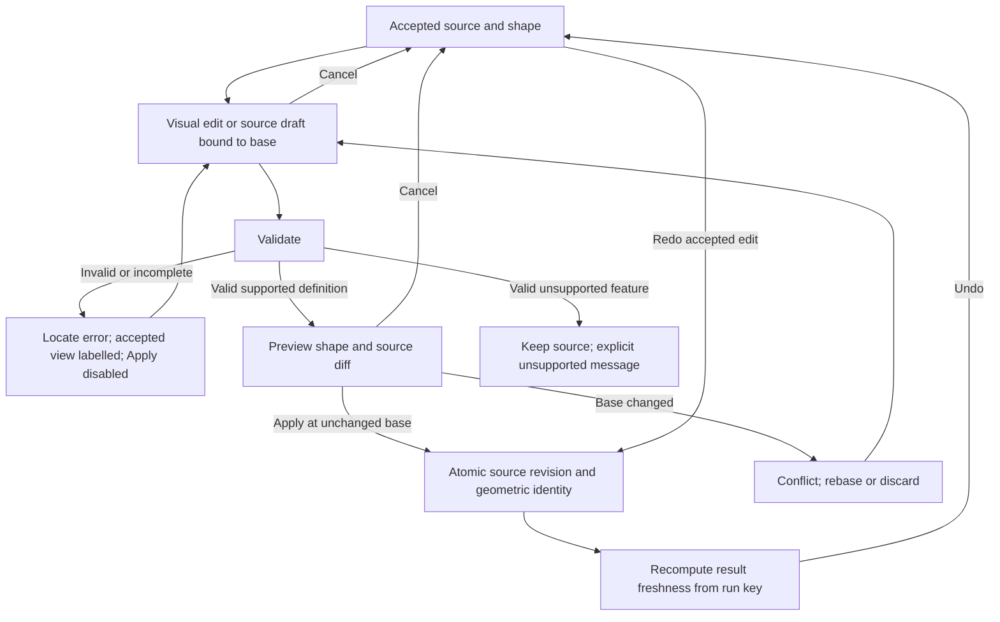

# FoilDSL 4.0

**Status:** proposed normative companion to product specification revision 1.4, for review.
Requirements below are product contracts, not claims that a production parser or geometry kernel exists.
**Verified:** the source comparisons and executable v3 observations in the [reconciliation](../notes/foildsl-reconciliation.md).
**Inferred:** the chosen authoring contract reconciles the user's request with the established control-vertex CAD model.
**Flagged:** production conformance, cross-platform serialization and certified geometry validation remain unimplemented.

## 1. Purpose, scope and precedence

A `.foil` UTF-8 document describes one mirrored 3D lifting surface or one normalized 2D profile.
The **accepted source** is the canonical authored artifact. Its parsed record is a disposable, reproducible
projection, never an independently editable authority. “Canonical authored” does not mean that the editor
must strip comments or force formatting. Source preservation and geometry identity are separate contracts (§8).

This companion controls language meaning; the product specification controls workflows, physics, analysis,
and release acceptance. Its existing A4 geometry contract remains authoritative except for the explicit
representation and source-ownership amendments here. FoilDSL describes geometry, not executable scripts,
solver setup, network requests, filesystem commands or AI instructions. It cannot assert hydrodynamic validity.
Multi-surface assemblies and independent port/starboard halves remain outside 4.0.

Version 4.0 is deliberately source-incompatible with v3. A missing header is never guessed to be 4.0.
This remains an unapproved 4.0 draft. The 22 September review correction makes leading and trailing rails
independent: the earlier draft's `planform chord cv` field is rejected, never reinterpreted as a trailing
edge. See §10 for explicit conversion; no released 4.0 compatibility claim exists yet.
An unknown major or minor version is read-only until a compatible parser or an explicit migration is selected.
No keyword is silently ignored. A newer version may add syntax; it may not change the meaning of a valid 4.0
document. Migration creates a new source revision and preserves the original (§10).

## 2. Conceptual domain model, settled before the UI

**Bounded context:** Shape authoring. Analysis consumes accepted Surface revisions by identity and cannot edit them.

| Concept | Kind | Meaning |
|---|---|---|
| Authored document | entity / aggregate root | Its accepted source and referenced immutable profile assets denote exactly one valid shape under a pinned evaluator. This is its invariant. |
| Source revision | immutable value | A complete accepted spelling, including comments, linked to its predecessor. |
| Edit draft | entity | One pending transaction bound to an accepted base revision and target; may be incomplete or invalid. |
| Surface revision | immutable entity | The geometric meaning of a foil source plus resolved profile revisions; all readers reproduce the same surface. |
| Profile revision | immutable entity / aggregate root | A normalized upper/lower curve pair with coherent endpoint/closure semantics; source polars attach only to its admitted exact identity. |
| Distribution curve | value | A B-spline control polygon and knots defining one function of normalized half-span. |
| Authored station | value | A span position and immutable profile reference; it supplies section-shape assignment, not a second copy of the channels. |
| Inspection slice | derived view | A query at a span position; moving it changes selection only. It is not syntax and is not an authored station. |
| Assertion | value | An authored acceptance bound on a derived measure; it checks geometry and never solves or modifies it. |

The native project remains `.cfdw.json`. It contains source revisions, profile assets, provenance and run
references. It shall not persist a second editable channel table beside FoilDSL. Cached parsed records and
meshes carry source/evaluator keys, are labelled derived, and are discarded/rebuilt on any mismatch.
Operating conditions remain outside FoilDSL. A standalone `.foil` export includes inline profiles or its
explicit content-addressed dependencies; a missing dependency is an error, never a nominal section.

**Grain:** one source snapshot per accepted authoring transaction; one Surface revision per changed evaluation
input set; one immutable profile revision per changed profile definition. Revision history is append-only.
Names/comments/locks/assertions create source history without changing geometry identity when shape is unchanged.
Control values, knots, evaluator, half-span, assignments and profile contents are versioned, never rewritten in
old revisions. Derived area/span are semi-additive across disjoint geometry only, never across revisions;
AR/taper are non-additive. No derived dimension is an additional authored driver.

## 3. Lexical rules

EBNF below uses `=` and `;`, concatenation, `|`, `[optional]`, `{zero or more}`, quoted terminals and
`(* comments *)`. Whitespace is required between adjacent word/number tokens; punctuation delimits itself.
Whitespace is U+0020, tab, CR or LF. `#` begins a comment through the next newline, outside strings.
CRLF and LF are legal and retained in source. A BOM is allowed only at byte zero and is retained there.
Identifiers and keywords are case-sensitive ASCII; names and comments may contain Unicode.
Strings use JSON string escaping (`\"`, `\\`, `\n`, `\r`, `\t`, `\b`, `\f`, `\/`, `\uXXXX`);
unescaped controls, unpaired surrogates and literal newlines inside strings are errors.
The parser neither Unicode-normalizes names nor evaluates string contents.

`number` is a decimal token. Dimensional values retain their exact decimal rational value through unit
scaling, then convert once to SI binary64 with round-to-nearest, ties-to-even. Dimensionless values convert
directly to binary64 with the same rounding. This order prevents cm/mm/m double-rounding drift.
Overflow, NaN and infinity are errors; negative zero has semantic value zero. `integer` is a nonnegative
decimal integer token (no exponent, sign or decimal point); semantic ranges apply below.
Error locations are one-based line and Unicode-scalar column plus UTF-8 byte span, not display pixels.

```ebnf
number = ["+" | "-"], (digits, [".", digits] | ".", digits),
         [("e" | "E"), ["+" | "-"], digits] ;
integer = digits ;
digits = digit, {digit} ;
digit = "0" | "1" | "2" | "3" | "4" | "5" | "6" | "7" | "8" | "9" ;
string = '"', {unicode-scalar-except-quote-backslash-control | json-escape}, '"' ;
```

The two lexical classes in the final rule mean exactly the exclusions and escapes above; they are not
language extensions. No other token classes are implicit.

## 4. Complete syntactic grammar

Syntax fixes block order to make diffs predictable; comments/whitespace are free between tokens.
Every mandatory field occurs once. Repetition is legal only where braces say so. Duplicate singleton fields
are errors, replacing v3's last-writer-wins semantics.

```ebnf
document = "foildsl", '"4.0"', (foil | standalone-profile), EOF ;
foil = "foil", string, "{", "units", length-unit,
       "half_span", length, evaluator, "symmetry", "mirror_y",
       "planform", "{", "leading", curve, "trailing", curve, "}",
       "dihedral", curve, "twist", curve, "thickness", curve,
       "profiles", "{", profile, {profile}, "}",
       "sections", "{", assignment, assignment, {assignment}, "}",
       ["tip", ("open" | "point")], ["locks", "{", {lock}, "}"],
       ["constrain", "{", {assertion}, "}"], "}" ;
standalone-profile = "section", string, "{", evaluator, profile-body, "}" ;
evaluator = "evaluator", string, string ;
profile = "profile", string, "{", (profile-body | asset), "}" ;
profile-body = "upper", curve, "lower", curve,
               ["closure", ("open" | "closed")], ["provenance", string] ;
asset = "asset", "sha256", string ;
curve = "cv", "{", "degree", integer, "knots", numbers,
        "points", points, ["ids", strings], "}" ;
numbers = "[", number, {",", number}, "]" ;
points = "[", point, {",", point}, "]" ;
point = "(", number, ",", number, ")" ;
strings = "[", string, {",", string}, "]" ;
assignment = "at", station, "profile", string ;
station = "root" | "center" | "tip" | number, (length-unit | "%") ;
length = number, length-unit ;
length-unit = "mm" | "cm" | "m" ;
lock = "root_mirror", channel
     | "freeze", channel, string, "at", point
     | "value", channel, "at", station, number
     | "bounds", channel, string, number, number ;
channel = "leading" | "trailing" | "dihedral" | "twist" | "thickness" ;
assertion = metric, (">=" | "<="), quantity
          | metric, "==", quantity, "tolerance", quantity ;
metric = "area" | "aspect" | "taper" | "mean_chord" | "mac"
       | "center_chord" | "tip_chord" | "tip_rise"
       | "max_drop" | "max_rise" | "root_thick" | "tip_thick" ;
quantity = number, [length-unit | "mm2" | "cm2" | "m2"] ;
```

`EOF` is the end of input after optional whitespace/comments. Trailing commas are illegal.
Length-unit words in `quantity` are disjoint from metric names, so omitted dimensionless units are unambiguous.
Units are mandatory for dimensional assertions. `~` is not supported: users state an explicit tolerance.

## 5. Static and geometric semantics

1. `units` governs the ordinates of leading, trailing and dihedral CVs and their lock values. Half-span and station
   distances always have an explicit suffix. Twist ordinates/locks are degrees; thickness is a dimensionless
   chord fraction. Profile coordinates and all CV abscissae/knots are dimensionless. Conversion to SI occurs
   before evaluation. Unit changes convert values; relabelling them is a geometric edit.
2. Half-span is finite and strictly positive. Full projected span is derived as twice half-span. The frame is
   fixed to +x aft, +y starboard, +z up, root leading edge at the origin. `leading(0)=dihedral(0)=0`.
   Symmetry is exactly `(x,y,z) → (x,-y,z)`. Positive twist is nose-up about the leading edge.
   Leading and trailing are **independent absolute x positions in the unrotated planform**, not offsets from
   one another. Each has its own degree, knot vector, CV abscissae, ordinates, IDs and locks. Chord is only
   `trailing(eta)-leading(eta)`; it has no saved CVs, knots or independent geometric identity.
3. For N points and degree p, `knots` has **N+p+1** entries (N is count, not highest index).
   End values are 0 and 1, each repeated p+1 times; interior knots are in (0,1), nondecreasing,
   with multiplicity at most p. All rational weights are exactly one by language definition.
   Channels have p=3 and N in [6,10] in 4.0; profile sides have p=5 and N in [6,32].
   This profile capacity includes the existing 8–16 fitting policy without making that construction an authority.
4. Channel points are `(eta-coordinate, ordinate)`. The first abscissa is 0, last 1, and all abscissae strictly
   increase. The evaluated parametric B-spline is inverted at a requested eta, then its ordinate is read.
   A CV abscissa is not a through-station and is not generally the spline parameter. Identical endpoint
   ordinates on the first two CVs implement a root tangent lock; interior CVs can lie on a straight curve,
   so “never lies on the curve” is not a universal geometric claim.
5. Profile sides run from LE to TE, first point `(0,0)`, last abscissa 1, first abscissa 0. Their intermediate
   abscissae are nondecreasing; repeated initial abscissae allow a vertical LE tangent. The evaluated abscissa
   must be strictly increasing on the open interval. Upper/lower are compared at the same normalized chord
   x, using their own knot vectors and inverse abscissa. Upper is strictly above lower on (0,1).
   `closure closed` (default) requires both TE ordinates zero; `open` permits distinct TE ordinates.
   Closure recipes such as Skew lower modify CVs in a draft, then serialize the resulting curves; they are
   editing commands, not hidden additional shape parameters. Continuity is measured, never inferred from degree.
6. Profile thickness is `max_x(upper(x)-lower(x))`, strictly positive. Camber is the half-sum.
   A standalone section retains its intrinsic thickness. In a foil the single thickness channel sets effective
   t/c; normalized profile thickness shapes are scaled as §6 prescribes. No assignment stores another t/c.
   **Use source thickness** is a command creating channel CVs/constraints in one preview transaction; **Keep
   current thickness** leaves that channel untouched. Both serialize to the same language, with provenance.
7. Profile names are nonempty and unique within a foil; references resolve exactly and are case-sensitive.
   All profiles must be referenced. Assignments start at root, end at tip and have strictly increasing
   resolved positions in [0,half-span]. A single section throughout therefore has two endpoint assignments.
   No assignment or inspection slice duplicates a channel value. Promotion inserts the evaluated blended
   shape as a profile revision with a measured deviation; it must satisfy the exact-operation gate before Apply.
8. Default tip is `open`, meaning nonzero terminal chord and a boundary section, not a manufacturability claim.
   Derived chord `trailing(eta)-leading(eta)` is strictly positive everywhere for an open tip. A declared `point` tip has chord zero only at eta=1
   and positive chord on [0,1); normals use the limiting surface. Thickness is in (0,1) throughout.
   Negative/crossing chord, crossing profiles or a folded/self-intersecting surface block acceptance.
   These are geometric obligations over intervals, not proof from 91 samples. An unresolved numerical test
   is **Not assessed**, which blocks Apply/export in the product. The prototype labels its sampled check honestly.
9. Root-mirror locks default ON for all channels when the `locks` block is absent. An explicit block is the
   complete lock set and may be empty. Freeze explicitly stores the named vertex's required `(eta,ordinate)`
   coordinates in its `at` pair, including for standalone file opening; bounds constrain
   its ordinate inclusively. Value locks bind an evaluated channel value at a station. Source is a candidate
   solved record: the parser checks locks, never silently moves CVs. GUI pin/fit operations solve first,
   display changed CVs/deviation, then serialize. Infeasible locks report involved IDs and prevent Apply.
10. `ids`, when present, contains one unique nonempty string per point, scoped to that curve. New source may
    omit IDs; acceptance materializes stable IDs before showing the final source diff. An omitted-ID document
    cannot contain `freeze`/`bounds` references. IDs survive vertex moves and reorder is forbidden; insertion
    creates an ID and deletion retires it. IDs/locks do not enter geometry identity.
11. An `asset sha256` string is exactly 64 lowercase hexadecimal characters. It addresses original immutable
    standalone `.foil` section bytes in the project asset set. No path, URL, ambient working directory or live
    catalog is resolved. Its own pinned evaluator must be supported. Missing or wrong-hash assets block Apply.
    DAT/catalog import first creates an admitted explicit profile with source bytes, provenance and measured
    conversion residual. No `eppler` or `file` placeholder is accepted as real geometry.

## 6. Deterministic evaluation and derived geometry

`evaluator "cfdw-cv" "1"` names the **proposed mathematical contract in this section**, not an installed kernel.
A different identifier/version requires its own published contract and compatible evaluator. No fallback occurs.
The kernel used for a derived skin is recorded with the export/cache, not treated as a second authored surface.

Evaluate each B-spline by the Cox–de Boor definition, with the endpoint t=1 taking the last point and zero
denominators contributing zero basis terms. For channels, invert the strictly monotone abscissa at eta. For
profiles, invert at normalized chord x. A production implementation must meet A4.5's identity oracle on both
platforms; algorithm choices may not change this mathematical meaning. Numerical nonconvergence is an error.

Between adjacent station assignments a and b, let `w=(eta-eta_a)/(eta_b-eta_a)`.
For each profile derive camber C and unit-thickness shape T=(upper-lower)/max(upper-lower).
Evaluate their linear combinations `C=(1-w)C_a+w C_b`, `T0=(1-w)T_a+w T_b`, then
`T=T0/max_x(T0)`. The placed upper/lower profile is `q=(x,C ± thickness(eta)*T/2)`.
This is the product's linear normalized-camber/unit-thickness blend, with shared x correspondence.
A computational shared-knot conversion must preserve these functions and report any approximation residual.
There is no mid-span family switch and no cosine interpolation of four nominal section parameters.

For q=(x,z), c=trailing(eta)-leading(eta), L=leading(eta), Z=dihedral(eta), phi=twist(eta) converted to radians.
The pinned binary64 radians-per-degree constant is `0.017453292519943295`; multiplication rounds once to
binary64, ties-to-even. Trigonometric evaluation must meet the identity oracle, not promise bit-identical libm:

```
X = L + c*(x*cos(phi) + z*sin(phi))
Y = half_span*eta
Zplaced = Z + c*(-x*sin(phi) + z*cos(phi))
```

This is **rule A**: the channel-evaluated surface is the meaning. Section planes do not bank.
The port side mirrors Y. A positive phi takes a TE point downward relative to the LE. A B-spline skin,
tessellation, STEP or grid is a derived approximation with measured error; sampling count cannot redefine geometry.
NACA/CST generation and v3 anchor interpolation remain import/construction operations with named source,
version and residual, never alternate evaluators hidden behind a profile name.

Area S = 2∫chord(y)dy over the half-span, independent of incidence; aspect=b²/S; mean_chord=S/b;
mac=(2/S)∫chord(y)²dy; taper=c_tip/c_root. `mean_chord` and `mac` are distinct.
`tip_rise` is signed terminal elevation; max_drop=max(0,-min Z), max_rise=max(0,max Z);
root_thick and tip_thick are chord times effective t/c. Area uses area units, aspect/taper no units, all other
listed metrics length units. Developed area is omitted rather than confused with wetted area.
Assertions do not alter geometry: `>=`/`<=` compare the computed measure; `==` requires absolute difference
no greater than its nonnegative explicit tolerance of the same dimension. If numerical error straddles a bound,
the result is **Not assessed**, not pass. A failed assertion preserves draft and blocks Apply until fixed or
explicitly removed in the source; the change is reviewable. Removing an assertion alone does not stale analysis.

## 7. Validation, diagnostics and incomplete drafts

Validation phases are ordered: lexical → syntactic → version/evaluator → dimensional/structural → references
→ geometric/locks → assertions. Diagnostics have stable code, phase, severity, source span, affected entity,
plain reason and recovery action. Multiple independent errors may be reported in source order; dependent
phases do not fabricate follow-on errors. Parse success alone is never labelled “valid foil”.

Before parsing, limit source to 1 MiB UTF-8 and reject with `DSL-LIMIT` above that bound. Limits per document
are 4096 profiles, 4096 assignments, 4096 assertions/locks combined, 4096 Unicode scalars per string and the
curve point bounds in §5. Geometry validation has a one-second interactive work budget before cancellation
with **Not assessed** and a retry option; it never accepts on timeout. These are proposed acceptance limits,
not measured browser capabilities. Asset resolution is restricted to the project asset set, and rendering
inserts source names/diagnostics as text, never HTML or script. Comments cannot authorize actions or network use.

| Code | Example failure | Recovery |
|---|---|---|
| DSL-LEX | unterminated string, nonfinite number | Keep draft; select offending span. |
| DSL-SYNTAX | missing brace, duplicate field, unknown keyword | Complete/remove syntax; accepted geometry remains. |
| DSL-LEGACY | earlier unapproved 4.0 `planform chord cv` | Preserve the original; request explicit conversion to independent leading/trailing rails. |
| DSL-VERSION | 3.0/no header/unknown evaluator | Choose explicit migration or open read-only. |
| DSL-UNIT | `half_span 20 cm2` | Enter a length. |
| DSL-CURVE | bad knot count, unordered abscissa | Name curve and required count/order. |
| DSL-REFERENCE | missing profile or asset | Restore referenced asset or choose explicit replacement. |
| DSL-GEOMETRY | negative chord/crossing profile/fold | Locate span; repair draft; Apply disabled. |
| DSL-LOCK | violated or conflicting lock | Name lock and affected CV; edit/release explicitly. |
| DSL-ASSERT | failed or unassessed assertion | Show actual, bound, units and uncertainty. |
| DSL-UNSUPPORTED | valid feature outside prototype capability | Retain exact source; no partial interpretation. |
| DSL-CONFLICT | base revision changed while draft open | Rebase with a new preview or discard; never overwrite. |

An invalid/incomplete draft is saveable as a **recovery draft**, separate from accepted source. On reopening,
the accepted shape is restored and the recovery draft is offered with its original base. Every view states
whether it displays Accepted rN or Preview from rN. The last-good shape must not appear to depict invalid text.

## 8. Source, serialization, identity and provenance

Three identities serve different purposes:

- **Source identity:** SHA-256 of exact UTF-8 bytes, including comments/line endings, stored with each source revision.
- **Definition identity:** BLAKE3 of canonical semantic geometry input (below); this is the Surface revision's
  geometry dependency in the existing run key. A comment/name/assertion/lock-only edit leaves it unchanged.
- **Run identity:** the existing product A5.7 key, including geometry plus operating point, method/version,
  mesh/settings and all other declared dependencies. No `current` boolean is a durable authority.

Canonical semantic input is a labelled object containing format `foildsl-geometry-4.0`, evaluator ID/version,
SI half-span, fixed frame/symmetry, five ordered curves (degree, complete knots, ordered point pairs), resolved
ordered profile definitions and eta assignments, closure and tip mode. Resolve profile names to their numeric
definitions; sort profiles by first assignment occurrence and replace references by their resulting index.
Strip unused metadata, source names, comments, IDs, locks, provenance and assertions. Convert degrees to radians
using the evaluator's pinned conversion constant before canonicalization. Normalize negative zero to zero.
Serialize this object with RFC 8785 canonical JSON and shortest-round-trip numbers; BLAKE3 hashes UTF-8 bytes.
This specifies content identity, not tolerance-quantized shape equivalence: distinct input records can produce
equivalent shapes but need not share a hash. Never round inputs to an identity tolerance before hashing.

The **exact canonical object shape** uses these literal keys, with no additional/omitted keys. In the following
type notation `Curve` is `{"degree": p, "knots": [u0,...], "points": [[x0,y0],...]}`: actual arrays contain every
value, never ellipses. `Profile` is `{"evaluator":[id,version],"upper":Curve,"lower":Curve,"closure":"closed"}`
or the same keys with closure `"open"`. Strings `id`/`version` are the resolved profile evaluator.

```
Foil = {
  "format": "foildsl-geometry-4.0", "kind": "foil",
  "evaluator": [id, version],
  "frame": "aft-starboard-up-root-le", "symmetry": "mirror_y",
  "half_span_m": h,
  "channels": {"leading": Curve, "trailing": Curve, "dihedral": Curve,
               "twist": Curve, "thickness": Curve},
  "profiles": [Profile, ...],
  "assignments": [[eta, profileIndex], ...], "tip": "open"
}
Section = {
  "format": "foildsl-geometry-4.0", "kind": "section", "profile": Profile
}
```

`tip` is `"point"` only when declared; default `"open"` and default `"closed"` closure always materialize.
Channels' first coordinates remain eta; dimensional ordinates use metres, twist ordinates radians and thickness
fractions. Profile coordinates remain dimensionless. Assignment indexes are zero-based integers. Arrays preserve
order; profile ordering is first assignment occurrence as above, and inline/asset spellings with identical
resolved contents produce identical Profile objects. Standalone Section carries no assumed span or wing fields.
These objects, not the typography/order of keys in this explanatory example, are serialized by RFC 8785.

Canonical **text export** uses the grammar order, LF, two spaces, one point per line, m for all length
source values, m2 for area assertions, explicit IDs, explicit defaults, and shortest round-trip numbers. It is idempotent and preserves
all semantic SI values: emit their binary64 shortest-round-trip decimal in m, so reparsing does not rescale a
rounded decimal. Degree and dimensionless values retain their shortest-round-trip inputs. Noncanonical GUI
source may stay in mm; a GUI patch must verify parse-after-emit identity or show an explicit conversion error.
It is an explicit **Format source** action with a diff and undo item, not automatic on typing.
Formatting does not promise to preserve comment positions; the action must preview any moved comment.
Ordinary GUI edits patch the corresponding syntax nodes while preserving untouched comments/strings/trivia.
If a safe patch cannot be produced, the GUI shows the replacement diff and requires Apply; it cannot silently
regenerate the whole file. Parsed arrays in memory may be updated only as part of committing accepted source.

Geometry history and source history both survive save/reopen, Undo and Redo. Undo of a geometric transaction
restores its prior source, profile assignments, asset references and identity together. Run freshness is
recomputed against the restored run key; old result values remain immutable. Source-only edits can create an
authoring revision without a new Surface revision. A display-unit preference is not a FoilDSL source edit.
The exact native JSON envelope and persistent storage implementation remain outside this language decision.

## 9. UX contract and acceptance cases

CAD remains the spatial workbench. **Visual / Source / Split** are editing views of one document, not separate
authorities or a new eighth activity. A section document offers the same source view for its Profile revision.
Selection in either view identifies the same CV/station/profile. Source line selection alone changes no geometry.



| ID | Falsifiable acceptance criterion |
|---|---|
| DSL-01 | Given `foil-basic.foil`, when opened in a conforming implementation, then two stations share the inline profile and all five channels evaluate; no network request occurs. |
| DSL-02 | Given `section-basic.foil`, when opened, then it is a normalized 2D section, not an assumed wing; assigning it to a wing previews the t/c policy. |
| DSL-03 | Given a CV edit in either view, when previewed, then both views show the same draft record and the diff; Cancel restores exact accepted source and shape. |
| DSL-04 | Given malformed text, crossing geometry, unavailable assets or unknown syntax, when validated, then Apply is disabled and the accepted shape remains labelled. |
| DSL-05 | Given two values 14 and 14.049 mm, when serialized/reparsed, then the 0.049 mm difference survives and the definition identities differ; no 0.1 mm rounding is permitted. |
| DSL-06 | Given a comment-only edit, when applied, then source identity changes and geometric identity/run freshness do not. |
| DSL-07 | Given a geometry edit, when applied then undone/redone, then source and shape change together and result freshness follows the full run key. |
| DSL-08 | Given display-unit changes or Format source, then evaluated geometry and definition identity are unchanged. |
| DSL-09 | Given an inserted inspection slice, then source is unchanged; promoting it requires an exact-operation deviation report before an assignment is added. |
| DSL-10 | Given save/reopen on either OS, then accepted source bytes, dependency hashes, recovery draft and historical runs survive; a missing evaluator never substitutes another. |
| DSL-11 | Given asset substitution or an invalid checksum, then the document cannot be accepted or analyzed; no nominal profile is shown as resolved. |
| DSL-12 | Given a v3 file, then migration previews every semantic departure and the maximum surface deviation, preserving the original; absent comparison evidence blocks migration acceptance. |
| DSL-13 | Given different valid leading/trailing knot vectors and CV abscissae, when a leading CV moves in Source or Visual and is applied, then every trailing CV/knot/ID and the evaluated unrotated trailing rail remain unchanged; chord and dependent dimensions update from trailing minus leading. The inverse holds for a trailing-only edit. Cancel changes neither rail; Undo/Redo restore both rail definitions and matching source together. |
| DSL-14 | Given the earlier unapproved 4.0 draft containing `planform chord cv`, when opened, then it is rejected with an explicit legacy-draft conversion message; it is never treated as a trailing curve. |

UI follows existing DESIGN.md tokens and the C spatial/canvas archetype, with an E authoring facet inside the
document. Source editor has a visible name, keyboard selection, line/column diagnostics and a polite status
region; errors are text and location, not color alone. Keyboard reaches Validate, Preview, Apply, Cancel,
Undo/Redo and view switch without a pointer. Source typing never triggers workspace single-letter tools.
The narrow viewport uses one active view with explicit switch; Split does not compress text below readability.
Empty, loading, accepted, dirty, validating, invalid, unsupported, preview, conflict and recovery states are
distinct. Reduced motion changes no functionality. Existing offline, accessibility and performance acceptance
targets apply; latency for validate/preview/apply and error counts are emitted on the normal path with source
revision and evaluator, never source contents. Missing instrumentation reports “Not recorded”.

## 10. v3 migration and conformance boundary

The supplied PDF/HTML/JSX remain immutable references. Import recognizes them as **v3 proposal documents**,
not native accepted geometry. Preserve source bytes and their SHA-256. Resolve any external section before
conversion; unsupported NACA modifiers or nominal profiles fail closed. Evaluate the actual v3 interpolation,
quarter-chord twist and bank convention as the comparison source. Fit explicit CVs and profile curves under
the 4.0 model; LE pivot, fixed planes and linear profile blending may make faithful conversion impossible.
Report maximum surface deviation, sample set, tolerances and all changed conventions; no zero residual is assumed.
A conversion above A4.6 tolerance remains a draft. The user may intentionally redesign it as a new shape,
but the action cannot be labelled lossless migration. Old v3 FNV hashes are provenance labels only.

The v3 concept of independently authored leading/trailing edges is retained. Its anchor curves still require
conversion into explicit CV records with residuals. For legacy native records or the earlier unapproved 4.0
draft with leading+chord, the proposed new trailing function is `oldLeading(eta)+oldChord(eta)`. Adding CV
ordinates is exact **only when degree, knots and parametric abscissa control arrays are identical**, so both
curves have the same inverse mapping. If they differ, coefficient-wise addition is forbidden: use a proved
exact common representation or fit the evaluated sum with a measured deviation, preview and explicit Apply.
Source imports never perform this conversion automatically. A chord precision edit is an explicit command
whose preview names the rail held fixed (default leading) and the trailing changes; it is not a third authority.
At nonzero twist, changing leading also changes the LE rotation pivot: independence concerns the authored
unrotated planform rails, not an assertion that every placed 3D point on the other edge stays stationary.

Conformance has separate claims: **syntax**, **static semantics**, **evaluated geometry**, **serialization**,
**editor transactions**, and **scientific analysis**. Passing one never grants the others. The fixtures in
[examples](../examples/foildsl/README.md) specify required outcomes, including negative and metamorphic cases.
The review mockup advertises its supported subset and illustrative calculations. A valid 4.0 document outside
that subset is retained verbatim and rejected with DSL-UNSUPPORTED; it is never partially applied.
No browser check in this task certifies a production geometry kernel or Windows/macOS native accessibility.
